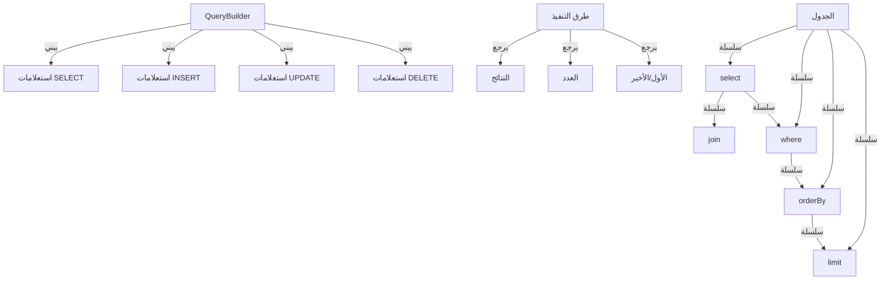

يوفر منشئ استعلام XOOPS واجهة حديثة وسلسة لبناء استعلامات SQL. يساعد في منع حقن SQL، ويحسن القراءة، ويوفر تجريد قاعدة بيانات لأنظمة قاعدة بيانات متعددة.

## معمارية منشئ الاستعلام



## فئة QueryBuilder

فئة منشئ الاستعلام الرئيسية مع واجهة سلسة.

### نظرة عامة على الفئة

```php
namespace Xoops\Database;

class QueryBuilder
{
    protected string $table = '';
    protected string $type = 'SELECT';
    protected array $selects = [];
    protected array $joins = [];
    protected array $wheres = [];
    protected array $orders = [];
    protected int $limit = 0;
    protected int $offset = 0;
    protected array $bindings = [];
}
```

### الطرق الثابتة

#### table

إنشاء منشئ استعلام جديد لجدول.

```php
public static function table(string $table): QueryBuilder
```

**المعاملات:**

| المعامل | النوع | الوصف |
|-----------|------|-------------|
| `$table` | string | اسم الجدول (مع أو بدون بادئة) |

**الإرجاع:** `QueryBuilder` - مثيل منشئ الاستعلام

**مثال:**
```php
$query = QueryBuilder::table('users');
$query = QueryBuilder::table('xoops_users'); // مع البادئة
```

## استعلامات SELECT

### select

تحديد الأعمدة المراد تحديدها.

```php
public function select(...$columns): self
```

**المعاملات:**

| المعامل | النوع | الوصف |
|-----------|------|-------------|
| `...$columns` | array | أسماء الأعمدة أو التعبيرات |

**الإرجاع:** `self` - لربط الطريقة

**مثال:**
```php
// اختيار بسيط
QueryBuilder::table('users')
    ->select('id', 'username', 'email')
    ->get();

// تحديد مع الأسماء المستعارة
QueryBuilder::table('users')
    ->select('id as user_id', 'username as name')
    ->get();

// اختر جميع الأعمدة
QueryBuilder::table('users')
    ->select('*')
    ->get();

// التحديد مع التعبيرات
QueryBuilder::table('orders')
    ->select('id', 'COUNT(*) as total_items')
    ->groupBy('id')
    ->get();
```

### where

إضافة شرط WHERE.

```php
public function where(string $column, string $operator = '=', mixed $value = null): self
```

**المعاملات:**

| المعامل | النوع | الوصف |
|-----------|------|-------------|
| `$column` | string | اسم العمود |
| `$operator` | string | عامل المقارنة |
| `$value` | mixed | القيمة للمقارنة |

**الإرجاع:** `self` - لربط الطريقة

**العوامل:**

| العامل | الوصف | مثال |
|----------|-------------|---------|
| `=` | يساوي | `->where('status', '=', 'active')` |
| `!=` أو `<>` | لا يساوي | `->where('status', '!=', 'deleted')` |
| `>` | أكبر من | `->where('price', '>', 100)` |
| `<` | أقل من | `->where('price', '<', 100)` |
| `>=` | أكبر أو يساوي | `->where('age', '>=', 18)` |
| `<=` | أقل أو يساوي | `->where('age', '<=', 65)` |
| `LIKE` | مطابقة النمط | `->where('name', 'LIKE', '%john%')` |
| `IN` | في القائمة | `->where('status', 'IN', ['active', 'pending'])` |
| `NOT IN` | ليس في القائمة | `->where('id', 'NOT IN', [1, 2, 3])` |
| `BETWEEN` | النطاق | `->where('age', 'BETWEEN', [18, 65])` |
| `IS NULL` | هو فارغ | `->where('deleted_at', 'IS NULL')` |
| `IS NOT NULL` | ليس فارغ | `->where('deleted_at', 'IS NOT NULL')` |

**مثال:**
```php
// شرط واحد
QueryBuilder::table('users')
    ->select('*')
    ->where('status', '=', 'active')
    ->get();

// شروط متعددة (AND)
QueryBuilder::table('users')
    ->select('*')
    ->where('status', '=', 'active')
    ->where('age', '>=', 18)
    ->get();

// عامل IN
QueryBuilder::table('products')
    ->select('*')
    ->where('category_id', 'IN', [1, 2, 3])
    ->get();

// عامل LIKE
QueryBuilder::table('users')
    ->select('*')
    ->where('email', 'LIKE', '%@example.com')
    ->get();

// فحص NULL
QueryBuilder::table('users')
    ->select('*')
    ->where('deleted_at', 'IS NULL')
    ->get();
```

### orWhere

إضافة شرط OR.

```php
public function orWhere(string $column, string $operator = '=', mixed $value = null): self
```

**مثال:**
```php
QueryBuilder::table('users')
    ->select('*')
    ->where('status', '=', 'active')
    ->orWhere('premium', '=', 1)
    ->get();
    // SELECT * FROM users WHERE status = 'active' OR premium = 1
```

### whereIn / whereNotIn

طرق الراحة لـ IN/NOT IN.

```php
public function whereIn(string $column, array $values): self
public function whereNotIn(string $column, array $values): self
```

**مثال:**
```php
QueryBuilder::table('posts')
    ->select('*')
    ->whereIn('status', ['published', 'scheduled'])
    ->get();

QueryBuilder::table('comments')
    ->select('*')
    ->whereNotIn('spam_score', [8, 9, 10])
    ->get();
```

### whereNull / whereNotNull

طرق الراحة للفحص الفارغ.

```php
public function whereNull(string $column): self
public function whereNotNull(string $column): self
```

**مثال:**
```php
QueryBuilder::table('users')
    ->select('*')
    ->whereNotNull('verified_at')
    ->get();
```

### whereBetween

التحقق من ما إذا كانت القيمة بين قيمتين.

```php
public function whereBetween(string $column, array $values): self
```

**مثال:**
```php
QueryBuilder::table('products')
    ->select('*')
    ->whereBetween('price', [10, 100])
    ->get();

QueryBuilder::table('orders')
    ->select('*')
    ->whereBetween('created_at', ['2024-01-01', '2024-12-31'])
    ->get();
```

### join

إضافة INNER JOIN.

```php
public function join(
    string $table,
    string $first,
    string $operator = '=',
    string $second = null
): self
```

**مثال:**
```php
QueryBuilder::table('posts')
    ->select('posts.*', 'users.username', 'categories.name')
    ->join('users', 'posts.user_id', '=', 'users.id')
    ->join('categories', 'posts.category_id', '=', 'categories.id')
    ->where('posts.published', '=', 1)
    ->get();
```

### leftJoin / rightJoin

أنواع ربط بديلة.

```php
public function leftJoin(
    string $table,
    string $first,
    string $operator = '=',
    string $second = null
): self

public function rightJoin(
    string $table,
    string $first,
    string $operator = '=',
    string $second = null
): self
```

**مثال:**
```php
QueryBuilder::table('users')
    ->select('users.*', 'COUNT(posts.id) as post_count')
    ->leftJoin('posts', 'users.id', '=', 'posts.user_id')
    ->groupBy('users.id')
    ->get();
```

### groupBy

تجميع النتائج حسب العمود (الأعمدة).

```php
public function groupBy(...$columns): self
```

**مثال:**
```php
QueryBuilder::table('orders')
    ->select('user_id', 'COUNT(*) as order_count', 'SUM(total) as total_spent')
    ->groupBy('user_id')
    ->get();

QueryBuilder::table('sales')
    ->select('department', 'region', 'SUM(amount) as total')
    ->groupBy('department', 'region')
    ->get();
```

### having

إضافة شرط HAVING.

```php
public function having(string $column, string $operator = '=', mixed $value = null): self
```

**مثال:**
```php
QueryBuilder::table('orders')
    ->select('user_id', 'COUNT(*) as order_count')
    ->groupBy('user_id')
    ->having('order_count', '>', 5)
    ->get();
```

### orderBy

ترتيب النتائج.

```php
public function orderBy(string $column, string $direction = 'ASC'): self
```

**المعاملات:**

| المعامل | النوع | الوصف |
|-----------|------|-------------|
| `$column` | string | العمود المراد الترتيب حسبه |
| `$direction` | string | `ASC` أو `DESC` |

**مثال:**
```php
// ترتيب واحد
QueryBuilder::table('users')
    ->select('*')
    ->orderBy('created_at', 'DESC')
    ->get();

// ترتيب متعدد
QueryBuilder::table('posts')
    ->select('*')
    ->orderBy('category_id', 'ASC')
    ->orderBy('created_at', 'DESC')
    ->get();

// ترتيب عشوائي
QueryBuilder::table('quotes')
    ->select('*')
    ->orderBy('RAND()')
    ->get();
```

### limit / offset

حد وإزاحة النتائج.

```php
public function limit(int $limit): self
public function offset(int $offset): self
```

**مثال:**
```php
// حد بسيط
QueryBuilder::table('posts')
    ->select('*')
    ->limit(10)
    ->get();

// الترقيم
$page = 2;
$perPage = 20;
$offset = ($page - 1) * $perPage;

QueryBuilder::table('posts')
    ->select('*')
    ->limit($perPage)
    ->offset($offset)
    ->get();
```

## طرق التنفيذ

### get

تنفيذ الاستعلام وإرجاع جميع النتائج.

```php
public function get(): array
```

**الإرجاع:** `array` - مصفوفة صفوف النتائج

**مثال:**
```php
$users = QueryBuilder::table('users')
    ->select('id', 'username', 'email')
    ->where('status', '=', 'active')
    ->orderBy('username')
    ->get();

foreach ($users as $user) {
    echo $user['username'] . ' (' . $user['email'] . ')' . "\n";
}
```

### first

الحصول على النتيجة الأولى.

```php
public function first(): ?array
```

**الإرجاع:** `?array` - الصف الأول أو فارغ

**مثال:**
```php
$user = QueryBuilder::table('users')
    ->select('*')
    ->where('id', '=', 123)
    ->first();

if ($user) {
    echo 'وجد: ' . $user['username'];
}
```

### last

الحصول على النتيجة الأخيرة.

```php
public function last(): ?array
```

**مثال:**
```php
$latestPost = QueryBuilder::table('posts')
    ->select('*')
    ->orderBy('created_at', 'DESC')
    ->last();
```

### count

الحصول على عدد النتائج.

```php
public function count(): int
```

**الإرجاع:** `int` - عدد الصفوف

**مثال:**
```php
$activeUsers = QueryBuilder::table('users')
    ->where('status', '=', 'active')
    ->count();

echo "المستخدمون النشطون: $activeUsers";
```

### exists

التحقق من عودة الاستعلام إلى أي نتائج.

```php
public function exists(): bool
```

**الإرجاع:** `bool` - صحيح إذا كانت النتائج موجودة

**مثال:**
```php
if (QueryBuilder::table('users')->where('email', '=', 'test@example.com')->exists()) {
    echo 'المستخدم موجود بالفعل';
}
```

### aggregate

الحصول على قيم التجميع.

```php
public function aggregate(string $function, string $column): mixed
```

**مثال:**
```php
$maxPrice = QueryBuilder::table('products')
    ->aggregate('MAX', 'price');

$avgAge = QueryBuilder::table('users')
    ->aggregate('AVG', 'age');

$totalSales = QueryBuilder::table('orders')
    ->aggregate('SUM', 'total');
```

## استعلامات INSERT

### insert

إدراج صف.

```php
public function insert(array $values): bool
```

**مثال:**
```php
QueryBuilder::table('users')->insert([
    'username' => 'john',
    'email' => 'john@example.com',
    'password' => password_hash('secret', PASSWORD_BCRYPT),
    'created_at' => date('Y-m-d H:i:s')
]);
```

### insertMany

إدراج صفوف متعددة.

```php
public function insertMany(array $rows): bool
```

**مثال:**
```php
QueryBuilder::table('log_entries')->insertMany([
    ['action' => 'login', 'user_id' => 1, 'timestamp' => time()],
    ['action' => 'logout', 'user_id' => 2, 'timestamp' => time()],
    ['action' => 'update', 'user_id' => 3, 'timestamp' => time()]
]);
```

## استعلامات UPDATE

### update

تحديث الصفوف.

```php
public function update(array $values): int
```

**الإرجاع:** `int` - عدد الصفوف المتأثرة

**مثال:**
```php
// تحديث مستخدم واحد
QueryBuilder::table('users')
    ->where('id', '=', 123)
    ->update([
        'email' => 'newemail@example.com',
        'updated_at' => date('Y-m-d H:i:s')
    ]);

// تحديث صفوف متعددة
QueryBuilder::table('posts')
    ->where('status', '=', 'draft')
    ->where('created_at', '<', date('Y-m-d', strtotime('-30 days')))
    ->update([
        'status' => 'archived'
    ]);
```

### increment / decrement

زيادة أو تناقص العمود.

```php
public function increment(string $column, int $amount = 1): int
public function decrement(string $column, int $amount = 1): int
```

**مثال:**
```php
// زيادة عدد المشاهدات
QueryBuilder::table('posts')
    ->where('id', '=', 123)
    ->increment('views');

// تقليل المخزون
QueryBuilder::table('products')
    ->where('id', '=', 456)
    ->decrement('stock', 5);
```

## استعلامات DELETE

### delete

حذف الصفوف.

```php
public function delete(): int
```

**الإرجاع:** `int` - عدد الصفوف المحذوفة

**مثال:**
```php
// حذف سجل واحد
QueryBuilder::table('comments')
    ->where('id', '=', 789)
    ->delete();

// حذف سجلات متعددة
QueryBuilder::table('log_entries')
    ->where('created_at', '<', date('Y-m-d', strtotime('-30 days')))
    ->delete();
```

### truncate

حذف جميع الصفوف من الجدول.

```php
public function truncate(): bool
```

**مثال:**
```php
// مسح جميع الجلسات
QueryBuilder::table('sessions')->truncate();
```

## الميزات المتقدمة

### تعبيرات خام

```php
QueryBuilder::table('products')
    ->select('id', 'name', QueryBuilder::raw('price * quantity as total'))
    ->get();
```

### استعلامات فرعية

```php
$recentPostIds = QueryBuilder::table('posts')
    ->select('id')
    ->where('created_at', '>', date('Y-m-d', strtotime('-7 days')))
    ->toSql();

$comments = QueryBuilder::table('comments')
    ->select('*')
    ->whereIn('post_id', $recentPostIds)
    ->get();
```

### الحصول على SQL

```php
public function toSql(): string
```

**مثال:**
```php
$sql = QueryBuilder::table('users')
    ->select('id', 'username')
    ->where('status', '=', 'active')
    ->toSql();

echo $sql;
// SELECT id, username FROM xoops_users WHERE status = ?
```

## أمثلة كاملة

### تحديد معقد مع الربط

```php
<?php
/**
 * الحصول على المشاركات مع معلومات المؤلف والفئة
 */

$posts = QueryBuilder::table('posts')
    ->select(
        'posts.id',
        'posts.title',
        'posts.content',
        'posts.created_at',
        'users.username as author',
        'categories.name as category'
    )
    ->join('users', 'posts.user_id', '=', 'users.id')
    ->join('categories', 'posts.category_id', '=', 'categories.id')
    ->where('posts.published', '=', 1)
    ->orderBy('posts.created_at', 'DESC')
    ->limit(10)
    ->get();

foreach ($posts as $post) {
    echo '<article>';
    echo '<h2>' . htmlspecialchars($post['title']) . '</h2>';
    echo '<p class="meta">بقلم ' . htmlspecialchars($post['author']) . ' في ' . htmlspecialchars($post['category']) . '</p>';
    echo '<p>' . htmlspecialchars($post['content']) . '</p>';
    echo '</article>';
}
```

### الترقيم مع QueryBuilder

```php
<?php
/**
 * نتائج مقسمة إلى صفحات
 */

$page = isset($_GET['page']) ? (int)$_GET['page'] : 1;
$perPage = 20;
$offset = ($page - 1) * $perPage;

// الحصول على العدد الإجمالي
$total = QueryBuilder::table('articles')
    ->where('status', '=', 'published')
    ->count();

// احصل على نتائج الصفحة
$articles = QueryBuilder::table('articles')
    ->select('*')
    ->where('status', '=', 'published')
    ->orderBy('created_at', 'DESC')
    ->limit($perPage)
    ->offset($offset)
    ->get();

// حساب الترقيم
$pages = ceil($total / $perPage);

// عرض النتائج
foreach ($articles as $article) {
    echo '<div class="article">' . htmlspecialchars($article['title']) . '</div>';
}

// عرض روابط الترقيم
if ($pages > 1) {
    echo '<nav class="pagination">';
    for ($i = 1; $i <= $pages; $i++) {
        if ($i == $page) {
            echo '<span class="current">' . $i . '</span>';
        } else {
            echo '<a href="?page=' . $i . '">' . $i . '</a>';
        }
    }
    echo '</nav>';
}
```

### تحليل البيانات مع التجميعات

```php
<?php
/**
 * تحليل المبيعات
 */

// إجمالي المبيعات حسب المنطقة
$regionSales = QueryBuilder::table('orders')
    ->select('region', QueryBuilder::raw('SUM(total) as total_sales'), QueryBuilder::raw('COUNT(*) as order_count'))
    ->groupBy('region')
    ->orderBy('total_sales', 'DESC')
    ->get();

foreach ($regionSales as $region) {
    echo $region['region'] . ': $' . number_format($region['total_sales'], 2) . ' (' . $region['order_count'] . ' orders)' . "\n";
}

// متوسط قيمة الطلب
$avgOrderValue = QueryBuilder::table('orders')
    ->aggregate('AVG', 'total');

echo 'متوسط قيمة الطلب: $' . number_format($avgOrderValue, 2);
```

## أفضل الممارسات

1. **استخدم الاستعلامات ذات المعاملات** - يتعامل QueryBuilder مع ربط المعاملات تلقائياً
2. **ربط الطرق** - استفد من الواجهة السلسة للحصول على كود قابل للقراءة
3. **اختبر إخراج SQL** - استخدم `toSql()` للتحقق من الاستعلامات المولدة
4. **استخدم الفهارس** - تأكد من أن الأعمدة المستعلم عنها بكثرة لديها فهارس
5. **حد النتائج** - دائماً استخدم `limit()` لمجموعات البيانات الكبيرة
6. **استخدم التجميعات** - اترك قاعدة البيانات تقوم بالعد والجمع بدلاً من PHP
7. **الهروب من الإخراج** - دائماً هرب البيانات المعروضة باستخدام `htmlspecialchars()`
8. **أداء الفهرس** - راقب الاستعلامات البطيئة وحسنها وفقاً لذلك

## التوثيق ذي الصلة

- XoopsDatabase - طبقة قاعدة البيانات والاتصالات
- Criteria - نظام الاستعلام القديم القائم على Criteria
- ../Core/XoopsObject - استمرارية كائن البيانات
- ../Module/Module-System - عمليات قاعدة بيانات الوحدة

---

*انظر أيضاً: [واجهة برمجية قاعدة بيانات XOOPS](https://github.com/XOOPS/XoopsCore27/tree/master/htdocs/class)*
