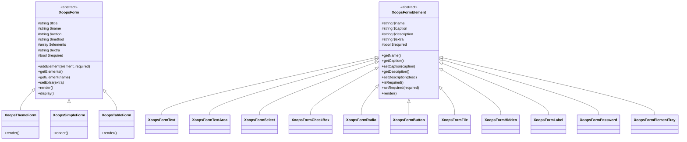
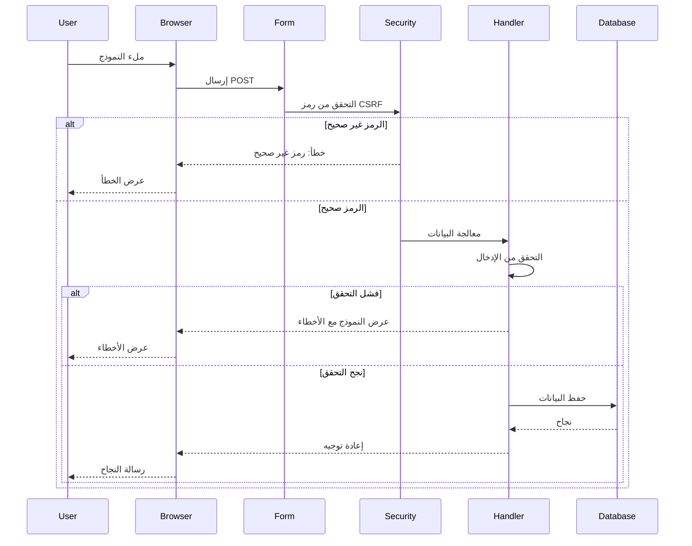

> توثيق واجهة برمجة التطبيقات الكاملة لنظام إنشاء النماذج في XOOPS.

---

## هرم الفئات



---

## XoopsForm (القاعدة المجردة)

### المُنشئ

```php
public function __construct(
    string $title,      // عنوان النموذج
    string $name,       // اسم سمة النموذج
    string $action,     // عنوان URL لإجراء النموذج
    string $method = 'post',  // طريقة HTTP
    bool $addToken = false    // إضافة رمز CSRF
)
```

### الدوال

| الدالة | المعاملات | الإرجاع | الوصف |
|--------|----------|--------|-------|
| `addElement` | `XoopsFormElement $element, bool $required = false` | `void` | إضافة عنصر إلى النموذج |
| `getElements` | - | `array` | الحصول على جميع العناصر |
| `getElement` | `string $name` | `XoopsFormElement\|null` | الحصول على عنصر حسب الاسم |
| `setExtra` | `string $extra` | `void` | تعيين سمات HTML إضافية |
| `getExtra` | - | `string` | الحصول على السمات الإضافية |
| `getTitle` | - | `string` | الحصول على عنوان النموذج |
| `setTitle` | `string $title` | `void` | تعيين عنوان النموذج |
| `getName` | - | `string` | الحصول على اسم النموذج |
| `getAction` | - | `string` | الحصول على عنوان URL للإجراء |
| `render` | - | `string` | عرض كود HTML للنموذج |
| `display` | - | `void` | طباعة النموذج المعروض |
| `insertBreak` | `string $extra = ''` | `void` | إدراج فاصل بصري |
| `setRequired` | `XoopsFormElement $element` | `void` | وضع علامة على العنصر كمطلوب |

---

## XoopsThemeForm

فئة النموذج الأكثر استخداماً، تعرض بأسلوب متوافق مع المظهر الحالي.

### الاستخدام

```php
<?php
$form = new XoopsThemeForm(
    'تسجيل مستخدم',
    'registration_form',
    'register.php',
    'post',
    true  // تضمين رمز CSRF
);

$form->addElement(new XoopsFormText('اسم المستخدم', 'uname', 25, 255, ''), true);
$form->addElement(new XoopsFormPassword('كلمة المرور', 'pass', 25, 255), true);
$form->addElement(new XoopsFormButton('', 'submit', _SUBMIT, 'submit'));

echo $form->render();
```

### الإخراج المعروض

```html
<form name="registration_form" action="register.php" method="post"
      enctype="application/x-www-form-urlencoded">
  <table class="outer" cellspacing="1">
    <tr><th colspan="2">تسجيل مستخدم</th></tr>
    <tr class="odd">
      <td class="head">اسم المستخدم <span class="required">*</span></td>
      <td class="even">
        <input type="text" name="uname" size="25" maxlength="255" value="">
      </td>
    </tr>
    <!-- ... المزيد من الحقول ... -->
  </table>
  <input type="hidden" name="XOOPS_TOKEN_REQUEST" value="...">
</form>
```

---

## عناصر النموذج

### XoopsFormText

إدخال نص بسطر واحد.

```php
$text = new XoopsFormText(
    string $caption,    // نص التسمية
    string $name,       // اسم الإدخال
    int $size,          // عرض العرض
    int $maxlength,     // الحد الأقصى للأحرف
    mixed $value = ''   // القيمة الافتراضية
);

// الدوال
$text->getValue();
$text->setValue($value);
$text->getSize();
$text->getMaxlength();
```

### XoopsFormTextArea

إدخال نص متعدد الأسطر.

```php
$textarea = new XoopsFormTextArea(
    string $caption,
    string $name,
    mixed $value = '',
    int $rows = 5,
    int $cols = 50
);

// الدوال
$textarea->getRows();
$textarea->getCols();
```

### XoopsFormSelect

قائمة منسدلة أو تحديد متعدد.

```php
$select = new XoopsFormSelect(
    string $caption,
    string $name,
    mixed $value = null,
    int $size = 1,        // 1 = قائمة منسدلة، >1 = قائمة
    bool $multiple = false
);

// الدوال
$select->addOption(mixed $value, string $name = '');
$select->addOptionArray(array $options);
$select->getOptions();
$select->getValue();
$select->isMultiple();
```

### XoopsFormCheckBox

صندوق اختيار أو مجموعة صناديق اختيار.

```php
$checkbox = new XoopsFormCheckBox(
    string $caption,
    string $name,
    mixed $value = null,
    string $delimeter = '&nbsp;'
);

// الدوال
$checkbox->addOption(mixed $value, string $name = '');
$checkbox->addOptionArray(array $options);
$checkbox->getValue();
```

### XoopsFormRadio

مجموعة أزرار راديو.

```php
$radio = new XoopsFormRadio(
    string $caption,
    string $name,
    mixed $value = null,
    string $delimeter = '&nbsp;'
);

// الدوال
$radio->addOption(mixed $value, string $name = '');
$radio->addOptionArray(array $options);
```

### XoopsFormButton

زر إرسال أو إعادة تعيين أو زر مخصص.

```php
$button = new XoopsFormButton(
    string $caption,
    string $name,
    string $value = '',
    string $type = 'button'  // 'submit', 'reset', 'button'
);
```

### XoopsFormFile

إدخال رفع ملف.

```php
$file = new XoopsFormFile(
    string $caption,
    string $name,
    int $maxFileSize = 0
);

// الدوال
$file->getMaxFileSize();
$file->setMaxFileSize(int $size);
```

### XoopsFormHidden

حقل إدخال مخفي.

```php
$hidden = new XoopsFormHidden(
    string $name,
    mixed $value
);
```

### XoopsFormHiddenToken

رمز حماية CSRF.

```php
$token = new XoopsFormHiddenToken(
    string $name = 'XOOPS_TOKEN_REQUEST'
);
```

### XoopsFormLabel

تسمية للعرض فقط (ليست إدخالاً).

```php
$label = new XoopsFormLabel(
    string $caption,
    string $value
);
```

### XoopsFormPassword

حقل إدخال كلمة المرور.

```php
$password = new XoopsFormPassword(
    string $caption,
    string $name,
    int $size,
    int $maxlength,
    mixed $value = ''
);
```

### XoopsFormElementTray

تجميع عناصر متعددة معاً.

```php
$tray = new XoopsFormElementTray(
    string $caption,
    string $delimeter = '&nbsp;'
);

// الدوال
$tray->addElement(XoopsFormElement $element, bool $required = false);
$tray->getElements();
```

---

## مخطط تدفق النموذج



---

## مثال شامل

```php
<?php
require_once __DIR__ . '/mainfile.php';

use Xmf\Request;

$helper = \XoopsModules\MyModule\Helper::getInstance();
$itemHandler = $helper->getHandler('Item');

// معالجة إرسال النموذج
if (Request::hasVar('submit', 'POST')) {
    // التحقق من رمز CSRF
    if (!$GLOBALS['xoopsSecurity']->check()) {
        redirect_header('form.php', 3, implode('<br>', $GLOBALS['xoopsSecurity']->getErrors()));
    }

    // الحصول على الإدخال المتحقق منه
    $title = Request::getString('title', '', 'POST');
    $content = Request::getText('content', '', 'POST');
    $categoryId = Request::getInt('category_id', 0, 'POST');
    $status = Request::getString('status', 'draft', 'POST');

    // إنشاء وملء الكائن
    $item = $itemHandler->create();
    $item->setVars([
        'title' => $title,
        'content' => $content,
        'category_id' => $categoryId,
        'status' => $status,
        'created' => time(),
        'uid' => $GLOBALS['xoopsUser']->getVar('uid')
    ]);

    // حفظ
    if ($itemHandler->insert($item)) {
        redirect_header('index.php', 2, _MD_MYMODULE_SAVED);
    } else {
        $error = _MD_MYMODULE_ERROR_SAVING;
    }
}

// بناء النموذج
$form = new XoopsThemeForm(_MD_MYMODULE_ADD_ITEM, 'itemform', 'form.php', 'post', true);

// حقل العنوان
$titleElement = new XoopsFormText(_MD_MYMODULE_TITLE, 'title', 50, 255, $title ?? '');
$titleElement->setDescription(_MD_MYMODULE_TITLE_DESC);
$form->addElement($titleElement, true);

// قائمة الفئة
$categoryHandler = $helper->getHandler('Category');
$categories = $categoryHandler->getList();
$categorySelect = new XoopsFormSelect(_MD_MYMODULE_CATEGORY, 'category_id', $categoryId ?? 0);
$categorySelect->addOptionArray($categories);
$form->addElement($categorySelect, true);

// منطقة المحتوى مع محرر
$editorConfigs = [
    'name' => 'content',
    'value' => $content ?? '',
    'rows' => 15,
    'cols' => 60,
    'width' => '100%',
    'height' => '400px',
];
$form->addElement(new XoopsFormEditor(_MD_MYMODULE_CONTENT, 'content', $editorConfigs));

// أزرار الراديو للحالة
$statusRadio = new XoopsFormRadio(_MD_MYMODULE_STATUS, 'status', $status ?? 'draft');
$statusRadio->addOptionArray([
    'draft' => _MD_MYMODULE_DRAFT,
    'published' => _MD_MYMODULE_PUBLISHED,
    'archived' => _MD_MYMODULE_ARCHIVED
]);
$form->addElement($statusRadio);

// زر الإرسال
$buttonTray = new XoopsFormElementTray('', '&nbsp;');
$buttonTray->addElement(new XoopsFormButton('', 'submit', _SUBMIT, 'submit'));
$buttonTray->addElement(new XoopsFormButton('', 'reset', _CANCEL, 'reset'));
$form->addElement($buttonTray);

// عرض
require_once XOOPS_ROOT_PATH . '/header.php';

if (!empty($error)) {
    echo "<div class='errorMsg'>$error</div>";
}

$form->display();

require_once XOOPS_ROOT_PATH . '/footer.php';
```

---

## التوثيق الذي يتعلق بهذا

- واجهة برمجة تطبيقات XoopsObject
- دليل النماذج
- حماية CSRF

---

#xoops #api #forms #xoopsform #reference
