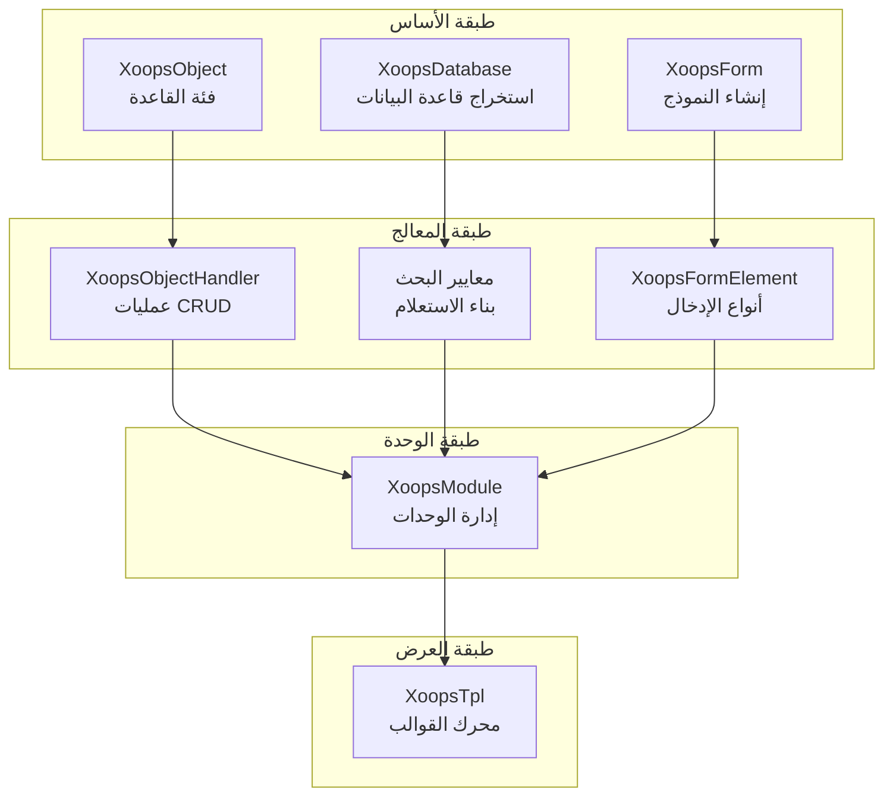
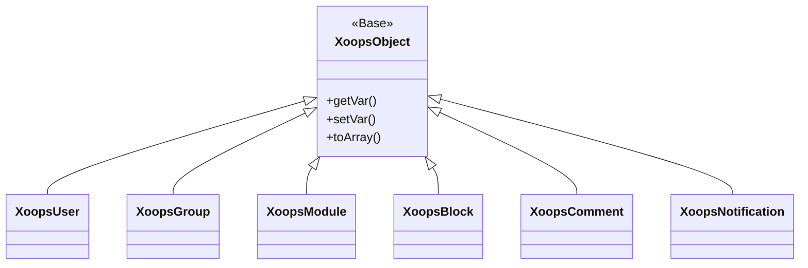
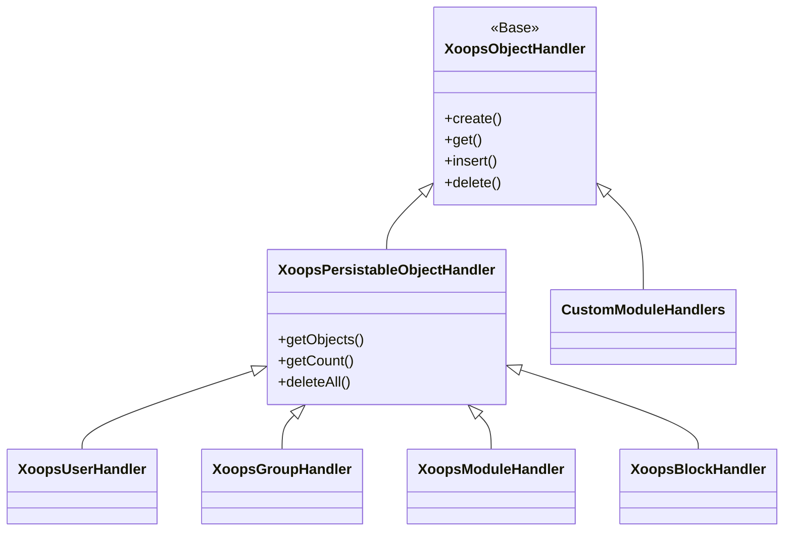
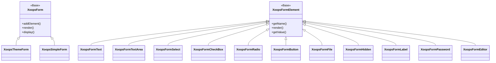

مرحباً بك في وثائق مرجع واجهة برمجة تطبيقات XOOPS الشاملة. يوفر هذا القسم توثيقاً مفصلاً لجميع الفئات الأساسية والدوال والأنظمة التي تشكل نظام إدارة المحتوى XOOPS.

## نظرة عامة

تم تنظيم واجهة برمجة تطبيقات XOOPS في عدة أنظمة فرعية رئيسية، كل منها مسؤول عن جانب معين من وظائف نظام إدارة المحتوى. فهم هذه واجهات برمجة التطبيقات أمر ضروري لتطوير الوحدات والمظاهر والإضافات لـ XOOPS.

## أقسام واجهة برمجة التطبيقات

### الفئات الأساسية

فئات الأساس التي تبني عليها جميع مكونات XOOPS الأخرى.

| التوثيق | الوصف |
|----------|-------|
| XoopsObject | فئة القاعدة لجميع كائنات البيانات في XOOPS |
| XoopsObjectHandler | نمط معالج عمليات CRUD |

### طبقة قاعدة البيانات

استخراج قاعدة البيانات وأدوات بناء الاستعلامات.

| التوثيق | الوصف |
|----------|-------|
| XoopsDatabase | طبقة الاستخراج من قاعدة البيانات |
| نظام معايير البحث | معايير الاستعلام والشروط |
| منشئ الاستعلامات | بناء الاستعلامات بطريقة معبرة حديثة |

### نظام النموذج

إنشاء نماذج HTML والتحقق من صحتها.

| التوثيق | الوصف |
|----------|-------|
| XoopsForm | حاوية النموذج والعرض |
| عناصر النموذج | جميع أنواع عناصر النموذج المتاحة |

### فئات النواة

مكونات نظام النواة والخدمات الأساسية.

| التوثيق | الوصف |
|----------|-------|
| فئات نواة النظام | نواة النظام والمكونات الأساسية |

### نظام الوحدات

إدارة الوحدات ودورة حياتها.

| التوثيق | الوصف |
|----------|-------|
| نظام الوحدات | تحميل الوحدات والتثبيت والإدارة |

### نظام القوالب

تكامل قالب Smarty.

| التوثيق | الوصف |
|----------|-------|
| نظام القوالب | تكامل Smarty وإدارة القوالب |

### نظام المستخدمين

إدارة المستخدمين والمصادقة.

| التوثيق | الوصف |
|----------|-------|
| نظام المستخدمين | حسابات المستخدمين والمجموعات والأذونات |

## نظرة عامة على البنية



## هرم الفئات

### نموذج الكائن



### نموذج المعالج



### نموذج النموذج



## أنماط التصميم

تطبق واجهة برمجة تطبيقات XOOPS عدة أنماط تصميم معروفة:

### نمط Singleton
يستخدم للخدمات العامة مثل اتصالات قاعدة البيانات وأمثلة الحاويات.

```php
$db = XoopsDatabase::getInstance();
$container = XoopsContainer::getInstance();
```

### نمط المصنع
معالجات الكائنات تنشئ كائنات المجال بشكل متسق.

```php
$handler = xoops_getHandler('user');
$user = $handler->create();
```

### نمط مركب
تحتوي النماذج على عناصر نموذج متعددة؛ يمكن أن تحتوي المعايير على معايير متداخلة.

```php
$criteria = new CriteriaCompo();
$criteria->add(new Criteria('status', 1));
$criteria->add(new CriteriaCompo(...)); // متداخل
```

### نمط المراقب
نظام الحدث يسمح بالاقتران الضعيف بين الوحدات.

```php
$dispatcher->addListener('module.news.article_published', $callback);
```

## أمثلة البدء السريع

### إنشاء وحفظ كائن

```php
// الحصول على المعالج
$handler = xoops_getHandler('user');

// إنشاء كائن جديد
$user = $handler->create();
$user->setVar('uname', 'newuser');
$user->setVar('email', 'user@example.com');

// الحفظ إلى قاعدة البيانات
$handler->insert($user);
```

### الاستعلام بمعايير البحث

```php
// بناء المعايير
$criteria = new CriteriaCompo();
$criteria->add(new Criteria('level', 0, '>'));
$criteria->setSort('uname');
$criteria->setOrder('ASC');
$criteria->setLimit(10);

// الحصول على الكائنات
$handler = xoops_getHandler('user');
$users = $handler->getObjects($criteria);
```

### إنشاء نموذج

```php
$form = new XoopsThemeForm('ملف تعريف المستخدم', 'userform', 'save.php', 'post', true);
$form->addElement(new XoopsFormText('اسم المستخدم', 'uname', 50, 255, $user->getVar('uname')));
$form->addElement(new XoopsFormTextArea('السيرة الذاتية', 'bio', $user->getVar('bio')));
$form->addElement(new XoopsFormButton('', 'submit', _SUBMIT, 'submit'));
echo $form->render();
```

## اتفاقيات واجهة برمجة التطبيقات

### اتفاقيات التسمية

| النوع | الاتفاقية | مثال |
|------|-----------|------|
| الفئات | PascalCase | `XoopsUser`, `CriteriaCompo` |
| الدوال | camelCase | `getVar()`, `setVar()` |
| الخصائص | camelCase (محمي) | `$_vars`, `$_handler` |
| الثوابت | UPPER_SNAKE_CASE | `XOBJ_DTYPE_INT` |
| جداول قاعدة البيانات | snake_case | `users`, `groups_users_link` |

### أنواع البيانات

تحدد XOOPS أنواع بيانات قياسية لمتغيرات الكائن:

| الثابت | النوع | الوصف |
|----------|------|-------|
| `XOBJ_DTYPE_TXTBOX` | String | إدخال نص (معقم) |
| `XOBJ_DTYPE_TXTAREA` | String | محتوى منطقة النص |
| `XOBJ_DTYPE_INT` | Integer | القيم الرقمية |
| `XOBJ_DTYPE_URL` | String | التحقق من عنوان URL |
| `XOBJ_DTYPE_EMAIL` | String | التحقق من البريد الإلكتروني |
| `XOBJ_DTYPE_ARRAY` | Array | مصفوفات متسلسلة |
| `XOBJ_DTYPE_OTHER` | Mixed | معالجة مخصصة |
| `XOBJ_DTYPE_SOURCE` | String | كود المصدر (تعقيم بسيط) |
| `XOBJ_DTYPE_STIME` | Integer | طابع زمني قصير |
| `XOBJ_DTYPE_MTIME` | Integer | طابع زمني متوسط |
| `XOBJ_DTYPE_LTIME` | Integer | طابع زمني طويل |

## طرق المصادقة

تدعم واجهة برمجة التطبيقات طرق مصادقة متعددة:

### مصادقة مفتاح API
```
X-API-Key: your-api-key
```

### رمز OAuth Bearer
```
Authorization: Bearer your-oauth-token
```

### مصادقة قائمة على الجلسة
تستخدم جلسة XOOPS الموجودة عند تسجيل الدخول.

## نقاط نهاية REST API

عند تمكين REST API:

| نقطة النهاية | الطريقة | الوصف |
|----------|--------|-------|
| `/api.php/rest/users` | GET | عرض قائمة المستخدمين |
| `/api.php/rest/users/{id}` | GET | الحصول على المستخدم بواسطة المعرف |
| `/api.php/rest/users` | POST | إنشاء مستخدم |
| `/api.php/rest/users/{id}` | PUT | تحديث المستخدم |
| `/api.php/rest/users/{id}` | DELETE | حذف المستخدم |
| `/api.php/rest/modules` | GET | عرض قائمة الوحدات |

## التوثيق ذو الصلة

- دليل تطوير الوحدات
- دليل تطوير المظهر
- إعدادات النظام
- أفضل ممارسات الأمان

## سجل الإصدارات

| الإصدار | التغييرات |
|----------|-----------|
| 2.5.11 | الإصدار الثابت الحالي |
| 2.5.10 | إضافة دعم GraphQL API |
| 2.5.9 | تحسين نظام المعايير |
| 2.5.8 | دعم تحميل تلقائي PSR-4 |

---

*هذا التوثيق جزء من قاعدة معارف XOOPS. للحصول على أحدث التحديثات، قم بزيارة [مستودع XOOPS على GitHub](https://github.com/XOOPS).*
