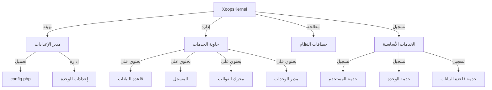

توفر نواة XOOPS الإطار الأساسي لتمهيد النظام وإدارة الإعدادات ومعالجة أحداث النظام وتوفير أدوات مساعدة أساسية. تشكل هذه الفئات العمود الفقري لتطبيق XOOPS.

## بنية النظام



## فئة XoopsKernel

فئة النواة الرئيسية التي تهيئ وتدير نظام XOOPS.

### نظرة عامة على الفئة

```php
namespace Xoops;

class XoopsKernel
{
    private static ?XoopsKernel $instance = null;
    protected ServiceContainer $services;
    protected ConfigurationManager $config;
    protected array $modules = [];
    protected bool $isLoaded = false;
}
```

### المُنشئ

```php
private function __construct()
```

مُنشئ خاص يفرض نمط Singleton.

### getInstance

استرجاع مثيل النواة الفردي.

```php
public static function getInstance(): XoopsKernel
```

**الإرجاع:** `XoopsKernel` - مثيل النواة الفردي

**مثال:**
```php
$kernel = XoopsKernel::getInstance();
```

### عملية التمهيد

تتبع عملية تمهيد النواة هذه الخطوات:

1. **التهيئة** - تعيين معالجات الأخطاء وتعريف الثوابت
2. **الإعدادات** - تحميل ملفات الإعدادات
3. **تسجيل الخدمات** - تسجيل الخدمات الأساسية
4. **كشف الوحدة** - مسح والتعرف على الوحدات النشطة
5. **تهيئة قاعدة البيانات** - الاتصال بقاعدة البيانات
6. **التنظيف** - الاستعداد لمعالجة الطلب

```php
public function boot(): void
```

**مثال:**
```php
$kernel = XoopsKernel::getInstance();
$kernel->boot();
```

### طرق حاوية الخدمات

#### تسجيل الخدمة

تسجيل خدمة في حاوية الخدمات.

```php
public function registerService(
    string $name,
    callable|object $definition
): void
```

**المعاملات:**

| المعامل | النوع | الوصف |
|----------|------|-------|
| `$name` | string | معرف الخدمة |
| `$definition` | callable\|object | مصنع الخدمة أو المثيل |

**مثال:**
```php
$kernel->registerService('custom.handler', function($c) {
    return new CustomHandler();
});
```

#### الحصول على الخدمة

استرجاع خدمة مسجلة.

```php
public function getService(string $name): mixed
```

**المعاملات:**

| المعامل | النوع | الوصف |
|----------|------|-------|
| `$name` | string | معرف الخدمة |

**الإرجاع:** `mixed` - الخدمة المطلوبة

**مثال:**
```php
$database = $kernel->getService('database');
$logger = $kernel->getService('logger');
```

#### التحقق من الخدمة

فحص ما إذا كانت الخدمة مسجلة.

```php
public function hasService(string $name): bool
```

**مثال:**
```php
if ($kernel->hasService('cache')) {
    $cache = $kernel->getService('cache');
}
```

## مدير الإعدادات

يدير إعدادات التطبيق وإعدادات الوحدات.

### نظرة عامة على الفئة

```php
namespace Xoops\Core;

class ConfigurationManager
{
    protected array $config = [];
    protected array $defaults = [];
    protected string $configPath;
}
```

### الدوال

#### تحميل

تحميل الإعدادات من الملف أو المصفوفة.

```php
public function load(string|array $source): void
```

**المعاملات:**

| المعامل | النوع | الوصف |
|----------|------|-------|
| `$source` | string\|array | مسار ملف الإعدادات أو مصفوفة |

**مثال:**
```php
$config = $kernel->getService('config');
$config->load(XOOPS_ROOT_PATH . '/include/config.php');
$config->load(['sitename' => 'موقعي', 'admin_email' => 'admin@example.com']);
```

#### الحصول على

استرجاع قيمة الإعدادات.

```php
public function get(string $key, mixed $default = null): mixed
```

**المعاملات:**

| المعامل | النوع | الوصف |
|----------|------|-------|
| `$key` | string | مفتاح الإعدادات (تدوين النقطة) |
| `$default` | mixed | القيمة الافتراضية إذا لم توجد |

**الإرجاع:** `mixed` - قيمة الإعدادات

**مثال:**
```php
$siteName = $config->get('sitename');
$adminEmail = $config->get('admin.email', 'admin@example.com');
```

#### التعيين

تعيين قيمة الإعدادات.

```php
public function set(string $key, mixed $value): void
```

**المعاملات:**

| المعامل | النوع | الوصف |
|----------|------|-------|
| `$key` | string | مفتاح الإعدادات |
| `$value` | mixed | قيمة الإعدادات |

**مثال:**
```php
$config->set('sitename', 'اسم الموقع الجديد');
$config->set('features.cache_enabled', true);
```

#### الحصول على إعدادات الوحدة

الحصول على الإعدادات لوحدة معينة.

```php
public function getModuleConfig(
    string $moduleName
): array
```

**المعاملات:**

| المعامل | النوع | الوصف |
|----------|------|-------|
| `$moduleName` | string | اسم دليل الوحدة |

**الإرجاع:** `array` - مصفوفة إعدادات الوحدة

**مثال:**
```php
$publisherConfig = $config->getModuleConfig('publisher');
```

## خطافات النظام

تسمح خطافات النظام للوحدات والإضافات بتنفيذ الكود في نقاط معينة من دورة حياة التطبيق.

### فئة مدير الخطافات

```php
namespace Xoops\Core;

class HookManager
{
    protected array $hooks = [];
    protected array $listeners = [];
}
```

### الدوال

#### إضافة خطاف

تسجيل نقطة خطاف.

```php
public function addHook(string $name): void
```

**المعاملات:**

| المعامل | النوع | الوصف |
|----------|------|-------|
| `$name` | string | معرف الخطاف |

**مثال:**
```php
$hooks = $kernel->getService('hooks');
$hooks->addHook('system.startup');
$hooks->addHook('user.login');
$hooks->addHook('module.install');
```

#### الاستماع

إرفاق مستمع بخطاف.

```php
public function listen(
    string $hookName,
    callable $callback,
    int $priority = 10
): void
```

**المعاملات:**

| المعامل | النوع | الوصف |
|----------|------|-------|
| `$hookName` | string | معرف الخطاف |
| `$callback` | callable | الدالة المراد تنفيذها |
| `$priority` | int | أولوية التنفيذ (أعلى تعمل أولاً) |

**مثال:**
```php
$hooks->listen('user.login', function($user) {
    error_log('المستخدم ' . $user->uname . ' سجل دخولاً');
}, 10);

$hooks->listen('module.install', function($module) {
    // منطق التثبيت المخصص للوحدة
    echo "تثبيت " . $module->getName();
}, 5);
```

#### التشغيل

تنفيذ جميع المستمعين لخطاف.

```php
public function trigger(
    string $hookName,
    mixed $arguments = null
): array
```

**المعاملات:**

| المعامل | النوع | الوصف |
|----------|------|-------|
| `$hookName` | string | معرف الخطاف |
| `$arguments` | mixed | البيانات المراد تمريرها إلى المستمعين |

**الإرجاع:** `array` - النتائج من جميع المستمعين

**مثال:**
```php
$results = $hooks->trigger('system.startup');
$results = $hooks->trigger('user.created', $newUser);
```

## نظرة عامة على الخدمات الأساسية

تسجل النواة عدة خدمات أساسية أثناء التمهيد:

| الخدمة | الفئة | الغرض |
|--------|-------|--------|
| `database` | XoopsDatabase | طبقة استخراج قاعدة البيانات |
| `config` | ConfigurationManager | إدارة الإعدادات |
| `logger` | Logger | تسجيل التطبيق |
| `template` | XoopsTpl | محرك القوالب |
| `user` | UserManager | خدمة إدارة المستخدمين |
| `module` | ModuleManager | إدارة الوحدات |
| `cache` | CacheManager | طبقة التخزين المؤقت |
| `hooks` | HookManager | خطافات أحداث النظام |

## مثال الاستخدام الشامل

```php
<?php
/**
 * عملية تمهيد الوحدة المخصصة باستخدام النواة
 */

// الحصول على مثيل النواة
$kernel = XoopsKernel::getInstance();

// تمهيد النظام
$kernel->boot();

// الحصول على الخدمات
$config = $kernel->getService('config');
$database = $kernel->getService('database');
$logger = $kernel->getService('logger');
$hooks = $kernel->getService('hooks');

// الوصول إلى الإعدادات
$siteName = $config->get('sitename');
$adminEmail = $config->get('admin.email');

// تسجيل خطافات محددة للوحدة
$hooks->listen('user.login', function($user) {
    // تسجيل دخول المستخدم
    $logger->info('دخول المستخدم: ' . $user->uname);

    // المتابعة في قاعدة البيانات
    $database->query(
        'INSERT INTO ' . $database->prefix('event_log') .
        ' (type, user_id, message, timestamp) VALUES (?, ?, ?, ?)',
        ['login', $user->uid(), 'دخول المستخدم', time()]
    );
});

$hooks->listen('module.install', function($module) {
    $logger->info('تم تثبيت الوحدة: ' . $module->getName());
});

// تشغيل الخطافات
$hooks->trigger('system.startup');

// استخدام خدمة قاعدة البيانات
$result = $database->query(
    'SELECT * FROM ' . $database->prefix('users') .
    ' LIMIT 10'
);

while ($row = $database->fetchArray($result)) {
    echo "المستخدم: " . htmlspecialchars($row['uname']) . "\n";
}

// تسجيل خدمة مخصصة
$kernel->registerService('custom.repository', function($c) {
    return new CustomRepository($c->getService('database'));
});

// الوصول إلى الخدمة المخصصة لاحقاً
$repo = $kernel->getService('custom.repository');
```

## ثوابت النواة

تحدد النواة عدة ثوابت مهمة أثناء التمهيد:

```php
// مسارات النظام
define('XOOPS_ROOT_PATH', '/var/www/xoops');
define('XOOPS_HTDOCS_PATH', XOOPS_ROOT_PATH . '/htdocs');
define('XOOPS_MODULES_PATH', XOOPS_ROOT_PATH . '/htdocs/modules');
define('XOOPS_THEMES_PATH', XOOPS_ROOT_PATH . '/htdocs/themes');

// مسارات الويب
define('XOOPS_URL', 'http://example.com');
define('XOOPS_HTDOCS_URL', XOOPS_URL . '/htdocs');

// قاعدة البيانات
define('XOOPS_DB_PREFIX', 'xoops_');
```

## معالجة الأخطاء

تعيين النواة معالجات الأخطاء أثناء التمهيد:

```php
// تعيين معالج الأخطاء المخصص
set_error_handler(function($errno, $errstr, $errfile, $errline) {
    $kernel->getService('logger')->error(
        "خطأ: $errstr في $errfile:$errline"
    );
});

// تعيين معالج الاستثناءات
set_exception_handler(function($exception) {
    $kernel->getService('logger')->critical(
        "استثناء: " . $exception->getMessage()
    );
});
```

## أفضل الممارسات

1. **التمهيد الواحد** - استدعاء `boot()` مرة واحدة فقط أثناء بدء التطبيق
2. **استخدام حاوية الخدمات** - تسجيل واسترجاع الخدمات من خلال النواة
3. **معالجة الخطافات مبكراً** - تسجيل مستمعي الخطافات قبل تشغيلها
4. **تسجيل الأحداث المهمة** - استخدام خدمة المسجل للتصحيح
5. **تخزين الإعدادات مؤقتاً** - تحميل الإعدادات مرة واحدة وإعادة استخدامها
6. **معالجة الأخطاء** - ضبط معالجات الأخطاء دائماً قبل معالجة الطلبات

## التوثيق ذو الصلة

- ../Module/Module-System - نظام الوحدات ودورة حياتها
- ../Template/Template-System - تكامل محرك القوالب
- ../User/User-System - مصادقة وإدارة المستخدمين
- ../Database/XoopsDatabase - طبقة قاعدة البيانات

---

*انظر أيضاً: [كود مصدر نواة XOOPS](https://github.com/XOOPS/XoopsCore27/tree/master/htdocs/class)*
