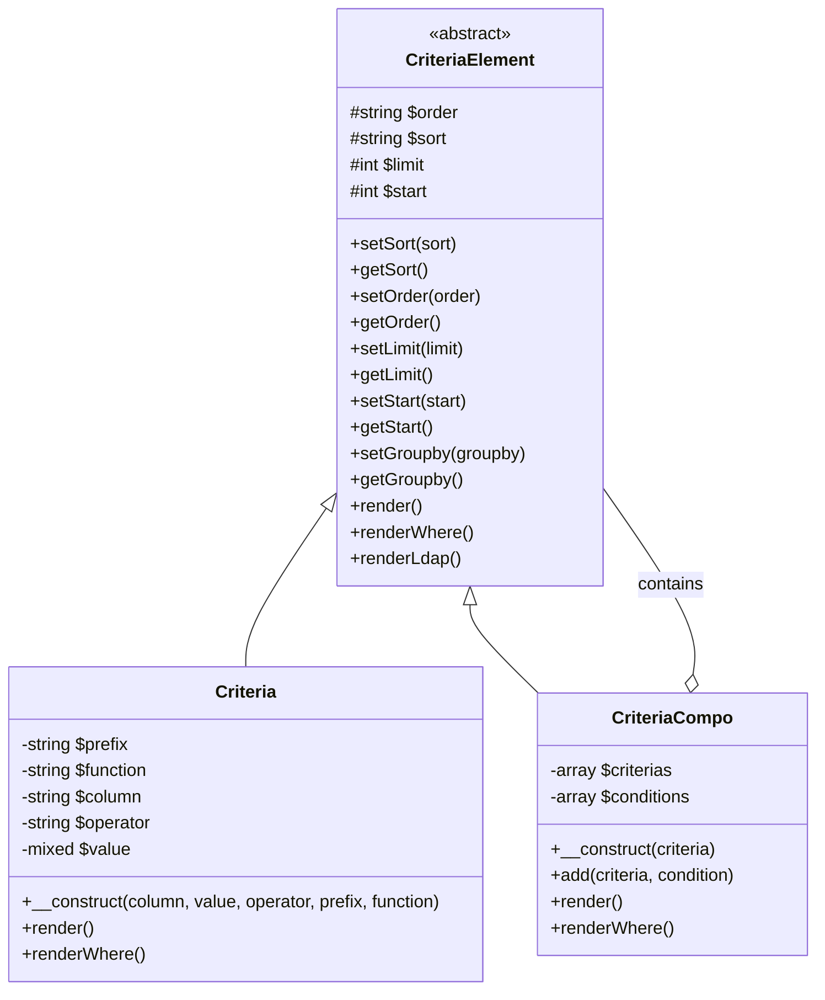
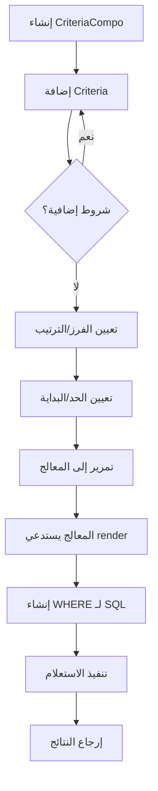
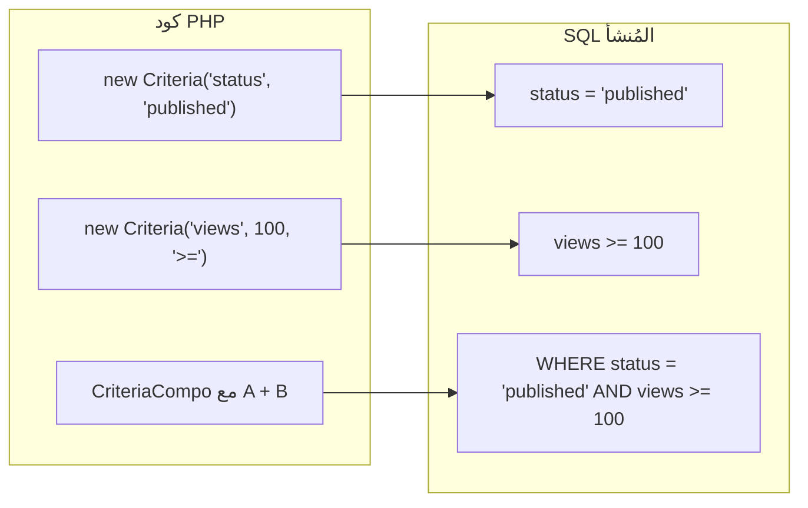
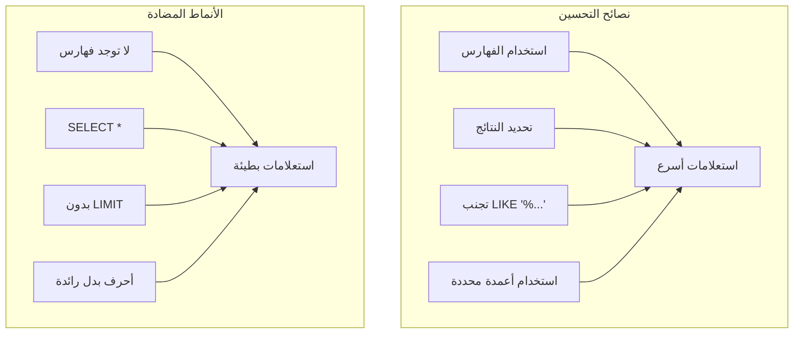

> توثيق واجهة برمجة التطبيقات الكاملة لنظام بناء استعلامات معايير البحث في XOOPS.

---

## بنية نظام معايير البحث



---

## فئة معايير البحث

### المُنشئ

```php
public function __construct(
    string $column,           // اسم العمود
    mixed $value = '',        // القيمة للمقارنة
    string $operator = '=',   // عامل المقارنة
    string $prefix = '',      // بادئة الجدول
    string $function = ''     // دالة SQL للتغليف
)
```

### العاملات

| العامل | مثال | إخراج SQL |
|--------|------|----------|
| `=` | `new Criteria('status', 1)` | `status = 1` |
| `!=` | `new Criteria('status', 0, '!=')` | `status != 0` |
| `<>` | `new Criteria('status', 0, '<>')` | `status <> 0` |
| `<` | `new Criteria('age', 18, '<')` | `age < 18` |
| `<=` | `new Criteria('age', 18, '<=')` | `age <= 18` |
| `>` | `new Criteria('age', 18, '>')` | `age > 18` |
| `>=` | `new Criteria('age', 18, '>=')` | `age >= 18` |
| `LIKE` | `new Criteria('title', '%php%', 'LIKE')` | `title LIKE '%php%'` |
| `NOT LIKE` | `new Criteria('title', '%spam%', 'NOT LIKE')` | `title NOT LIKE '%spam%'` |
| `IN` | `new Criteria('id', '(1,2,3)', 'IN')` | `id IN (1,2,3)` |
| `NOT IN` | `new Criteria('id', '(1,2,3)', 'NOT IN')` | `id NOT IN (1,2,3)` |
| `IS NULL` | `new Criteria('deleted', null, 'IS NULL')` | `deleted IS NULL` |
| `IS NOT NULL` | `new Criteria('email', null, 'IS NOT NULL')` | `email IS NOT NULL` |
| `BETWEEN` | `new Criteria('created', '1000 AND 2000', 'BETWEEN')` | `created BETWEEN 1000 AND 2000` |

### أمثلة الاستخدام

```php
// المساواة البسيطة
$criteria = new Criteria('status', 'published');

// مقارنة رقمية
$criteria = new Criteria('views', 100, '>=');

// مطابقة الأنماط
$criteria = new Criteria('title', '%XOOPS%', 'LIKE');

// مع بادئة الجدول
$criteria = new Criteria('uid', 1, '=', 'u');
// العرض: u.uid = 1

// مع دالة SQL
$criteria = new Criteria('title', '', '!=', '', 'LOWER');
// العرض: LOWER(title) != ''
```

---

## فئة معايير البحث المركبة

### المُنشئ والدوال

```php
// إنشاء معايير مركبة فارغة
$criteria = new CriteriaCompo();

// أو مع معايير أولية
$criteria = new CriteriaCompo(new Criteria('status', 'active'));

// إضافة معايير (AND بشكل افتراضي)
$criteria->add(new Criteria('views', 10, '>='));

// إضافة مع OR
$criteria->add(new Criteria('featured', 1), 'OR');

// التداخل
$subCriteria = new CriteriaCompo();
$subCriteria->add(new Criteria('author', 1));
$subCriteria->add(new Criteria('author', 2), 'OR');
$criteria->add($subCriteria); // (author = 1 OR author = 2)
```

### الفرز والتقسيم إلى صفحات

```php
$criteria = new CriteriaCompo();
$criteria->add(new Criteria('status', 'published'));

// فرز واحد
$criteria->setSort('created');
$criteria->setOrder('DESC');

// أعمدة فرز متعددة
$criteria->setSort('category_id, created');
$criteria->setOrder('ASC, DESC');

// التقسيم إلى صفحات
$criteria->setLimit(10);    // العناصر لكل صفحة
$criteria->setStart(0);     // الإزاحة (صفحة * حد)

// تجميع حسب
$criteria->setGroupby('category_id');
```

---

## تدفق بناء الاستعلام



---

## أمثلة استعلامات معقدة

### البحث مع شروط متعددة

```php
$criteria = new CriteriaCompo();

// يجب أن تكون الحالة منشورة
$criteria->add(new Criteria('status', 'published'));

// الفئة هي 1، 2، أو 3
$criteria->add(new Criteria('category_id', '(1, 2, 3)', 'IN'));

// تم إنشاؤها في آخر 30 يوماً
$thirtyDaysAgo = time() - (30 * 24 * 60 * 60);
$criteria->add(new Criteria('created', $thirtyDaysAgo, '>='));

// مصطلح البحث في العنوان أو المحتوى
$searchCriteria = new CriteriaCompo();
$searchCriteria->add(new Criteria('title', '%' . $searchTerm . '%', 'LIKE'));
$searchCriteria->add(new Criteria('content', '%' . $searchTerm . '%', 'LIKE'), 'OR');
$criteria->add($searchCriteria);

// الفرز حسب المشاهدات بترتيب تنازلي
$criteria->setSort('views');
$criteria->setOrder('DESC');

// التقسيم إلى صفحات
$criteria->setLimit($perPage);
$criteria->setStart($page * $perPage);

// التنفيذ
$items = $itemHandler->getObjects($criteria);
$total = $itemHandler->getCount($criteria);
```

### استعلام نطاق التاريخ

```php
$criteria = new CriteriaCompo();

// بين تاريخين
$startDate = strtotime('2024-01-01');
$endDate = strtotime('2024-12-31');

$criteria->add(new Criteria('created', $startDate, '>='));
$criteria->add(new Criteria('created', $endDate, '<='));

// أو باستخدام BETWEEN
$criteria->add(new Criteria('created', "$startDate AND $endDate", 'BETWEEN'));
```

### استعلام مرشح إذن المستخدم

```php
$criteria = new CriteriaCompo();
$criteria->add(new Criteria('status', 'published'));

// إذا لم يكن المستخدم مسؤولاً، أظهر فقط العناصر الخاصة به أو العامة
if (!$xoopsUser || !$xoopsUser->isAdmin()) {
    $permCriteria = new CriteriaCompo();
    $permCriteria->add(new Criteria('visibility', 'public'));

    if (is_object($xoopsUser)) {
        $permCriteria->add(new Criteria('author_id', $xoopsUser->getVar('uid')), 'OR');
    }

    $criteria->add($permCriteria);
}
```

### استعلام شبيه بـ Join

```php
// الحصول على عناصر حيث تكون الفئة نشطة
// (باستخدام نهج الاستعلام الفرعي)
$categoryHandler = xoops_getHandler('category');
$activeCatCriteria = new Criteria('status', 'active');
$activeCategories = $categoryHandler->getIds($activeCatCriteria);

if (!empty($activeCategories)) {
    $criteria->add(new Criteria('category_id', '(' . implode(',', $activeCategories) . ')', 'IN'));
}
```

---

## تصور معايير البحث إلى SQL



---

## تكامل المعالج

```php
// طرق المعالج القياسية التي تقبل معايير البحث

// الحصول على كائنات متعددة
$objects = $handler->getObjects($criteria);
$objects = $handler->getObjects($criteria, true);  // كمصفوفة
$objects = $handler->getObjects($criteria, true, true); // كمصفوفة، المعرف كمفتاح

// الحصول على العدد
$count = $handler->getCount($criteria);

// الحصول على قائمة (معرف => معرّف)
$list = $handler->getList($criteria);

// حذف العناصر المطابقة
$deleted = $handler->deleteAll($criteria);

// تحديث العناصر المطابقة
$handler->updateAll('status', 'archived', $criteria);
```

---

## اعتبارات الأداء



### أفضل الممارسات

1. **ضع دائماً LIMIT** للجداول الكبيرة
2. **استخدم الفهارس** على الأعمدة المستخدمة في المعايير
3. **تجنب الأحرف البدل الرائدة** في LIKE (`'%term'` بطيء)
4. **قم بالتصفية المسبقة في PHP** عند الحاجة للمنطق المعقد
5. **استخدم COUNT بحذر** - خزّن النتائج عند الإمكان

---

## التوثيق ذو الصلة

- طبقة قاعدة البيانات
- واجهة برمجة تطبيقات XoopsObjectHandler
- منع حقن SQL

---

#xoops #api #criteria #database #query #reference
