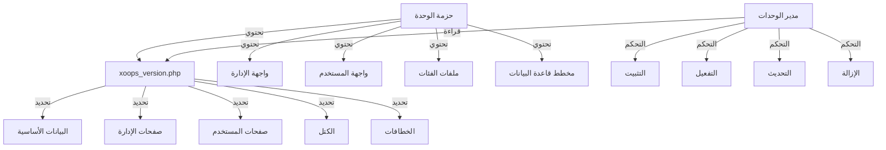

يوفر نظام الوحدات في XOOPS إطار عمل كامل لتطوير وتثبيت وإدارة وتوسيع وظائف الوحدة. الوحدات عبارة عن حزم مستقلة تمدد XOOPS بميزات وإمكانيات إضافية.

## بنية الوحدة



## هيكل الوحدة

هيكل دليل الوحدة الموحد في XOOPS:

```
mymodule/
├── xoops_version.php          # بيان الوحدة والإعدادات
├── admin.php                  # الصفحة الرئيسية للإدارة
├── index.php                  # الصفحة الرئيسية للمستخدم
├── admin/                     # دليل صفحات الإدارة
│   ├── main.php
│   ├── manage.php
│   └── settings.php
├── class/                     # فئات الوحدة
│   ├── Handler/
│   │   ├── ItemHandler.php
│   │   └── CategoryHandler.php
│   └── Objects/
│       ├── Item.php
│       └── Category.php
├── sql/                       # مخططات قاعدة البيانات
│   ├── mysql.sql
│   └── postgres.sql
├── include/                   # ملفات التضمين
│   ├── common.inc.php
│   └── functions.php
├── templates/                 # قوالب الوحدة
│   ├── admin/
│   │   └── main.tpl
│   └── user/
│       ├── index.tpl
│       └── item.tpl
├── blocks/                    # كتل الوحدة
│   └── blocks.php
├── tests/                     # اختبارات الوحدة
├── language/                  # ملفات اللغة
│   ├── english/
│   │   └── main.php
│   └── spanish/
│       └── main.php
└── docs/                      # التوثيق
```

## فئة XoopsModule

تمثل فئة XoopsModule وحدة مثبتة في XOOPS.

### نظرة عامة على الفئة

```php
namespace Xoops\Core\Module;

class XoopsModule extends XoopsObject
{
    protected int $moduleid = 0;
    protected string $name = '';
    protected string $dirname = '';
    protected string $version = '';
    protected string $description = '';
    protected array $config = [];
    protected array $blocks = [];
    protected array $adminPages = [];
    protected array $userPages = [];
}
```

### الخصائص

| الخاصية | النوع | الوصف |
|--------|------|-------|
| `$moduleid` | int | معرف الوحدة الفريد |
| `$name` | string | اسم عرض الوحدة |
| `$dirname` | string | اسم دليل الوحدة |
| `$version` | string | إصدار الوحدة الحالي |
| `$description` | string | وصف الوحدة |
| `$config` | array | إعدادات الوحدة |
| `$blocks` | array | كتل الوحدة |
| `$adminPages` | array | صفحات لوحة الإدارة |
| `$userPages` | array | صفحات واجهة المستخدم |

### المُنشئ

```php
public function __construct()
```

ينشئ مثيل وحدة جديد ويهيئ المتغيرات.

### الدوال الأساسية

#### getName

الحصول على اسم عرض الوحدة.

```php
public function getName(): string
```

**الإرجاع:** `string` - اسم عرض الوحدة

**مثال:**
```php
$module = new XoopsModule();
$module->setVar('name', 'الناشر');
echo $module->getName(); // "الناشر"
```

#### getDirname

الحصول على اسم دليل الوحدة.

```php
public function getDirname(): string
```

**الإرجاع:** `string` - اسم دليل الوحدة

**مثال:**
```php
echo $module->getDirname(); // "publisher"
```

#### getVersion

الحصول على إصدار الوحدة الحالي.

```php
public function getVersion(): string
```

**الإرجاع:** `string` - سلسلة الإصدار

**مثال:**
```php
echo $module->getVersion(); // "2.1.0"
```

#### getDescription

الحصول على وصف الوحدة.

```php
public function getDescription(): string
```

**الإرجاع:** `string` - وصف الوحدة

**مثال:**
```php
$desc = $module->getDescription();
```

#### getConfig

استرجاع إعدادات الوحدة.

```php
public function getConfig(string $key = null): mixed
```

**المعاملات:**

| المعامل | النوع | الوصف |
|----------|------|-------|
| `$key` | string | مفتاح الإعدادات (null للكل) |

**الإرجاع:** `mixed` - قيمة الإعدادات أو المصفوفة

**مثال:**
```php
$config = $module->getConfig();
$itemsPerPage = $module->getConfig('items_per_page');
```

#### setConfig

تعيين إعدادات الوحدة.

```php
public function setConfig(string $key, mixed $value): void
```

**المعاملات:**

| المعامل | النوع | الوصف |
|----------|------|-------|
| `$key` | string | مفتاح الإعدادات |
| `$value` | mixed | قيمة الإعدادات |

**مثال:**
```php
$module->setConfig('items_per_page', 20);
$module->setConfig('enable_cache', true);
```

#### getPath

الحصول على المسار الكامل للملف من الوحدة.

```php
public function getPath(): string
```

**الإرجاع:** `string` - المسار المطلق لدليل الوحدة

**مثال:**
```php
$path = $module->getPath(); // "/var/www/xoops/modules/publisher"
$classPath = $module->getPath() . '/class';
```

#### getUrl

الحصول على عنوان URL للوحدة.

```php
public function getUrl(): string
```

**الإرجاع:** `string` - عنوان URL للوحدة

**مثال:**
```php
$url = $module->getUrl(); // "http://example.com/modules/publisher"
```

## عملية تثبيت الوحدة

### دالة xoops_module_install

دالة تثبيت الوحدة المحددة في `xoops_version.php`:

```php
function xoops_module_install_modulename($module)
{
    // $module هو مثيل XoopsModule

    // إنشاء جداول قاعدة البيانات
    // تهيئة الإعدادات الافتراضية
    // إنشاء المجلدات الافتراضية
    // إعداد أذونات الملفات

    return true; // نجاح
}
```

**المعاملات:**

| المعامل | النوع | الوصف |
|----------|------|-------|
| `$module` | XoopsModule | الوحدة قيد التثبيت |

**الإرجاع:** `bool` - صحيح في حالة النجاح، خطأ في حالة الفشل

**مثال:**
```php
function xoops_module_install_publisher($module)
{
    // الحصول على مسار الوحدة
    $modulePath = $module->getPath();

    // إنشاء دليل التحميلات
    $uploadsPath = XOOPS_ROOT_PATH . '/uploads/publisher';
    if (!is_dir($uploadsPath)) {
        mkdir($uploadsPath, 0755, true);
    }

    // الحصول على اتصال قاعدة البيانات
    global $xoopsDB;

    // تنفيذ سكريبت تثبيت SQL
    $sqlFile = $modulePath . '/sql/mysql.sql';
    if (file_exists($sqlFile)) {
        $sqlQueries = file_get_contents($sqlFile);
        // تنفيذ الاستعلامات (مبسط)
        $xoopsDB->queryFromFile($sqlFile);
    }

    // تعيين الإعدادات الافتراضية
    $module->setConfig('items_per_page', 10);
    $module->setConfig('enable_comments', true);

    return true;
}
```

### دالة xoops_module_uninstall

دالة إزالة الوحدة:

```php
function xoops_module_uninstall_modulename($module)
{
    // حذف جداول قاعدة البيانات
    // إزالة الملفات المحملة
    // تنظيف الإعدادات

    return true;
}
```

**مثال:**
```php
function xoops_module_uninstall_publisher($module)
{
    global $xoopsDB;

    // حذف الجداول
    $tables = ['publisher_items', 'publisher_categories', 'publisher_comments'];
    foreach ($tables as $table) {
        $xoopsDB->query('DROP TABLE IF EXISTS ' . $xoopsDB->prefix($table));
    }

    // إزالة مجلد التحميل
    $uploadsPath = XOOPS_ROOT_PATH . '/uploads/publisher';
    if (is_dir($uploadsPath)) {
        // حذف الدليل بشكل متكرر
        $this->recursiveRemoveDir($uploadsPath);
    }

    return true;
}
```

## خطافات الوحدات

تسمح خطافات الوحدة للوحدات بالتكامل مع الوحدات الأخرى والنظام.

### إعلان الخطاف

في `xoops_version.php`:

```php
$modversion['hooks'] = [
    'system.page.footer' => [
        'function' => 'publisher_page_footer'
    ],
    'user.profile.view' => [
        'function' => 'publisher_user_articles'
    ],
];
```

### تطبيق الخطاف

```php
// في ملف الوحدة (مثل include/hooks.php)

function publisher_page_footer()
{
    // إرجاع HTML للتذييل
    return '<div class="publisher-footer">محتوى تذييل الناشر</div>';
}

function publisher_user_articles($user_id)
{
    global $xoopsDB;

    // الحصول على مقالات المستخدم
    $result = $xoopsDB->query(
        'SELECT * FROM ' . $xoopsDB->prefix('publisher_articles') .
        ' WHERE author_id = ? ORDER BY published DESC LIMIT 5',
        [$user_id]
    );

    $articles = [];
    while ($row = $xoopsDB->fetchAssoc($result)) {
        $articles[] = $row;
    }

    return $articles;
}
```

### خطافات النظام المتاحة

| الخطاف | المعاملات | الوصف |
|---------|-----------|-------|
| `system.page.header` | بدون | إخراج رأس الصفحة |
| `system.page.footer` | بدون | إخراج تذييل الصفحة |
| `user.login.success` | كائن $user | بعد دخول المستخدم |
| `user.logout` | كائن $user | بعد خروج المستخدم |
| `user.profile.view` | $user_id | عرض ملف المستخدم |
| `module.install` | كائن $module | تثبيت الوحدة |
| `module.uninstall` | كائن $module | إزالة الوحدة |

## خدمة مدير الوحدات

تتعامل خدمة ModuleManager مع عمليات الوحدات.

### الدوال

#### getModule

استرجاع وحدة حسب الاسم.

```php
public function getModule(string $dirname): ?XoopsModule
```

**المعاملات:**

| المعامل | النوع | الوصف |
|----------|------|-------|
| `$dirname` | string | اسم دليل الوحدة |

**الإرجاع:** `?XoopsModule` - مثيل الوحدة أو null

**مثال:**
```php
$moduleManager = $kernel->getService('module');
$publisher = $moduleManager->getModule('publisher');
if ($publisher) {
    echo $publisher->getName();
}
```

#### getAllModules

الحصول على جميع الوحدات المثبتة.

```php
public function getAllModules(bool $activeOnly = true): array
```

**المعاملات:**

| المعامل | النوع | الوصف |
|----------|------|-------|
| `$activeOnly` | bool | إرجاع الوحدات النشطة فقط |

**الإرجاع:** `array` - مصفوفة من كائنات XoopsModule

**مثال:**
```php
$activeModules = $moduleManager->getAllModules(true);
foreach ($activeModules as $module) {
    echo $module->getName() . " - " . $module->getVersion() . "\n";
}
```

#### isModuleActive

التحقق مما إذا كانت الوحدة نشطة.

```php
public function isModuleActive(string $dirname): bool
```

**مثال:**
```php
if ($moduleManager->isModuleActive('publisher')) {
    // وحدة الناشر نشطة
}
```

#### activateModule

تفعيل وحدة.

```php
public function activateModule(string $dirname): bool
```

**مثال:**
```php
if ($moduleManager->activateModule('publisher')) {
    echo "تم تفعيل الناشر";
}
```

#### deactivateModule

تعطيل وحدة.

```php
public function deactivateModule(string $dirname): bool
```

**مثال:**
```php
if ($moduleManager->deactivateModule('publisher')) {
    echo "تم تعطيل الناشر";
}
```

## أفضل الممارسات

1. **استخدم مساحات الأسماء للفئات** - استخدم مساحات أسماء محددة بالوحدة لتجنب التعارضات

2. **استخدم المعالجات** - استخدم دائماً فئات المعالج لعمليات قاعدة البيانات

3. **دولّن المحتوى** - استخدم ثوابت اللغة لجميع النصوص الموجهة للمستخدم

4. **أنشئ سكريبتات التثبيت** - وفر مخططات قاعدة البيانات

5. **وثّق الخطافات** - وثّق بوضوح الخطافات التي توفرها الوحدة

6. **عد نسخة الوحدة** - زيادة أرقام الإصدار مع الإصدارات

7. **اختبر التثبيت** - اختبر عمليات التثبيت والإزالة بدقة

8. **تعامل مع الأذونات** - تحقق من أذونات المستخدم قبل السماح بالإجراءات

## التوثيق ذو الصلة

- ../Kernel/Kernel-Classes - تهيئة النواة والخدمات الأساسية
- ../Template/Template-System - قوالب الوحدة وتكامل المظهر
- ../Database/QueryBuilder - بناء استعلامات قاعدة البيانات
- ../Core/XoopsObject - فئة الكائن الأساسي

---

*انظر أيضاً: [دليل تطوير وحدات XOOPS](https://github.com/XOOPS/XoopsCore27/wiki/Module-Development)*
