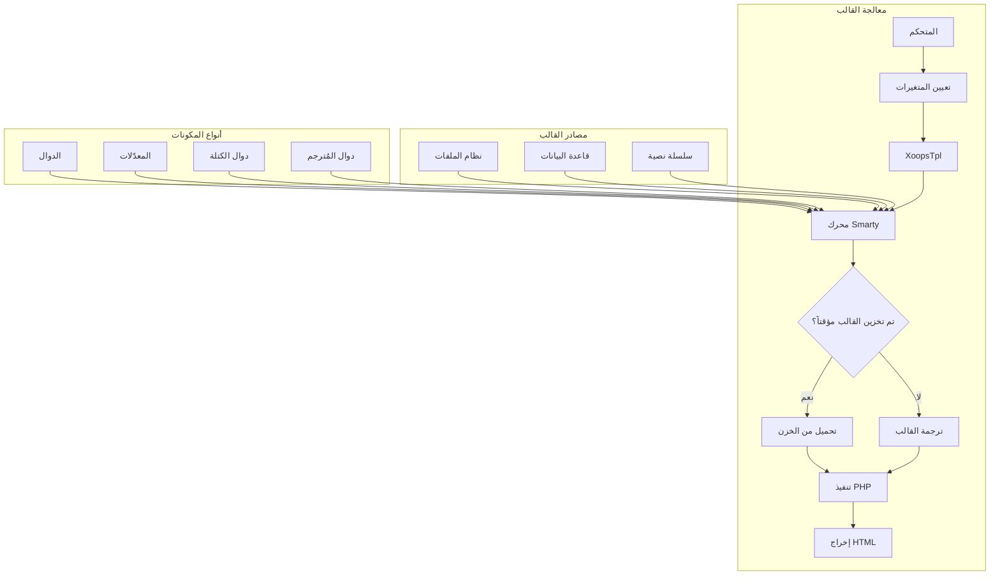
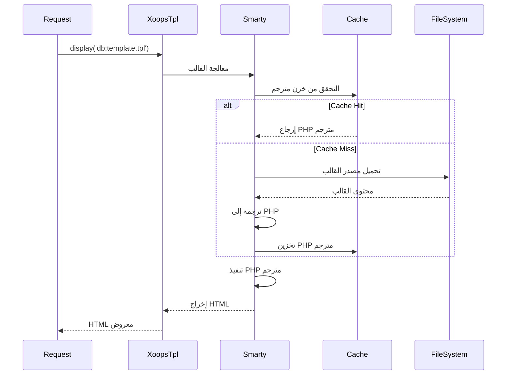
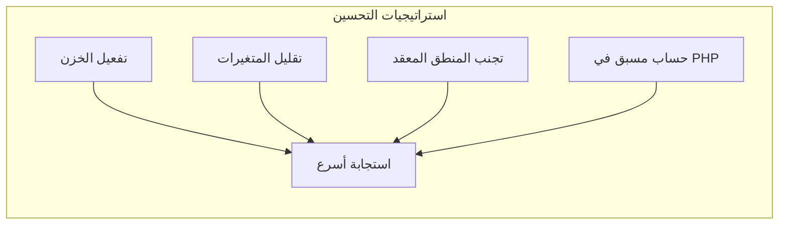

> توثيق واجهة برمجة التطبيقات الكاملة لمحرك قوالب Smarty في XOOPS.

---

## بنية محرك القوالب



---

## فئة XoopsTpl

### التهيئة

```php
// كائن القالب العام
global $xoopsTpl;

// أو الحصول على مثيل جديد
$tpl = new XoopsTpl();

// متاح في الوحدات
$GLOBALS['xoopsTpl']->assign('myvar', $value);
```

### الدوال الأساسية

| الدالة | المعاملات | الوصف |
|--------|----------|-------|
| `assign` | `string $name, mixed $value` | تعيين متغير إلى القالب |
| `assignByRef` | `string $name, mixed &$value` | التعيين بالمرجع |
| `append` | `string $name, mixed $value, bool $merge = false` | إضافة إلى متغير مصفوفة |
| `display` | `string $template` | عرض وإخراج القالب |
| `fetch` | `string $template` | عرض وإرجاع القالب |
| `clearAssign` | `string $name` | مسح متغير معين |
| `clearAllAssign` | - | مسح جميع المتغيرات |
| `getTemplateVars` | `string $name = null` | الحصول على المتغيرات المعينة |
| `templateExists` | `string $template` | التحقق من وجود القالب |
| `isCached` | `string $template` | التحقق من تخزين القالب مؤقتاً |
| `clearCache` | `string $template = null` | مسح خزن القالب |

### تعيين المتغيرات

```php
// تعيين بسيط
$xoopsTpl->assign('title', 'عنوان الصفحة');
$xoopsTpl->assign('count', 42);
$xoopsTpl->assign('is_admin', true);

// تعيين المصفوفة
$xoopsTpl->assign('items', [
    ['id' => 1, 'name' => 'العنصر 1'],
    ['id' => 2, 'name' => 'العنصر 2'],
]);

// تعيين الكائن
$xoopsTpl->assign('user', $xoopsUser);

// تعيينات متعددة
$xoopsTpl->assign([
    'title' => 'عنواني',
    'content' => 'محتواي',
    'author' => 'جون دو'
]);

// الإضافة إلى مصفوفة
$xoopsTpl->append('items', ['id' => 3, 'name' => 'العنصر 3']);
```

### تحميل القالب

```php
// من قاعدة البيانات (مترجم)
$xoopsTpl->display('db:mymodule_index.tpl');

// من نظام الملفات
$xoopsTpl->display('file:' . XOOPS_ROOT_PATH . '/modules/mymodule/templates/custom.tpl');

// جلب بدون إخراج
$html = $xoopsTpl->fetch('db:mymodule_item.tpl');

// من سلسلة نصية
$template = '<h1>{$title}</h1><p>{$content}</p>';
$html = $xoopsTpl->fetch('string:' . $template);
```

---

## مرجع بناء جملة Smarty

### المتغيرات

```smarty
{* متغير بسيط *}
<{$title}>

{* الوصول إلى المصفوفة *}
<{$item.name}>
<{$item['name']}>

{* خاصية الكائن *}
<{$user->name}>
<{$user->getVar('uname')}>

{* متغير الإعدادات *}
<{$xoops_sitename}>

{* الثابت *}
<{$smarty.const._MD_MYMODULE_TITLE}>

{* متغيرات الخادم *}
<{$smarty.server.REQUEST_URI}>
<{$smarty.get.id}>
<{$smarty.post.name}>
```

### المعدّلات

```smarty
{* معدّلات السلسلة النصية *}
<{$title|upper}>
<{$title|lower}>
<{$title|capitalize}>
<{$title|truncate:50:"..."}>
<{$content|strip_tags}>
<{$content|nl2br}>
<{$text|escape:'html'}>
<{$text|escape:'url'}>

{* تنسيق التاريخ *}
<{$timestamp|date_format:"%Y-%m-%d"}>
<{$timestamp|date_format:"%B %e, %Y"}>

{* تنسيق الأرقام *}
<{$price|number_format:2:".":","}>

{* القيمة الافتراضية *}
<{$optional|default:"غير متوفر"}>

{* معدّلات مربوطة *}
<{$title|strip_tags|truncate:50|escape}>

{* عد المصفوفة *}
<{$items|@count}>
```

### هياكل التحكم

```smarty
{* جملة الشرط *}
<{if $is_admin}>
    <p>محتوى المسؤول</p>
<{elseif $is_moderator}>
    <p>محتوى المراقب</p>
<{else}>
    <p>محتوى المستخدم</p>
<{/if}>

{* حلقة foreach *}
<{foreach from=$items item=item key=key}>
    <li><{$key}>: <{$item.name}></li>
<{/foreach}>

{* foreach مع الخصائص *}
<{foreach from=$items item=item name=itemLoop}>
    <{if $smarty.foreach.itemLoop.first}>
        <ul>
    <{/if}>

    <li class="<{if $smarty.foreach.itemLoop.iteration is odd}>odd<{else}>even<{/if}>">
        <{$smarty.foreach.itemLoop.iteration}>. <{$item.name}>
    </li>

    <{if $smarty.foreach.itemLoop.last}>
        </ul>
        <p>المجموع: <{$smarty.foreach.itemLoop.total}></p>
    <{/if}>
<{/foreach}>

{* حلقة for *}
<{for $i=1 to 10}>
    <{$i}>
<{/for}>

{* حلقة while *}
<{while $count < 10}>
    <{$count}>
    <{$count = $count + 1}>
<{/while}>
```

### الإدراجات

```smarty
{* إدراج قالب آخر *}
<{include file="db:mymodule_header.tpl"}>

{* الإدراج مع متغيرات *}
<{include file="db:mymodule_item.tpl" item=$currentItem showAuthor=true}>

{* الإدراج من المظهر *}
<{include file="$theme_template_set/header.tpl"}>
```

### التعليقات

```smarty
{* هذا تعليق Smarty - لن يظهر في الإخراج *}

{*
    تعليق متعدد الأسطر
    يشرح القالب
*}
```

---

## دوال XOOPS المحددة

### عرض الكتل

```smarty
{* عرض كتلة حسب المعرّف *}
<{xoBlock id=5}>

{* عرض كتلة حسب الاسم *}
<{xoBlock name="mymodule_recent"}>

{* عرض جميع الكتل في الموضع *}
<{foreach item=block from=$xoBlocks.canvas_left}>
    <div class="block">
        <h3><{$block.title}></h3>
        <{$block.content}>
    </div>
<{/foreach}>
```

### معالجة الصور والأصول

```smarty
{* صورة الوحدة *}
/modules/<{$xoops_dirname}>/assets/images/logo.png">

{* صورة المظهر *}
icon.png">

{* دليل التحميل *}
/<{$item.image}>">
```

### إنشاء عنوان URL

```smarty
{* عنوان URL للوحدة *}
<a href="<{$xoops_url}>/modules/<{$xoops_dirname}>/item.php?id=<{$item.id}>">
    <{$item.title}>
</a>

{* مع عنوان URL صديق لمحركات البحث (إن كان مفعلاً) *}
<a href="<{$item.url}>"><{$item.title}></a>
```

---

## تدفق ترجمة القالب



---

## مكونات Smarty المخصصة

### مكون دالة

```php
// plugins/function.myfunction.php
function smarty_function_myfunction($params, $smarty)
{
    $name = $params['name'] ?? 'العالم';
    return "مرحبا، {$name}!";
}

// الاستخدام في القالب:
// <{myfunction name="جون"}>
```

### مكون معدّل

```php
// plugins/modifier.timeago.php
function smarty_modifier_timeago($timestamp)
{
    $diff = time() - $timestamp;

    if ($diff < 60) {
        return 'للتو';
    } elseif ($diff < 3600) {
        $mins = floor($diff / 60);
        return "{$mins} دقيقة(دقائق) مضت";
    } elseif ($diff < 86400) {
        $hours = floor($diff / 3600);
        return "{$hours} ساعة(ساعات) مضت";
    } else {
        $days = floor($diff / 86400);
        return "{$days} يوم(أيام) مضى";
    }
}

// الاستخدام في القالب:
// <{$item.created|timeago}>
```

### مكون كتلة

```php
// plugins/block.cache.php
function smarty_block_cache($params, $content, $smarty, &$repeat)
{
    if ($repeat) {
        // وسم الفتح
        return '';
    } else {
        // وسم الإغلاق - معالجة المحتوى
        $ttl = $params['ttl'] ?? 3600;
        $key = md5($content);

        // التحقق من الخزن...
        return $content;
    }
}

// الاستخدام في القالب:
// <{cache ttl=3600}>
//     محتوى مكلف هنا
// <{/cache}>
```

---

## نصائح الأداء



### أفضل الممارسات

1. **فعّل خزن القوالب** في الإنتاج
2. **اسند فقط المتغيرات المطلوبة** - لا تمرر كائنات كاملة
3. **استخدم المعدّلات بحذر** - قم بتنسيق مسبق في PHP إن أمكن
4. **تجنب الحلقات المتداخلة** - أعد تنظيم البيانات في PHP
5. **خزّن الكتل المكلفة** - استخدم خزن الكتل للاستعلامات المعقدة

---

## التوثيق ذو الصلة

- أساسيات Smarty
- تطوير المظهر
- هجرة Smarty 4

---

#xoops #api #smarty #templates #reference
