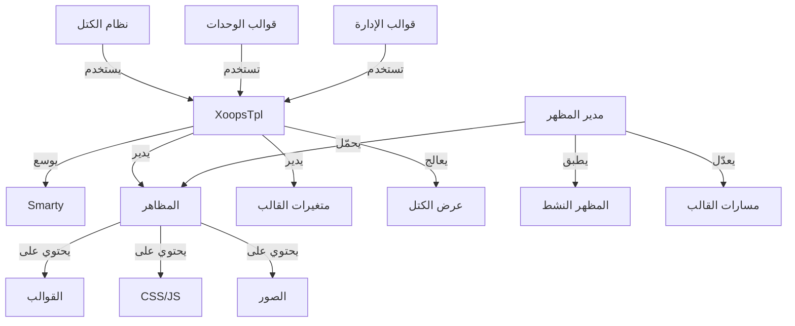

يتم بناء نظام قوالب XOOPS على محرك قالب Smarty القوي، مما يوفر طريقة مرنة وقابلة للتوسع لفصل منطق العرض عن منطق الأعمال. فهو يدير المظاهر ومعالجة القوالب وتعيين المتغيرات وإنشاء المحتوى الديناميكي.

## بنية نظام القوالب



## فئة XoopsTpl

فئة محرك القالب الرئيسية التي تمدد Smarty.

### نظرة عامة على الفئة

```php
namespace Xoops\Core;

class XoopsTpl extends Smarty
{
    protected array $vars = [];
    protected string $currentTheme = '';
    protected array $blocks = [];
    protected bool $isAdmin = false;
}
```

### توسيع Smarty

```php
use Xoops\Core\XoopsTpl;

class XoopsTpl extends Smarty
{
    private static ?XoopsTpl $instance = null;

    private function __construct()
    {
        parent::__construct();
        $this->configureDirectories();
        $this->registerPlugins();
    }

    public static function getInstance(): XoopsTpl
    {
        if (!isset(self::$instance)) {
            self::$instance = new self();
        }
        return self::$instance;
    }
}
```

### الدوال الأساسية

#### getInstance

الحصول على مثيل القالب الفردي.

```php
public static function getInstance(): XoopsTpl
```

**الإرجاع:** `XoopsTpl` - مثيل فردي

**مثال:**
```php
$xoopsTpl = XoopsTpl::getInstance();
```

#### assign

تعيين متغير إلى القالب.

```php
public function assign(
    string|array $tplVar,
    mixed $value = null
): void
```

**المعاملات:**

| المعامل | النوع | الوصف |
|----------|------|-------|
| `$tplVar` | string\|array | اسم المتغير أو مصفوفة ارتباطية |
| `$value` | mixed | قيمة المتغير |

**مثال:**
```php
$xoopsTpl->assign('page_title', 'مرحبا');
$xoopsTpl->assign('user_name', 'جون دو');

// تعيينات متعددة
$xoopsTpl->assign([
    'items' => $items,
    'total_count' => count($items),
    'show_pagination' => true
]);
```

#### appendAssign

إضافة القيم إلى متغيرات مصفوفة القالب.

```php
public function appendAssign(
    string $tplVar,
    mixed $value
): void
```

**المعاملات:**

| المعامل | النوع | الوصف |
|----------|------|-------|
| `$tplVar` | string | اسم المتغير |
| `$value` | mixed | القيمة المراد إضافتها |

**مثال:**
```php
$xoopsTpl->assign('breadcrumbs', ['الرئيسية']);
$xoopsTpl->appendAssign('breadcrumbs', 'المدونة');
$xoopsTpl->appendAssign('breadcrumbs', 'المقالات');
// breadcrumbs = ['الرئيسية', 'المدونة', 'المقالات']
```

#### getAssignedVars

الحصول على جميع متغيرات القالب المعينة.

```php
public function getAssignedVars(): array
```

**الإرجاع:** `array` - المتغيرات المعينة

**مثال:**
```php
$vars = $xoopsTpl->getAssignedVars();
foreach ($vars as $name => $value) {
    echo "$name = " . var_export($value, true) . "\n";
}
```

#### display

عرض قالب وإخراجه للمتصفح.

```php
public function display(
    string $resource,
    string|array $cache_id = null,
    string $compile_id = null,
    object $parent = null
): void
```

**المعاملات:**

| المعامل | النوع | الوصف |
|----------|------|-------|
| `$resource` | string | مسار ملف القالب |
| `$cache_id` | string\|array | معرف الخزن |
| `$compile_id` | string | معرف الترجمة |
| `$parent` | object | كائن القالب الأب |

**مثال:**
```php
$xoopsTpl->assign('page_title', 'الرئيسية');
$xoopsTpl->display('user:index.tpl');

// مع المسار المطلق
$xoopsTpl->display(XOOPS_ROOT_PATH . '/templates/user/index.tpl');
```

#### fetch

عرض قالب وإرجاعه كسلسلة نصية.

```php
public function fetch(
    string $resource,
    string|array $cache_id = null,
    string $compile_id = null,
    object $parent = null
): string
```

**الإرجاع:** `string` - محتوى القالب المعروض

**مثال:**
```php
$xoopsTpl->assign('message', 'مرحبا بالعالم');
$html = $xoopsTpl->fetch('user:message.tpl');
echo $html;

// الاستخدام لقوالب البريد الإلكتروني
$emailContent = $xoopsTpl->fetch('mail:notification.tpl');
mail($to, $subject, $emailContent);
```

#### loadTheme

تحميل مظهر معين.

```php
public function loadTheme(string $themeName): bool
```

**المعاملات:**

| المعامل | النوع | الوصف |
|----------|------|-------|
| `$themeName` | string | اسم دليل المظهر |

**الإرجاع:** `bool` - نجاح التحميل

**مثال:**
```php
if ($xoopsTpl->loadTheme('bluemoon')) {
    echo "تم تحميل المظهر بنجاح";
}
```

#### getCurrentTheme

الحصول على اسم المظهر النشط الحالي.

```php
public function getCurrentTheme(): string
```

**الإرجاع:** `string` - اسم المظهر

**مثال:**
```php
$currentTheme = $xoopsTpl->getCurrentTheme();
echo "المظهر النشط: $currentTheme";
```

#### setOutputFilter

إضافة مرشح إخراج لمعالجة إخراج القالب.

```php
public function setOutputFilter(string $function): void
```

**المعاملات:**

| المعامل | النوع | الوصف |
|----------|------|-------|
| `$function` | string | اسم دالة المرشح |

**مثال:**
```php
// إزالة المسافة البيضاء من الإخراج
$xoopsTpl->setOutputFilter('trim');

// مرشح مخصص
function my_output_filter($output) {
    // ضغط HTML
    $output = preg_replace('/\s+/', ' ', $output);
    return trim($output);
}
$xoopsTpl->setOutputFilter('my_output_filter');
```

#### registerPlugin

تسجيل مكون Smarty مخصص.

```php
public function registerPlugin(
    string $type,
    string $name,
    callable $callback
): void
```

**المعاملات:**

| المعامل | النوع | الوصف |
|----------|------|-------|
| `$type` | string | نوع المكون (معدّل، كتلة، دالة) |
| `$name` | string | اسم المكون |
| `$callback` | callable | دالة الاستدعاء |

**مثال:**
```php
// تسجيل معدّل مخصص
$xoopsTpl->registerPlugin('modifier', 'markdown', function($text) {
    return markdown_parse($text);
});

// الاستخدام في القالب: {$content|markdown}

// تسجيل وسم كتلة مخصص
$xoopsTpl->registerPlugin('block', 'permission', function($params, $content, $smarty, &$repeat) {
    if ($repeat) return;

    // التحقق من الأذونات
    if (has_permission($params['name'])) {
        return $content;
    }
    return '';
});

// الاستخدام في القالب: {permission name="admin"}...{/permission}
```

## نظام المظهر

### هيكل المظهر

هيكل دليل المظهر الموحد:

```
bluemoon/
├── style.css              # ورقة الأنماط الرئيسية
├── admin.css              # ورقة أنماط الإدارة
├── theme.html             # قالب الصفحة الرئيسية
├── admin.html             # قالب صفحة الإدارة
├── blocks/                # قوالب الكتل
│   ├── block_left.tpl
│   └── block_right.tpl
├── modules/               # قوالب الوحدات
│   ├── publisher/
│   │   ├── index.tpl
│   │   └── item.tpl
│   └── news/
│       └── index.tpl
├── images/                # صور المظهر
│   ├── logo.png
│   └── banner.png
├── js/                    # ملفات JavaScript للمظهر
│   └── script.js
└── readme.txt             # توثيق المظهر
```

### فئة مدير المظهر

```php
namespace Xoops\Core\Theme;

class ThemeManager
{
    protected array $themes = [];
    protected string $activeTheme = '';
    protected string $themeDirectory = '';

    public function getActiveTheme(): string {}
    public function setActiveTheme(string $theme): bool {}
    public function getThemeList(): array {}
    public function themeExists(string $name): bool {}
}
```

## متغيرات القالب

### متغيرات عام متاحة عام

يعين XOOPS تلقائياً عدة متغيرات قالب عامة:

| المتغير | النوع | الوصف |
|----------|------|-------|
| `$xoops_url` | string | عنوان URL لتثبيت XOOPS |
| `$xoops_user` | XoopsUser\|null | كائن المستخدم الحالي |
| `$xoops_uname` | string | اسم المستخدم الحالي |
| `$xoops_isadmin` | bool | المستخدم هو مسؤول |
| `$xoops_banner` | string | كود HTML للشعار |
| `$xoops_notification` | string | ترميز الإخطار |
| `$xoops_version` | string | إصدار XOOPS |

### متغيرات خاصة بالكتل

عند عرض الكتل:

| المتغير | النوع | الوصف |
|----------|------|-------|
| `$block` | array | معلومات الكتلة |
| `$block.title` | string | عنوان الكتلة |
| `$block.content` | string | محتوى الكتلة |
| `$block.id` | int | معرف الكتلة |
| `$block.module` | string | اسم الوحدة |

### متغيرات قالب الوحدة

عادةً تعين الوحدات:

| المتغير | النوع | الوصف |
|----------|------|-------|
| `$module_name` | string | اسم عرض الوحدة |
| `$module_dir` | string | دليل الوحدة |
| `$xoops_module_header` | string | CSS/JS للوحدة |

## إعدادات Smarty

### معدّلات Smarty الشائعة

| المعدّل | الوصف | مثال |
|--------|--------|-------|
| `capitalize` | تكبير الحرف الأول | `{$title\|capitalize}` |
| `count_characters` | عدد الأحرف | `{$text\|count_characters}` |
| `date_format` | تنسيق الطابع الزمني | `{$timestamp\|date_format:'%Y-%m-%d'}` |
| `escape` | الهروب من الأحرف الخاصة | `{$html\|escape:'html'}` |
| `nl2br` | تحويل الأسطر الجديدة إلى `<br>` | `{$text\|nl2br}` |
| `strip_tags` | إزالة وسوم HTML | `{$content\|strip_tags}` |
| `truncate` | تحديد طول السلسلة | `{$text\|truncate:100}` |
| `upper` | تحويل إلى أحرف كبيرة | `{$name\|upper}` |
| `lower` | تحويل إلى أحرف صغيرة | `{$name\|lower}` |

### هياكل التحكم

```smarty
{* جملة الشرط *}
{if $user->isAdmin()}
    <p>محتوى الإدارة</p>
{else}
    <p>محتوى المستخدم</p>
{/if}

{* حلقة *}
{foreach $items as $item}
    <div class="item">{$item.title}</div>
{/foreach}

{* حلقة مع عداد *}
{foreach $items as $item name=item_loop}
    {$smarty.foreach.item_loop.iteration}: {$item.title}
{/foreach}

{* حلقة while *}
{while $condition}
    <!-- المحتوى -->
{/while}

{* جملة switch *}
{switch $status}
    {case 'draft'}<span class="draft">مسودة</span>{break}
    {case 'published'}<span class="published">منشور</span>{break}
    {default}<span class="unknown">غير معروف</span>
{/switch}
```

## مثال قالب شامل

### كود PHP

```php
<?php
/**
 * صفحة قائمة مقالات الوحدة
 */

include __DIR__ . '/include/common.inc.php';

$xoopsTpl = XoopsTpl::getInstance();

// التحقق من أن الوحدة نشطة
$module = xoops_getModuleByDirname('articles');
if (!$module) {
    redirect_header(XOOPS_URL, 3, 'لم يتم العثور على الوحدة');
}

// الحصول على معالج الأشياء
$itemHandler = xoops_getModuleHandler('item', 'articles');

// الحصول على معاملات التقسيم إلى صفحات
$page = !empty($_GET['page']) ? (int)$_GET['page'] : 1;
$perPage = $module->getConfig('items_per_page') ?: 10;
$offset = ($page - 1) * $perPage;

// بناء المعايير
$criteria = new CriteriaCompo();
$criteria->add(new Criteria('status', 1));
$criteria->setSort('published', 'DESC');
$criteria->setLimit($perPage);
$criteria->setStart($offset);

// جلب الأشياء
$items = $itemHandler->getObjects($criteria);
$total = $itemHandler->getCount(new Criteria('status', 1));

// حساب التقسيم إلى صفحات
$pages = ceil($total / $perPage);

// تعيين متغيرات القالب
$xoopsTpl->assign([
    'module_name' => $module->getName(),
    'items' => $items,
    'total_items' => $total,
    'current_page' => $page,
    'total_pages' => $pages,
    'items_per_page' => $perPage,
    'show_pagination' => $pages > 1
]);

// إضافة breadcrumbs
$xoopsTpl->assign('xoops_breadcrumbs', [
    ['url' => XOOPS_URL, 'title' => 'الرئيسية'],
    ['url' => $module->getUrl(), 'title' => $module->getName()],
    ['title' => 'المقالات']
]);

// عرض القالب
$xoopsTpl->display($module->getPath() . '/templates/user/list.tpl');
```

### ملف القالب (list.tpl)

```smarty
<div id="articles-list">
    <h1>{$module_name|escape}</h1>

    {if $items}
        <div class="articles-container">
            {foreach $items as $item}
                <article class="article-item">
                    <header>
                        <h2>
                            <a href="{$item.url|escape}">
                                {$item.title|escape}
                            </a>
                        </h2>
                        <div class="meta">
                            <span class="author">بقلم {$item.author|escape}</span>
                            <span class="date">
                                {$item.published|date_format:'%B %d, %Y'}
                            </span>
                        </div>
                    </header>

                    <div class="content">
                        <p>{$item.summary|truncate:150}</p>
                    </div>

                    <footer>
                        <a href="{$item.url|escape}" class="read-more">
                            اقرأ المزيد »
                        </a>
                    </footer>
                </article>
            {/foreach}
        </div>

        {* التقسيم إلى صفحات *}
        {if $show_pagination}
            <nav class="pagination">
                {if $current_page > 1}
                    <a href="?page=1" class="first">« الأول</a>
                    <a href="?page={$current_page - 1}" class="prev">‹ السابق</a>
                {/if}

                {for $i=1 to $total_pages}
                    {if $i == $current_page}
                        <span class="current">{$i}</span>
                    {else}
                        <a href="?page={$i}">{$i}</a>
                    {/if}
                {/for}

                {if $current_page < $total_pages}
                    <a href="?page={$current_page + 1}" class="next">التالي ›</a>
                    <a href="?page={$total_pages}" class="last">الأخير »</a>
                {/if}
            </nav>
        {/if}
    {else}
        <p class="no-items">لا توجد مقالات.</p>
    {/if}
</div>
```

## أفضل الممارسات

1. **الهروب من محتوى المستخدم** - استخدم دائماً `|escape` لمحتوى من المستخدم
2. **استخدم مسارات القالب** - ارجع إلى القوالب بالنسبة للمظهر
3. **افصل المنطق عن العرض** - احتفظ بالمنطق المعقد في PHP
4. **خزّن القوالب** - فعّل خزن القوالب في الإنتاج
5. **استخدم المعدّلات بشكل صحيح** - طبّق المرشحات المناسبة للسياق
6. **نظم الكتل** - ضع قوالب الكتل في دليل مخصص
7. **وثّق المتغيرات** - وثق جميع متغيرات القالب في PHP

## التوثيق ذو الصلة

- ../Module/Module-System - نظام الوحدات والخطافات
- ../Kernel/Kernel-Classes - النواة والإعدادات
- ../Core/XoopsObject - فئة الكائن الأساسي

---

*انظر أيضاً: [توثيق Smarty](https://www.smarty.net/docs) | [واجهة برمجة تطبيقات قالب XOOPS](https://github.com/XOOPS/XoopsCore27/tree/master/htdocs/class)*
