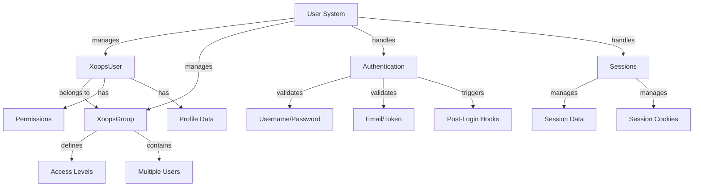

نظام مستخدمي XOOPS يدير حسابات المستخدمين والمصادقة والتفويض وعضويات المجموعات وإدارة الجلسات. يوفر إطار عمل قوي لتأمين تطبيقك والتحكم في وصول المستخدمين.

## معمارية نظام المستخدمين



## فئة XoopsUser

كائن المستخدم الرئيسي يمثل حساب مستخدم.

### نظرة عامة على الفئة

```php
namespace Xoops\Core\User;

class XoopsUser extends XoopsObject
{
    protected int $uid = 0;
    protected string $uname = '';
    protected string $email = '';
    protected string $pass = '';
    protected int $uregdate = 0;
    protected int $ulevel = 0;
    protected array $groups = [];
    protected array $permissions = [];
}
```

### المُنشئ

```php
public function __construct(int $uid = null)
```

ينشئ كائن مستخدم جديد، ويحمل اختياريًا من قاعدة البيانات بالمعرف.

**المعاملات:**

| المعامل | النوع | الوصف |
|--------|------|-------|
| `$uid` | int | معرف المستخدم المراد تحميله (اختياري) |

**مثال:**
```php
// إنشاء مستخدم جديد
$user = new XoopsUser();

// تحميل مستخدم موجود
$user = new XoopsUser(123);
```

### الخصائص الأساسية

| الخاصية | النوع | الوصف |
|--------|------|-------|
| `uid` | int | معرف المستخدم |
| `uname` | string | اسم المستخدم |
| `email` | string | عنوان البريد الإلكتروني |
| `pass` | string | تجزئة كلمة المرور |
| `uregdate` | int | طابع زمني للتسجيل |
| `ulevel` | int | مستوى المستخدم (9=مسؤول، 1=مستخدم) |
| `groups` | array | معرّفات المجموعات |
| `permissions` | array | علامات الأذونات |

### الدوال الأساسية

#### getID / getUid

الحصول على معرف المستخدم.

```php
public function getID(): int
public function getUid(): int  // اسم مستعار
```

**يعيد:** `int` - معرف المستخدم

**مثال:**
```php
$user = new XoopsUser(1);
echo $user->getID(); // 1
echo $user->getUid(); // 1
```

#### getUnameReal

الحصول على اسم عرض المستخدم.

```php
public function getUnameReal(): string
```

**يعيد:** `string` - الاسم الحقيقي للمستخدم

**مثال:**
```php
$realName = $user->getUnameReal();
echo "مرحبا، $realName";
```

#### getEmail

الحصول على عنوان بريد المستخدم الإلكتروني.

```php
public function getEmail(): string
```

**يعيد:** `string` - عنوان البريد الإلكتروني

**مثال:**
```php
$email = $user->getEmail();
mail($email, 'مرحبا', 'مرحبا بك في XOOPS');
```

#### getVar / setVar

الحصول على أو تعيين متغير مستخدم.

```php
public function getVar(string $key, string $format = 's'): mixed
public function setVar(string $key, mixed $value, bool $notGpc = false): bool
```

**مثال:**
```php
// الحصول على القيم
$username = $user->getVar('uname');
$email = $user->getVar('email', 's'); // منسق للعرض

// تعيين القيم
$user->setVar('uname', 'اسم_مستخدم_جديد');
$user->setVar('email', 'user@example.com');
```

#### getGroups

الحصول على عضويات المجموعات الخاصة بالمستخدم.

```php
public function getGroups(): array
```

**يعيد:** `array` - مصفوفة معرّفات المجموعات

**مثال:**
```php
$groups = $user->getGroups();
echo "عضو في " . count($groups) . " مجموعات";
```

#### isInGroup

التحقق من انتماء المستخدم لمجموعة.

```php
public function isInGroup(int $groupId): bool
```

**المعاملات:**

| المعامل | النوع | الوصف |
|--------|------|-------|
| `$groupId` | int | معرف المجموعة المراد التحقق منها |

**يعيد:** `bool` - صحيح إذا كان في المجموعة

**مثال:**
```php
if ($user->isInGroup(1)) { // 1 = مديرو الويب
    echo 'المستخدم مدير ويب';
}
```

#### isAdmin

التحقق من كون المستخدم مسؤولاً.

```php
public function isAdmin(): bool
```

**يعيد:** `bool` - صحيح إذا كان مسؤولاً

**مثال:**
```php
if ($user->isAdmin()) {
    // إظهار عناصر التحكم في المسؤول
    echo '<a href="admin/">لوحة المسؤول</a>';
}
```

#### getProfile

الحصول على معلومات ملف تعريف المستخدم.

```php
public function getProfile(): array
```

**يعيد:** `array` - بيانات الملف الشخصي

**مثال:**
```php
$profile = $user->getProfile();
echo 'السيرة الذاتية: ' . $profile['bio'];
```

#### isActive

التحقق من حالة نشاط حساب المستخدم.

```php
public function isActive(): bool
```

**يعيد:** `bool` - صحيح إذا كان نشطًا

**مثال:**
```php
if ($user->isActive()) {
    // السماح بوصول المستخدم
} else {
    // تقييد الوصول
}
```

#### updateLastLogin

تحديث طابع زمني آخر تسجيل دخول للمستخدم.

```php
public function updateLastLogin(): bool
```

**يعيد:** `bool` - صحيح عند النجاح

**مثال:**
```php
if ($user->updateLastLogin()) {
    echo 'تم تسجيل الدخول';
}
```

## فئة XoopsGroup

إدارة مجموعات المستخدمين والأذونات.

### نظرة عامة على الفئة

```php
namespace Xoops\Core\User;

class XoopsGroup extends XoopsObject
{
    protected int $groupid = 0;
    protected string $name = '';
    protected string $description = '';
    protected int $group_type = 0;
    protected array $users = [];
}
```

### الثوابت

| الثابت | القيمة | الوصف |
|--------|--------|-------|
| `TYPE_NORMAL` | 0 | مجموعة مستخدمين عادية |
| `TYPE_ADMIN` | 1 | مجموعة إدارية |
| `TYPE_SYSTEM` | 2 | مجموعة نظامية |

### الدوال

#### getName

الحصول على اسم المجموعة.

```php
public function getName(): string
```

**يعيد:** `string` - اسم المجموعة

**مثال:**
```php
$group = new XoopsGroup(1);
echo $group->getName(); // "مديرو الويب"
```

#### getDescription

الحصول على وصف المجموعة.

```php
public function getDescription(): string
```

**يعيد:** `string` - الوصف

**مثال:**
```php
echo $group->getDescription();
```

#### getUsers

الحصول على أعضاء المجموعة.

```php
public function getUsers(): array
```

**يعيد:** `array` - مصفوفة معرّفات المستخدمين

**مثال:**
```php
$users = $group->getUsers();
echo "المجموعة تحتوي على " . count($users) . " عضو";
```

#### addUser

إضافة مستخدم إلى المجموعة.

```php
public function addUser(int $uid): bool
```

**المعاملات:**

| المعامل | النوع | الوصف |
|--------|------|-------|
| `$uid` | int | معرف المستخدم |

**يعيد:** `bool` - صحيح عند النجاح

**مثال:**
```php
$group = new XoopsGroup(2); // المحررون
$group->addUser(123);
$groupHandler->insert($group);
```

#### removeUser

إزالة مستخدم من المجموعة.

```php
public function removeUser(int $uid): bool
```

**مثال:**
```php
$group->removeUser(123);
```

## مصادقة المستخدم

### عملية تسجيل الدخول

```php
/**
 * تسجيل دخول المستخدم
 */
function xoops_user_login(string $uname, string $pass, bool $rememberMe = false): ?XoopsUser
{
    global $xoopsDB;

    // تطهير اسم المستخدم
    $uname = trim($uname);

    // الحصول على المستخدم من قاعدة البيانات
    $query = $xoopsDB->prepare(
        'SELECT * FROM ' . $xoopsDB->prefix('users') .
        ' WHERE uname = ? AND active = 1'
    );
    $query->bind_param('s', $uname);
    $query->execute();
    $result = $query->get_result();

    if ($result->num_rows === 0) {
        return null; // المستخدم غير موجود
    }

    $row = $result->fetch_assoc();

    // التحقق من كلمة المرور
    if (!password_verify($pass, $row['pass'])) {
        return null; // كلمة مرور غير صحيحة
    }

    // تحميل كائن المستخدم
    $user = new XoopsUser($row['uid']);

    // تحديث آخر تسجيل دخول
    $user->updateLastLogin();

    // معالجة "تذكرني"
    if ($rememberMe) {
        // تعيين ملف تعريف ارتباط دائم
        setcookie(
            'xoops_user_remember',
            $user->uid(),
            time() + (30 * 24 * 60 * 60), // 30 يومًا
            '/',
            $_SERVER['HTTP_HOST'] ?? ''
        );
    }

    return $user;
}
```

### إدارة كلمات المرور

```php
/**
 * تجزئة كلمة المرور بشكل آمن
 */
function xoops_hash_password(string $password): string
{
    return password_hash($password, PASSWORD_BCRYPT, [
        'cost' => 12
    ]);
}

/**
 * التحقق من كلمة المرور
 */
function xoops_verify_password(string $password, string $hash): bool
{
    return password_verify($password, $hash);
}

/**
 * التحقق من احتياج كلمة المرور إلى إعادة تجزئة
 */
function xoops_password_needs_rehash(string $hash): bool
{
    return password_needs_rehash($hash, PASSWORD_BCRYPT, [
        'cost' => 12
    ]);
}
```

## إدارة الجلسات

### فئة مدير الجلسات

```php
namespace Xoops\Core;

class SessionManager
{
    protected array $data = [];
    protected string $sessionId = '';

    public function start(): void {}
    public function get(string $key): mixed {}
    public function set(string $key, mixed $value): void {}
    public function destroy(): void {}
}
```

### طرق الجلسة

#### بدء الجلسة

```php
<?php
session_start();

// إعادة توليد معرف الجلسة للأمان
session_regenerate_id(true);

// تعيين انتهاء الجلسة
ini_set('session.gc_maxlifetime', 3600); // ساعة واحدة

// تخزين المستخدم في الجلسة
if ($user) {
    $_SESSION['xoops_user'] = $user;
    $_SESSION['xoops_uid'] = $user->getID();
    $_SESSION['xoops_uname'] = $user->getVar('uname');
}
```

#### التحقق من الجلسة

```php
/**
 * الحصول على المستخدم الحالي من الجلسة
 */
function xoops_get_current_user(): ?XoopsUser
{
    if (isset($_SESSION['xoops_user']) && $_SESSION['xoops_user'] instanceof XoopsUser) {
        return $_SESSION['xoops_user'];
    }
    return null;
}

/**
 * التحقق من تسجيل دخول المستخدم
 */
function xoops_is_user_logged_in(): bool
{
    return isset($_SESSION['xoops_uid']) && $_SESSION['xoops_uid'] > 0;
}
```

#### إنهاء الجلسة

```php
/**
 * تسجيل خروج المستخدم
 */
function xoops_user_logout()
{
    global $xoopsUser;

    // تسجيل عملية الخروج
    if ($xoopsUser) {
        error_log('المستخدم ' . $xoopsUser->getVar('uname') . ' تم تسجيل خروجه');
    }

    // حذف بيانات الجلسة
    $_SESSION = [];

    // حذف ملف تعريف ارتباط الجلسة
    if (ini_get('session.use_cookies')) {
        $params = session_get_cookie_params();
        setcookie(
            session_name(),
            '',
            time() - 42000,
            $params['path'],
            $params['domain'],
            $params['secure'],
            $params['httponly']
        );
    }

    // إنهاء الجلسة
    session_destroy();
}
```

## نظام الأذونات

### ثوابت الأذونات

| الثابت | القيمة | الوصف |
|--------|--------|-------|
| `XOOPS_PERMISSION_NONE` | 0 | لا توجد أذونات |
| `XOOPS_PERMISSION_VIEW` | 1 | عرض المحتوى |
| `XOOPS_PERMISSION_SUBMIT` | 2 | إرسال المحتوى |
| `XOOPS_PERMISSION_EDIT` | 4 | تحرير المحتوى |
| `XOOPS_PERMISSION_DELETE` | 8 | حذف المحتوى |
| `XOOPS_PERMISSION_ADMIN` | 16 | وصول المسؤول |

### التحقق من الأذونات

```php
/**
 * التحقق من وجود أذونات المستخدم
 */
function xoops_check_permission($user, $resource, $permission)
{
    if (!$user) {
        return false;
    }

    // المسؤولون لديهم جميع الأذونات
    if ($user->isAdmin()) {
        return true;
    }

    // التحقق من أذونات المجموعة
    $groups = $user->getGroups();
    foreach ($groups as $groupId) {
        if (xoops_group_has_permission($groupId, $resource, $permission)) {
            return true;
        }
    }

    return false;
}
```

## معالج المستخدم

معالج المستخدم يدير عمليات إدارة جودة البيانات للمستخدم.

```php
/**
 * الحصول على معالج المستخدم
 */
$userHandler = xoops_getHandler('user');

/**
 * إنشاء مستخدم جديد
 */
$user = new XoopsUser();
$user->setVar('uname', 'مستخدم_جديد');
$user->setVar('email', 'user@example.com');
$user->setVar('pass', xoops_hash_password('password123'));
$user->setVar('uregdate', time());
$user->setVar('uactive', 1);

if ($userHandler->insert($user)) {
    echo 'تم إنشاء المستخدم برقم معرّف: ' . $user->getID();
}

/**
 * تحديث المستخدم
 */
$user = $userHandler->get(123);
$user->setVar('email', 'newemail@example.com');
$userHandler->insert($user);

/**
 * الحصول على مستخدم باسم المستخدم
 */
$user = $userHandler->findByUsername('john');

/**
 * حذف المستخدم
 */
$userHandler->delete($user);

/**
 * البحث عن المستخدمين
 */
$criteria = new CriteriaCompo();
$criteria->add(new Criteria('uname', '%admin%', 'LIKE'));
$users = $userHandler->getObjects($criteria);
```

## مثال شامل لإدارة المستخدمين

```php
<?php
/**
 * مثال شامل للمصادقة والملف الشخصي
 */

require_once XOOPS_ROOT_PATH . '/include/common.inc.php';

$xoopsUser = $GLOBALS['xoopsUser'];

// التحقق من تسجيل دخول المستخدم
if (!$xoopsUser || !$xoopsUser->isActive()) {
    redirect_header(XOOPS_URL, 3, 'يرجى تسجيل الدخول');
}

// الحصول على معالج المستخدم
$userHandler = xoops_getHandler('user');

// الحصول على المستخدم الحالي ببيانات جديدة
$currentUser = $userHandler->get($xoopsUser->getID());

// صفحة ملف المستخدم الشخصي
echo '<h1>الملف الشخصي: ' . htmlspecialchars($currentUser->getVar('uname')) . '</h1>';

echo '<div class="user-profile">';
echo '<p><strong>اسم المستخدم:</strong> ' . htmlspecialchars($currentUser->getVar('uname')) . '</p>';
echo '<p><strong>البريد الإلكتروني:</strong> ' . htmlspecialchars($currentUser->getVar('email')) . '</p>';
echo '<p><strong>تم التسجيل:</strong> ' . date('Y-m-d H:i:s', $currentUser->getVar('uregdate')) . '</p>';
echo '<p><strong>المجموعات:</strong> ';

$groupHandler = xoops_getHandler('group');
$groups = $currentUser->getGroups();
$groupNames = [];
foreach ($groups as $groupId) {
    $group = $groupHandler->get($groupId);
    if ($group) {
        $groupNames[] = htmlspecialchars($group->getName());
    }
}
echo implode(', ', $groupNames);
echo '</p>';

// حالة المسؤول
if ($currentUser->isAdmin()) {
    echo '<p><strong>الحالة:</strong> مسؤول</p>';
}

echo '</div>';

// نموذج تغيير كلمة المرور
if ($_SERVER['REQUEST_METHOD'] === 'POST' && !empty($_POST['change_password'])) {
    $oldPassword = $_POST['old_password'] ?? '';
    $newPassword = $_POST['new_password'] ?? '';
    $confirmPassword = $_POST['confirm_password'] ?? '';

    // التحقق من كلمة المرور القديمة
    if (!password_verify($oldPassword, $currentUser->getVar('pass'))) {
        echo '<div class="error">كلمة المرور الحالية غير صحيحة</div>';
    } elseif ($newPassword !== $confirmPassword) {
        echo '<div class="error">كلمات المرور الجديدة غير متطابقة</div>';
    } elseif (strlen($newPassword) < 6) {
        echo '<div class="error">يجب أن تكون كلمة المرور 6 أحرف على الأقل</div>';
    } else {
        // تحديث كلمة المرور
        $currentUser->setVar('pass', xoops_hash_password($newPassword));
        if ($userHandler->insert($currentUser)) {
            echo '<div class="success">تم تغيير كلمة المرور بنجاح</div>';
        } else {
            echo '<div class="error">فشل في تحديث كلمة المرور</div>';
        }
    }
}

// نموذج تغيير كلمة المرور
echo '<form method="post">';
echo '<h3>تغيير كلمة المرور</h3>';
echo '<div class="form-group">';
echo '<label>كلمة المرور الحالية:</label>';
echo '<input type="password" name="old_password" required>';
echo '</div>';
echo '<div class="form-group">';
echo '<label>كلمة المرور الجديدة:</label>';
echo '<input type="password" name="new_password" required>';
echo '</div>';
echo '<div class="form-group">';
echo '<label>تأكيد كلمة المرور:</label>';
echo '<input type="password" name="confirm_password" required>';
echo '</div>';
echo '<button type="submit" name="change_password">تغيير كلمة المرور</button>';
echo '</form>';
```

## أفضل الممارسات

1. **تجزئة كلمات المرور** - استخدم دائمًا bcrypt أو argon2 لتجزئة كلمات المرور
2. **التحقق من الإدخال** - تحقق من صحة ورطهر جميع إدخالات المستخدم
3. **التحقق من الأذونات** - تحقق دائمًا من أذونات المستخدم قبل الإجراءات
4. **استخدام الجلسات بأمان** - أعد توليد معرفات الجلسات عند تسجيل الدخول
5. **سجل الأنشطة** - سجل تسجيل الدخول والخروج والإجراءات الحرجة
6. **تحديد معدل المحاولات** - طبق تحديد معدل محاولات تسجيل الدخول
7. **استخدم HTTPS فقط** - استخدم دائمًا HTTPS للمصادقة
8. **إدارة المجموعات** - استخدم المجموعات لتنظيم الأذونات

## الوثائق ذات الصلة

- ../Kernel/Kernel-Classes - خدمات النواة والتمهيد
- ../Database/QueryBuilder - استعلامات قاعدة البيانات لبيانات المستخدم
- ../Core/XoopsObject - فئة الكائن الأساسي

---

*انظر أيضًا: [واجهة برمجة تطبيقات مستخدمي XOOPS](https://github.com/XOOPS/XoopsCore27/tree/master/htdocs/class) | [أمان PHP](https://www.php.net/manual/en/book.password.php)*
