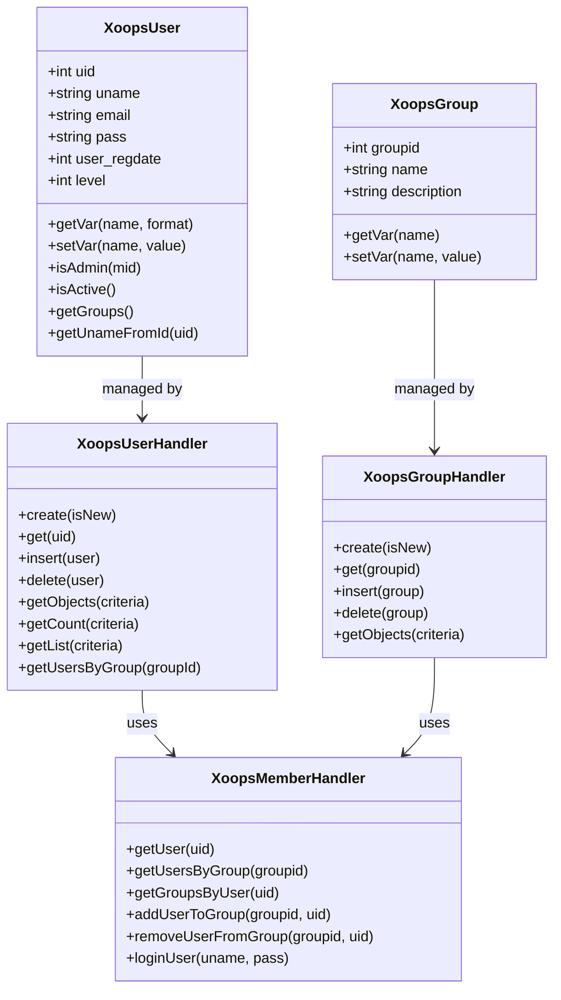
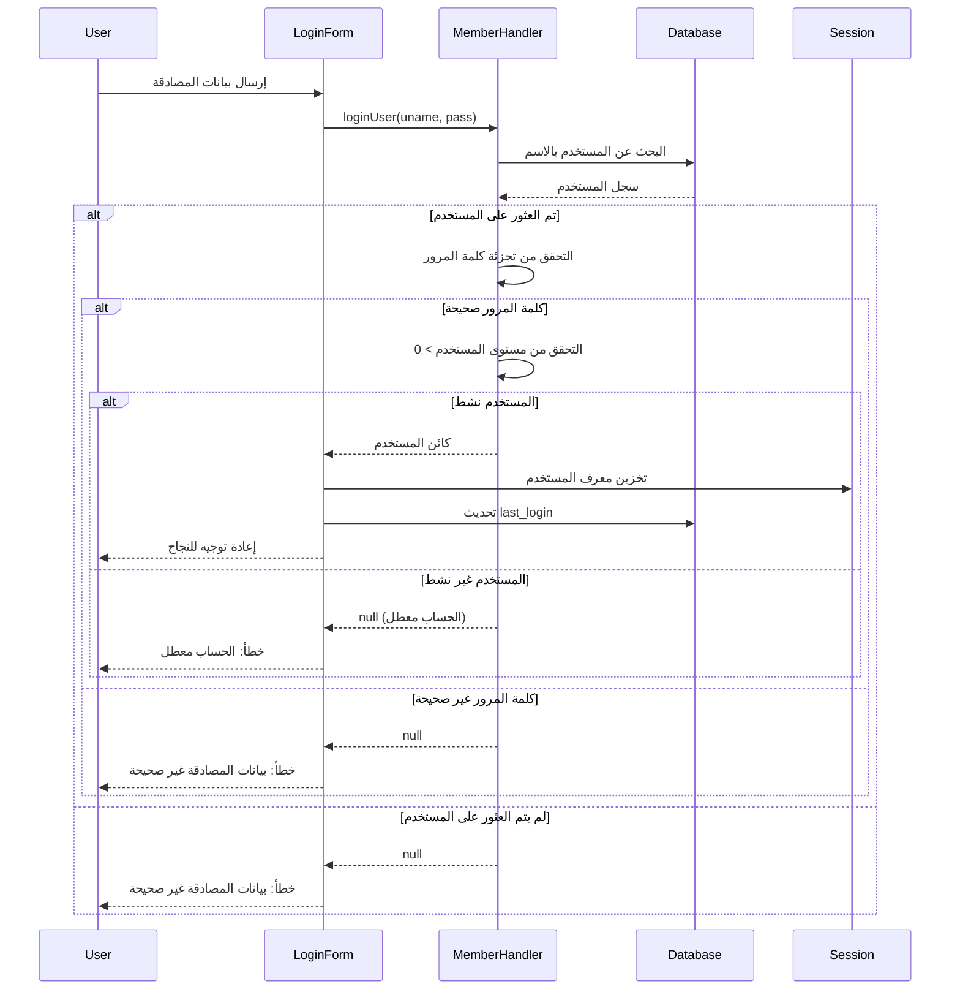
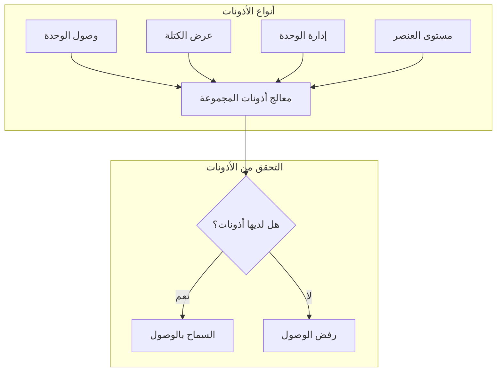
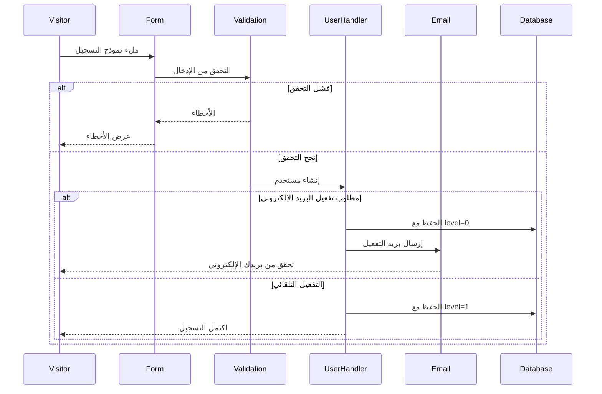

> وثائق واجهة برمجة التطبيقات الكاملة لنظام المستخدمين في XOOPS.

---

## معمارية نظام المستخدمين



---

## فئة XoopsUser

### الخصائص

| الخاصية | النوع | الوصف |
|--------|------|-------|
| `uid` | int | معرف المستخدم (المفتاح الأساسي) |
| `uname` | string | اسم المستخدم |
| `name` | string | الاسم الحقيقي |
| `email` | string | عنوان البريد الإلكتروني |
| `pass` | string | تجزئة كلمة المرور |
| `url` | string | رابط الموقع |
| `user_avatar` | string | اسم ملف الصورة الرمزية |
| `user_regdate` | int | طابع زمني للتسجيل |
| `user_from` | string | الموقع الجغرافي |
| `user_sig` | string | التوقيع |
| `user_occ` | string | المهنة |
| `user_intrest` | string | الاهتمامات |
| `bio` | string | السيرة الذاتية |
| `posts` | int | عدد المشاركات |
| `rank` | int | رتبة المستخدم |
| `level` | int | مستوى المستخدم (0=غير نشط، 1=نشط) |
| `theme` | string | المظهر المفضل |
| `timezone` | float | إزاحة المنطقة الزمنية |
| `last_login` | int | طابع زمني لآخر تسجيل دخول |

### الدوال الأساسية

```php
// الحصول على المستخدم الحالي
global $xoopsUser;

// التحقق من تسجيل الدخول
if (is_object($xoopsUser)) {
    // المستخدم قد سجل الدخول
    $uid = $xoopsUser->getVar('uid');
    $username = $xoopsUser->getVar('uname');
}

// الحصول على القيم المنسقة
$uname = $xoopsUser->getVar('uname');           // القيمة الخام
$unameDisplay = $xoopsUser->getVar('uname', 's'); // آمن للعرض
$unameEdit = $xoopsUser->getVar('uname', 'e');    // للتحرير في النموذج

// التحقق من كون المسؤول
$isAdmin = $xoopsUser->isAdmin();              // مسؤول الموقع
$isModuleAdmin = $xoopsUser->isAdmin($mid);    // مسؤول الوحدة

// الحصول على مجموعات المستخدم
$groups = $xoopsUser->getGroups();             // مصفوفة معرفات المجموعات

// التحقق من النشاط
$isActive = $xoopsUser->isActive();
```

---

## معالج XoopsUser

### عمليات CRUD للمستخدم

```php
// الحصول على المعالج
$userHandler = xoops_getHandler('user');

// إنشاء مستخدم جديد
$user = $userHandler->create();
$user->setVar('uname', 'مستخدم_جديد');
$user->setVar('email', 'user@example.com');
$user->setVar('pass', password_hash('password123', PASSWORD_DEFAULT));
$user->setVar('user_regdate', time());
$user->setVar('level', 1);

if ($userHandler->insert($user)) {
    $newUid = $user->getVar('uid');
}

// الحصول على مستخدم برقم معرف
$user = $userHandler->get(123);

// تحديث المستخدم
$user->setVar('email', 'newemail@example.com');
$userHandler->insert($user);

// حذف المستخدم
$userHandler->delete($user);
```

### الاستعلام عن المستخدمين

```php
// الحصول على جميع المستخدمين النشطين
$criteria = new Criteria('level', 1);
$users = $userHandler->getObjects($criteria);

// الحصول على المستخدمين حسب المعايير
$criteria = new CriteriaCompo();
$criteria->add(new Criteria('level', 1));
$criteria->add(new Criteria('posts', 10, '>='));
$criteria->setSort('posts');
$criteria->setOrder('DESC');
$criteria->setLimit(10);
$activePosters = $userHandler->getObjects($criteria);

// الحصول على عدد المستخدمين
$count = $userHandler->getCount($criteria);

// الحصول على قائمة المستخدمين (uid => uname)
$userList = $userHandler->getList($criteria);

// البحث عن المستخدمين
$criteria = new CriteriaCompo();
$criteria->add(new Criteria('uname', '%john%', 'LIKE'));
$criteria->add(new Criteria('email', '%john%', 'LIKE'), 'OR');
$searchResults = $userHandler->getObjects($criteria);
```

---

## معالج XoopsMember

### إدارة المجموعات

```php
$memberHandler = xoops_getHandler('member');

// الحصول على المستخدم مع المجموعات
$user = $memberHandler->getUser($uid);
$groups = $memberHandler->getGroupsByUser($uid);

// الحصول على المستخدمين في المجموعة
$users = $memberHandler->getUsersByGroup($groupId);
$users = $memberHandler->getUsersByGroup($groupId, true); // كائنات
$users = $memberHandler->getUsersByGroup($groupId, false); // معرفات فقط

// إضافة مستخدم إلى المجموعة
$memberHandler->addUserToGroup($groupId, $uid);

// إزالة مستخدم من المجموعة
$memberHandler->removeUserFromGroup($groupId, $uid);
```

### المصادقة

```php
// تسجيل دخول المستخدم
$user = $memberHandler->loginUser($username, $password);

if ($user) {
    // تسجيل دخول ناجح
    $_SESSION['xoopsUserId'] = $user->getVar('uid');
    $user->setVar('last_login', time());
    $userHandler->insert($user);
} else {
    // فشل تسجيل الدخول
}

// تسجيل الخروج
$_SESSION = [];
session_destroy();
redirect_header(XOOPS_URL, 3, 'تم تسجيل الخروج');
```

---

## تدفق المصادقة



---

## نظام المجموعات

### المجموعات الافتراضية

| معرف المجموعة | الاسم | الوصف |
|--------|------|-------|
| 1 | مديرو الويب | وصول إداري كامل |
| 2 | المستخدمون المسجلون | المستخدمون العاديون المسجلون |
| 3 | مجهول | الزوار غير المسجلين |

### أذونات المجموعات



### التحقق من الأذونات

```php
$gpermHandler = xoops_getHandler('groupperm');

// التحقق من وصول الوحدة
$groups = is_object($xoopsUser) ? $xoopsUser->getGroups() : [XOOPS_GROUP_ANONYMOUS];
$hasAccess = $gpermHandler->checkRight('module_read', $moduleId, $groups);

// التحقق من إدارة الوحدة
$isAdmin = $gpermHandler->checkRight('module_admin', $moduleId, $groups);

// التحقق من أذونات مخصصة
$hasPermission = $gpermHandler->checkRight(
    'item_view',      // اسم الإذن
    $itemId,          // معرف العنصر
    $groups,          // معرفات المجموعات
    $moduleId         // معرف الوحدة
);

// الحصول على العناصر التي يمكن للمستخدم الوصول إليها
$itemIds = $gpermHandler->getItemIds('item_view', $groups, $moduleId);
```

---

## تدفق تسجيل المستخدم



---

## مثال شامل

```php
<?php
require_once __DIR__ . '/mainfile.php';

use Xmf\Request;

$memberHandler = xoops_getHandler('member');
$userHandler = xoops_getHandler('user');

// معالج التسجيل
if (Request::hasVar('register', 'POST')) {
    // التحقق من CSRF
    if (!$GLOBALS['xoopsSecurity']->check()) {
        redirect_header('register.php', 3, 'خطأ أمني');
    }

    $uname = Request::getString('uname', '', 'POST');
    $email = Request::getEmail('email', '', 'POST');
    $pass = Request::getString('pass', '', 'POST');
    $passConfirm = Request::getString('pass_confirm', '', 'POST');

    $errors = [];

    // التحقق من اسم المستخدم
    if (strlen($uname) < 3 || strlen($uname) > 25) {
        $errors[] = 'يجب أن يكون اسم المستخدم من 3 إلى 25 حرف';
    }

    // التحقق من عدم استخدام اسم المستخدم من قبل
    $criteria = new Criteria('uname', $uname);
    if ($userHandler->getCount($criteria) > 0) {
        $errors[] = 'اسم المستخدم مستخدم بالفعل';
    }

    // التحقق من البريد الإلكتروني
    if (!filter_var($email, FILTER_VALIDATE_EMAIL)) {
        $errors[] = 'عنوان البريد الإلكتروني غير صحيح';
    }

    // التحقق من عدم استخدام البريد الإلكتروني من قبل
    $criteria = new Criteria('email', $email);
    if ($userHandler->getCount($criteria) > 0) {
        $errors[] = 'البريد الإلكتروني مسجل بالفعل';
    }

    // التحقق من كلمة المرور
    if (strlen($pass) < 8) {
        $errors[] = 'يجب أن تكون كلمة المرور 8 أحرف على الأقل';
    }

    if ($pass !== $passConfirm) {
        $errors[] = 'كلمات المرور غير متطابقة';
    }

    if (empty($errors)) {
        // إنشاء المستخدم
        $user = $userHandler->create();
        $user->setVar('uname', $uname);
        $user->setVar('email', $email);
        $user->setVar('pass', password_hash($pass, PASSWORD_DEFAULT));
        $user->setVar('user_regdate', time());
        $user->setVar('level', 1); // تفعيل تلقائي

        if ($userHandler->insert($user)) {
            // إضافة إلى مجموعة المستخدمين المسجلين
            $memberHandler->addUserToGroup(XOOPS_GROUP_USERS, $user->getVar('uid'));

            redirect_header('index.php', 3, 'اكتمل التسجيل بنجاح!');
        } else {
            $errors[] = 'خطأ في إنشاء الحساب';
        }
    }
}

// عرض نموذج التسجيل
require_once XOOPS_ROOT_PATH . '/header.php';

if (!empty($errors)) {
    foreach ($errors as $error) {
        echo "<div class='errorMsg'>$error</div>";
    }
}

// نموذج التسجيل هنا...

require_once XOOPS_ROOT_PATH . '/footer.php';
```

---

## الوثائق ذات الصلة

- دليل إدارة المستخدمين
- نظام الأذونات
- المصادقة

---

#xoops #api #user #authentication #reference
