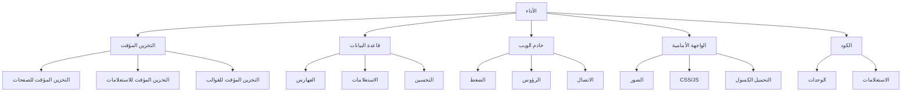

# تحسين أداء XOOPS

دليل شامل لتحسين XOOPS لأقصى سرعة وكفاءة.

## نظرة عامة على تحسين الأداء



## تكوين التخزين المؤقت

التخزين المؤقت هو أسرع طريقة لتحسين الأداء.

### التخزين المؤقت على مستوى الصفحة

تفعيل التخزين المؤقت الكامل للصفحات في XOOPS:

**لوحة التحكم > System > Preferences > Cache Settings**

```
تفعيل التخزين المؤقت: نعم
نوع التخزين المؤقت: ملف Cache (أو APCu/Memcache)
مدة التخزين المؤقت: 3600 ثانية (ساعة واحدة)
التخزين المؤقت لقوائم الوحدات: نعم
التخزين المؤقت للتكوين: نعم
التخزين المؤقت لنتائج البحث: نعم
```

### التخزين المؤقت القائم على الملفات

تكوين موقع التخزين المؤقت للملفات:

```bash
# أنشئ دليل التخزين المؤقت خارج جذر الويب (أكثر أمانًا)
mkdir -p /var/cache/xoops
chown www-data:www-data /var/cache/xoops
chmod 755 /var/cache/xoops

# حرّر mainfile.php
define('XOOPS_CACHE_PATH', '/var/cache/xoops/');
```

### التخزين المؤقت APCu

يوفر APCu التخزين المؤقت في الذاكرة (سريع جدًا):

```bash
# تثبيت APCu
apt-get install php-apcu

# التحقق من التثبيت
php -m | grep apcu

# تكوين في php.ini
apc.enabled = 1
apc.memory_size = 128M
apc.ttl = 0
apc.user_ttl = 3600
apc.shm_size = 128
```

تفعيل في XOOPS:

**لوحة التحكم > System > Preferences > Cache Settings**

```
نوع التخزين المؤقت: APCu
```

### التخزين المؤقت Memcache/Redis

التخزين المؤقت الموزع للمواقع عالية الحركة:

**تثبيت Memcache:**

```bash
# تثبيت خادم Memcache
apt-get install memcached

# بدء الخدمة
systemctl start memcached
systemctl enable memcached

# التحقق من التشغيل
netstat -tlnp | grep memcached
# يجب أن يظهر الاستماع على المنفذ 11211
```

**تكوين في XOOPS:**

عدّل mainfile.php:

```php
// تكوين Memcache
define('XOOPS_CACHE_TYPE', 'memcache');
define('XOOPS_CACHE_HOST', 'localhost');
define('XOOPS_CACHE_PORT', 11211);
define('XOOPS_CACHE_TIMEOUT', 0);
```

أو في لوحة التحكم:

```
نوع التخزين المؤقت: Memcache
مضيف Memcache: localhost:11211
```

### التخزين المؤقت للقوالب

ترجمة وتخزين مؤقت لقوالب XOOPS:

```bash
# تأكد من أن templates_c قابل للكتابة
chmod 777 /var/www/html/xoops/templates_c/

# امسح القوالب المخزنة مؤقتًا القديمة
rm -rf /var/www/html/xoops/templates_c/*
```

تكوين في المظهر:

```html
<!-- في xoops_version.php للمظهر -->
{smarty.const.XOOPS_VAR_PATH|constant}
<{$xoops_meta}>

<!-- استخدام التخزين المؤقت في القوالب -->
{cache}
    [محتوى مخزن مؤقتًا هنا]
{/cache}
```

## تحسين قاعدة البيانات

### إضافة فهارس قاعدة البيانات

قواعد البيانات المفهرسة بشكل صحيح تستعلم بشكل أسرع بكثير.

```sql
-- تحقق من الفهارس الحالية
SHOW INDEXES FROM xoops_users;

-- فهارس شائعة لإضافتها
ALTER TABLE xoops_users ADD INDEX idx_uname (uname);
ALTER TABLE xoops_users ADD INDEX idx_email (email);
ALTER TABLE xoops_users ADD INDEX idx_uid_active (uid, user_actkey);

-- إضافة فهارس لجداول المشاركات/المحتوى
ALTER TABLE xoops_posts ADD INDEX idx_post_published (post_published);
ALTER TABLE xoops_posts ADD INDEX idx_post_uid (post_uid);
ALTER TABLE xoops_posts ADD INDEX idx_post_created (post_created);

-- التحقق من الفهارس المُنشأة
SHOW INDEXES FROM xoops_users\G
```

### تحسين الجداول

تحسين الجداول بشكل منتظم يحسن الأداء:

```sql
-- تحسين جميع الجداول
OPTIMIZE TABLE xoops_users;
OPTIMIZE TABLE xoops_posts;
OPTIMIZE TABLE xoops_config;
OPTIMIZE TABLE xoops_comments;

-- أو تحسين الكل مرة واحدة
REPAIR TABLE xoops_users;
OPTIMIZE TABLE xoops_users;
REPAIR TABLE xoops_posts;
OPTIMIZE TABLE xoops_posts;
```

أنشئ سكريبت تحسين آلي:

```bash
#!/bin/bash
# سكريبت تحسين قاعدة البيانات

echo "تحسين قاعدة بيانات XOOPS..."

mysql -u xoops_user -p xoops_db << EOF
-- تحسين جميع الجداول
OPTIMIZE TABLE xoops_users;
OPTIMIZE TABLE xoops_posts;
OPTIMIZE TABLE xoops_config;
OPTIMIZE TABLE xoops_comments;
OPTIMIZE TABLE xoops_users_online;

-- عرض حجم قاعدة البيانات
SELECT table_schema,
       ROUND(SUM(data_length + index_length) / 1024 / 1024, 2) as total_mb
FROM information_schema.tables
WHERE table_schema = 'xoops_db'
GROUP BY table_schema;
EOF

echo "تم اكتمال تحسين قاعدة البيانات!"
```

جدول مع cron:

```bash
# تحسين أسبوعي
crontab -e
# أضف: 0 3 * * 0 /usr/local/bin/optimize-xoops-db.sh
```

### تحسين الاستعلام

مراجعة الاستعلامات البطيئة:

```sql
-- تفعيل سجل الاستعلامات البطيئة
SET GLOBAL slow_query_log = 'ON';
SET GLOBAL long_query_time = 2;

-- عرض الاستعلامات البطيئة
SELECT * FROM mysql.slow_log;

-- أو تحقق من ملف السجل البطيء
tail -100 /var/log/mysql/slow.log
```

تقنيات التحسين الشائعة:

```php
// بطيء - تجنب الاستعلامات غير الضرورية في الحلقات
foreach ($users as $user) {
    $profile = getUserProfile($user['uid']);  // استعلام في حلقة!
    echo $profile['name'];
}

// سريع - احصل على جميع البيانات مرة واحدة
$profiles = getAllUserProfiles($user_ids);
foreach ($users as $user) {
    echo $profiles[$user['uid']]['name'];
}
```

### زيادة حجم مخزن InnoDB مؤقتًا

تكوين MySQL لتخزين مؤقت أفضل:

عدّل `/etc/mysql/mysql.conf.d/mysqld.cnf`:

```ini
# مخزن InnoDB مؤقتًا (50-80% من ذاكرة النظام)
innodb_buffer_pool_size = 1G

# التخزين المؤقت للاستعلام (اختياري، يمكن تعطيله في MySQL 5.7+)
query_cache_size = 64M
query_cache_type = 1

# أقصى عدد اتصالات
max_connections = 500

# أقصى حزمة مسموحة
max_allowed_packet = 256M

# انتظار الاتصال
connect_timeout = 10
```

أعد تشغيل MySQL:

```bash
systemctl restart mysql
```

## تحسين خادم الويب

### تفعيل ضغط Gzip

ضغط الردود لتقليل نطاق الترددات الترددية:

**تكوين Apache:**

```apache
<IfModule mod_deflate.c>
    AddOutputFilterByType DEFLATE text/html text/plain text/xml text/css text/javascript application/javascript application/json

    # لا تضغط الصور والملفات المضغوطة بالفعل
    SetEnvIfNoCase Request_URI \.(jpg|jpeg|png|gif|zip|gzip)$ no-gzip dont-vary

    # تسجيل الردود المضغوطة
    DeflateBufferSize 8096
</IfModule>
```

**تكوين Nginx:**

```nginx
gzip on;
gzip_types text/html text/plain text/css text/javascript application/javascript application/json;
gzip_min_length 1000;
gzip_vary on;
gzip_comp_level 6;

# لا تضغط تنسيقات مضغوطة بالفعل
gzip_disable "msie6";
```

التحقق من الضغط:

```bash
# تحقق من ضغط الرد
curl -I -H "Accept-Encoding: gzip" http://your-domain.com/xoops/

# يجب أن يعرض:
# Content-Encoding: gzip
```

### رؤوس التخزين المؤقت للمتصفح

عيّن انتهاء الصلاحية لأصول ثابتة:

**Apache:**

```apache
<IfModule mod_expires.c>
    ExpiresActive On

    # التخزين المؤقت للصور لمدة 30 يومًا
    ExpiresByType image/jpeg "access plus 30 days"
    ExpiresByType image/gif "access plus 30 days"
    ExpiresByType image/png "access plus 30 days"
    ExpiresByType image/svg+xml "access plus 30 days"

    # التخزين المؤقت CSS/JS لمدة 30 يومًا
    ExpiresByType text/css "access plus 30 days"
    ExpiresByType application/javascript "access plus 30 days"
    ExpiresByType text/javascript "access plus 30 days"

    # التخزين المؤقت للخطوط لمدة سنة واحدة
    ExpiresByType font/eot "access plus 1 year"
    ExpiresByType font/ttf "access plus 1 year"
    ExpiresByType font/woff "access plus 1 year"
    ExpiresByType font/woff2 "access plus 1 year"

    # لا تخزن HTML مؤقتًا
    ExpiresByType text/html "access plus 1 hour"
</IfModule>
```

**Nginx:**

```nginx
location ~* \.(jpg|jpeg|png|gif|ico|svg|woff|woff2|ttf|eot)$ {
    expires 30d;
    add_header Cache-Control "public, immutable";
}

location ~* \.(css|js)$ {
    expires 30d;
    add_header Cache-Control "public";
}

location ~ \.html$ {
    expires 1h;
    add_header Cache-Control "public";
}
```

### اتصال Keepalive

تفعيل اتصالات HTTP الدائمة:

**Apache:**

```apache
<IfModule mod_http.c>
    KeepAlive On
    KeepAliveTimeout 15
    MaxKeepAliveRequests 100
</IfModule>
```

**Nginx:**

```nginx
keepalive_timeout 15s;
keepalive_requests 100;
```

## تحسين الواجهة الأمامية

### تحسين الصور

تقليل أحجام ملفات الصور:

```bash
# ضغط صور JPEG دفعة واحدة
for img in *.jpg; do
    convert "$img" -quality 85 "optimized_$img"
done

# ضغط صور PNG دفعة واحدة
for img in *.png; do
    optipng -o2 "$img"
done

# أو استخدم imagemin CLI
npm install -g imagemin-cli
imagemin images/ --out-dir=images-optimized
```

### تصغير CSS و JavaScript

تقليل أحجام ملفات CSS/JS:

**استخدام أدوات Node.js:**

```bash
# تثبيت المصغرات
npm install -g uglify-js clean-css-cli

# تصغير JavaScript
uglifyjs script.js -o script.min.js

# تصغير CSS
cleancss style.css -o style.min.css
```

**استخدام أدوات على الإنترنت:**
- مصغر CSS: https://cssminifier.com/
- مصغر JavaScript: https://www.minifycode.com/javascript-minifier/

### تحميل الصور بطريقة كسولة

تحميل الصور فقط عند الحاجة:

```html
<!-- إضافة سمة loading="lazy" -->


<!-- أو استخدام مكتبة JavaScript لمتصفحات أقدم -->


<script src="https://cdnjs.cloudflare.com/ajax/libs/vanilla-lazyload/17.1.2/lazyload.min.js"></script>
<script>
    var lazyLoad = new LazyLoad({
        elements_selector: ".lazy"
    });
</script>
```

### تقليل موارد Render-Blocking

تحميل CSS/JS بشكل استراتيجي:

```html
<!-- حمّل CSS الحرج مضمّنًا -->
<style>
    /* الأنماط الحرجة للمحتوى فوق الطي */
</style>

<!-- أرجِ CSS غير الحرج -->
<link rel="stylesheet" href="style.css" media="print" onload="this.media='all'">

<!-- أرجِ JavaScript -->
<script src="script.js" defer></script>

<!-- أو استخدم async للسكريبتات غير الحرجة -->
<script src="analytics.js" async></script>
```

## تكامل CDN

استخدم شبكة توزيع المحتوى للوصول العالمي الأسرع.

### شبكات التوزيع الشهيرة

| CDN | التكلفة | الميزات |
|-----|---------|--------|
| Cloudflare | مجاني/مدفوع | DDoS، DNS، Cache، Analytics |
| AWS CloudFront | مدفوع | أداء عالي، عام |
| Bunny CDN | بأسعار معقولة | التخزين، الفيديو، Cache |
| jsDelivr | مجاني | مكتبات JavaScript |
| cdnjs | مجاني | مكتبات شهيرة |

### إعداد Cloudflare

1. سجل في https://www.cloudflare.com/
2. أضف نطاقك
3. حدّث nameservers مع Cloudflare
4. تفعيل خيارات التخزين المؤقت:
   - مستوى التخزين المؤقت: الهجوم
   - التخزين المؤقت على كل شيء: On
   - TTL التخزين المؤقت للمتصفح: شهر واحد

5. في XOOPS، حدّث نطاقك لاستخدام DNS من Cloudflare

### تكوين CDN في XOOPS

حدّث عناوين الصور إلى CDN:

عدّل نموذج المظهر:

```html
<!-- الأصلي -->


<!-- مع CDN -->

```

أو عيّن في PHP:

```php
// في mainfile.php أو الإعداد
define('XOOPS_CDN_URL', 'https://cdn.your-domain.com');

// في النموذج

```

## مراقبة الأداء

### اختبار PageSpeed Insights

اختبر أداء موقعك:

1. قم بزيارة Google PageSpeed Insights: https://pagespeed.web.dev/
2. أدخل رابط XOOPS الخاص بك
3. راجع التوصيات
4. طبّق التحسينات المقترحة

### مراقبة أداء الخادم

راقب مقاييس الخادم الفعلية:

```bash
# تثبيت أدوات المراقبة
apt-get install htop iotop nethogs

# راقب CPU والذاكرة
htop

# راقب I/O للقرص
iotop

# راقب الشبكة
nethogs
```

### تنميط أداء PHP

حدد كود PHP البطيء:

```php
<?php
// استخدم Xdebug للتنميط
xdebug_start_trace('profile');

// الكود الخاص بك هنا
$result = someExpensiveFunction();

xdebug_stop_trace();
?>
```

### مراقبة استعلام MySQL

تتبع الاستعلامات البطيئة:

```bash
# تفعيل السجل
mysql -u root -p

SET GLOBAL general_log = 'ON';
SET GLOBAL log_output = 'FILE';
SET GLOBAL general_log_file = '/var/log/mysql/query.log';

# راجع الاستعلامات البطيئة
tail -f /var/log/mysql/slow.log

# حلل الاستعلام
EXPLAIN SELECT * FROM xoops_users WHERE uid = 1\G
```

## قائمة التحقق من تحسين الأداء

طبّق هذه لأفضل أداء:

- [ ] **التخزين المؤقت:** تفعيل ملف/APCu/Memcache التخزين المؤقت
- [ ] **قاعدة البيانات:** أضف فهارس، حسّن الجداول
- [ ] **الضغط:** تفعيل ضغط Gzip
- [ ] **التخزين المؤقت للمتصفح:** عيّن رؤوس التخزين المؤقت
- [ ] **الصور:** حسّن وضغط
- [ ] **CSS/JS:** صغّر الملفات
- [ ] **التحميل الكسول:** طبّق للصور
- [ ] **CDN:** استخدم للأصول الثابتة
- [ ] **Keep-Alive:** تفعيل الاتصالات الدائمة
- [ ] **الوحدات:** عطّل الوحدات غير المستخدمة
- [ ] **المظاهر:** استخدم مظاهر خفيفة محسّنة
- [ ] **المراقبة:** تتبع مقاييس الأداء
- [ ] **الصيانة الدورية:** امسح التخزين المؤقت، حسّن قاعدة البيانات

## سكريبت تحسين الأداء

تحسين آلي:

```bash
#!/bin/bash
# سكريبت تحسين الأداء

echo "=== تحسين أداء XOOPS ==="

# امسح التخزين المؤقت
echo "مسح التخزين المؤقت..."
rm -rf /var/www/html/xoops/cache/*
rm -rf /var/www/html/xoops/templates_c/*

# حسّن قاعدة البيانات
echo "تحسين قاعدة البيانات..."
mysql -u xoops_user -p xoops_db << EOF
OPTIMIZE TABLE xoops_users;
OPTIMIZE TABLE xoops_posts;
OPTIMIZE TABLE xoops_config;
OPTIMIZE TABLE xoops_comments;
EOF

# تحقق من أذونات الملفات
echo "التحقق من أذونات الملفات..."
find /var/www/html/xoops -type f -exec chmod 644 {} \;
find /var/www/html/xoops -type d -exec chmod 755 {} \;
chmod 777 /var/www/html/xoops/cache
chmod 777 /var/www/html/xoops/templates_c
chmod 777 /var/www/html/xoops/uploads
chmod 777 /var/www/html/xoops/var

# إنشاء تقرير أداء
echo "اكتمل تحسين الأداء!"
echo ""
echo "الخطوات التالية:"
echo "1. اختبر الموقع على https://pagespeed.web.dev/"
echo "2. راقب الأداء في لوحة التحكم"
echo "3. فكر في CDN للأصول الثابتة"
echo "4. راجع الاستعلامات البطيئة في MySQL"
```

## مقاييس قبل وبعد

تتبع التحسينات:

```
قبل التحسين:
- وقت تحميل الصفحة: 3.5 ثانية
- استعلامات قاعدة البيانات: 45
- معدل نسبة التخزين المؤقت: 0%
- حجم قاعدة البيانات: 250MB

بعد التحسين:
- وقت تحميل الصفحة: 0.8 ثانية (77% أسرع)
- استعلامات قاعدة البيانات: 8 (مخزنة مؤقتًا)
- معدل نسبة التخزين المؤقت: 85%
- حجم قاعدة البيانات: 120MB (محسّنة)
```

## الخطوات التالية

بعد تحسين الأداء:

1. راجع التكوين الأساسي
2. تأكد من تدابير الأمان
3. طبّق التخزين المؤقت
4. راقب الأداء مع الأدوات
5. اضبط بناءً على المقاييس

---

**علامات:** #performance #optimization #caching #database #cdn

**المقالات ذات الصلة:**
- ../../06-Publisher-Module/User-Guide/Basic-Configuration
- System-Settings
- Security-Configuration
- ../Installation/Server-Requirements
