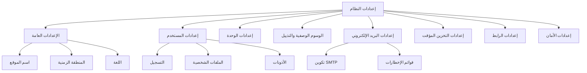

# إعدادات نظام XOOPS

يغطي هذا الدليل جميع إعدادات النظام المتاحة في لوحة تحكم XOOPS، منظمة حسب الفئة.

## معمارية إعدادات النظام



## الوصول إلى إعدادات النظام

### الموقع

**لوحة التحكم > System > Preferences**

أو انتقل مباشرة:

```
http://your-domain.com/xoops/admin/index.php?fct=preferences
```

### متطلبات الإذن

- فقط المسؤولون (مديرو الويب) يمكنهم الوصول لإعدادات النظام
- التغييرات تؤثر على الموقع كاملاً
- معظم التغييرات تأخذ التأثير فورًا

## الإعدادات العامة

التكوين الأساسي لتثبيت XOOPS الخاص بك.

### معلومات أساسية

```
اسم الموقع: [اسم موقعك]
الوصف الافتراضي: [وصف موجز لموقعك]
شعار الموقع: [شعار جذاب]
بريد المسؤول: admin@your-domain.com
اسم مدير الويب: اسم المسؤول
بريد مدير الويب: admin@your-domain.com
```

### إعدادات المظهر

```
المظهر الافتراضي: [اختر مظهر]
اللغة الافتراضية: الإنجليزية (أو اللغة المفضلة)
عدد العناصر لكل صفحة: 15 (عادة 10-25)
الكلمات في الملخص: 25 (لنتائج البحث)
أذونات تحميل المظهر: معطّل (أمان)
```

### إعدادات إقليمية

```
المنطقة الزمنية الافتراضية: [منطقتك الزمنية]
تنسيق التاريخ: %Y-%m-%d (تنسيق YYYY-MM-DD)
تنسيق الوقت: %H:%M:%S (تنسيق HH:MM:SS)
توفير الوقت الصيفي: [تلقائي/يدوي/بلا]
```

**جدول تنسيق المنطقة الزمنية:**

| المنطقة | المنطقة الزمنية | إزاحة UTC |
|--------|---------|----------|
| شرق الولايات المتحدة | America/New_York | -5 / -4 |
| وسط الولايات المتحدة | America/Chicago | -6 / -5 |
| جبلي الولايات المتحدة | America/Denver | -7 / -6 |
| ساحل المحيط الهادئ | America/Los_Angeles | -8 / -7 |
| المملكة المتحدة/لندن | Europe/London | 0 / +1 |
| فرنسا/ألمانيا | Europe/Paris | +1 / +2 |
| اليابان | Asia/Tokyo | +9 |
| الصين | Asia/Shanghai | +8 |
| أستراليا/سيدني | Australia/Sydney | +10 / +11 |

### تكوين البحث

```
تفعيل البحث: نعم
البحث في صفحات المسؤول: نعم/لا
البحث في الأرشيفات: نعم
نوع البحث الافتراضي: الكل / الصفحات فقط
الكلمات المستبعدة من البحث: [قائمة مفصولة بفواصل]
```

**الكلمات المستبعدة الشائعة:** the, a, an, and, or, but, in, on, at, by, to, from

## إعدادات المستخدم

التحكم في سلوك حساب المستخدم وعملية التسجيل.

### تسجيل المستخدم

```
السماح بتسجيل المستخدم: نعم/لا
نوع التسجيل:
  ☐ تفعيل تلقائي (وصول فوري)
  ☐ موافقة المسؤول (يجب على المسؤول الموافقة)
  ☐ التحقق من البريد (يجب على المستخدم التحقق من البريد)

إخطار المستخدمين: نعم/لا
التحقق من بريد المستخدم: مطلوب/اختياري
```

### تكوين المستخدم الجديد

```
تسجيل دخول المستخدمين الجدد تلقائيًا: نعم/لا
تعيين مجموعة مستخدمين افتراضية: نعم
مجموعة المستخدمين الافتراضية: [اختر مجموعة]
إنشاء صورة رمزية للمستخدم: نعم/لا
الصورة الرمزية الأولية: [اختر افتراضي]
```

### إعدادات ملف تعريف المستخدم

```
السماح بملفات تعريف المستخدمين: نعم
عرض قائمة الأعضاء: نعم
عرض إحصائيات المستخدمين: نعم
عرض آخر وقت متصل: نعم
السماح بصورة رمزية للمستخدم: نعم
أقصى حجم ملف صورة رمزية: 100KB
أبعاد الصورة الرمزية: 100x100 بكسل
```

### إعدادات بريد المستخدم

```
السماح للمستخدمين بإخفاء البريد: نعم
عرض البريد في الملف الشخصي: نعم
فترة إخطار البريد الإلكتروني: فوري/يومي/أسبوعي/أبدًا
```

### تتبع نشاط المستخدم

```
تتبع نشاط المستخدم: نعم
تسجيل دخول المستخدم: نعم
تسجيل محاولات الدخول الفاشلة: نعم
تتبع عنوان IP: نعم
مسح سجلات النشاط الأقدم من: 90 يومًا
```

### حدود الحساب

```
السماح بنفس البريد: لا
أقل طول لاسم المستخدم: 3 أحرف
أقصى طول لاسم المستخدم: 15 حرف
أقل طول لكلمة المرور: 6 أحرف
مطالبة برموز خاصة: نعم
مطالبة بأرقام: نعم
انتهاء صلاحية كلمة المرور: 90 يومًا (أو أبدًا)
حذف الحسابات غير النشطة لمدة: 365 يومًا
```

## إعدادات الوحدة

تكوين السلوك الفردي للوحدات.

### خيارات الوحدة الشائعة

لكل وحدة مثبتة، يمكنك تعيين:

```
حالة الوحدة: نشطة/غير نشطة
العرض في القائمة: نعم/لا
وزن الوحدة: [1-999] (أعلى = أقل في العرض)
الصفحة الرئيسية الافتراضية: تظهر هذه الوحدة عند زيارة /
وصول المسؤول: [مجموعات المستخدمين المسموحة]
وصول المستخدم: [مجموعات المستخدمين المسموحة]
```

### إعدادات وحدة النظام

```
عرض الصفحة الرئيسية كـ: بوابة / وحدة / صفحة ثابتة
وحدة الصفحة الرئيسية الافتراضية: [اختر وحدة]
عرض قائمة التذييل: نعم
لون التذييل: [منتقي اللون]
عرض إحصائيات النظام: نعم
عرض استخدام الذاكرة: نعم
```

### تكوين لكل وحدة

لكل وحدة إعدادات محددة للوحدة:

**مثال - وحدة الصفحة:**
```
تفعيل التعليقات: نعم/لا
تعديل التعليقات: نعم/لا
التعليقات لكل صفحة: 10
تفعيل التقييمات: نعم
السماح بتقييمات مجهولة: نعم
```

**مثال - وحدة المستخدم:**
```
مجلد تحميل الصورة الرمزية: ./uploads/
أقصى حجم تحميل: 100KB
السماح بتحميل الملفات: نعم
أنواع الملفات المسموحة: jpg, gif, png
```

الوصول إلى إعدادات محددة للوحدة:
- **Admin > Modules > [اسم الوحدة] > Preferences**

## وسوم المحتوى وإعدادات التذييل

تكوين الوسوم الوصفية لتحسين محركات البحث.

### الوسوم الوصفية العالمية

```
كلمات مفتاحية: xoops, cms, نظام إدارة محتوى
وصف: نظام إدارة محتوى قوي وديناميكي
المؤلف: اسمك
حقوق الطبع: حقوق الطبع 2025، شركتك
روبوتات: فهرس، متابعة
إعادة الزيارة: 30 يومًا
```

### أفضل ممارسات الوسوم

| الوسم | الغرض | التوصية |
|------|-------|-----------|
| الكلمات المفتاحية | مصطلحات البحث | 5-10 كلمات مفتاحية صلة، مفصولة بفواصل |
| الوصف | قائمة محرك البحث | 150-160 حرف |
| المؤلف | منشئ الصفحة | اسمك أو شركتك |
| حقوق الطبع | قانوني | إخطار حقوق الطبع الخاص بك |
| الروبوتات | تعليمات الزاحف | فهرس، متابعة (السماح بالفهرسة) |

### إعدادات التذييل

```
عرض التذييل: نعم
لون التذييل: داكن/فاتح
خلفية التذييل: [رمز اللون]
نص التذييل: [HTML مسموح]
روابط التذييل الإضافية: [أزواج الرابط والنص]
```

**HTML تذييل نموذجي:**
```html
<p>حقوق الطبع &copy; 2025 شركتك. جميع الحقوق محفوظة.</p>
<p><a href="/privacy">سياسة الخصوصية</a> | <a href="/terms">شروط الاستخدام</a></p>
```

### وسوم وسائط التواصل الاجتماعي (Open Graph)

```
تفعيل Open Graph: نعم
معرّف تطبيق Facebook: [معرّف التطبيق]
نوع بطاقة Twitter: ملخص / ملخص_صورة كبيرة / لاعب
صورة المشاركة الافتراضية: [رابط الصورة]
```

## إعدادات البريد الإلكتروني

تكوين توصيل البريد الإلكتروني ونظام الإخطارات.

### طريقة توصيل البريد الإلكتروني

```
استخدام SMTP: نعم/لا

إذا كان SMTP:
  مضيف SMTP: smtp.gmail.com
  منفذ SMTP: 587 (TLS) أو 465 (SSL)
  أمان SMTP: TLS / SSL / بلا
  اسم مستخدم SMTP: [email@example.com]
  كلمة مرور SMTP: [كلمة المرور]
  مصادقة SMTP: نعم/لا
  انتظار SMTP: 10 ثواني

إذا كانت PHP mail():
  مسار Sendmail: /usr/sbin/sendmail -t -i
```

### تكوين البريد الإلكتروني

```
عنوان الإرسال: noreply@your-domain.com
اسم الإرسال: اسم موقعك
عنوان الرد: support@your-domain.com
إرسال BCC لرسائل البريد الإداري: نعم/لا
```

### إعدادات الإخطارات

```
إرسال بريد ترحيب: نعم/لا
موضوع بريد الترحيب: مرحبا بك في [اسم الموقع]
نص بريد الترحيب: [رسالة مخصصة]

إرسال بريد إعادة تعيين كلمة المرور: نعم/لا
تضمين كلمة مرور عشوائية: نعم/لا
انتهاء صلاحية الرمز: 24 ساعة
```

### إخطارات المسؤول

```
إخطار المسؤول بالتسجيل: نعم
إخطار المسؤول بالتعليقات: نعم
إخطار المسؤول بالإرسالات: نعم
إخطار المسؤول بالأخطاء: نعم
```

### إخطارات المستخدم

```
إخطار المستخدم بالتسجيل: نعم
إخطار المستخدم بالتعليقات: نعم
إخطار المستخدم برسائل خاصة: نعم
السماح للمستخدمين بتعطيل الإخطارات: نعم
تكرار الإخطار الافتراضي: فوري
```

### نماذج البريد الإلكتروني

خصص رسائل الإخطار في لوحة التحكم:

**المسار:** System > Email Templates

القوالب المتاحة:
- تسجيل المستخدم
- إعادة تعيين كلمة المرور
- إخطار التعليقات
- الرسالة الخاصة
- تنبيهات النظام
- رسائل محددة للوحدة

## إعدادات التخزين المؤقت

تحسين الأداء من خلال التخزين المؤقت.

### تكوين التخزين المؤقت

```
تفعيل التخزين المؤقت: نعم/لا
نوع التخزين المؤقت:
  ☐ ملف Cache
  ☐ APCu (Alternative PHP Cache)
  ☐ Memcache (التخزين المؤقت الموزع)
  ☐ Redis (التخزين المؤقت المتقدم)

مدة التخزين المؤقت: 3600 ثانية (ساعة واحدة)
```

### خيارات التخزين المؤقت حسب النوع

**ملف Cache:**
```
دليل التخزين المؤقت: /var/www/html/xoops/cache/
فترة المسح: يومي
أقصى ملفات تخزين مؤقت: 1000
```

**APCu Cache:**
```
توزيع الذاكرة: 128MB
مستوى الشظايا: منخفض
```

**Memcache/Redis:**
```
مضيف الخادم: localhost
منفذ الخادم: 11211 (Memcache) / 6379 (Redis)
الاتصال الدائم: نعم
```

### ما يتم تخزينه مؤقتًا

```
التخزين المؤقت لقوائم الوحدات: نعم
التخزين المؤقت لبيانات التكوين: نعم
التخزين المؤقت لبيانات النموذج: نعم
التخزين المؤقت لبيانات جلسة المستخدم: نعم
التخزين المؤقت لنتائج البحث: نعم
التخزين المؤقت لاستعلامات قاعدة البيانات: نعم
التخزين المؤقت لمصادر RSS: نعم
التخزين المؤقت للصور: نعم
```

## إعدادات الرابط

تكوين إعادة كتابة الرابط والتنسيق.

### إعدادات الرابط الصديق

```
تفعيل الروابط الصديقة: نعم/لا
نوع الرابط الصديق:
  ☐ Path Info: /page/about
  ☐ سلسلة الاستعلام: /index.php?p=about

الشرطة المائلة اللاحقة: تضمين / حذف
حالة الرابط: أحرف صغيرة / حساس لحالة الأحرف
```

### قوائم إعادة كتابة الرابط

```
قوائم .htaccess: [عرض الحالية]
قوائم Nginx: [عرض الحالية إذا كانت Nginx]
قوائم IIS: [عرض الحالية إذا كانت IIS]
```

## إعدادات الأمان

التحكم في التكوين المتعلق بالأمان.

### أمان كلمة المرور

```
سياسة كلمة المرور:
  ☐ مطالبة برسائل كبيرة
  ☐ مطالبة برسائل صغيرة
  ☐ مطالبة بأرقام
  ☐ مطالبة برموز خاصة

أقل طول لكلمة المرور: 8 أحرف
انتهاء صلاحية كلمة المرور: 90 يومًا
سجل كلمة المرور: تذكر آخر 5 كلمات مرور
فرض تغيير كلمة المرور: عند تسجيل الدخول التالي
```

### أمان تسجيل الدخول

```
قفل الحساب بعد محاولات فاشلة: 5 محاولات
مدة القفل: 15 دقيقة
تسجيل جميع محاولات الدخول: نعم
تسجيل محاولات الدخول الفاشلة: نعم
تنبيه بريد الدخول الإداري: إرسال بريد عند دخول المسؤول
مصادقة متعددة العوامل: معطّل/مفعّل
```

### أمان تحميل الملفات

```
السماح بتحميل الملفات: نعم/لا
أقصى حجم ملف: 128MB
أنواع الملفات المسموحة: jpg, gif, png, pdf, zip, doc, docx
فحص التحميلات عن البرامج الضارة: نعم (إذا توفر)
الحجر الصحي للملفات المريبة: نعم
```

### أمان الجلسة

```
إدارة الجلسة: قاعدة البيانات/الملفات
انتهاء صلاحية الجلسة: 1800 ثانية (30 دقيقة)
مدة ملف تعريف ارتباط الجلسة: 0 (حتى إغلاق المتصفح)
ملف تعريف ارتباط آمن: نعم (HTTPS فقط)
ملف تعريف ارتباط HTTP فقط: نعم (منع وصول JavaScript)
```

### إعدادات CORS

```
السماح بطلبات Cross-Origin: لا
الأصول المسموحة: [قائمة النطاقات]
السماح بالبيانات الاعتماديّة: لا
الطرق المسموحة: GET, POST
```

## الإعدادات المتقدمة

خيارات تكوين إضافية للمستخدمين المتقدمين.

### وضع التصحيح

```
وضع التصحيح: معطّل/مفعّل
مستوى السجل: خطأ / تحذير / معلومات / تصحيح
ملف سجل التصحيح: /var/log/xoops_debug.log
عرض الأخطاء: معطّل (إنتاج)
```

### ضبط الأداء

```
تحسين استعلامات قاعدة البيانات: نعم
استخدام التخزين المؤقت للاستعلام: نعم
ضغط الإخراج: نعم
تصغير CSS/JavaScript: نعم
تحميل الصور بطريقة كسولة: نعم
```

### إعدادات المحتوى

```
السماح بـ HTML في المشاركات: نعم/لا
وسوم HTML المسموحة: [تكوين]
تجريد الكود الضار: نعم
السماح بالتضمين: نعم/لا
تعديل المحتوى: تلقائي/يدوي
كشف البريد المزعج: نعم
```

## تصدير/استيراد الإعدادات

### نسخ احتياطي من الإعدادات

تصدير الإعدادات الحالية:

**لوحة التحكم > System > Tools > Export Settings**

```bash
# يتم تصدير الإعدادات كملف JSON
# حمّل وخزّن بأمان
```

### استعادة الإعدادات

استيراد إعدادات مُصدّرة سابقًا:

**لوحة التحكم > System > Tools > Import Settings**

```bash
# حمّل ملف JSON
# تحقق من التغييرات قبل التأكيد
```

## تسلسل الأولويات للإعدادات

أولويات إعدادات XOOPS (من الأعلى إلى الأسفل - المطابقة الأولى تفوز):

```
1. mainfile.php (الثوابت)
2. تكوين محدد للوحدة
3. إعدادات نظام لوحة التحكم
4. تكوين المظهر
5. تفضيلات المستخدم (للإعدادات الخاصة بالمستخدم)
```

## سكريبت نسخ احتياطي من الإعدادات

أنشئ نسخة احتياطية من الإعدادات الحالية:

```php
<?php
// سكريبت النسخ الاحتياطي: /var/www/html/xoops/backup-settings.php
require_once __DIR__ . '/mainfile.php';

$config_handler = xoops_getHandler('config');
$configs = $config_handler->getConfigs();

$backup = [
    'exported_date' => date('Y-m-d H:i:s'),
    'xoops_version' => XOOPS_VERSION,
    'php_version' => PHP_VERSION,
    'settings' => []
];

foreach ($configs as $config) {
    $backup['settings'][$config->getVar('conf_name')] = [
        'value' => $config->getVar('conf_value'),
        'description' => $config->getVar('conf_desc'),
        'type' => $config->getVar('conf_type'),
    ];
}

// احفظ في ملف JSON
file_put_contents(
    '/backups/xoops_settings_' . date('YmdHis') . '.json',
    json_encode($backup, JSON_PRETTY_PRINT)
);

echo "تم النسخ الاحتياطي للإعدادات بنجاح!";
?>
```

## تغييرات إعدادات شائعة

### تغيير اسم الموقع

1. Admin > System > Preferences > General Settings
2. عدّل "Site Name"
3. انقر "حفظ"

### تفعيل/تعطيل التسجيل

1. Admin > System > Preferences > User Settings
2. بدّل "السماح بتسجيل المستخدم"
3. اختر نوع التسجيل
4. انقر "حفظ"

### تغيير المظهر الافتراضي

1. Admin > System > Preferences > General Settings
2. اختر "المظهر الافتراضي"
3. انقر "حفظ"
4. امسح التخزين المؤقت لتأثير الفوري

### تحديث بريد الاتصال

1. Admin > System > Preferences > General Settings
2. عدّل "Admin Email"
3. عدّل "Webmaster Email"
4. انقر "حفظ"

## قائمة التحقق من التحقق

بعد تكوين إعدادات النظام، تحقق من:

- [ ] اسم الموقع يعرض بشكل صحيح
- [ ] المنطقة الزمنية تعرض الوقت الصحيح
- [ ] إخطارات البريد الإلكتروني ترسل بشكل صحيح
- [ ] تسجيل المستخدم يعمل كما تم تكويني
- [ ] الصفحة الرئيسية تعرض الافتراضي المختار
- [ ] وظيفة البحث تعمل
- [ ] التخزين المؤقت يحسّن وقت التحميل
- [ ] الروابط الصديقة تعمل (إذا تم تفعيلها)
- [ ] الوسوم الوصفية تظهر في مصدر الصفحة
- [ ] تم استقبال إخطارات المسؤول
- [ ] تدابير الأمان مفروضة

## استكشاف أخطاء الإعدادات

### الإعدادات لا تحفظ

**الحل:**
```bash
# تحقق من أذونات الملفات على دليل التكوين
chmod 755 /var/www/html/xoops/var/

# تحقق من إمكانية الكتابة لقاعدة البيانات
# حاول الحفظ مرة أخرى في لوحة التحكم
```

### التغييرات لا تأخذ التأثير

**الحل:**
```bash
# امسح التخزين المؤقت
rm -rf /var/www/html/xoops/cache/*
rm -rf /var/www/html/xoops/templates_c/*

# إذا لم يحل المشكلة، أعد تشغيل خادم الويب
systemctl restart apache2
```

### البريد الإلكتروني لا يُرسل

**الحل:**
1. تحقق من بيانات اعتماد SMTP في إعدادات البريل الإلكتروني
2. اختبر باستخدام زر "إرسال بريد اختبار"
3. تحقق من سجلات الأخطاء
4. جرّب استخدام PHP mail() بدلاً من SMTP

## الخطوات التالية

بعد تكوين إعدادات النظام:

1. تكوين إعدادات الأمان
2. تحسين الأداء
3. استكشف ميزات لوحة التحكم
4. قم بإعداد إدارة المستخدمين

---

**علامات:** #system-settings #configuration #preferences #admin-panel

**المقالات ذات الصلة:**
- ../../06-Publisher-Module/User-Guide/Basic-Configuration
- Security-Configuration
- Performance-Optimization
- ../First-Steps/Admin-Panel-Overview
