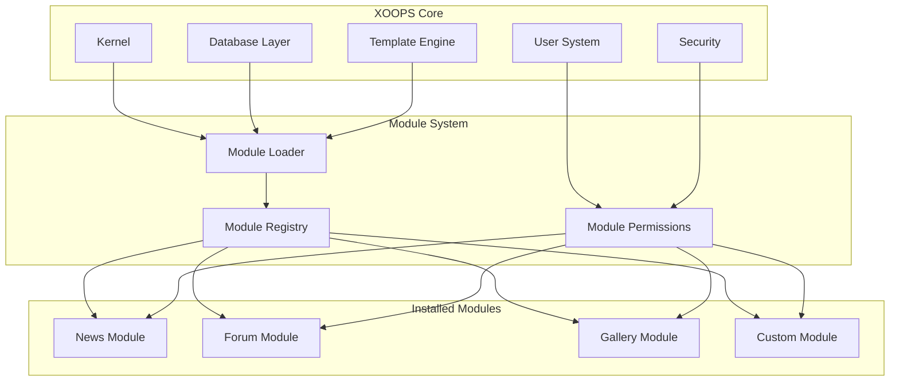
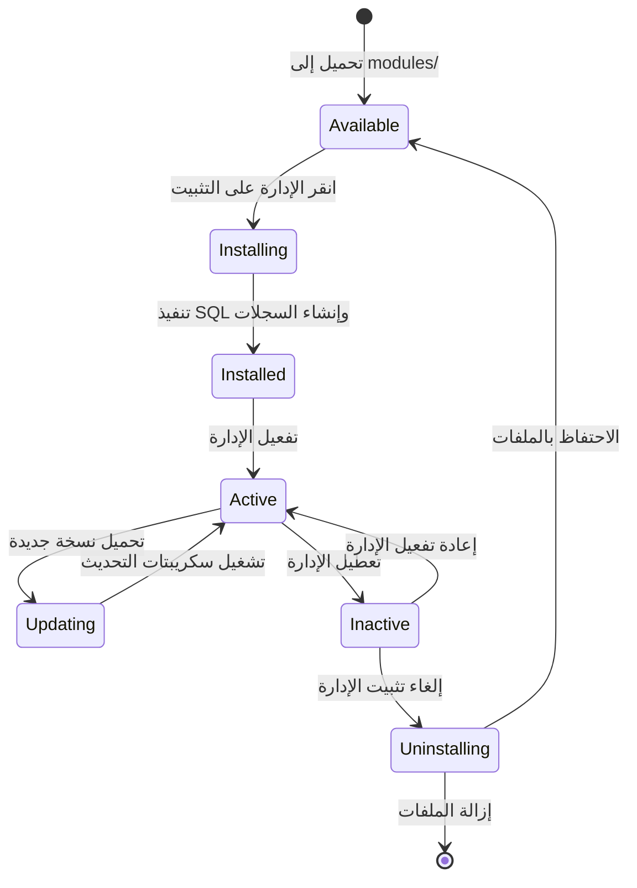

# ADR-001: العمارة المعيارية

> سجل قرار العمارة لفلسفة التصميم المعياري الأساسي لـ XOOPS.

---

## الحالة

**مقبول** - قرار أساسي منذ نشأة XOOPS

---

## السياق

كان XOOPS (نظام بوابة موجه بالكائنات القابل للتوسع) بحاجة إلى عمارة تسمح بـ:

1. السماح لمطورين الجهات الخارجية بتوسيع الوظائف
2. تمكين مسؤولي الموقع من التخصيص بدون الحاجة للبرمجة
3. دعم التطوير والتحديثات المستقلة
4. توفير العزل بين الميزات المختلفة
5. التوسع من المدونات البسيطة إلى البوابات المعقدة

كان المشهد الإعلامي في أوائل 2000s يقدم أنظمة أحادية الكتلة كانت صعبة التخصيص والتوسع.

---

## رسم تخطيطي للقرار



---

## القرار

سنقوم بتطبيق **عمارة معيارية** حيث:

### 1. النواة توفر البنية التحتية
- تجريد قاعدة البيانات
- المصادقة والأذونات
- عرض القوالب (Smarty)
- أدوات الأمان
- إنشاء النماذج
- أدوات مشتركة

### 2. الوحدات مستقلة بذاتها
كل وحدة:
- لها بنية مجلد خاصة بها
- تحتوي على فئاتها وقوالبها وSQL الخاصة بها
- تعرف تكوينها الخاص
- يمكن تثبيتها/إلغاء تثبيتها بشكل مستقل
- لها تتبع الإصدار

### 3. بنية الوحدة القياسية
```
modules/modulename/
├── admin/                  # واجهة الإدارة
│   ├── index.php
│   └── menu.php
├── class/                  # فئات PHP
├── include/                # ملفات الإدراج
├── language/               # الترجمات
├── sql/                    # مخطط قاعدة البيانات
├── templates/              # قوالب Smarty
├── blocks/                 # تعريفات الكتل
├── xoops_version.php       # بيان الوحدة
├── index.php               # نقطة الدخول
└── header.php              # تمهيد الوحدة
```

### 4. بيان الوحدة (xoops_version.php)
```php
<?php
$modversion['name']        = 'اسم الوحدة';
$modversion['version']     = '1.0.0';
$modversion['description'] = 'وصف الوحدة';
$modversion['dirname']     = basename(__DIR__);
$modversion['hasMain']     = 1;
$modversion['hasAdmin']    = 1;
$modversion['sqlfile']['mysql'] = 'sql/mysql.sql';
$modversion['tables']      = ['modulename_table1'];
$modversion['templates']   = [...];
$modversion['config']      = [...];
$modversion['blocks']      = [...];
```

### 5. اتصال الوحدات
- من خلال واجهات برمجية أساسية (معالجات، أحداث)
- علاقات قاعدة البيانات
- أنقاض التحميل المسبق
- الخدمات المشتركة

---

## دورة حياة الوحدة



---

## العواقب

### إيجابي

1. **القابلية للتوسع**: تم إنشاء آلاف الوحدات من قبل المجتمع
2. **الاستقلالية**: يمكن تطوير الوحدات بشكل منفصل
3. **المرونة**: يمكن للمواقع مزج ومطابقة الميزات
4. **قابلية الصيانة**: التحديثات لا تؤثر على الوحدات الأخرى
5. **السوق**: ظهر نظام بيئي للوحدات
6. **منحنى التعلم**: يتعلم المطورون نمط واحد

### سلبي

1. **النفقات**: كل وحدة لها تكلفة التمهيد
2. **التكرار**: قد يتكرر الكود المشترك
3. **التكامل**: تحتاج ميزات الوحدات المتقاطعة إلى تصميم حذر
4. **الإصدار**: يلزم إدارة توافق الوحدة
5. **اختلاف الجودة**: تختلف جودة الوحدات من جهات خارجية

### محايد

1. **قاعدة البيانات**: كل وحدة تدير جداولها الخاصة
2. **القوالب**: يجب أن تستوعب المظهر وحدات مختلفة
3. **التحديثات**: النواة والوحدات التحديث بشكل مستقل

---

## البدائل التي تمت دراستها

### 1. العمارة أحادية الكتلة
**مرفوضة** - جامدة جداً وصعبة التخصيص

### 2. عمارة الإضافات (بأسلوب WordPress)
**تم اعتمادها جزئياً** - توفر الكتل والأنقاض بحيث تعمل كالأنقاض داخل الوحدات

### 3. عمارة المكونات (بأسلوب Joomla)
**مرفوضة** - أكثر تعقيداً وأقل ودية للمطورين

### 4. الخدمات الدقيقة
**غير قابلة للتطبيق** - معقدة جداً لعصر الاستضافة المشتركة

---

## القرارات ذات الصلة

- ADR-002: الوصول إلى قاعدة البيانات الموجهة للكائنات
- ADR-003: محرك قالب Smarty
- ADR-005: نظام الأذونات

---

## المراجع

- تاريخ مشروع XOOPS
- أنماط عمارة تطبيقات PHP
- دراسات مقارنة CMS (2001-2005)

---

#xoops #architecture #adr #modules #design-decision
