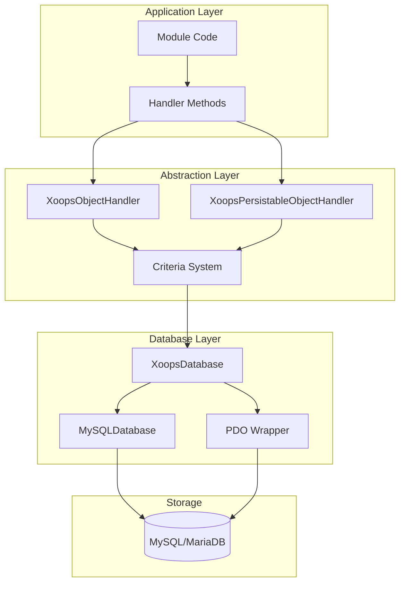
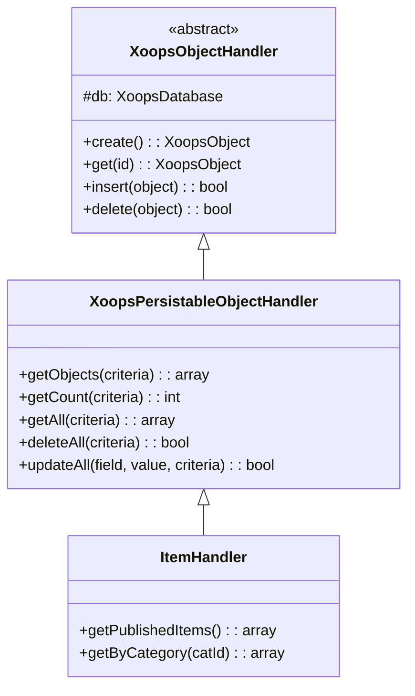
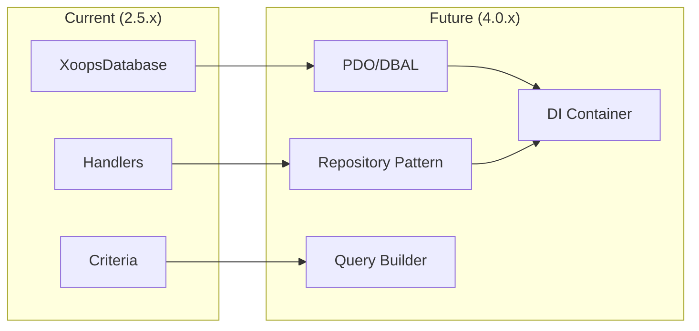

# ADR-002: تجريد قاعدة البيانات

> سجل قرار العمارة لنمط الوصول إلى قاعدة البيانات الموجهة للكائنات في XOOPS.

---

## الحالة

**مقبول** - النمط الأساسي منذ XOOPS 2.0

---

## السياق

احتاجت XOOPS إلى استراتيجية تفاعل قاعدة البيانات التي من شأنها:

1. تجريد بعيداً عن بناء جملة SQL الخاصة بقاعدة البيانات
2. توفير عمليات CRUD متسقة عبر جميع الوحدات
3. تمكين تعقيم البيانات والهروب التلقائي
4. دعم تغييرات محرك قاعدة البيانات المستقبلية
5. تبسيط العمليات الشائعة للمطورين

البدائل كانت:
- SQL الخام في جميع أنحاء قاعدة الرموز
- ORM كامل (العقيدة والنطق)
- تجريد خفيف الوزن مخصص

---

## رسم تخطيطي للقرار



---

## القرار

سنقوم بتطبيق **نمط المعالج** بـ:

### 1. XoopsObject - حاوية البيانات

كل كيان بيانات يمتد XoopsObject:

```php
class Item extends XoopsObject
{
    public function __construct()
    {
        $this->initVar('id', XOBJ_DTYPE_INT, null, false);
        $this->initVar('title', XOBJ_DTYPE_TXTBOX, '', true, 255);
        $this->initVar('content', XOBJ_DTYPE_TXTAREA, '', false);
        $this->initVar('status', XOBJ_DTYPE_INT, 0, false);
    }
}
```

### 2. المعالج - مدير العمليات

لكل كائن معالج مقابل:

```php
class ItemHandler extends XoopsPersistableObjectHandler
{
    public function __construct($db)
    {
        parent::__construct($db, 'mymodule_items', Item::class, 'id', 'title');
    }

    // الطرق الموروثة:
    // - create(), get(), insert(), delete()
    // - getObjects(), getCount(), getAll()
}
```

### 3. المعايير - منشئ الاستعلام

شروط الاستعلام الموجهة للكائنات:

```php
$criteria = new CriteriaCompo();
$criteria->add(new Criteria('status', 1));
$criteria->add(new Criteria('created', time() - 86400, '>='));
$criteria->setSort('created');
$criteria->setOrder('DESC');
$criteria->setLimit(10);

$items = $handler->getObjects($criteria);
```

---

## ثوابت نوع البيانات

```php
// أنواع متغيرات مع التعقيم التلقائي
XOBJ_DTYPE_INT       // عدد صحيح
XOBJ_DTYPE_TXTBOX    // نص سطر واحد (مهروب)
XOBJ_DTYPE_TXTAREA   // نص متعدد الأسطر (مهروب)
XOBJ_DTYPE_EMAIL     // التحقق من البريد الإلكتروني
XOBJ_DTYPE_URL       // التحقق من URL
XOBJ_DTYPE_ARRAY     // مصفوفة مسلسلة
XOBJ_DTYPE_OTHER     // لا معالجة
XOBJ_DTYPE_FLOAT     // عدد عشري
```

---

## وراثة المعالج



---

## العواقب

### إيجابي

1. **الاتساق**: جميع الوحدات تستخدم نفس الأنماط
2. **الأمان**: الهروب التلقائي يمنع حقن SQL
3. **البساطة**: العمليات الشائعة تتطلب حداً أدنى من الأكواد
4. **قابلية الصيانة**: التغييرات على طبقة قاعدة البيانات لا تؤثر على الوحدات
5. **قابلية الاختبار**: يمكن الاستهزاء بالمعالجات للاختبار

### سلبي

1. **الأداء**: نفقات عامة إضافية للتجريد
2. **التعقيد**: منحنى التعلم للمطورين الجدد
3. **القيود**: قد تحتاج الاستعلامات المعقدة إلى SQL الخام
4. **مشكلة N+1**: لا توجد تحميل حريص مدمج

### التخفيفات

- **الأداء**: ذاكرة تخزين مؤقت للكائنات التي يتم الوصول إليها بشكل متكرر
- **الاستعلامات المعقدة**: السماح بـ SQL الخام عند الحاجة
- **N+1**: استخدم getAll() مع معايير مناسبة

---

## التطور إلى XOOPS 4.0



خطط XOOPS 4.0:
- Doctrine DBAL لتجريد قاعدة البيانات
- نمط المستودع يحل محل المعالجات
- منشئ الاستعلام للاستعلامات المعقدة
- تكامل حاوية PSR-11 الكامل

---

## أمثلة الكود

### CRUD أساسي

```php
$helper = Helper::getInstance();
$handler = $helper->getHandler('Item');

// إنشاء
$item = $handler->create();
$item->setVar('title', 'عنصر جديد');
$handler->insert($item);

// قراءة
$item = $handler->get($id);
$title = $item->getVar('title');

// تحديث
$item->setVar('title', 'العنوان المحدث');
$handler->insert($item);

// حذف
$handler->delete($item);
```

### الاستعلام المعقد

```php
$criteria = new CriteriaCompo();
$criteria->add(new Criteria('status', 'published'));
$criteria->add(new Criteria('category_id', '(1,2,3)', 'IN'));
$criteria->add(new Criteria('created', strtotime('-30 days'), '>='));
$criteria->setSort('views');
$criteria->setOrder('DESC');
$criteria->setLimit(10);
$criteria->setStart(0);

$items = $handler->getObjects($criteria);
$total = $handler->getCount($criteria);
```

---

## القرارات ذات الصلة

- ADR-001: العمارة المعيارية
- ADR-003: محرك قالب Smarty

---

## المراجع

- Martin Fowler - أنماط عمارة تطبيقات المؤسسات
- مفاهيم التصميم يحركها المجال
- أنماط النسخة النشطة مقابل نمط بطاقة البيانات

---

#xoops #architecture #adr #database #handler #design-decision
