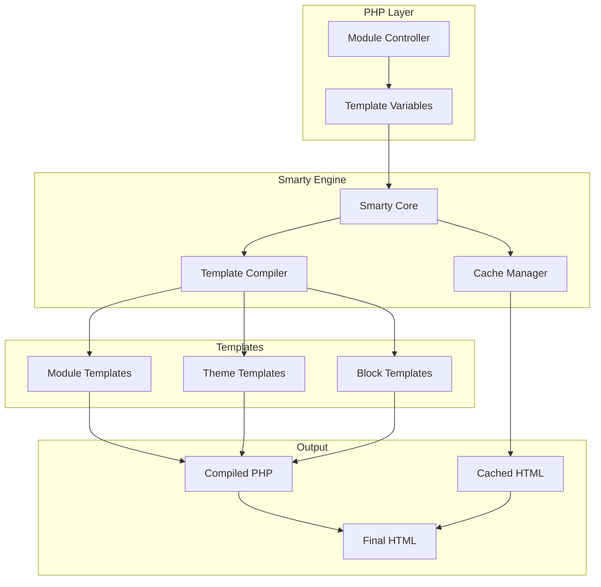
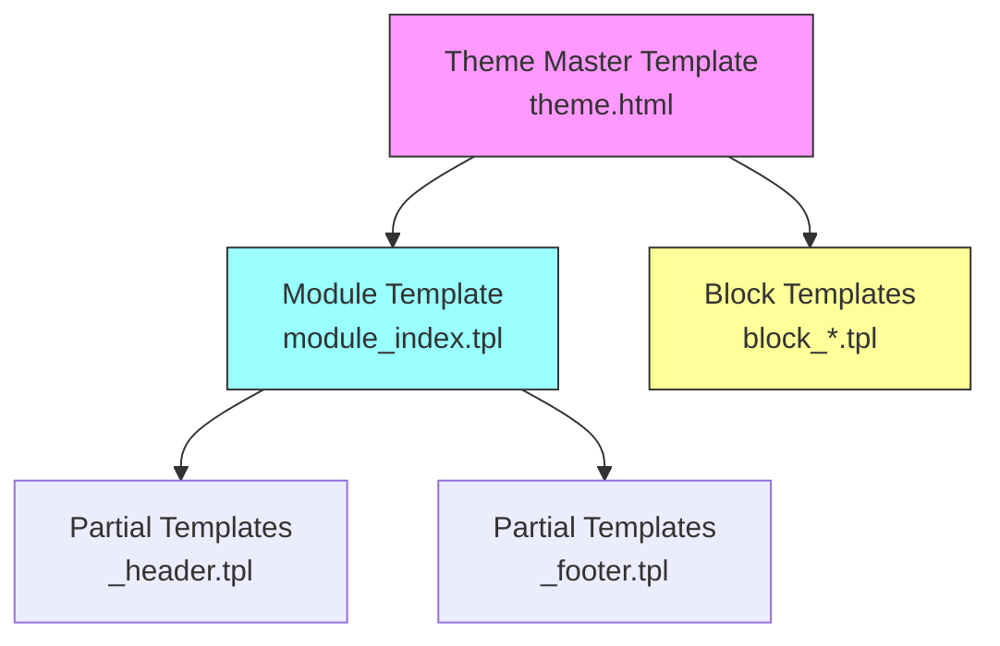
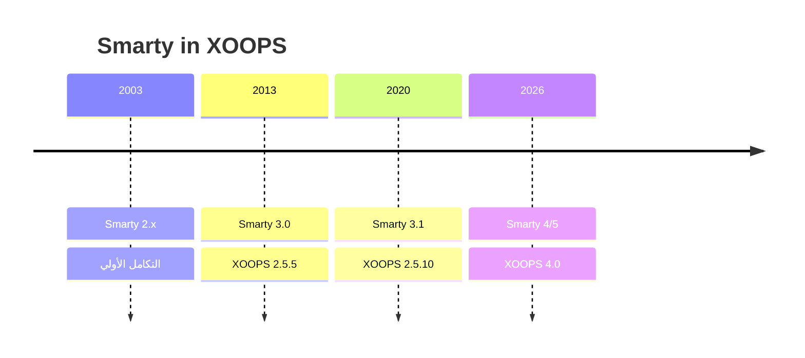

# ADR-003: محرك القالب (Smarty)

> سجل قرار العمارة لاعتماد محرك قالب Smarty في XOOPS.

---

## الحالة

**مقبول** - قرار أساسي منذ XOOPS 2.0

**متطور** - الهجرة إلى Smarty 4/5 مخطط لـ XOOPS 4.0

---

## السياق

احتاجت XOOPS إلى حل قالب يسمح بـ:

1. فصل العرض عن منطق الأعمال
2. السماح لمصممي المواضيع بالعمل بدون معرفة PHP
3. دعم وراثة القالب والإدراج
4. توفير التخزين المؤقت للأداء
5. تمكين القوالب القابلة للتخصيص من قبل المستخدم
6. دعم التدويل

---

## رسم تخطيطي للقرار



---

## القرار

سنستخدم **Smarty** كمحرك قالب لأنه:

### 1. فصل المخاوف

```php
// PHP (وحدة التحكم) - منطق العمل
$items = $itemHandler->getPublishedItems();
$xoopsTpl->assign('items', $items);

// Smarty (العرض) - العرض
// templates/items.tpl
```

```smarty
{* قالب Smarty - لا منطق PHP *}
<{foreach item=item from=$items}>
    <article>
        <h2><{$item.title}></h2>
        <p><{$item.summary}></p>
    </article>
<{/foreach}>
```

### 2. محددات XOOPS

يستخدم XOOPS `<{` و `}>` بدلاً من المعيار `{` `}`:

```smarty
{* Smarty القياسي *}
{$variable}

{* XOOPS Smarty - يتجنب تضارب JavaScript *}
<{$variable}>
```

### 3. هرمية القالب



### 4. تخزين القالب

- **قاعدة البيانات**: القوالب المخصصة المخزنة لقدرة الرجوع
- **نظام الملفات**: القوالب الأصلية في دلائل الوحدة
- **الذاكرة المؤقتة**: القوالب المجمعة للأداء

---

## إعدادات Smarty

```php
// تهيئة XOOPS Smarty
$xoopsTpl = new XoopsTpl();

// محددات مخصصة
$xoopsTpl->left_delim = '<{';
$xoopsTpl->right_delim = '}>';

// التخزين المؤقت
$xoopsTpl->caching = XOOPS_TEMPLATE_CACHE;
$xoopsTpl->cache_lifetime = 3600;

// الأمان
$xoopsTpl->security_policy = new Smarty_Security($xoopsTpl);
$xoopsTpl->security_policy->php_functions = [];
$xoopsTpl->security_policy->php_modifiers = ['escape', 'count'];
```

---

## ميزات القالب المستخدمة

### المتغيرات

```smarty
{* متغير بسيط *}
<{$title}>

{* خاصية الكائن *}
<{$item.title}>

{* مع معدل تعديل *}
<{$content|truncate:200:'...'}>

{* هروب الإخراج *}
<{$userInput|escape:'html'}>
```

### هياكل التحكم

```smarty
{* شرط *}
<{if $isAdmin}>
    <a href="admin.php">الإدارة</a>
<{elseif $isUser}>
    <a href="profile.php">الملف الشخصي</a>
<{else}>
    <a href="login.php">تسجيل الدخول</a>
<{/if}>

{* حلقة *}
<{foreach item=item from=$items name=itemloop}>
    <{$smarty.foreach.itemloop.index}>: <{$item.title}>
<{/foreach}>
```

### الإدراج

```smarty
{* إدراج قالب آخر *}
<{include file="db:mymodule_header.tpl"}>

{* إدراج مع متغيرات *}
<{include file="db:mymodule_item.tpl" item=$currentItem}>

{* إدراج من المظهر *}
<{include file="file:$theme_path/partials/sidebar.tpl"}>
```

---

## العواقب

### إيجابي

1. **ودية المصمم**: بناء جملة شبيه بـ HTML
2. **التخزين المؤقت**: التخزين المؤقت المدمج للقالب
3. **الأمان**: عزل كود PHP
4. **المرونة**: المعدلات والوظائف والمكونات الإضافية
5. **التخصيص**: يمكن للمستخدمين تعديل القوالب
6. **المجتمع**: نظام بيئي Smarty الكبير

### سلبي

1. **منحنى التعلم**: بناء جملة خاص بـ Smarty
2. **النفقات**: خطوة التجميع مطلوبة
3. **تصحيح الأخطاء**: قد تكون أخطاء القالب غامضة
4. **مشاكل الإصدار**: تغييرات فاصلة بين الإصدارات

### التخفيفات

- **التعلم**: وثائق شاملة
- **الأداء**: التخزين المؤقت العدواني
- **تصحيح الأخطاء**: وحدة التصحيح ورسائل الخطأ الواضحة
- **الإصدارات**: طبقة التوافق في XOOPS

---

## سجل الإصدارات



---

## الهجرة: Smarty 3 إلى 4/5

### تغييرات فاصلة

```smarty
{* Smarty 3 - مهمل *}
<{php}>echo date('Y');<{/php}>

{* Smarty 4+ - استخدام المعدلات أو الإسناد من PHP *}
<{$current_year}>

{* Smarty 3 - مهمل {section} *}
<{section name=i loop=$items}>
    <{$items[i].title}>
<{/section}>

{* Smarty 4+ - استخدام {foreach} *}
<{foreach $items as $item}>
    <{$item.title}>
<{/foreach}>
```

### طبقة التوافق

توفر XOOPS طبقة توافق للانتقالات السلسة:

```php
// XoopsTpl يمتد Smarty مع طرق التوافق
class XoopsTpl extends Smarty
{
    public function assign($tpl_var, $value = null)
    {
        // يتعامل مع بناء جملة Smarty 3 و 4
        return parent::assign($tpl_var, $value);
    }
}
```

---

## البدائل التي تمت دراستها

### 1. Twig
**المميزات**: حديثة وحول نظام Symfony
**العيوب**: بناء جملة مختلفة وجهد الهجرة
**القرار**: خيار مستقبلي محتمل لـ XOOPS 3.x

### 2. Blade (Laravel)
**المميزات**: بناء جملة نظيف وشهير
**العيوب**: خاص بـ Laravel
**القرار**: غير مناسب للاستخدام المستقل

### 3. قوالب PHP الأصلية
**المميزات**: لا منحنى تعلم وسريعة
**العيوب**: مخاطر أمنية وعدم وجود فصل
**القرار**: مرفوضة لقابلية الصيانة

---

## القرارات ذات الصلة

- ADR-001: العمارة المعيارية
- ADR-002: تجريد قاعدة البيانات

---

## المراجع

- Smarty Documentation: https://www.smarty.net/docs/en/
- دليل نظام قوالب XOOPS
- نمط MVC في تطبيقات الويب

---

#xoops #architecture #adr #smarty #templates #design-decision
