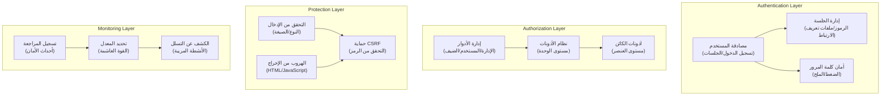

# ADR-004: عمارة نظام الأمان

> عمارة أمان شاملة لـ XOOPS CMS الحماية من التهديدات الحديثة.

---

## الحالة

**مقبول** - طبقة الأمان الأساسية منذ XOOPS 2.5

---

## السياق

### بيان المشكلة

يحتاج XOOPS إلى نظام أمان قوي:

1. **الحماية من الثغرات الويب الشائعة** (أعلى 10 OWASP)
2. **التحكم في الأذونات الدقيقة** عبر الوحدات
3. **تمكين المصادقة الآمنة** بمعايير حديثة
4. **منع انتهاكات البيانات** والوصول غير المصرح
5. **دعم التحكم في الوصول متعدد المستويات** (إدارة وممراجع ومستخدم وضيف)
6. **الدمج مع جميع الوحدات** بسلاسة

### التهديدات الحالية

الهجمات الويب الحديثة تشمل:

- **حقن SQL** - SQL خبيث في إدخال المستخدم
- **XSS (البرمجة النصية للموقع المتقاطع)** - JavaScript المحقون في الصفحات
- **CSRF (طلب التزوير عبر الموقع)** - تقديم النماذج غير المصرح بها
- **تجاوز المصادقة** - التعامل الضعيف مع الجلسة / كلمة المرور
- **تجاوز التخويل** - تصعيد الامتياز
- **تعريض البيانات** - البيانات الحساسة في URL أو السجلات أو الذاكرة المؤقتة

### متطلبات أمان XOOPS

1. مصادقة المستخدم وإدارة الجلسة
2. التحكم في الوصول المبني على الدور (RBAC)
3. نظام الأذونات للوحدات والكائنات
4. التحقق من الإدخال والهروب من الإخراج
5. الحماية من الهجمات الشائعة
6. تسجيل مراجعة أحداث الأمان
7. التعامل الآمن مع كلمة المرور
8. حماية رمز CSRF

---

## القرار

### عمارة الأمان الأساسية



---

## مكونات الأمان

### 1. نظام المصادقة

**عملية تسجيل دخول المستخدم:**

```php
<?php
// 1. التحقق من بيانات الاعتماد
$user = $userHandler->findByLogin($username);
if (!$user || !password_verify($password, $user->getVar('pass'))) {
    throw new AuthenticationException('بيانات اعتماد غير صحيحة');
}

// 2. التحقق من تفعيل الحساب
if (!$user->getVar('uactive')) {
    throw new AuthenticationException('الحساب غير مفعل');
}

// 3. إنشاء جلسة آمنة
session_regenerate_id(true);
$_SESSION['uid'] = $user->getVar('uid');
$_SESSION['token'] = bin2hex(random_bytes(32));
$_SESSION['created'] = time();

// 4. تسجيل تسجيل الدخول
$this->auditLog('USER_LOGIN', $user->getVar('uid'));
```

**أمان كلمة المرور:**

```php
<?php
// استخدم password_hash وليس MD5 أو SHA1
$hashed = password_hash($password, PASSWORD_BCRYPT, [
    'cost' => 12, // تكلفة عالية = القوة الغاشمة البطيئة
]);

// التحقق من كلمة المرور
if (!password_verify($inputPassword, $hashed)) {
    throw new Exception('كلمة مرور غير صحيحة');
}

// إعادة تجزئة إذا تغيرت الخوارزمية أو التكلفة
if (password_needs_rehash($hashed, PASSWORD_BCRYPT, ['cost' => 12])) {
    $newHash = password_hash($password, PASSWORD_BCRYPT, ['cost' => 12]);
    $user->setVar('pass', $newHash);
    $userHandler->insert($user);
}
```

---

## العواقب

### التأثيرات الإيجابية

1. **الحماية الشاملة** - تغطي فئات الثغرات الرئيسية
2. **الأمان الطبقي** - طبقات دفاع متعددة
3. **RBAC مرن** - التحكم الدقيق في الأذونات
4. **مسار التدقيق** - تتبع أحداث الأمان
5. **معيار الصناعة** - يتوافق مع توصيات OWASP
6. **تكامل الوحدة** - سهولة استخدام واجهات برمجية الأمان

### التأثيرات السلبية

1. **التعقيد** - مزيد من الأكواد والتكوين مطلوب
2. **الأداء** - الضغط والتحقق يضيف نفقات إضافية
3. **تجربة المستخدم** - الأمان أحياناً غير مريح
4. **الصيانة** - يتطلب تحديثات أمان منتظمة
5. **التدريب المطلوب** - يجب على المطورين اتباع الممارسات

---

## القرارات ذات الصلة

- ADR-001: العمارة المعيارية - الوحدات تطبق الأمان
- ADR-005: نظام أذونات الوحدة
- ADR-006: المصادقة متعددة العوامل (مستقبلية)

---

## المراجع

### معايير الأمان

- [OWASP Top 10](https://owasp.org/www-project-top-ten/)
- [إطار عمل NIST للأمن السيبراني](https://www.nist.gov/cyberframework)
- [CWE Top 25](https://cwe.mitre.org/top25/)

---

#xoops #adr #security #architecture #authentication #authorization #rbac
