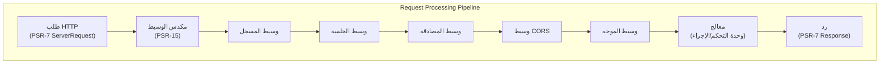

# ADR-005: نمط وسيط PSR-15 لـ XOOPS 4.0

> اعتماد معالجات طلب خادم HTTP المتوافقة مع PSR-15 (الوسيط) لتحسين خط أنابيب معالجة الطلبات.

:::caution[اقتراح XOOPS 4.0 — غير متوفر في 2.5.x]
يصف ADR هذا **عمارة مقترحة لإصدار XOOPS 4.0**. وسيط PSR-15 **غير متوفر في XOOPS 2.5.x**. تستخدم الوحدات الحالية 2.5.x نمط وحدة التحكم في الصفحة مع تمهيد `mainfile.php`. انظر إلى عمارة XOOPS لدورة حياة الطلب الحالية.
:::

---

## الحالة

**مقترح** - قيد التقييم لإصدار XOOPS 4.0

---

## السياق

### النهج الحالي

يستخدم XOOPS 2.5 نهج معالجة الطلبات أحادي الكتلة:

```php
// الحالي: المعالجة المتسلسلة
require_once 'mainfile.php';
// → تهيئة النواة
// → مصادقة المستخدم
// → تحميل الوحدة
// → عرض الصفحة

// كل شيء في تدفق واحد ومخاوف مختلطة
```

### المشاكل مع النهج الحالي

1. **مخاوف مختلطة** - المصادقة والتسجيل والتوجيه متشابكة
2. **صعوبة الاختبار** - يصعب اختبار خطوات معالجة الطلب بشكل فردي
3. **صعوبة التوسع** - يمكن للوحدات فقط خطاف عبر التحميل المسبق/الأحداث
4. **فصل ضعيف** - منطق معالجة الطلب متناثر في جميع أنحاء قاعدة الرموز
5. **غير قابل للتأليف** - لا يمكن سهولة ربط أو إعادة ترتيب خطوات المعالجة

### ما هو وسيط PSR-15؟

يحدد PSR-15 واجهة معيارية لوسيط HTTP:

```php
<?php
interface RequestHandlerInterface {
    public function handle(ServerRequestInterface $request): ResponseInterface;
}

interface MiddlewareInterface {
    public function process(
        ServerRequestInterface $request,
        RequestHandlerInterface $handler
    ): ResponseInterface;
}
```

**سلسلة الوسيط:**

```
الطلب
  ↓
[المسجل] → يسجل الطلب
  ↓
[المصادقة] → التحقق من جلسة المستخدم
  ↓
[CORS] → يتحقق من عبر الأصول
  ↓
[الموجه] → يوزع إلى معالج
  ↓
[المعالج] → ينشئ الرد
  ↓
الرد
```

---

## القرار

### اعتماد مكدس وسيط PSR-15 لـ XOOPS 4.0

تطبيق خط أنابيب معالجة الطلب القائمة على الوسيط بعد معيار PSR-15.

### نظرة عامة على العمارة



---

## العواقب

### التأثيرات الإيجابية

1. **فصل المخاوف** - كل وسيط يتعامل مع مسؤولية واحدة
2. **قابلية الاختبار** - سهولة اختبار وحدة المكونات الفردية
3. **القابلية للتأليف** - يمكن خلط الوسيط وإعادة ترتيبه
4. **التوافق مع المعايير** - يستخدم معايير PSR-15 و PSR-7
5. **القابلية للتوسع** - يمكن للوحدات بسهولة إضافة وسيط مخصص
6. **التصحيح** - تدفق طلب واضح من خلال خط الأنابيب
7. **الأداء** - يمكن تحسين طبقات وسيط محددة
8. **التشغيل البيني** - يمكن استخدام وسيط PSR-15 من جهات خارجية

### التأثيرات السلبية

1. **منحنى التعلم** - يجب على المطورين فهم PSR-15
2. **النفقات العامة للأداء** - المزيد من استدعاءات الدالة في خط الأنابيب
3. **التعقيد** - المزيد من الأجزاء المتحركة من النهج أحادي الكتلة
4. **جهد الهجرة** - يتطلب إعادة صياغة الكود الموجود
5. **التبعيات** - يتطلب مكتبة HTTP متوافقة مع PSR-7

---

## الممارسات الأفضل للوسيط

### افعل

- اجعل الوسيط مركز على (مسؤولية واحدة)
- استخدم عدم القابلية للتغيير (إنشاء طلب/رد جديد)
- التعامل مع الأخطاء برشاقة
- توثيق التبعيات
- أضف تلميحات نوع
- اختبر الوسيط
- استخدم واجهات PSR-15 القياسية

### لا تفعل

- لا تعدل كائنات الطلب/الرد المشتركة
- لا تصل إلى العوامل الشاملة بشكل مباشر
- لا تنشئ تبعيات على ترتيب الوسيط
- لا تقبض على جميع الاستثناءات
- لا تخلط منطق العمل مع الوسيط
- لا تجعل الوسيط يفعل الكثير

---

## القرارات ذات الصلة

- ADR-001: العمارة المعيارية - الأساس
- ADR-004: نظام الأمان - يستخدم الوسيط للمصادقة
- ADR-006: حاوية الحقن - يمكن استخدام الوسيط

---

## المراجع

### معايير PSR

- [PSR-7: واجهة رسالة HTTP](https://www.php-fig.org/psr/psr-7/)
- [PSR-15: معالجات طلب خادم HTTP](https://www.php-fig.org/psr/psr-15/)

---

#xoops #adr #psr-15 #middleware #architecture #psr-7
