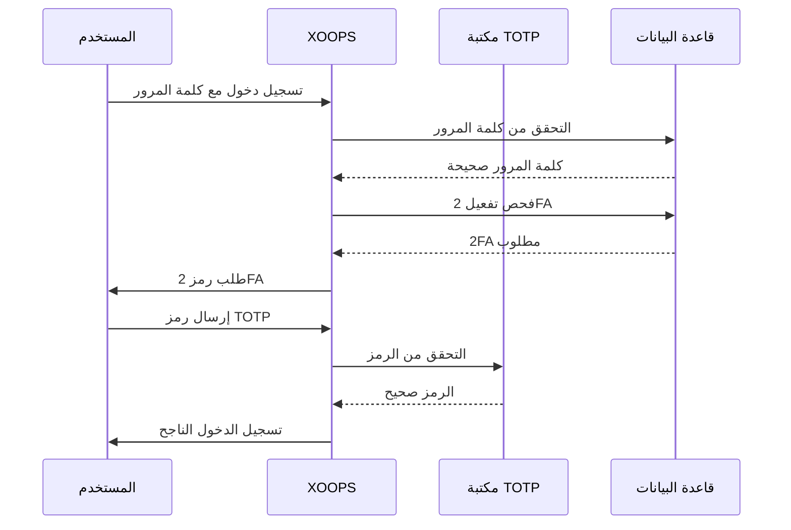

## الحالة

مقترح

## السياق

يحتاج XOOPS إلى تعزيز الأمان لمصادقة المستخدم. توفر المصادقة متعددة العوامل (2FA) طبقة أمان إضافية تتجاوز كلمات المرور وحماية الحسابات حتى إذا تم اختراق كلمات المرور.

الاعتبارات الرئيسية:
- التوافق للخلف مع المصادقة الموجودة
- دعم طرق 2FA متعددة
- تجربة المستخدم أثناء الإعداد وتسجيل الدخول
- آليات الاسترجاع للأجهزة المفقودة
- التكامل مع نظام الأذونات الموجود

## القرار

سنقوم بتطبيق TOTP (كلمة مرور لمرة واحدة قائمة على الوقت) كطريقة 2FA الأساسية مع دعم رموز النسخ الاحتياطي.

### نهج التطبيق



### مخطط قاعدة البيانات

```sql
CREATE TABLE `{PREFIX}_users_2fa` (
    `user_id` INT(11) NOT NULL,
    `secret` VARCHAR(32) NOT NULL,
    `enabled` TINYINT(1) DEFAULT 0,
    `backup_codes` TEXT,
    `last_used` INT(11),
    `created` INT(11) NOT NULL,
    PRIMARY KEY (`user_id`),
    FOREIGN KEY (`user_id`) REFERENCES `{PREFIX}_users`(`uid`)
);
```

### واجهة الخدمة

```php
interface TwoFactorAuthInterface
{
    public function enable(int $userId): TwoFactorSetup;
    public function disable(int $userId): void;
    public function verify(int $userId, string $code): bool;
    public function generateBackupCodes(int $userId): array;
    public function isEnabled(int $userId): bool;
}
```

---

## العواقب

### إيجابي

- أمان الحساب محسّن بشكل كبير
- توافق TOTP القياسي (Google Authenticator وغيره)
- رموز النسخ الاحتياطي تمنع قفل الحساب
- اختياري لكل مستخدم - لا يفرض الاعتماد
- يسمح تكامل وسيط PSR-15 بدمج نظيف

### سلبي

- خطوة تسجيل دخول إضافية تؤثر على تجربة المستخدم
- يجب على المستخدمين إدارة تطبيقات المصادقة
- الأجهزة المفقودة تتطلب عملية استرجاع
- تخزين قاعدة البيانات والاستعلامات الإضافية
- يتطلب اعتماد مكتبة التشفير

---

## المراجع

- [RFC 6238 - TOTP](https://tools.ietf.org/html/rfc6238)
- [تنسيق مفتاح Google Authenticator](https://github.com/google/google-authenticator/wiki/Key-Uri-Format)
