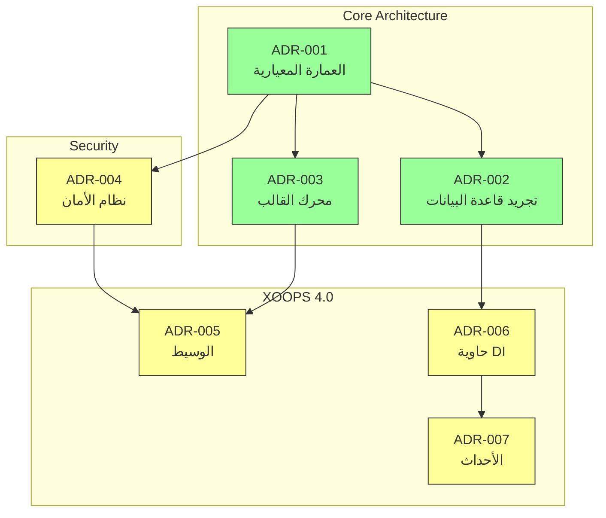
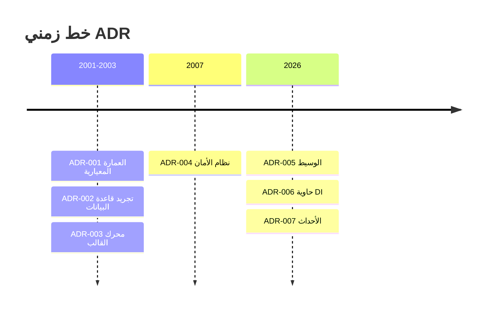

# 📋 فهرس سجلات قرارات العمارة

> فهرس شامل للقرارات المعمارية التي شكلت XOOPS CMS.

---

## ما هي ADRs؟

توثق سجلات قرارات العمارة (ADRs) القرارات المعمارية المهمة التي تم اتخاذها أثناء تطوير XOOPS. تلتقط السياق والقرار والعواقب لكل خيار وتوفر سياق تاريخي قيم للمحافظين والمساهمين.

---

## أسطورة حالة ADR

| الحالة | المعنى |
|--------|--------|
| **مقترح** | قيد النقاش وليس مقبولاً بعد |
| **مقبول** | تم اعتماد القرار |
| **مهمل** | لم تعد الموصى به |
| **مستبدل** | تم استبداله بـ ADR آخر |

---

## ADRs الحالية

### قرارات أساسية

| ADR | العنوان | الحالة | التأثير |
|-----|--------|--------|--------|
| ADR-001 | العمارة المعيارية | مقبول | النواة |
| ADR-002 | الوصول إلى قاعدة البيانات الموجهة للكائنات | مقبول | النواة |
| ADR-003 | محرك قالب Smarty | مقبول | النواة |

### ADRs المخطط لها (XOOPS 4.0)

| ADR | العنوان | الحالة | التأثير |
|-----|--------|--------|--------|
| ADR-004 | تصميم نظام الأمان | مقترح | الأمان |
| ADR-005 | وسيط PSR-15 | مقترح | العمارة |
| ADR-006 | حاوية الحقن | مقترح | العمارة |
| ADR-007 | إعادة تصميم نظام الأحداث | مقترح | العمارة |

---

## علاقات ADR



---

## الخط الزمني



---

## إنشاء ADRs جديدة

عند اقتراح قرار معماري جديد:

1. نسخ قالب ADR
2. ملء جميع الأقسام
3. تقديم كطلب سحب
4. النقاش في مشاكل GitHub
5. تحديث الحالة بعد القرار

### هيكل قالب ADR

```markdown
# ADR-XXX: العنوان

## الحالة
مقترح | مقبول | مهمل | مستبدل

## السياق
ما هي المشكلة التي تحفز هذا القرار؟

## القرار
ما هو التغيير الذي نقترحه؟

## العواقب
ما الذي يصبح أسهل أو أصعب نتيجة لذلك؟

## البدائل التي تمت دراستها
ما هي الخيارات الأخرى التي تم تقييمها؟
```

---

## 🔗 التوثيق ذات الصلة

- المفاهيم الأساسية
- إرشادات المساهمة
- خارطة طريق XOOPS 4.0

---

#xoops #adr #architecture #index #decisions
