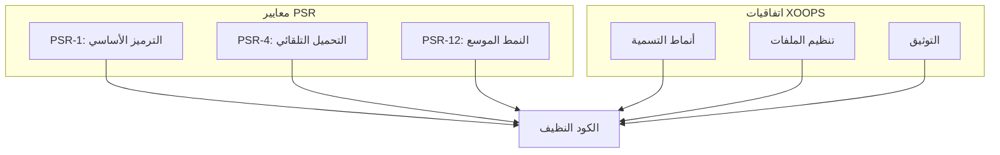

# معايير PHP

> يتبع XOOPS معايير PSR-1 و PSR-4 و PSR-12 مع اتفاقيات خاصة بـ XOOPS.

---

## نظرة عامة على المعايير



---

## بنية الملفات

### علامات PHP

```php
<?php
// استخدم دائماً علامات PHP الكاملة وليس العلامات القصيرة
// حذف علامة الإغلاق ?> في ملفات PHP النقية

declare(strict_types=1);

namespace XoopsModules\MyModule;

// الكود هنا...
```

### رأس الملف

```php
<?php

declare(strict_types=1);

/**
 * XOOPS - نظام إدارة محتوى PHP
 *
 * @package    XoopsModules\MyModule
 * @subpackage Class
 * @author     اسمك <email@example.com>
 * @copyright  2026 مشروع XOOPS
 * @license    GPL-2.0-or-later
 * @link       https://xoops.org
 */

namespace XoopsModules\MyModule;

use XoopsObject;
use XoopsPersistableObjectHandler;
```

---

## اتفاقيات التسمية

### الفئات

```php
// PascalCase لأسماء الفئات
class ItemHandler extends XoopsPersistableObjectHandler
{
    // ...
}

// الواجهات تنتهي بـ "Interface"
interface RepositoryInterface
{
    public function find(int $id): ?object;
}

// السمات تنتهي بـ "Trait"
trait TimestampTrait
{
    public function getCreatedAt(): \DateTimeInterface
    {
        // ...
    }
}

// الفئات المجردة تبدأ بـ "Abstract"
abstract class AbstractEntity
{
    // ...
}
```

### الطرق والدوال

```php
// camelCase للطرق
public function getActiveItems(): array
{
    // ...
}

// أفعال لطرق العمل
public function createItem(array $data): Item
public function updateItem(int $id, array $data): bool
public function deleteItem(int $id): bool
public function findById(int $id): ?Item
public function hasPermission(string $permission): bool
public function isActive(): bool
public function canEdit(): bool
```

### المتغيرات والخصائص

```php
class Item
{
    // camelCase للخصائص
    private int $itemId;
    private string $itemTitle;
    private bool $isPublished;
    private array $categoryIds;

    // camelCase للمتغيرات
    public function process(): void
    {
        $itemCount = 0;
        $activeItems = [];
        $isValid = true;
    }
}
```

### الثوابت

```php
// UPPER_SNAKE_CASE للثوابت
class Config
{
    public const DEFAULT_ITEMS_PER_PAGE = 10;
    public const MAX_UPLOAD_SIZE = 10485760;
    public const CACHE_LIFETIME = 3600;
}

// أو استدعاءات define()
define('XOOPS_ROOT_PATH', '/path/to/xoops');
define('MYMODULE_VERSION', '1.0.0');
```

---

## بنية الفئة

```php
<?php

declare(strict_types=1);

namespace XoopsModules\MyModule;

use XoopsDatabase;
use XoopsPersistableObjectHandler;

/**
 * معالج كائنات العنصر
 *
 * @package XoopsModules\MyModule
 */
class ItemHandler extends XoopsPersistableObjectHandler
{
    // 1. الثوابت
    public const TABLE_NAME = 'mymodule_items';

    // 2. الخصائص (ترتيب الرؤية: عام وحمائي وخاص)
    public int $defaultLimit = 10;

    protected string $table;

    private XoopsDatabase $db;

    // 3. البناء
    public function __construct(?XoopsDatabase $db = null)
    {
        $this->db = $db ?? \XoopsDatabaseFactory::getDatabaseConnection();
        parent::__construct($this->db, self::TABLE_NAME, Item::class, 'id', 'title');
    }

    // 4. الطرق العامة
    public function getPublishedItems(int $limit = 10): array
    {
        $criteria = new \CriteriaCompo();
        $criteria->add(new \Criteria('status', 'published'));
        $criteria->setLimit($limit);

        return $this->getObjects($criteria);
    }

    // 5. الطرق المحمية
    protected function validateItem(Item $item): bool
    {
        return true;
    }

    // 6. الطرق الخاصة
    private function sanitizeInput(string $input): string
    {
        return htmlspecialchars($input, ENT_QUOTES, 'UTF-8');
    }
}
```

---

## قواعد التنسيق

### المحاذاة والمسافات

```php
// استخدم 4 مسافات للمحاذاة (وليس علامات التبويب)
class Example
{
    public function method(): void
    {
        if ($condition) {
            // 4 مسافات
            foreach ($items as $item) {
                // 8 مسافات
                $this->process($item);
            }
        }
    }
}

// سطر فارغ واحد بين الطرق
public function methodOne(): void
{
    // ...
}

public function methodTwo(): void
{
    // ...
}
```

### طول السطر

```php
// الحد الأقصى 120 حرف لكل سطر
// قسم الأسطر الطويلة بشكل منطقي

// استدعاءات الطريقة الطويلة
$result = $this->someHandler->processComplexOperation(
    $parameter1,
    $parameter2,
    $parameter3,
    $parameter4
);

// المصفوفات الطويلة
$config = [
    'option1' => 'value1',
    'option2' => 'value2',
    'option3' => 'value3',
];

// الشروط الطويلة
if ($condition1
    && $condition2
    && $condition3
) {
    // ...
}
```

---

## إعلانات النوع

```php
<?php

declare(strict_types=1);

class TypeExample
{
    // أنواع الخصائص (PHP 7.4+)
    private int $id;
    private string $title;
    private ?string $description = null;
    private array $tags = [];
    private bool $isActive = false;

    // معاملات مكتوبة
    public function __construct(
        int $id,
        string $title,
        ?string $description = null
    ) {
        $this->id = $id;
        $this->title = $title;
        $this->description = $description;
    }

    // إعلانات نوع الرجوع
    public function getId(): int
    {
        return $this->id;
    }

    public function getTitle(): string
    {
        return $this->title;
    }

    // نوع الرجوع الفارغ
    public function setTitle(string $title): void
    {
        $this->title = $title;
    }

    // أنواع الاتحاد (PHP 8.0+)
    public function getValue(): int|string
    {
        return $this->value;
    }
}
```

---

## التوثيق

### تعليق DocBlock للفئة

```php
/**
 * يتعامل مع عمليات CRUD لكيانات المقالة
 *
 * يوفر هذا المعالج طرقاً لإنشاء وقراءة وتحديث
 * وحذف المقالات من قاعدة البيانات.
 *
 * @package    XoopsModules\Publisher
 * @subpackage Handler
 * @author     فريق تطوير XOOPS
 * @since      1.0.0
 */
class ArticleHandler extends XoopsPersistableObjectHandler
{
```

### تعليق DocBlock للطريقة

```php
/**
 * جلب المقالات حسب الفئة
 *
 * يجلب المقالات المنشورة التابعة لفئة محددة،
 * مرتبة حسب تاريخ الإنشاء تنازلياً.
 *
 * @param int  $categoryId معرف الفئة
 * @param int  $limit      الحد الأقصى للمقالات المراد إرجاعها
 * @param int  $offset     بداية الترقيم للصفحات
 * @param bool $published  إرجاع المقالات المنشورة فقط
 *
 * @return Article[] مصفوفة من كائنات المقالة
 *
 * @throws \InvalidArgumentException إذا كان معرف الفئة غير صحيح
 *
 * @since 1.0.0
 */
public function getByCategory(
    int $categoryId,
    int $limit = 10,
    int $offset = 0,
    bool $published = true
): array {
```

---

## أدوات

### تكوين PHP CS Fixer

```php
// .php-cs-fixer.php
<?php

$finder = PhpCsFixer\Finder::create()
    ->in(__DIR__ . '/class')
    ->in(__DIR__ . '/src');

return (new PhpCsFixer\Config())
    ->setRules([
        '@PSR12' => true,
        'array_syntax' => ['syntax' => 'short'],
        'ordered_imports' => ['sort_algorithm' => 'alpha'],
        'no_unused_imports' => true,
        'declare_strict_types' => true,
    ])
    ->setFinder($finder);
```

---

## التوثيق ذات الصلة

- معايير JavaScript
- تنظيم الأكواد
- إرشادات طلب السحب

---

#xoops #php #coding-standards #psr #best-practices
