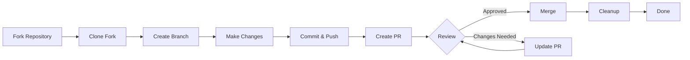

> يرشدك هذا الدليل خلال العملية الكاملة للمساهمة في XOOPS، من الإعداد الأولي إلى دمج طلب السحب.

---

## المتطلبات الأساسية

قبل أن تبدأ المساهمة، تأكد من أن لديك:

- **Git** مثبت ومكون
- **حساب GitHub** (مجاني)
- **PHP 7.4+** لتطوير XOOPS
- **Composer** لإدارة الاعتماديات
- معرفة أساسية بسير عمل Git
- الإلمام بقواعس السلوك

---

## الخطوة 1: نسخ المستودع

### على واجهة GitHub الويب

1. انتقل إلى المستودع (مثل `XOOPS/XoopsCore27`)
2. انقر على زر **Fork** في الزاوية العلوية اليمنى
3. اختر مكان النسخ (حسابك الشخصي)
4. انتظر حتى يكتمل النسخ

### لماذا النسخ؟

- تحصل على نسختك الخاصة للعمل عليها
- لا يحتاج المسؤولون إلى إدارة فروع كثيرة
- لديك السيطرة الكاملة على نسختك
- تشير طلبات السحب إلى نسختك والمستودع الأصلي

---

## الخطوة 2: استنسخ نسختك محلياً

```bash
# استنسخ نسختك (استبدل YOUR_USERNAME)
git clone https://github.com/YOUR_USERNAME/XoopsCore27.git
cd XoopsCore27

# أضف upstream remote لتتبع المستودع الأصلي
git remote add upstream https://github.com/XOOPS/XoopsCore27.git

# تحقق من أن remotes تم ضبطها بشكل صحيح
git remote -v
# origin    https://github.com/YOUR_USERNAME/XoopsCore27.git (fetch)
# origin    https://github.com/YOUR_USERNAME/XoopsCore27.git (push)
# upstream  https://github.com/XOOPS/XoopsCore27.git (fetch)
# upstream  https://github.com/XOOPS/XoopsCore27.git (nofetch)
```

---

## الخطوة 3: إعداد بيئة التطوير

### تثبيت الاعتماديات

```bash
# تثبيت اعتماديات Composer
composer install

# تثبيت اعتماديات التطوير
composer install --dev

# لتطوير الوحدات النمطية
cd modules/mymodule
composer install
```

### تكوين Git

```bash
# اضبط هويتك في Git
git config user.name "Your Name"
git config user.email "your.email@example.com"

# اختياري: اضبط إعدادات Git العالمية
git config --global user.name "Your Name"
git config --global user.email "your.email@example.com"
```

### قم بتشغيل الاختبارات

```bash
# تأكد من أن الاختبارات تمر بحالة نظيفة
./vendor/bin/phpunit

# قم بتشغيل مجموعة اختبارات محددة
./vendor/bin/phpunit --testsuite unit
```

---

## الخطوة 4: إنشاء فرع الميزة

### اتفاقية تسمية الفروع

اتبع هذا النمط: `<type>/<description>`

**الأنواع:**
- `feature/` - ميزة جديدة
- `fix/` - إصلاح خطأ
- `docs/` - التوثيق فقط
- `refactor/` - إعادة هيكلة الأكواد
- `test/` - إضافة الاختبارات
- `chore/` - الصيانة والأدوات

**أمثلة:**
```bash
# فرع الميزة
git checkout -b feature/add-two-factor-auth

# فرع إصلاح الأخطاء
git checkout -b fix/prevent-xss-in-forms

# فرع التوثيق
git checkout -b docs/update-api-guide

# قم دائماً بالفرع من upstream/main (أو develop)
git checkout -b feature/my-feature upstream/main
```

### حافظ على تحديث الفرع

```bash
# قبل البدء في العمل، قم بالمزامنة مع upstream
git fetch upstream
git merge upstream/main

# لاحقاً، إذا تغير upstream
git fetch upstream
git rebase upstream/main
```

---

## الخطوة 5: قم بإجراء التغييرات

### ممارسات التطوير

1. **اكتب الأكواد** باتباع معايير PHP
2. **اكتب الاختبارات** للوظائف الجديدة
3. **حدّث التوثيق** إذا لزم الأمر
4. **قم بتشغيل أدوات التدقيق** وأدوات تنسيق الأكواد

### فحوصات جودة الأكواد

```bash
# قم بتشغيل جميع الاختبارات
./vendor/bin/phpunit

# قم بالتشغيل مع التغطية
./vendor/bin/phpunit --coverage-html coverage/

# قم بتشغيل PHP CS Fixer
./vendor/bin/php-cs-fixer fix --dry-run

# قم بتشغيل تحليل PHPStan الثابت
./vendor/bin/phpstan analyse class/ src/
```

### قم بحفظ التغييرات الجيدة

```bash
# تحقق مما قمت بتغييره
git status
git diff

# رتب الملفات المحددة
git add class/MyClass.php
git add tests/MyClassTest.php

# أو رتب جميع التغييرات
git add .

# قم بحفظ التغييرات برسالة وصفية
git commit -m "feat(auth): add two-factor authentication support"
```

---

## الخطوة 6: احتفظ بالفرع متزامناً

أثناء العمل على ميزتك، قد يتقدم الفرع الرئيسي:

```bash
# اجلب أحدث التغييرات من upstream
git fetch upstream

# الخيار أ: Rebase (مفضل للحصول على سجل نظيف)
git rebase upstream/main

# الخيار ب: Merge (أبسط لكن يضيف رسائل دمج)
git merge upstream/main

# إذا حدثت تضاربات، قم بحلها ثم:
git add .
git rebase --continue  # أو git merge --continue
```

---

## الخطوة 7: ادفع إلى نسختك

```bash
# ادفع الفرع إلى نسختك
git push origin feature/my-feature

# عند الدفعات اللاحقة
git push

# إذا قمت بإعادة الترتيب، قد تحتاج إلى force push (استخدم بحذر!)
git push --force-with-lease origin feature/my-feature
```

---

## الخطوة 8: إنشاء طلب سحب

### على واجهة GitHub الويب

1. اذهب إلى نسختك على GitHub
2. ستري إشعاراً بإنشاء PR من الفرع الخاص بك
3. انقر على **"Compare & pull request"**
4. أو انقر يدوياً على **"New pull request"** وحدد الفرع الخاص بك

### عنوان وصف PR

**صيغة العنوان:**
```
<type>(<scope>): <subject>
```

أمثلة:
```
feat(auth): add two-factor authentication
fix(forms): prevent XSS in text input
docs: update installation guide
refactor(core): improve performance
```

**قالب الوصف:**

```markdown
## الوصف
شرح موجز لما يفعله هذا PR.

## التغييرات
- غيّر X من A إلى B
- أضف الميزة Y
- أصلح الخطأ Z

## نوع التغيير
- [ ] ميزة جديدة (تضيف وظيفة جديدة)
- [ ] إصلاح الخطأ (يصلح مشكلة)
- [ ] تغيير فاصل (API/تغيير السلوك)
- [ ] تحديث التوثيق

## الاختبار
- [ ] اختبارات مضافة للوظيفة الجديدة
- [ ] جميع الاختبارات الموجودة تمر
- [ ] تم الاختبار يدوياً

## لقطات الشاشة (إن أمكن)
أدرج لقطات قبل/بعد لتغييرات واجهة المستخدم.

## المشاكل ذات الصلة
Closes #123
Related to #456

## قائمة التحقق
- [ ] يتبع الأكواد معايير النمط
- [ ] قمت بمراجعة كودك الخاص
- [ ] قمت بتعليق الأكواد المعقدة
- [ ] تم تحديث التوثيق
- [ ] لا توجد تحذيرات جديدة
- [ ] الاختبارات تمر محلياً
```

### قائمة فحص مراجعة PR

قبل الإرسال، تأكد من:

- [ ] يتبع الأكواد معايير PHP
- [ ] تم تضمين الاختبارات وتمر
- [ ] تم تحديث التوثيق (إن لزم الأمر)
- [ ] لا توجد تضاربات دمج
- [ ] رسائل الالتزام واضحة
- [ ] تم الإشارة إلى المشاكل ذات الصلة
- [ ] وصف PR مفصل
- [ ] لا توجد رموز تصحيح أو سجلات وحدة تحكم

---

## الخطوة 9: الاستجابة للتعليقات

### أثناء مراجعة الأكواس

1. **اقرأ التعليقات بعناية** - افهم التعليقات
2. **اطرح الأسئلة** - إذا كانت غير واضحة، اطلب توضيحاً
3. **ناقش البدائل** - ناقش الأساليب باحترام
4. **قم بإجراء التغييرات المطلوبة** - حدّث الفرع الخاص بك
5. **قم بـ force-push للالتزامات المحدثة** - إذا أعدت كتابة السجل

```bash
# قم بإجراء التغييرات
git add .
git commit --amend  # عدّل آخر التزام
git push --force-with-lease origin feature/my-feature

# أو أضف التزامات جديدة
git commit -m "Address feedback on PR review"
git push origin feature/my-feature
```

### توقع التكرار

- تتطلب معظم PRs جولات مراجعة متعددة
- كن صبوراً وبناءاً
- اعتبر التعليقات فرصة تعلم
- قد يقترح المسؤولون عمليات إعادة هيكلة

---

## الخطوة 10: الدمج والتنظيف

### بعد الموافقة

بمجرد موافقة المسؤولين والدمج:

1. **GitHub يدمج تلقائياً** أو ينقر المسؤول على الدمج
2. **الفرع الخاص بك يُحذف** (عادة بشكل تلقائي)
3. **التغييرات موجودة في upstream**

### التنظيف المحلي

```bash
# الانتقال إلى الفرع الرئيسي
git checkout main

# تحديث main بالتغييرات المدمجة
git fetch upstream
git merge upstream/main

# حذف فرع الميزة المحلي
git branch -d feature/my-feature

# حذف من نسختك (إذا لم يتم حذفه تلقائياً)
git push origin --delete feature/my-feature
```

---

## رسم تخطيطي لسير العمل



---

## السيناريوهات الشائعة

### المزامنة قبل البدء

```bash
# ابدأ دائماً من جديد
git fetch upstream
git checkout -b feature/new-thing upstream/main
```

### إضافة المزيد من الالتزامات

```bash
# فقط ادفع مرة أخرى
git add .
git commit -m "feat: additional changes"
git push origin feature/new-thing
```

### إصلاح الأخطاء

```bash
# آخر التزام به رسالة خاطئة
git commit --amend -m "Correct message"
git push --force-with-lease

# العودة إلى الحالة السابقة (احذر!)
git reset --soft HEAD~1  # احتفظ بالتغييرات
git reset --hard HEAD~1  # تجاهل التغييرات
```

### التعامل مع تضاربات الدمج

```bash
# أعد الترتيب وحل التضاربات
git fetch upstream
git rebase upstream/main

# عدّل الملفات المتعارضة لحلها
# ثم استمر
git add .
git rebase --continue
git push --force-with-lease
```

---

## أفضل الممارسات

### افعل

- احتفظ بالفروع مركزة على مشاكل واحدة
- اجعل الالتزامات صغيرة ومنطقية
- اكتب رسائل التزام وصفية
- حدّث الفرع الخاص بك بتكرار
- اختبر قبل الدفع
- وثّق التغييرات
- كن مستجيباً للتعليقات

### لا تفعل

- لا تعمل مباشرة على فرع main/master
- لا تمزج التغييرات غير ذات الصلة في PR واحد
- لا تحفظ الملفات المُنشأة أو node_modules
- لا تفرض الدفع بعد أن يكون PR علنياً (استخدم --force-with-lease)
- لا تتجاهل تعليقات مراجعة الأكواس
- لا تنشئ PRs ضخمة (قسّمها إلى أجزاء أصغر)
- لا تحفظ البيانات الحساسة (مفاتيح API وكلمات المرور)

---

## نصائح للنجاح

### التواصل

- اطرح أسئلة في المشاكل قبل بدء العمل
- اطلب التوجيه على التغييرات المعقدة
- ناقش الطريقة في وصف PR
- استجب للتعليقات بسرعة

### اتبع المعايير

- راجع معايير PHP
- افحص إرشادات الإبلاغ عن المشاكل
- اقرأ نظرة عامة على المساهمة
- اتبع إرشادات طلب السحب

### تعرّف على قاعدة الأكواس

- اقرأ أنماط الأكواس الموجودة
- ادرس التطبيقات المماثلة
- افهم العمارة
- افحص المفاهيم الأساسية

---

## التوثيق ذات الصلة

- قواعس السلوك
- إرشادات طلب السحب
- الإبلاغ عن المشاكل
- معايير ترميز PHP
- نظرة عامة على المساهمة

---

#xoops #git #github #contributing #workflow #pull-request
