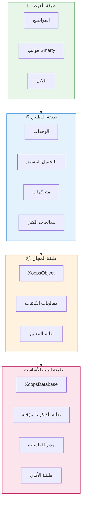
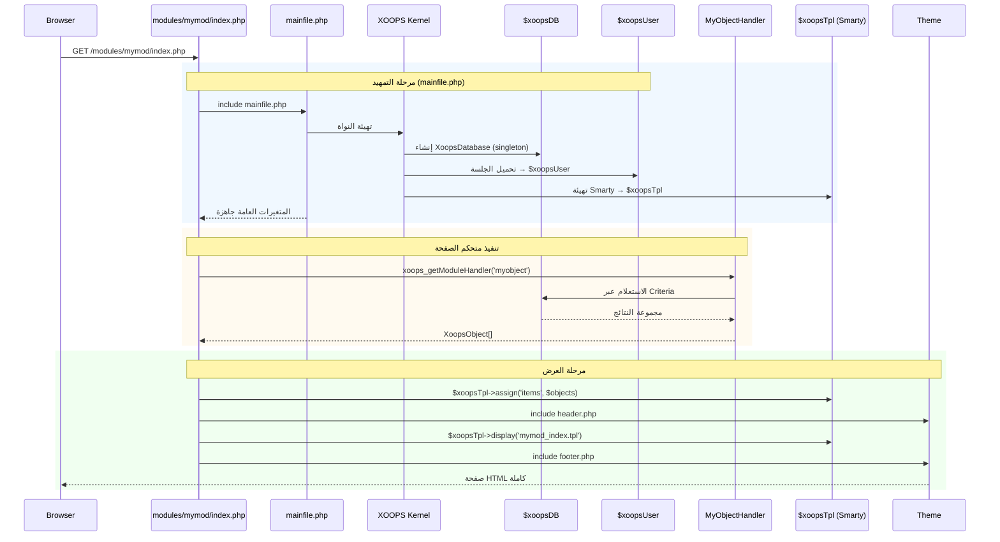

:::note[حول هذا المستند]
تصف هذه الصفحة **المعمارية المفاهيمية** لـ XOOPS التي تنطبق على الإصدارات الحالية (2.5.x) والمستقبلية (4.0.x). بعض الرسوم البيانية تظهر رؤية التصميم متعدد الطبقات.

**للتفاصيل الخاصة بالإصدار:**
- **XOOPS 2.5.x اليوم:** يستخدم `mainfile.php`، المتغيرات العامة (`$xoopsDB`، `$xoopsUser`)، التحميل المسبق، ونمط معالج الصفحة
- **هدف XOOPS 4.0:** PSR-15 middleware، حاوية DI، جهاز التوجيه - راجع [خارطة الطريق](../../07-XOOPS-4.0/XOOPS-4.0-Roadmap.md)
:::

يوفر هذا المستند نظرة شاملة على معمارية نظام XOOPS، مع شرح كيفية عمل المكونات المختلفة معاً لإنشاء نظام إدارة محتوى مرن وقابل للتوسع.

## نظرة عامة

يتبع XOOPS معمارية معيارية تفصل الاهتمامات إلى طبقات متميزة. يتم بناء النظام حول عدة مبادئ أساسية:

- **المعيارية**: يتم تنظيم الوظائف في وحدات مستقلة قابلة للتثبيت
- **قابلية التوسع**: يمكن توسيع النظام بدون تعديل الكود الأساسي
- **التجريد**: تم فصل قاعدة البيانات وطبقات التقديم عن منطق العمل
- **الأمان**: آليات أمان مدمجة للحماية من الثغرات الشائعة

## طبقات النظام



### 1. طبقة العرض

تتعامل طبقة العرض مع عرض واجهة المستخدم باستخدام محرك قوالب Smarty.

**المكونات الرئيسية:**
- **المواضيع**: تصميم الجمال والتخطيط
- **قوالب Smarty**: عرض المحتوى الديناميكي
- **الكتل**: أداة إعادة استخدام محتوى

### 2. طبقة التطبيق

تحتوي طبقة التطبيق على منطق الأعمال والمتحكمات ووظائف الوحدات.

**المكونات الرئيسية:**
- **الوحدات**: حزم الوظائف المستقلة
- **المعالجات**: فئات معالجة البيانات
- **التحميل المسبق**: مستمعي الأحداث والخطاطيف

### 3. طبقة المجال

تحتوي طبقة المجال على كائنات الأعمال الأساسية والقواعد.

**المكونات الرئيسية:**
- **XoopsObject**: فئة أساسية لجميع كائنات المجال
- **المعالجات**: عمليات CRUD لكائنات المجال

### 4. طبقة البنية الأساسية

توفر طبقة البنية الأساسية خدمات أساسية مثل الوصول إلى قاعدة البيانات والتخزين المؤقت.

## دورة حياة الطلب

يعتبر فهم دورة حياة الطلب حاسماً لتطوير XOOPS الفعال.

### تدفق متحكم الصفحة في XOOPS 2.5.x

يستخدم XOOPS 2.5.x الحالي نمط **متحكم الصفحة** حيث يتعامل كل ملف PHP مع طلبه الخاص. يتم تهيئة المتغيرات العامة (`$xoopsDB`، `$xoopsUser`، `$xoopsTpl`، إلخ) أثناء التمهيد وتتوفر في جميع أنحاء التنفيذ.



### المتغيرات العامة الرئيسية في 2.5.x

| المتغير العام | النوع | المهيأة | الغرض |
|--------|------|-------------|---------|
| `$xoopsDB` | `XoopsDatabase` | التمهيد | اتصال قاعدة البيانات (singleton) |
| `$xoopsUser` | `XoopsUser\|null` | تحميل الجلسة | المستخدم الحالي المسجل دخول |
| `$xoopsTpl` | `XoopsTpl` | تهيئة النموذج | محرك قوالب Smarty |
| `$xoopsModule` | `XoopsModule` | تحميل الوحدة | سياق الوحدة الحالي |
| `$xoopsConfig` | `array` | تحميل التكوين | تكوين النظام |

:::note[مقارنة XOOPS 4.0]
في XOOPS 4.0، يتم استبدال نمط متحكم الصفحة بـ **خط أنابيب PSR-15 Middleware** وتوجيه قائم على الموجه. يتم استبدال المتغيرات العامة بحقن الاعتماديات. راجع [عقد الوضع الهجين](../../07-XOOPS-4.0/Specifications/Hybrid-Mode-Contract.md) لضمانات التوافق أثناء الهجرة.
:::

### 1. مرحلة التمهيد

```php
// mainfile.php هو نقطة الدخول
include_once XOOPS_ROOT_PATH . '/mainfile.php';

// تهيئة النواة
$xoops = Xoops::getInstance();
$xoops->boot();
```

**الخطوات:**
1. تحميل التكوين (`mainfile.php`)
2. تهيئة محمل التحميل التلقائي
3. إعداد معالجة الأخطاء
4. إنشاء اتصال قاعدة البيانات
5. تحميل جلسة المستخدم
6. تهيئة محرك قوالب Smarty

### 2. مرحلة التوجيه

```php
// توجيه الطلب إلى الوحدة المناسبة
$module = $GLOBALS['xoopsModule'];
$controller = $module->getController();
$controller->dispatch($request);
```

**الخطوات:**
1. تحليل عنوان URL للطلب
2. تحديد الوحدة الهدف
3. تحميل تكوين الوحدة
4. التحقق من الأذونات
5. التوجيه إلى المعالج المناسب

### 3. مرحلة التنفيذ

```php
// تنفيذ المتحكم
$data = $handler->getObjects($criteria);
$xoopsTpl->assign('items', $data);
```

**الخطوات:**
1. تنفيذ منطق المتحكم
2. التفاعل مع طبقة البيانات
3. معالجة قواعد الأعمال
4. إعداد بيانات العرض

### 4. مرحلة العرض

```php
// عرض النموذج
include XOOPS_ROOT_PATH . '/header.php';
$xoopsTpl->display('db:module_template.tpl');
include XOOPS_ROOT_PATH . '/footer.php';
```

**الخطوات:**
1. تطبيق تخطيط المظهر
2. عرض نموذج الوحدة
3. معالجة الكتل
4. استجابة الإخراج

## المكونات الأساسية

### XoopsObject

فئة أساسية لجميع كائنات البيانات في XOOPS.

```php
<?php
class MyModuleItem extends XoopsObject
{
    public function __construct()
    {
        $this->initVar('id', XOBJ_DTYPE_INT, null, false);
        $this->initVar('title', XOBJ_DTYPE_TXTBOX, '', true, 255);
        $this->initVar('content', XOBJ_DTYPE_TXTAREA, '', false);
        $this->initVar('created', XOBJ_DTYPE_INT, time(), false);
    }
}
```

**الطرق الرئيسية:**
- `initVar()` - تحديد خصائص الكائن
- `getVar()` - استرجاع قيم الخصائص
- `setVar()` - تعيين قيم الخصائص
- `assignVars()` - التخصيص الجماعي من المصفوفة

### XoopsPersistableObjectHandler

يتعامل مع عمليات CRUD لكائنات XoopsObject.

```php
<?php
class MyModuleItemHandler extends XoopsPersistableObjectHandler
{
    public function __construct(\XoopsDatabase $db)
    {
        parent::__construct($db, 'mymodule_items', 'MyModuleItem', 'id', 'title');
    }

    public function getActiveItems($limit = 10)
    {
        $criteria = new CriteriaCompo();
        $criteria->add(new Criteria('status', 1));
        $criteria->setSort('created');
        $criteria->setOrder('DESC');
        $criteria->setLimit($limit);

        return $this->getObjects($criteria);
    }
}
```

**الطرق الرئيسية:**
- `create()` - إنشاء نموذج كائن جديد
- `get()` - استرجاع الكائن حسب المعرف
- `insert()` - حفظ الكائن في قاعدة البيانات
- `delete()` - إزالة الكائن من قاعدة البيانات
- `getObjects()` - استرجاع كائنات متعددة
- `getCount()` - عد الكائنات المطابقة

### هيكل الوحدة

تتبع كل وحدة XOOPS هيكل دليل قياسي:

```
modules/mymodule/
├── class/                  # فئات PHP
│   ├── MyModuleItem.php
│   └── MyModuleItemHandler.php
├── include/                # ملفات التضمين
│   ├── common.php
│   └── functions.php
├── templates/              # قوالب Smarty
│   ├── mymodule_index.tpl
│   └── mymodule_item.tpl
├── admin/                  # منطقة الإدارة
│   ├── index.php
│   └── menu.php
├── language/               # الترجمات
│   └── english/
│       ├── main.php
│       └── modinfo.php
├── sql/                    # مخطط قاعدة البيانات
│   └── mysql.sql
├── xoops_version.php       # معلومات الوحدة
├── index.php               # دخول الوحدة
└── header.php              # رأس الوحدة
```

## حاوية حقن الاعتماديات

يمكن لتطوير XOOPS الحديث الاستفادة من حقن الاعتماديات للحصول على قابلية اختبار أفضل.

### تنفيذ حاوية أساسي

```php
<?php
class XoopsDependencyContainer
{
    private array $services = [];

    public function register(string $name, callable $factory): void
    {
        $this->services[$name] = $factory;
    }

    public function resolve(string $name): mixed
    {
        if (!isset($this->services[$name])) {
            throw new \InvalidArgumentException("Service not found: $name");
        }

        $factory = $this->services[$name];

        if (is_callable($factory)) {
            return $factory($this);
        }

        return $factory;
    }

    public function has(string $name): bool
    {
        return isset($this->services[$name]);
    }
}
```

### حاوية متوافقة مع PSR-11

```php
<?php
namespace Xmf\Di;

use Psr\Container\ContainerInterface;

class BasicContainer implements ContainerInterface
{
    protected array $definitions = [];

    public function set(string $id, mixed $value): void
    {
        $this->definitions[$id] = $value;
    }

    public function get(string $id): mixed
    {
        if (!$this->has($id)) {
            throw new \InvalidArgumentException("Service not found: $id");
        }

        $entry = $this->definitions[$id];

        if (is_callable($entry)) {
            return $entry($this);
        }

        return $entry;
    }

    public function has(string $id): bool
    {
        return isset($this->definitions[$id]);
    }
}
```

### مثال الاستخدام

```php
<?php
// تسجيل الخدمة
$container = new XoopsDependencyContainer();

$container->register('database', function () {
    return XoopsDatabaseFactory::getDatabaseConnection();
});

$container->register('userHandler', function ($c) {
    return new XoopsUserHandler($c->resolve('database'));
});

// حل الخدمة
$userHandler = $container->resolve('userHandler');
$user = $userHandler->get($userId);
```

## نقاط التوسع

يوفر XOOPS عدة آليات توسع:

### 1. التحميل المسبق

يسمح التحميل المسبق للوحدات بربط أحداث النواة.

```php
<?php
// modules/mymodule/preloads/core.php
class MymoduleCorePreload extends XoopsPreloadItem
{
    public static function eventCoreHeaderEnd($args)
    {
        // تنفيذ عند انتهاء معالجة الرأس
    }

    public static function eventCoreFooterStart($args)
    {
        // تنفيذ عند بدء معالجة التذييل
    }
}
```

### 2. الإضافات البرمجية

تمتد الإضافات البرمجية الوظائف المحددة داخل الوحدات.

```php
<?php
// modules/mymodule/plugins/notify.php
class MymoduleNotifyPlugin
{
    public function onItemCreate($item)
    {
        // إرسال إشعار عند إنشاء عنصر
    }
}
```

### 3. المرشحات

تعدل المرشحات البيانات أثناء مرورها عبر النظام.

```php
<?php
// مثال على مرشح المحتوى
$myts = MyTextSanitizer::getInstance();
$content = $myts->displayTarea($rawContent, 1, 1, 1);
```

## أفضل الممارسات

### تنظيم الكود

1. **استخدم الأنماط البرمجية** للكود الجديد:
   ```php
   namespace XoopsModules\MyModule;

   class Item extends \XoopsObject
   {
       // التنفيذ
   }
   ```

2. **اتبع التحميل التلقائي PSR-4**:
   ```json
   {
       "autoload": {
           "psr-4": {
               "XoopsModules\\MyModule\\": "class/"
           }
       }
   }
   ```

3. **افصل الاهتمامات**:
   - منطق المجال في `class/`
   - العرض في `templates/`
   - المتحكمات في جذر الوحدة

### الأداء

1. **استخدم التخزين المؤقت** للعمليات المكلفة
2. **حمل الموارد بكسل** عند الإمكان
3. **قلل استعلامات قاعدة البيانات** باستخدام دفعات معايير
4. **حسّن النماذج** بتجنب منطق معقد

### الأمان

1. **تحقق من جميع المدخلات** باستخدام `Xmf\Request`
2. **هروب الإخراج** في النماذج
3. **استخدم بيانات معدة مسبقاً** لاستعلامات قاعدة البيانات
4. **تحقق من الأذونات** قبل العمليات الحساسة

## الوثائق ذات الصلة

- [أنماط التصميم](Design-Patterns.md) - أنماط التصميم المستخدمة في XOOPS
- [طبقة قاعدة البيانات](../Database/Database-Layer.md) - تفاصيل تجريد قاعدة البيانات
- [أساسيات Smarty](../Templates/Smarty-Basics.md) - توثيق نظام النموذج
- [أفضل ممارسات الأمان](../Security/Security-Best-Practices.md) - إرشادات الأمان

---

#xoops #معمارية #core #تصميم #نظام-التصميم
