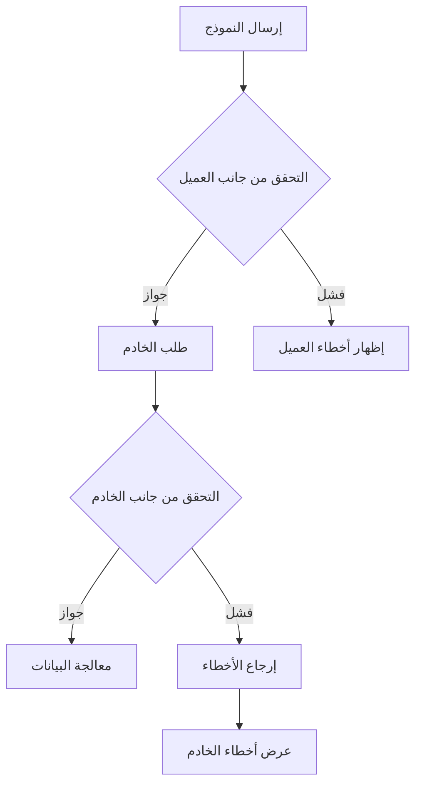

## نظرة عامة

يوفر XOOPS التحقق من الصحة على جانب العميل والخادم لمدخلات النموذج. يغطي هذا الدليل تقنيات التحقق والمدققون المدمجون وتنفيذ التحقق المخصص.

## معمارية التحقق من الصحة



## التحقق من الصحة على جانب الخادم

### استخدام XoopsFormValidator

```php
use Xoops\Core\Form\Validator;

$validator = new Validator();

$validator->addRule('username', 'required', 'Username is required');
$validator->addRule('username', 'minLength:3', 'Username must be at least 3 characters');
$validator->addRule('username', 'maxLength:50', 'Username cannot exceed 50 characters');
$validator->addRule('email', 'email', 'Please enter a valid email address');
$validator->addRule('password', 'minLength:8', 'Password must be at least 8 characters');

if (!$validator->validate($_POST)) {
    $errors = $validator->getErrors();
    // معالجة الأخطاء
}
```

### قواعد التحقق المدمجة

| القاعدة | الوصف | المثال |
|------|-------------|---------|
| `required` | يجب ألا يكون الحقل فارغاً | `required` |
| `email` | صيغة بريد إلكتروني صحيحة | `email` |
| `url` | صيغة URL صحيحة | `url` |
| `numeric` | قيمة رقمية فقط | `numeric` |
| `integer` | قيمة صحيحة فقط | `integer` |
| `minLength` | الحد الأدنى لطول السلسلة | `minLength:3` |
| `maxLength` | الحد الأقصى لطول السلسلة | `maxLength:100` |
| `min` | الحد الأدنى للقيمة الرقمية | `min:1` |
| `max` | الحد الأقصى للقيمة الرقمية | `max:100` |
| `regex` | نمط regex مخصص | `regex:/^[a-z]+$/` |
| `in` | القيمة في القائمة | `in:draft,published,archived` |
| `date` | صيغة تاريخ صحيحة | `date` |
| `alpha` | أحرف فقط | `alpha` |
| `alphanumeric` | أحرف وأرقام | `alphanumeric` |

### قواعد التحقق المخصصة

```php
$validator->addCustomRule('unique_username', function($value) {
    $memberHandler = xoops_getHandler('member');
    $criteria = new \CriteriaCompo();
    $criteria->add(new \Criteria('uname', $value));
    return $memberHandler->getUserCount($criteria) === 0;
}, 'Username already exists');

$validator->addRule('username', 'unique_username');
```

## التحقق من الطلب

### تطهير المدخلات

```php
use Xoops\Core\Request;

// احصل على القيم المطهرة
$username = Request::getString('username', '', 'POST');
$email = Request::getEmail('email', '', 'POST');
$age = Request::getInt('age', 0, 'POST');
$price = Request::getFloat('price', 0.0, 'POST');
$tags = Request::getArray('tags', [], 'POST');

// مع التحقق
$username = Request::getString('username', '', 'POST', [
    'minLength' => 3,
    'maxLength' => 50
]);
```

### منع XSS

```php
use Xoops\Core\Text\Sanitizer;

$sanitizer = Sanitizer::getInstance();

// تطهير محتوى HTML
$cleanContent = $sanitizer->sanitizeForDisplay($userContent);

// إزالة كل HTML
$plainText = $sanitizer->stripHtml($userContent);

// السماح بعلامات محددة
$content = $sanitizer->sanitizeForDisplay($userContent, [
    'allowedTags' => '<p><br><strong><em><a>'
]);
```

## التحقق من صحة جانب العميل

### خصائص التحقق من HTML5

```php
// حقل مطلوب
$element->setExtra('required');

// التحقق من النمط
$element->setExtra('pattern="[a-zA-Z0-9]+" title="Alphanumeric only"');

// قيود الطول
$element->setExtra('minlength="3" maxlength="50"');

// قيود رقمية
$element->setExtra('min="1" max="100"');
```

### التحقق من JavaScript

```javascript
document.getElementById('myForm').addEventListener('submit', function(e) {
    const username = document.getElementById('username').value;
    const errors = [];

    if (username.length < 3) {
        errors.push('Username must be at least 3 characters');
    }

    if (!/^[a-zA-Z0-9_]+$/.test(username)) {
        errors.push('Username can only contain letters, numbers, and underscores');
    }

    if (errors.length > 0) {
        e.preventDefault();
        displayErrors(errors);
    }
});
```

## حماية CSRF

### توليد الرمز

```php
// إنشاء رمز في النموذج
$form->addElement(new \XoopsFormHiddenToken());

// يضيف حقلاً مخفياً برمز الأمان
```

### التحقق من الرمز

```php
use Xoops\Core\Security;

if (!Security::checkReferer()) {
    die('Invalid request origin');
}

if (!Security::checkToken()) {
    die('Invalid security token');
}
```

## التحقق من تحميل الملف

```php
use Xoops\Core\Uploader;

$uploader = new Uploader(
    uploadDir: XOOPS_UPLOAD_PATH . '/images/',
    allowedMimeTypes: ['image/jpeg', 'image/png', 'image/gif'],
    maxFileSize: 2 * 1024 * 1024, // 2MB
    maxWidth: 1920,
    maxHeight: 1080
);

if ($uploader->fetchMedia('image_upload')) {
    if ($uploader->upload()) {
        $savedFile = $uploader->getSavedFileName();
    } else {
        $errors[] = $uploader->getErrors();
    }
}
```

## عرض الأخطاء

### جمع الأخطاء

```php
$errors = [];

if (empty($username)) {
    $errors['username'] = 'Username is required';
}

if (!filter_var($email, FILTER_VALIDATE_EMAIL)) {
    $errors['email'] = 'Invalid email format';
}

if (!empty($errors)) {
    // تخزين في الجلسة للعرض بعد إعادة التوجيه
    $_SESSION['form_errors'] = $errors;
    $_SESSION['form_data'] = $_POST;
    header('Location: ' . $_SERVER['HTTP_REFERER']);
    exit;
}
```

### عرض الأخطاء

```smarty
{if $errors}
<div class="alert alert-danger">
    <ul>
        {foreach $errors as $field => $message}
        <li>{$message}</li>
        {/foreach}
    </ul>
</div>
{/if}
```

## أفضل الممارسات

1. **قم دائماً بالتحقق من جانب الخادم** - يمكن تجاوز التحقق من جانب العميل
2. **استخدم الاستعلامات المحضرة** - منع حقن SQL
3. **تطهير الإخراج** - منع هجمات XSS
4. **التحقق من تحميل الملفات** - تحقق من أنواع MIME والأحجام
5. **استخدام رموز CSRF** - منع التزوير عبر الموقع
6. **تحديد معدل الإرسالات** - منع الإساءة

## الوثائق ذات الصلة

- مرجع عناصر النموذج
- نظرة عامة على النماذج
- أفضل ممارسات الأمان
