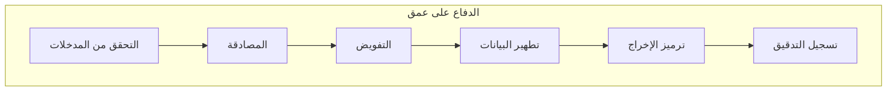

## نظرة عامة

تحدد هذه الوثيقة أفضل ممارسات الأمان لتطوير XOOPS، وتغطي التحقق من صحة المدخلات وترميز الإخراج والمصادقة والتفويض والحماية من الثغرات الويب الشائعة.

## مبادئ الأمان



## التحقق من المدخلات

### تطهير الطلب

```php
use Xoops\Core\Request;

// استخدم دائماً المعيار المطبوع
$id = Request::getInt('id', 0, 'GET');
$name = Request::getString('name', '', 'POST');
$email = Request::getEmail('email', '', 'POST');
$url = Request::getUrl('website', '', 'POST');

// لا تستخدم أبداً raw $_GET/$_POST/$_REQUEST
// سيء: $id = $_GET['id'];
// جيد: $id = Request::getInt('id', 0, 'GET');
```

### قواعد التحقق

```php
// التحقق قبل الاستخدام
if ($id <= 0) {
    throw new InvalidArgumentException('Invalid ID');
}

if (!preg_match('/^[a-zA-Z0-9_]{3,50}$/', $username)) {
    throw new InvalidArgumentException('Invalid username format');
}

// استخدم التحقق من القائمة البيضاء للتعدادات
$allowedStatuses = ['draft', 'published', 'archived'];
if (!in_array($status, $allowedStatuses, true)) {
    throw new InvalidArgumentException('Invalid status');
}
```

## منع حقن SQL

### استخدم الاستعلامات المحضرة

```php
// جيد: الاستعلام المحضر
$sql = "SELECT * FROM {$xoopsDB->prefix('users')} WHERE uid = ?";
$result = $xoopsDB->query($sql, [$userId]);

// سيء: concatenation السلسلة (عرضة للهجوم!)
// $sql = "SELECT * FROM users WHERE uid = " . $userId;
```

### استخدام كائنات Criteria

```php
use Criteria;
use CriteriaCompo;

$criteria = new CriteriaCompo();
$criteria->add(new Criteria('status', 'published'));
$criteria->add(new Criteria('uid', $userId, '='));
$criteria->add(new Criteria('created', time() - 86400, '>'));

$articles = $articleHandler->getObjects($criteria);
```

## منع XSS

### ترميز الإخراج

```php
use Xoops\Core\Text\Sanitizer;

// سياق HTML
$safeName = htmlspecialchars($userName, ENT_QUOTES, 'UTF-8');

// في النماذج (مفلوت تلقائياً)
{$userName|escape}

// للمحتوى الغني
$sanitizer = Sanitizer::getInstance();
$safeContent = $sanitizer->sanitizeForDisplay($content);
```

### سياسة أمان المحتوى

```php
// تعيين رؤوس CSP
header("Content-Security-Policy: default-src 'self'; script-src 'self'; style-src 'self' 'unsafe-inline'");
```

## حماية CSRF

### تنفيذ الرمز

```php
// إنشاء رمز
use Xoops\Core\Security;

$token = Security::createToken();

// في النموذج
echo '<input type="hidden" name="XOOPS_TOKEN_REQUEST" value="' . $token . '">';

// التحقق من الإرسال
if (!Security::checkToken()) {
    die('Security token mismatch');
}
```

### استخدام XoopsForm

```php
// يضيف رمز CSRF تلقائياً
$form = new XoopsThemeForm('Edit Article', 'articleform', 'save.php');
$form->addElement(new XoopsFormHiddenToken());
```

## أفضل ممارسات الأمان

- [ ] تم التحقق من جميع مدخلات المستخدم وتطهيرها
- [ ] استعلامات معدة مسبقاً لجميع عمليات قاعدة البيانات
- [ ] ترميز الإخراج لجميع المحتوى الذي ينشئه المستخدم
- [ ] رموز CSRF على جميع النماذج التي تغير الحالة
- [ ] تجزئة كلمة السر الآمن (Argon2id)
- [ ] أمان الجلسة المكون
- [ ] التحقق من تحميل الملفات
- [ ] رؤوس الأمان المعينة
- [ ] تنفيذ تحديد المعدل
- [ ] تمكين تسجيل التدقيق
- [ ] رسائل الخطأ لا تسرب المعلومات الحساسة

## الوثائق ذات الصلة

- نظام المصادقة
- نظام الأذونات
- التحقق من صحة المدخلات
