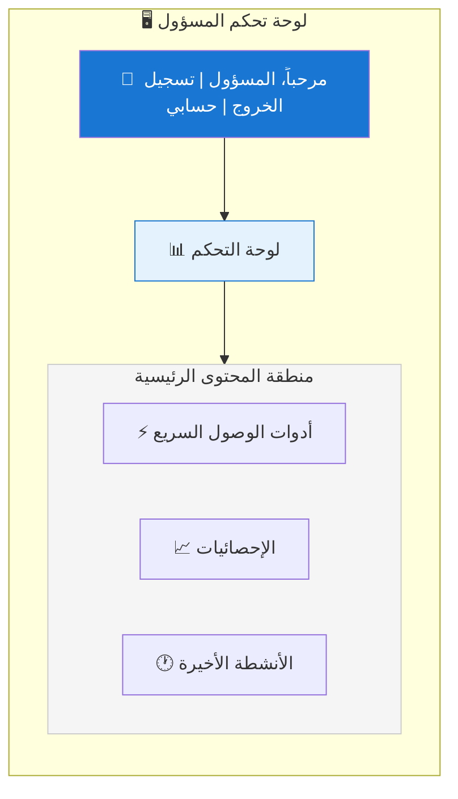
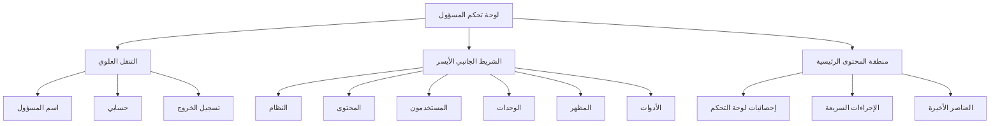

# نظرة عامة على لوحة مسؤول XOOPS

دليل شامل للتنقل واستخدام لوحة تحكم مسؤول XOOPS.

## الوصول إلى لوحة المسؤول

### تسجيل دخول المسؤول

افتح متصفحك وانتقل إلى:

```
http://your-domain.com/xoops/admin/
```

أو إذا كان XOOPS في الجذر:

```
http://your-domain.com/admin/
```

أدخل بيانات اعتماد المسؤول:

```
اسم المستخدم: [اسم المسؤول الخاص بك]
كلمة المرور: [كلمة المرور الخاصة بك]
```

### بعد تسجيل الدخول

ستشاهد لوحة التحكم الرئيسية للمسؤول:



## تخطيط لوحة المسؤول



## مكونات لوحة التحكم

### الشريط العلوي

يحتوي الشريط العلوي على عناصر التحكم الأساسية:

| العنصر | الغرض |
|---|---|
| **شعار المسؤول** | انقر للعودة إلى لوحة التحكم |
| **رسالة الترحيب** | يعرض اسم المسؤول المسجل دخول |
| **حسابي** | تحرير ملف تعريف المسؤول وكلمة المرور |
| **مساعدة** | الوصول إلى الوثائق |
| **تسجيل الخروج** | تسجيل الخروج من لوحة المسؤول |

### شريط التنقل الجانبي الأيسر

القائمة الرئيسية منظمة حسب الوظيفة:

```
├── النظام
│   ├── لوحة التحكم
│   ├── التفضيلات
│   ├── مستخدمو المسؤول
│   ├── المجموعات
│   ├── الأذونات
│   ├── الوحدات
│   └── الأدوات
├── المحتوى
│   ├── الصفحات
│   ├── الفئات
│   ├── التعليقات
│   └── مدير الوسائط
├── المستخدمون
│   ├── المستخدمون
│   ├── طلبات المستخدمين
│   ├── المستخدمون الحاليون
│   └── مجموعات المستخدمين
├── الوحدات
│   ├── الوحدات
│   ├── إعدادات الوحدات
│   └── تحديثات الوحدات
├── المظهر
│   ├── السمات
│   ├── القوالب
│   ├── الكتل
│   └── الصور
└── الأدوات
    ├── الصيانة
    ├── البريد الإلكتروني
    ├── الإحصائيات
    ├── السجلات
    └── النسخ الاحتياطية
```

### منطقة المحتوى الرئيسية

تعرض المعلومات والتحكم للقسم المحدد:

- نماذج للتكوين
- جداول البيانات مع القوائم
- المخططات والإحصائيات
- أزرار الإجراء السريع
- نصوص مساعدة وتلميحات

### أدوات لوحة التحكم

الوصول السريع إلى المعلومات الرئيسية:

- **معلومات النظام:** إصدار PHP وإصدار MySQL وإصدار XOOPS
- **الإحصائيات السريعة:** عدد المستخدمين والمنشورات الإجمالية والوحدات المثبتة
- **النشاط الأخير:** تسجيلات الدخول الأخيرة وتغييرات المحتوى والأخطاء
- **حالة الخادم:** استخدام المعالج والذاكرة ومساحة القرص
- **الإشعارات:** تنبيهات النظام والتحديثات المعلقة

## وظائف المسؤول الأساسية

### إدارة النظام

**الموقع:** النظام > [خيارات مختلفة]

#### التفضيلات

قم بتكوين إعدادات النظام الأساسية:

```
النظام > التفضيلات > [فئة الإعدادات]
```

الفئات:
- إعدادات عامة (اسم الموقع والمنطقة الزمنية)
- إعدادات المستخدم (التسجيل والملفات الشخصية)
- إعدادات البريد الإلكتروني (تكوين SMTP)
- إعدادات التخزين المؤقت (خيارات التخزين المؤقت)
- إعدادات URL (عناوين URL الودية)
- الوسوم الوصفية (إعدادات تحسين محرك البحث)

انظر التكوين الأساسي وإعدادات النظام.

#### مستخدمو المسؤول

إدارة حسابات المسؤول:

```
النظام > مستخدمو المسؤول
```

الوظائف:
- إضافة مسؤولين جدد
- تحرير ملفات تعريف المسؤول
- تغيير كلمات مرور المسؤول
- حذف حسابات المسؤول
- تعيين أذونات المسؤول

### إدارة المحتوى

**الموقع:** المحتوى > [خيارات مختلفة]

#### الصفحات والمقالات

إدارة محتوى الموقع:

```
المحتوى > الصفحات (أو وحدتك)
```

الوظائف:
- إنشاء صفحات جديدة
- تحرير المحتوى الموجود
- حذف الصفحات
- النشر والإلغاء
- تعيين الفئات
- إدارة المراجعات

#### الفئات

تنظيم المحتوى:

```
المحتوى > الفئات
```

الوظائف:
- إنشاء تسلسل هرمي للفئات
- تحرير الفئات
- حذف الفئات
- تعيين الصفحات

#### التعليقات

تعديل تعليقات المستخدمين:

```
المحتوى > التعليقات
```

الوظائف:
- عرض جميع التعليقات
- الموافقة على التعليقات
- تحرير التعليقات
- حذف الرسائل غير المرغوب فيها
- حجب المعلقين

### إدارة المستخدمين

**الموقع:** المستخدمون > [خيارات مختلفة]

#### المستخدمون

إدارة حسابات المستخدمين:

```
المستخدمون > المستخدمون
```

الوظائف:
- عرض جميع المستخدمين
- إنشاء مستخدمين جدد
- تحرير ملفات تعريف المستخدم
- حذف الحسابات
- إعادة تعيين كلمات المرور
- تغيير حالة المستخدم
- تعيين المجموعات

#### المستخدمون الحاليون

مراقبة المستخدمين النشطين:

```
المستخدمون > المستخدمون الحاليون
```

يعرض:
- المستخدمون الحاليون المتصلون بالإنترنت
- وقت آخر نشاط
- عنوان IP
- موقع المستخدم (إذا تم تكوينه)

#### مجموعات المستخدمين

إدارة أدوار المستخدمين والأذونات:

```
المستخدمون > المجموعات
```

الوظائف:
- إنشاء مجموعات مخصصة
- تعيين أذونات المجموعة
- تعيين المستخدمين للمجموعات
- حذف المجموعات

### إدارة الوحدات

**الموقع:** الوحدات > [خيارات مختلفة]

#### الوحدات

التثبيت والتكوين:

```
الوحدات > الوحدات
```

الوظائف:
- عرض الوحدات المثبتة
- تفعيل/تعطيل الوحدات
- تحديث الوحدات
- تكوين إعدادات الوحدات
- تثبيت وحدات جديدة
- عرض تفاصيل الوحدة

#### البحث عن التحديثات

```
الوحدات > الوحدات > البحث عن التحديثات
```

يعرض:
- تحديثات الوحدات المتاحة
- ملخص التغييرات
- خيارات التنزيل والتثبيت

### إدارة المظهر

**الموقع:** المظهر > [خيارات مختلفة]

#### السمات

إدارة سمات الموقع:

```
المظهر > السمات
```

الوظائف:
- عرض السمات المثبتة
- تعيين السمة الافتراضية
- تحميل سمات جديدة
- حذف السمات
- معاينة السمة
- تكوين السمة

#### الكتل

إدارة كتل المحتوى:

```
المظهر > الكتل
```

الوظائف:
- إنشاء كتل مخصصة
- تحرير محتوى الكتلة
- ترتيب الكتل على الصفحة
- تعيين رؤية الكتلة
- حذف الكتل
- تكوين التخزين المؤقت للكتلة

#### القوالب

إدارة القوالب (متقدمة):

```
المظهر > القوالب
```

للمستخدمين والمطورين المتقدمين.

### أدوات النظام

**الموقع:** النظام > الأدوات

#### وضع الصيانة

منع وصول المستخدم أثناء الصيانة:

```
النظام > وضع الصيانة
```

قم بالتكوين:
- تفعيل/تعطيل الصيانة
- رسالة صيانة مخصصة
- عناوين IP المسموح بها (للاختبار)

#### إدارة قاعدة البيانات

```
النظام > قاعدة البيانات
```

الوظائف:
- التحقق من اتساق قاعدة البيانات
- تشغيل تحديثات قاعدة البيانات
- إصلاح الجداول
- تحسين قاعدة البيانات
- تصدير هيكل قاعدة البيانات

#### سجلات النشاط

```
النظام > السجلات
```

راقب:
- نشاط المستخدم
- الإجراءات الإدارية
- أحداث النظام
- سجلات الأخطاء

## الإجراءات السريعة

المهام الشائعة التي يمكن الوصول إليها من لوحة التحكم:

```
الروابط السريعة:
├── إنشاء صفحة جديدة
├── إضافة مستخدم جديد
├── إنشاء كتلة محتوى
├── تحميل صورة
├── إرسال بريد جماعي
├── تحديث جميع الوحدات
└── مسح التخزين المؤقت
```

## اختصارات لوحة المسؤول

التنقل السريع:

| اختصار | الإجراء |
|---|---|
| `Ctrl+H` | الذهاب إلى المساعدة |
| `Ctrl+D` | الذهاب إلى لوحة التحكم |
| `Ctrl+Q` | البحث السريع |
| `Ctrl+L` | تسجيل الخروج |

## إدارة حساب المستخدم

### حسابي

الوصول إلى ملف تعريف المسؤول:

1. انقر على "حسابي" في الزاوية اليمنى العليا
2. تحرير معلومات الملف الشخصي:
   - عنوان البريد الإلكتروني
   - الاسم الحقيقي
   - معلومات المستخدم
   - الصورة الرمزية

### تغيير كلمة المرور

غير كلمة مرور المسؤول:

1. اذهب إلى **حسابي**
2. انقر على "تغيير كلمة المرور"
3. أدخل كلمة المرور الحالية
4. أدخل كلمة المرور الجديدة (مرتين)
5. انقر على "حفظ"

**نصائح الأمان:**
- استخدم كلمات مرور قوية (16+ أحرف)
- أدرج الأحرف الكبيرة والصغيرة والأرقام والرموز
- غير كلمة المرور كل 90 يوماً
- لا تشارك بيانات اعتماد المسؤول مع أحد

### تسجيل الخروج

تسجيل الخروج من لوحة المسؤول:

1. انقر على "تسجيل الخروج" في الزاوية اليمنى العليا
2. سيتم إعادة توجيهك إلى صفحة تسجيل الدخول

## إحصائيات لوحة المسؤول

### إحصائيات لوحة التحكم

نظرة عامة سريعة على مقاييس الموقع:

| المقياس | القيمة |
|--------|-------|
| المستخدمون الحاليون | 12 |
| إجمالي المستخدمين | 256 |
| إجمالي المنشورات | 1,234 |
| إجمالي التعليقات | 5,678 |
| إجمالي الوحدات | 8 |

### حالة النظام

معلومات الخادم والأداء:

| المكون | الإصدار/القيمة |
|-----------|---------------|
| إصدار XOOPS | 2.5.11 |
| إصدار PHP | 8.2.x |
| إصدار MySQL | 8.0.x |
| حمل الخادم | 0.45, 0.42 |
| وقت التشغيل | 45 يوماً |

### النشاط الأخير

الجدول الزمني للأحداث الأخيرة:

```
12:45 - تسجيل دخول المسؤول
12:30 - تسجيل مستخدم جديد
12:15 - صفحة منشورة
12:00 - تعليق منشور
11:45 - تحديث الوحدة
```

## نظام الإشعارات

### تنبيهات المسؤول

استقبل إشعارات ل:

- تسجيلات المستخدمين الجدد
- التعليقات في انتظار الموافقة
- محاولات تسجيل الدخول الفاشلة
- أخطاء النظام
- التحديثات الوحدات المتاحة
- مشاكل قاعدة البيانات
- تنبيهات مساحة القرص

قم بتكوين التنبيهات:

**النظام > التفضيلات > إعدادات البريد الإلكتروني**

```
إخطار المسؤول عند التسجيل: نعم
إخطار المسؤول عند التعليقات: نعم
إخطار المسؤول عند الأخطاء: نعم
بريد التنبيه: admin@your-domain.com
```

## مهام المسؤول الشائعة

### إنشاء صفحة جديدة

1. اذهب إلى **المحتوى > الصفحات** (أو الوحدة المعنية)
2. انقر على "إضافة صفحة جديدة"
3. ملء:
   - العنوان
   - المحتوى
   - الوصف
   - الفئة
   - البيانات الوصفية
4. انقر على "نشر"

### إدارة المستخدمين

1. اذهب إلى **المستخدمون > المستخدمون**
2. عرض قائمة المستخدمين مع:
   - اسم المستخدم
   - البريد الإلكتروني
   - تاريخ التسجيل
   - آخر تسجيل دخول
   - الحالة

3. انقر على اسم المستخدم ل:
   - تحرير الملف الشخصي
   - تغيير كلمة المرور
   - تحرير المجموعات
   - حجب/فتح حساب المستخدم

### تكوين الوحدة

1. اذهب إلى **الوحدات > الوحدات**
2. ابحث عن الوحدة في القائمة
3. انقر على اسم الوحدة
4. انقر على "التفضيلات" أو "الإعدادات"
5. تكوين خيارات الوحدة
6. حفظ التغييرات

### إنشاء كتلة جديدة

1. اذهب إلى **المظهر > الكتل**
2. انقر على "إضافة كتلة جديدة"
3. أدخل:
   - عنوان الكتلة
   - محتوى الكتلة (يسمح HTML)
   - الموضع على الصفحة
   - الرؤية (جميع الصفحات أو معينة)
   - الوحدة (إن أمكن)
4. انقر على "إرسال"

## مساعدة لوحة المسؤول

### الوثائق المدمجة

الوصول إلى المساعدة من لوحة المسؤول:

1. انقر على زر "المساعدة" في الشريط العلوي
2. مساعدة حساسة للسياق للصفحة الحالية
3. روابط إلى الوثائق
4. الأسئلة الشائعة

### الموارد الخارجية

- موقع XOOPS الرسمي: https://xoops.org/
- منتدى المجتمع: https://xoops.org/modules/newbb/
- مستودع الوحدة: https://xoops.org/modules/repository/
- الأخطاء/القضايا: https://github.com/XOOPS/XoopsCore/issues

## تخصيص لوحة المسؤول

### موضوع المسؤول

اختر موضوع واجهة المسؤول:

**النظام > التفضيلات > الإعدادات العامة**

```
موضوع المسؤول: [اختر موضوع]
```

المواضيع المتاحة:
- افتراضي (فاتح)
- الوضع الداكن
- مواضيع مخصصة

### تخصيص لوحة التحكم

اختر الأدوات التي تظهر:

**لوحة التحكم > تخصيص**

اختر:
- معلومات النظام
- الإحصائيات
- النشاط الأخير
- الروابط السريعة
- أدوات مخصصة

## أذونات لوحة المسؤول

مستويات المسؤول المختلفة لها أذونات مختلفة:

| الدور | الإمكانيات |
|---|---|
| **صاحب الموقع** | وصول كامل لجميع وظائف المسؤول |
| **المسؤول** | وظائف مسؤول محدودة |
| **المراقب** | تعديل المحتوى فقط |
| **المحرر** | إنشاء وتحرير المحتوى |

إدارة الأذونات:

**النظام > الأذونات**

## أفضل الممارسات الأمنية للوحة المسؤول

1. **كلمة مرور قوية:** استخدم كلمة مرور من 16+ حرف
2. **التغييرات المنتظمة:** غير كلمة المرور كل 90 يوماً
3. **مراقبة الوصول:** تحقق من سجلات "مستخدمي المسؤول" بانتظام
4. **تحديد الوصول:** أعد تسمية مجلد المسؤول لأمان إضافي
5. **استخدام HTTPS:** وصول المسؤول دائماً عبر HTTPS
6. **تصفية IP:** قيد وصول المسؤول لعناوين IP محددة
7. **تسجيل الخروج المنتظم:** تسجيل الخروج عند الانتهاء
8. **أمان المتصفح:** امسح ذاكرة التخزين المؤقت للمتصفح بانتظام

انظر تكوين الأمان.

## استكشاف أخطاء لوحة المسؤول

### لا يمكن الوصول إلى لوحة المسؤول

**الحل:**
1. تحقق من بيانات اعتماد تسجيل الدخول
2. امسح ذاكرة التخزين المؤقت وملفات تعريف الارتباط في المتصفح
3. جرب متصفحاً مختلفاً
4. تحقق من أن مسار مجلد المسؤول صحيح
5. تحقق من أذونات الملف على مجلد المسؤول
6. تحقق من الاتصال بقاعدة البيانات في mainfile.php

### صفحة لوحة المسؤول فارغة

**الحل:**
```bash
# تحقق من أخطاء PHP
tail -f /var/log/apache2/error.log

# تفعيل وضع التصحيح مؤقتاً
sed -i "s/define('XOOPS_DEBUG', 0)/define('XOOPS_DEBUG', 1)/" /var/www/html/xoops/mainfile.php

# تحقق من أذونات الملف
ls -la /var/www/html/xoops/admin/
```

### لوحة المسؤول بطيئة

**الحل:**
1. مسح التخزين المؤقت: **النظام > الأدوات > مسح التخزين المؤقت**
2. تحسين قاعدة البيانات: **النظام > قاعدة البيانات > تحسين**
3. التحقق من موارد الخادم: `htop`
4. مراجعة الاستعلامات البطيئة في MySQL

### الوحدة لا تظهر

**الحل:**
1. تحقق من تثبيت الوحدة: **الوحدات > الوحدات**
2. التحقق من أن الوحدة مفعلة
3. تحقق من الأذونات المعينة
4. التحقق من وجود ملفات الوحدة
5. مراجعة سجلات الأخطاء

## الخطوات التالية

بعد التعرف على لوحة المسؤول:

1. إنشاء صفحتك الأولى
2. إعداد مجموعات المستخدمين
3. تثبيت وحدات إضافية
4. تكوين الإعدادات الأساسية
5. تنفيذ الأمان

---

**الوسوم:** #لوحة-المسؤول #لوحة-التحكم #التنقل #البدء

**المقالات ذات الصلة:**
- ../التكوين/التكوين-الأساسي
- ../التكوين/إعدادات-النظام
- إنشاء-صفحتك-الأولى
- إدارة-المستخدمين
- تثبيت-الوحدات
