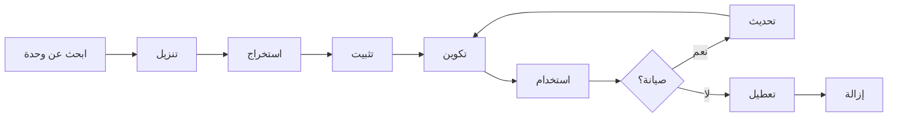

# تثبيت وإدارة وحدات XOOPS

تعرف على كيفية توسيع وظائف XOOPS من خلال تثبيت وتكوين الوحدات.

## فهم وحدات XOOPS

### ما هي الوحدات؟

الوحدات هي ملحقات تضيف وظائف إلى XOOPS:

| النوع | الغرض | أمثلة |
|---|---|---|
| **محتوى** | إدارة أنواع محتوى محددة | أخبار، مدونة، تذاكر |
| **مجتمع** | تفاعل المستخدمين | منتدى، تعليقات، تقييمات |
| **التجارة الإلكترونية** | بيع المنتجات | متجر، سلة، الدفعات |
| **وسائط** | التعامل مع الملفات/الصور | معرض، تنزيلات، مقاطع فيديو |
| **أداة** | أدوات ومساعدة | البريد الإلكتروني، النسخ الاحتياطية، التحليلات |

### الوحدات الأساسية مقابل الاختيارية

| الوحدة | النوع | المضمنة | قابلة للإزالة |
|---|---|---|---|
| **النظام** | أساسي | نعم | لا |
| **المستخدم** | أساسي | نعم | لا |
| **الملف الشخصي** | موصى به | نعم | نعم |
| **PM (رسالة خاصة)** | موصى به | نعم | نعم |
| **قناة WF** | اختياري | غالباً | نعم |
| **أخبار** | اختياري | لا | نعم |
| **منتدى** | اختياري | لا | نعم |

## دورة حياة الوحدة



## العثور على الوحدات

### مستودع وحدات XOOPS الرسمي

مستودع وحدات XOOPS الرسمي:

**تفضل بزيارة:** https://xoops.org/modules/repository/

```
الدليل > الوحدات > [تصفح الفئات]
```

تصفح حسب الفئة:
- إدارة المحتوى
- المجتمع
- التجارة الإلكترونية
- الوسائط
- التطوير
- إدارة الموقع

### تقييم الوحدات

قبل التثبيت، تحقق من:

| المعايير | ما تبحث عنه |
|---|---|
| **التوافق** | يعمل مع إصدار XOOPS الخاص بك |
| **التقييم** | تقييمات المستخدمين الجيدة |
| **التحديثات** | تم صيانتها مؤخراً |
| **التنزيلات** | شهيرة ومستخدمة على نطاق واسع |
| **المتطلبات** | متوافق مع خادمك |
| **الترخيص** | GPL أو مفتوح المصدر مماثل |
| **الدعم** | مطور نشط ومجتمع |

### قراءة معلومات الوحدة

يعرض كل إدراج وحدة:

```
اسم الوحدة: [اسم]
الإصدار: [X.X.X]
يتطلب: XOOPS [إصدار]
المؤلف: [اسم]
آخر تحديث: [تاريخ]
التنزيلات: [رقم]
التقييم: [نجوم]
الوصف: [وصف موجز]
التوافق: PHP [إصدار], MySQL [إصدار]
```

## تثبيت الوحدات

### الطريقة 1: تثبيت من خلال لوحة المسؤول

**الخطوة 1: الوصول إلى قسم الوحدات**

1. تسجيل الدخول إلى لوحة المسؤول
2. انتقل إلى **الوحدات > الوحدات**
3. انقر على **"تثبيت وحدة جديدة"** أو **"استعرض الوحدات"**

**الخطوة 2: تحميل الوحدة**

الخيار أ - التحميل المباشر:
1. انقر على **"اختر ملف"**
2. اختر ملف وحدة .zip من جهازك
3. انقر على **"تحميل"**

الخيار ب - تحميل عنوان URL:
1. الصق عنوان URL للوحدة
2. انقر على **"تنزيل وتثبيت"**

**الخطوة 3: مراجعة معلومات الوحدة**

```
اسم الوحدة: [اسم يظهر]
الإصدار: [إصدار]
المؤلف: [معلومات المؤلف]
الوصف: [وصف كامل]
المتطلبات: [إصدارات PHP/MySQL]
```

راجع وانقر على **"تابع التثبيت"**

**الخطوة 4: اختر نوع التثبيت**

```
☐ تثبيت جديد (تثبيت جديد)
☐ تحديث (ترقية موجودة)
☐ حذف ثم تثبيت (استبدال موجود)
```

حدد الخيار المناسب.

**الخطوة 5: تأكيد التثبيت**

مراجعة التأكيد النهائي:
```
سيتم تثبيت الوحدة على: /modules/modulename/
قاعدة البيانات: xoops_db
هل تريد المتابعة؟ [نعم] [لا]
```

انقر على **"نعم"** للتأكيد.

**الخطوة 6: التثبيت مكتمل**

```
التثبيت ناجح!

الوحدة: [اسم الوحدة]
الإصدار: [إصدار]
الجداول المنشأة: [عدد]
الملفات المثبتة: [عدد]

[انتقل إلى إعدادات الوحدة]  [العودة إلى الوحدات]
```

### الطريقة 2: التثبيت اليدوي (متقدم)

للتثبيت اليدوي أو استكشاف الأخطاء:

**الخطوة 1: تنزيل الوحدة**

1. حمل وحدة .zip من المستودع
2. استخرج إلى `/var/www/html/xoops/modules/modulename/`

```bash
# استخراج الوحدة
unzip module_name.zip
cp -r module_name /var/www/html/xoops/modules/

# تعيين الأذونات
chmod -R 755 /var/www/html/xoops/modules/module_name
```

**الخطوة 2: تشغيل سكريبت التثبيت**

```
تفضل بزيارة: http://your-domain.com/xoops/modules/module_name/admin/index.php?op=install
```

أو من خلال لوحة المسؤول (النظام > الوحدات > تحديث DB).

**الخطوة 3: التحقق من التثبيت**

1. اذهب إلى **الوحدات > الوحدات** في المسؤول
2. ابحث عن وحدتك في القائمة
3. تحقق من أنها تظهر على أنها "نشطة"

## تكوين الوحدة

### الوصول إلى إعدادات الوحدة

1. اذهب إلى **الوحدات > الوحدات**
2. ابحث عن وحدتك
3. انقر على اسم الوحدة
4. انقر على **"التفضيلات"** أو **"الإعدادات"**

### إعدادات الوحدة الشائعة

تقدم معظم الوحدات:

```
حالة الوحدة: [مفعل/معطل]
عرض في القائمة: [نعم/لا]
وزن الوحدة: [1-999] (ترتيب العرض)
مرئي للمجموعات: [خانات اختيار مجموعات المستخدمين]
```

### خيارات خاصة بالوحدة

لكل وحدة إعدادات فريدة. أمثلة:

**وحدة الأخبار:**
```
العناصر لكل صفحة: 10
إظهار المؤلف: نعم
السماح بالتعليقات: نعم
المراجعة مطلوبة: نعم
```

**وحدة المنتدى:**
```
المواضيع لكل صفحة: 20
المنشورات لكل صفحة: 15
أقصى حجم مرفق: 5MB
تفعيل التوقيعات: نعم
```

**وحدة المعرض:**
```
الصور لكل صفحة: 12
حجم الصورة المصغرة: 150x150
أقصى تحميل: 10MB
العلامة المائية: نعم/لا
```

راجع وثائق وحدتك للخيارات المحددة.

### حفظ التكوين

بعد ضبط الإعدادات:

1. انقر على **"إرسال"** أو **"حفظ"**
2. ستشاهد تأكيداً:
   ```
   تم حفظ الإعدادات بنجاح!
   ```

## إدارة كتل الوحدة

العديد من الوحدات تنشئ "كتل" - مناطق محتوى تشبه الأدوات.

### عرض كتل الوحدة

1. اذهب إلى **المظهر > الكتل**
2. ابحث عن كتل من وحدتك
3. تعرض معظم الوحدات "[اسم الوحدة] - [وصف الكتلة]"

### تكوين الكتل

1. انقر على اسم الكتلة
2. اضبط:
   - عنوان الكتلة
   - الرؤية (جميع الصفحات أو محددة)
   - الموضع على الصفحة (يسار، مركز، يمين)
   - مجموعات المستخدمين الذين يمكنهم الرؤية
3. انقر على **"إرسال"**

### عرض الكتلة على الصفحة الرئيسية

1. اذهب إلى **المظهر > الكتل**
2. ابحث عن الكتلة التي تريدها
3. انقر على **"تحرير"**
4. اضبط:
   - **مرئي لـ:** اختر المجموعات
   - **الموضع:** اختر العمود (يسار/مركز/يمين)
   - **الصفحات:** الصفحة الرئيسية أو جميع الصفحات
5. انقر على **"إرسال"**

## تثبيت أمثلة على وحدات محددة

### تثبيت وحدة الأخبار

**مثالي لـ:** منشورات المدونة والإعلانات

1. حمل وحدة الأخبار من المستودع
2. حمل عبر **الوحدات > الوحدات > تثبيت**
3. كوّن في **الوحدات > أخبار > التفضيلات**:
   - القصص لكل صفحة: 10
   - السماح بالتعليقات: نعم
   - الموافقة قبل النشر: نعم
4. أنشئ كتل للأخبار الأخيرة
5. ابدأ بنشر القصص!

### تثبيت وحدة المنتدى

**مثالي لـ:** مناقشة المجتمع

1. حمل وحدة المنتدى
2. ثبّت عبر لوحة المسؤول
3. أنشئ فئات المنتدى في الوحدة
4. كوّن الإعدادات:
   - المواضيع/الصفحة: 20
   - المنشورات/الصفحة: 15
   - تفعيل الإشراف: نعم
5. عيّن أذونات مجموعات المستخدمين
6. أنشئ كتل للمواضيع الأخيرة

### تثبيت وحدة المعرض

**مثالي لـ:** عرض الصور

1. حمل وحدة المعرض
2. ثبّت وكوّن
3. أنشئ ألبومات الصور
4. حمّل الصور
5. حدد الأذونات للعرض/التحميل
6. اعرض المعرض على موقعك

## تحديث الوحدات

### البحث عن التحديثات

```
لوحة المسؤول > الوحدات > الوحدات > البحث عن التحديثات
```

يعرض:
- تحديثات الوحدات المتاحة
- الإصدار الحالي مقابل الجديد
- ملخص التغييرات/ملاحظات الإصدار

### تحديث الوحدة

1. اذهب إلى **الوحدات > الوحدات**
2. انقر على الوحدة مع التحديث المتاح
3. انقر على زر **"تحديث"**
4. اختر **"تحديث"** من نوع التثبيت
5. اتبع معالج التثبيت
6. تم تحديث الوحدة!

### ملاحظات التحديث المهمة

قبل التحديث:

- [ ] النسخ الاحتياطي لقاعدة البيانات
- [ ] النسخ الاحتياطي لملفات الوحدة
- [ ] مراجعة ملخص التغييرات
- [ ] اختبار على خادم التدريج أولاً
- [ ] ملاحظة أي تعديلات مخصصة

بعد التحديث:
- [ ] التحقق من الوظائف
- [ ] فحص إعدادات الوحدة
- [ ] مراجعة التحذيرات/الأخطاء
- [ ] مسح التخزين المؤقت

## أذونات الوحدة

### تعيين وصول مجموعة المستخدمين

التحكم في مجموعات المستخدمين التي يمكنها الوصول إلى الوحدات:

**الموقع:** النظام > الأذونات

لكل وحدة، كوّن:

```
الوحدة: [اسم الوحدة]

وصول المسؤول: [حدد المجموعات]
وصول المستخدم: [حدد المجموعات]
إذن القراءة: [المجموعات المسموح بها للعرض]
إذن الكتابة: [المجموعات المسموح بها بالنشر]
إذن الحذف: [المسؤولون فقط]
```

### مستويات الأذونات الشائعة

```
محتوى عام (أخبار، صفحات):
├── وصول المسؤول: صاحب الموقع
├── وصول المستخدم: جميع المستخدمين المسجلين
└── إذن القراءة: الجميع

ميزات المجتمع (منتدى، تعليقات):
├── وصول المسؤول: صاحب الموقع والمشرفون
├── وصول المستخدم: جميع المستخدمين المسجلين
└── إذن الكتابة: جميع المستخدمين المسجلين

أدوات المسؤول:
├── وصول المسؤول: صاحب الموقع فقط
└── وصول المستخدم: معطل
```

## تعطيل وإزالة الوحدات

### تعطيل الوحدة (احتفظ بالملفات)

احتفظ بالوحدة لكن أخفها من الموقع:

1. اذهب إلى **الوحدات > الوحدات**
2. ابحث عن الوحدة
3. انقر على اسم الوحدة
4. انقر على **"تعطيل"** أو اضبط الحالة على غير نشط
5. الوحدة مختفية لكن البيانات محفوظة

أعد التفعيل في أي وقت:
1. انقر على الوحدة
2. انقر على **"تفعيل"**

### إزالة الوحدة تماماً

حذف الوحدة وبيانات الوحدة:

1. اذهب إلى **الوحدات > الوحدات**
2. ابحث عن الوحدة
3. انقر على **"إلغاء التثبيت"** أو **"حذف"**
4. تأكيد: "حذف الوحدة وجميع البيانات؟"
5. انقر على **"نعم"** للتأكيد

**تحذير:** إلغاء التثبيت يحذف جميع بيانات الوحدة!

### إعادة التثبيت بعد الإلغاء

إذا قمت بإلغاء تثبيت الوحدة:
- تم حذف ملفات الوحدة
- تم حذف جداول قاعدة البيانات
- تم فقدان جميع البيانات
- يجب إعادة التثبيت للاستخدام مرة أخرى
- يمكن استعادة من النسخة الاحتياطية

## استكشاف أخطاء تثبيت الوحدة

### الوحدة لا تظهر بعد التثبيت

**العرض:** الوحدة مدرجة لكن غير مرئية على الموقع

**الحل:**
```
1. تحقق من أن الوحدة "نشطة" (الوحدات > الوحدات)
2. فعّل كتل الوحدة (المظهر > الكتل)
3. تحقق من أذونات المستخدم (النظام > الأذونات)
4. مسح التخزين المؤقت (النظام > الأدوات > مسح التخزين المؤقت)
5. تحقق من عدم حجب .htaccess للوحدة
```

### خطأ التثبيت: "الجدول موجود بالفعل"

**العرض:** خطأ أثناء تثبيت الوحدة

**الحل:**
```
1. تم تثبيت الوحدة جزئياً من قبل
2. جرّب خيار "حذف ثم تثبيت"
3. أو أزل أولاً ثم ثبّت جديداً
4. تحقق من قاعدة البيانات للجداول الموجودة:
   mysql> SHOW TABLES LIKE 'xoops_module%';
```

### الوحدة تفتقد الاعتماديات

**العرض:** الوحدة لن تُثبّت - تتطلب وحدة أخرى

**الحل:**
```
1. لاحظ الوحدات المطلوبة من رسالة الخطأ
2. ثبّت الوحدات المطلوبة أولاً
3. ثم ثبّت الوحدة
4. ثبّت بالترتيب الصحيح
```

### صفحة فارغة عند الوصول إلى الوحدة

**العرض:** تُحمّل الوحدة لكن لا تظهر شيء

**الحل:**
```
1. فعّل وضع التصحيح في mainfile.php:
   define('XOOPS_DEBUG', 1);

2. تحقق من سجل أخطاء PHP:
   tail -f /var/log/php_errors.log

3. تحقق من أذونات الملف:
   chmod -R 755 /var/www/html/xoops/modules/modulename

4. تحقق من اتصال قاعدة البيانات في تكوين الوحدة

5. عطّل الوحدة وأعد التثبيت
```

### الوحدة تكسر الموقع

**العرض:** تثبيت الوحدة يكسر موقعك

**الحل:**
```
1. عطّل الوحدة المشكلة فوراً:
   Admin > الوحدات > [الوحدة] > تعطيل

2. مسح التخزين المؤقت:
   rm -rf /var/www/html/xoops/cache/*
   rm -rf /var/www/html/xoops/templates_c/*

3. استعد من النسخة الاحتياطية إذا لزم الأمر

4. تحقق من سجلات الأخطاء للسبب الجذري

5. اتصل بمطور الوحدة
```

## اعتبارات أمان الوحدة

### ثبّت من مصادر موثوقة فقط

```
✓ مستودع XOOPS الرسمي
✓ وحدات GitHub الرسمية لـ XOOPS
✓ مطورو الوحدات الموثوقين
✗ مواقع غير معروفة
✗ مصادر غير معروفة
```

### تحقق من أذونات الوحدة

بعد التثبيت:

1. راجع رمز الوحدة للنشاط المريب
2. تحقق من جداول قاعدة البيانات للشذوذ
3. راقب التغييرات في الملفات
4. احتفظ بالوحدات محدثة
5. أزل الوحدات غير المستخدمة

### أفضل ممارسات الأذونات

```
مجلد الوحدة: 755 (قابل للقراءة وليس قابل للكتابة بواسطة خادم الويب)
ملفات الوحدة: 644 (قابل للقراءة فقط)
بيانات الوحدة: محمية بواسطة قاعدة البيانات
```

## موارد تطوير الوحدة

### تعلم تطوير الوحدة

- الوثائق الرسمية: https://xoops.org/
- مستودع GitHub: https://github.com/XOOPS/
- منتدى المجتمع: https://xoops.org/modules/newbb/
- دليل المطور: متاح في مجلد المستندات

## أفضل الممارسات للوحدات

1. **ثبّت واحدة تلو الأخرى:** راقب التضاربات
2. **اختبر بعد التثبيت:** التحقق من الوظائف
3. **وثّق التكوين المخصص:** لاحظ إعداداتك
4. **احتفظ بالتحديثات:** ثبّت تحديثات الوحدات بسرعة
5. **أزل غير المستخدمة:** احذف الوحدات غير المطلوبة
6. **احتفظ بنسخة احتياطية قبل:** احتفظ دائماً بنسخة احتياطية قبل التثبيت
7. **اقرأ الوثائق:** تحقق من تعليمات الوحدة
8. **انضم إلى المجتمع:** اطلب المساعدة إذا لزم الأمر

## قائمة تثبيت الوحدة

لكل تثبيت وحدة:

- [ ] البحث والقراءة والمراجعات
- [ ] التحقق من توافق إصدار XOOPS
- [ ] النسخ الاحتياطي لقاعدة البيانات والملفات
- [ ] تنزيل الإصدار الأحدث
- [ ] ثبّت عبر لوحة المسؤول
- [ ] كوّن الإعدادات
- [ ] أنشئ/اضبط المواضع للكتل
- [ ] حدد أذونات المستخدمين
- [ ] اختبر الوظائف
- [ ] وثّق التكوين
- [ ] جدول التحديثات

## الخطوات التالية

بعد تثبيت الوحدات:

1. أنشئ محتوى للوحدات
2. ثبّت مجموعات المستخدمين
3. استكشف ميزات المسؤول
4. حسّن الأداء
5. ثبّت وحدات إضافية حسب الحاجة

---

**الوسوم:** #وحدات #تثبيت #ملحق #إدارة

**المقالات ذات الصلة:**
- نظرة-عامة-على-لوحة-المسؤول
- إدارة-المستخدمين
- إنشاء-صفحتك-الأولى
- ../التكوين/إعدادات-النظام
