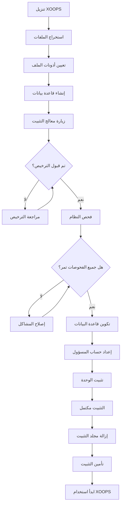

# دليل تثبيت XOOPS الكامل

يوفر هذا الدليل شرحاً شاملاً لتثبيت XOOPS من الصفر باستخدام معالج التثبيت.

## المتطلبات الأساسية

قبل بدء التثبيت، تأكد من أن لديك:

- الوصول إلى خادم الويب عبر FTP أو SSH
- وصول المسؤول إلى خادم قاعدة البيانات
- اسم نطاق مسجل
- التحقق من متطلبات الخادم
- أدوات النسخ الاحتياطي المتاحة

## عملية التثبيت



## التثبيت خطوة بخطوة

### الخطوة 1: تنزيل XOOPS

حمّل أحدث إصدار من [https://xoops.org/](https://xoops.org/):

```bash
# باستخدام wget
wget https://xoops.org/download/xoops-2.5.8.zip

# باستخدام curl
curl -O https://xoops.org/download/xoops-2.5.8.zip
```

### الخطوة 2: استخراج الملفات

استخرج أرشيف XOOPS إلى جذر الويب:

```bash
# انتقل إلى جذر الويب
cd /var/www/html

# استخرج XOOPS
unzip xoops-2.5.8.zip

# أعد تسمية المجلد (اختياري لكن موصى به)
mv xoops-2.5.8 xoops
cd xoops
```

### الخطوة 3: تعيين أذونات الملف

عيّن أذونات صحيحة لدلائل XOOPS:

```bash
# اجعل الدلائل قابلة للكتابة (755 للدلائل، 644 للملفات)
find . -type d -exec chmod 755 {} \;
find . -type f -exec chmod 644 {} \;

# اجعل دلائل محددة قابلة للكتابة بواسطة خادم الويب
chmod 777 uploads/
chmod 777 templates_c/
chmod 777 var/
chmod 777 cache/

# آمّن mainfile.php بعد التثبيت
chmod 644 mainfile.php
```

### الخطوة 4: إنشاء قاعدة بيانات

أنشئ قاعدة بيانات جديدة لـ XOOPS باستخدام MySQL:

```sql
-- إنشاء قاعدة بيانات
CREATE DATABASE xoops_db CHARACTER SET utf8mb4 COLLATE utf8mb4_unicode_ci;

-- إنشاء مستخدم
CREATE USER 'xoops_user'@'localhost' IDENTIFIED BY 'secure_password_here';

-- منح الامتيازات
GRANT ALL PRIVILEGES ON xoops_db.* TO 'xoops_user'@'localhost';
FLUSH PRIVILEGES;
```

أو استخدام phpMyAdmin:

1. تسجيل الدخول إلى phpMyAdmin
2. انقر على علامة التبويب "قواعس البيانات"
3. أدخل اسم قاعدة البيانات: `xoops_db`
4. اختر "utf8mb4_unicode_ci" collation
5. انقر على "إنشاء"
6. أنشئ مستخدماً بنفس اسم قاعدة البيانات
7. امنح جميع الامتيازات

### الخطوة 5: شغّل معالج التثبيت

افتح متصفحك وانتقل إلى:

```
http://your-domain.com/xoops/install/
```

#### مرحلة فحص النظام

يفحص المعالج تكوين خادمك:

- إصدار PHP >= 5.6.0
- MySQL/MariaDB متاح
- ملحقات PHP المطلوبة (GD و PDO وما إلى ذلك)
- أذونات الدليل
- اتصال قاعدة البيانات

**إذا فشلت الفحوصات:**

انظر قسم #Common-Installation-Issues للحلول.

#### تكوين قاعدة البيانات

أدخل بيانات اعتماد قاعدة البيانات:

```
مضيف قاعدة البيانات: localhost
اسم قاعدة البيانات: xoops_db
مستخدم قاعدة البيانات: xoops_user
كلمة مرور قاعدة البيانات: [كلمة المرور الآمنة]
بادئة الجدول: xoops_
```

**ملاحظات مهمة:**
- إذا كان مضيف قاعدة البيانات مختلفاً عن localhost (على سبيل المثال خادم بعيد)، أدخل اسم المضيف الصحيح
- تساعد بادئة الجدول إذا كنت تشغل عدة نسخ XOOPS في قاعدة بيانات واحدة
- استخدم كلمة مرور قوية مع أحرف مختلطة وأرقام ورموز

#### إعداد حساب المسؤول

أنشئ حساب المسؤول الخاص بك:

```
اسم مستخدم المسؤول: admin (أو اختر مخصص)
بريد المسؤول الإلكتروني: admin@your-domain.com
كلمة مرور المسؤول: [كلمة مرور قوية وفريدة]
تأكيد كلمة المرور: [كرر كلمة المرور]
```

**أفضل الممارسات:**
- استخدم اسم مستخدم فريد، وليس "admin"
- استخدم كلمة مرور من 16+ حرف
- قم بتخزين بيانات الاعتماد في مدير كلمات مرور آمن
- لا تشارك بيانات اعتماد المسؤول مع أحد

#### تثبيت الوحدة

اختر الوحدات الافتراضية للتثبيت:

- **وحدة النظام** (مطلوبة) - وظائف XOOPS الأساسية
- **وحدة المستخدم** (مطلوبة) - إدارة المستخدمين
- **وحدة الملف الشخصي** (موصى به) - ملفات تعريف المستخدمين
- **وحدة PM (رسالة خاصة)** (موصى به) - المراسلة الداخلية
- **وحدة قناة WF** (اختياري) - إدارة المحتوى

حدد جميع الوحدات الموصى بها لتثبيت مكتمل.

### الخطوة 6: إكمال التثبيت

بعد جميع الخطوات، ستشاهد شاشة تأكيد:

```
التثبيت مكتمل!

تثبيت XOOPS الخاص بك جاهز للاستخدام.
لوحة المسؤول: http://your-domain.com/xoops/admin/
لوحة المستخدم: http://your-domain.com/xoops/
```

### الخطوة 7: آمّن التثبيت

#### إزالة مجلد التثبيت

```bash
# أزل دليل التثبيت (حرج للأمان)
rm -rf /var/www/html/xoops/install/

# أو أعد تسميته
mv /var/www/html/xoops/install/ /var/www/html/xoops/install.bak
```

**تحذير:** لا تترك مجلد التثبيت متاحاً في الإنتاج!

#### آمّن mainfile.php

```bash
# اجعل mainfile.php للقراءة فقط
chmod 644 /var/www/html/xoops/mainfile.php

# عيّن الملكية
chown www-data:www-data /var/www/html/xoops/mainfile.php
```

#### عيّن أذونات الملف الصحيحة

```bash
# أذونات الإنتاج الموصى بها
find . -type f -name "*.php" -exec chmod 644 {} \;
find . -type d -exec chmod 755 {} \;

# دلائل قابلة للكتابة لخادم الويب
chmod 777 uploads/ var/ cache/ templates_c/
```

#### فعّل HTTPS/SSL

كوّن SSL في خادم الويب (nginx أو Apache).

**لـ Apache:**
```apache
<VirtualHost *:443>
    ServerName your-domain.com
    DocumentRoot /var/www/html/xoops

    SSLEngine on
    SSLCertificateFile /etc/ssl/certs/your-cert.crt
    SSLCertificateKeyFile /etc/ssl/private/your-key.key

    # فرض إعادة توجيه HTTPS
    <IfModule mod_rewrite.c>
        RewriteEngine On
        RewriteCond %{HTTPS} off
        RewriteRule ^(.*)$ https://%{HTTP_HOST}%{REQUEST_URI} [L,R=301]
    </IfModule>
</VirtualHost>
```

## تكوين ما بعد التثبيت

### 1. الوصول إلى لوحة المسؤول

انتقل إلى:
```
http://your-domain.com/xoops/admin/
```

تسجيل الدخول ببيانات اعتماد المسؤول الخاصة بك.

### 2. تكوين الإعدادات الأساسية

كوّن ما يلي:

- اسم الموقع والوصف
- عنوان بريد المسؤول الإلكتروني
- المنطقة الزمنية وصيغة التاريخ
- تحسين محرك البحث

### 3. اختبر التثبيت

- [ ] تحميل الصفحة الرئيسية لـ XOOPS
- [ ] يمكن الوصول إلى الوحدات
- [ ] تسجيل المستخدم يعمل
- [ ] وظائف لوحة المسؤول تعمل
- [ ] يعمل SSL/HTTPS

### 4. جدول النسخ الاحتياطية

قم بإعداد النسخ الاحتياطية التلقائية:

```bash
# إنشاء سكريبت النسخ الاحتياطية (backup.sh)
#!/bin/bash
DATE=$(date +%Y%m%d_%H%M%S)
BACKUP_DIR="/backups/xoops"
XOOPS_DIR="/var/www/html/xoops"

# قاعدة بيانات النسخ الاحتياطية
mysqldump -u xoops_user -p[password] xoops_db > $BACKUP_DIR/db_$DATE.sql

# ملفات النسخ الاحتياطية
tar -czf $BACKUP_DIR/files_$DATE.tar.gz $XOOPS_DIR

echo "النسخة الاحتياطية مكتملة: $DATE"
```

جدول مع cron:
```bash
# النسخة الاحتياطية اليومية في الساعة 2 صباحاً
0 2 * * * /usr/local/bin/backup.sh
```

## مشاكل التثبيت الشائعة

### المشكلة: أخطاء الأذونات المرفوضة

**العرض:** "الوصول مرفوض" عند تحميل أو إنشاء ملفات

**الحل:**
```bash
# تحقق من مستخدم خادم الويب
ps aux | grep apache  # لـ Apache
ps aux | grep nginx   # لـ Nginx

# إصلاح الأذونات (استبدل www-data بمستخدم خادم الويب)
chown -R www-data:www-data /var/www/html/xoops
chmod -R 755 /var/www/html/xoops
chmod 777 uploads/ var/ cache/ templates_c/
```

### المشكلة: فشل اتصال قاعدة البيانات

**العرض:** رسالة "لا يمكن الاتصال بخادم قاعدة البيانات"

**الحل:**
1. تحقق من بيانات اعتماد قاعدة البيانات في معالج التثبيت
2. تحقق من تشغيل MySQL/MariaDB:
   ```bash
   service mysql status  # أو mariadb
   ```
3. تحقق من وجود قاعدة البيانات:
   ```sql
   SHOW DATABASES;
   ```
4. اختبر الاتصال من سطر الأوامر:
   ```bash
   mysql -h localhost -u xoops_user -p xoops_db
   ```

### المشكلة: شاشة بيضاء فارغة

**العرض:** زيارة XOOPS تعرض صفحة فارغة

**الحل:**
1. تحقق من سجلات أخطاء PHP:
   ```bash
   tail -f /var/log/apache2/error.log
   ```
2. فعّل وضع التصحيح في mainfile.php:
   ```php
   define('XOOPS_DEBUG', 1);
   ```
3. تحقق من أذونات الملف على mainfile.php وملفات التكوين
4. تحقق من أن ملحق PHP-MySQL مثبت

### المشكلة: لا يمكن الكتابة إلى دليل التحميلات

**العرض:** ميزة التحميل تفشل، "لا يمكن الكتابة إلى uploads/"

**الحل:**
```bash
# تحقق من الأذونات الحالية
ls -la uploads/

# إصلاح الأذونات
chmod 777 uploads/
chown www-data:www-data uploads/

# للملفات المحددة
chmod 644 uploads/*
```

### المشكلة: ملحقات PHP مفقودة

**العرض:** فشل فحص النظام مع ملحقات مفقودة (GD و MySQL وما إلى ذلك)

**الحل (Ubuntu/Debian):**
```bash
# ثبّت مكتبة GD من PHP
apt-get install php-gd

# ثبّت دعم MySQL من PHP
apt-get install php-mysql

# أعد تشغيل خادم الويب
systemctl restart apache2  # أو nginx
```

**الحل (CentOS/RHEL):**
```bash
# ثبّت مكتبة GD من PHP
yum install php-gd

# ثبّت دعم MySQL من PHP
yum install php-mysql

# أعد تشغيل خادم الويب
systemctl restart httpd
```

### المشكلة: عملية التثبيت بطيئة

**العرض:** معالج التثبيت ينتهي أو يعمل ببطء جداً

**الحل:**
1. زد انتهاء صلاحية PHP في php.ini:
   ```ini
   max_execution_time = 300  # 5 دقائق
   ```
2. زد max_allowed_packet في MySQL:
   ```sql
   SET GLOBAL max_allowed_packet = 256M;
   ```
3. تحقق من موارد الخادم:
   ```bash
   free -h  # تحقق من RAM
   df -h    # تحقق من مساحة القرص
   ```

### المشكلة: لا يمكن الوصول إلى لوحة المسؤول

**العرض:** لا يمكن الوصول إلى لوحة المسؤول بعد التثبيت

**الحل:**
1. تحقق من وجود مستخدم المسؤول في قاعدة البيانات:
   ```sql
   SELECT * FROM xoops_users WHERE uid = 1;
   ```
2. امسح ذاكرة التخزين المؤقت وملفات تعريف الارتباط في المتصفح
3. تحقق من أن مجلد الجلسات قابل للكتابة:
   ```bash
   chmod 777 var/
   ```
4. تحقق من أن قواعد htaccess لا تحجب وصول المسؤول

## قائمة التحقق من التحقق

بعد التثبيت، تحقق من:

- [x] تحميل الصفحة الرئيسية لـ XOOPS بشكل صحيح
- [x] يمكن الوصول إلى لوحة المسؤول في /xoops/admin/
- [x] SSL/HTTPS يعمل
- [x] تم إزالة مجلد التثبيت أو غير متاح
- [x] أذونات الملف آمنة (644 للملفات و 755 للدلائل)
- [x] تم جدولة النسخ الاحتياطية لقاعدة البيانات
- [x] تحميل الوحدات بدون أخطاء
- [x] نظام تسجيل المستخدم يعمل
- [x] وظائف تحميل الملفات تعمل
- [x] إرسال إخطارات البريد الإلكتروني بشكل صحيح

## الخطوات التالية

بعد اكتمال التثبيت:

1. اقرأ دليل التكوين الأساسي
2. آمّن التثبيت الخاص بك
3. استكشف لوحة المسؤول
4. ثبّت وحدات إضافية
5. أنشئ مجموعات المستخدمين والأذونات

---

**الوسوم:** #التثبيت #الإعداد #البدء #استكشاف الأخطاء

**المقالات ذات الصلة:**
- متطلبات-الخادم
- ترقية-XOOPS
- ../التكوين/تكوين-الأمان
