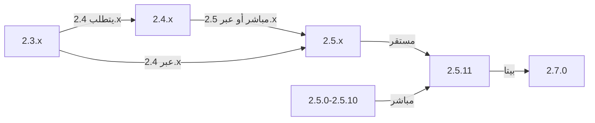

يغطي هذا الدليل ترقية XOOPS من الإصدارات الأقدم إلى أحدث إصدار مع الحفاظ على بيانات التخصيصات الخاصة بك.

> **معلومات الإصدار**
> - **مستقر:** XOOPS 2.5.11
> - **بيتا:** XOOPS 2.7.0 (اختبار)
> - **مستقبلي:** XOOPS 4.0 (قيد التطوير - انظر خريطة الطريق)

## قائمة التحقق قبل الترقية

قبل بدء الترقية، تحقق من:

- [ ] تم توثيق إصدار XOOPS الحالي
- [ ] تم تحديد إصدار XOOPS المستهدف
- [ ] تم إكمال النسخة الاحتياطية الكاملة للنظام
- [ ] تم التحقق من النسخة الاحتياطية للقاعدة البيانات
- [ ] تم تسجيل قائمة الوحدات المثبتة
- [ ] تم توثيق التعديلات المخصصة
- [ ] بيئة الاختبار متاحة
- [ ] تم فحص مسار الترقية (بعض الإصدارات تتخطى الإصدارات الوسيطة)
- [ ] تم التحقق من موارد الخادم (مساحة قرص وذاكرة كافية)
- [ ] تم تفعيل وضع الصيانة

## دليل مسار الترقية

مسارات ترقية مختلفة حسب الإصدار الحالي:



**مهم:** لا تتخطَ أبداً الإصدارات الرئيسية. إذا كنت تقوم بالترقية من 2.3.x، قم بالترقية أولاً إلى 2.4.x، ثم إلى 2.5.x.

## الخطوة 1: النسخة الاحتياطية الكاملة للنظام

### النسخة الاحتياطية للقاعدة البيانات

استخدم mysqldump لعمل نسخة احتياطية من قاعدة البيانات:

```bash
# Full database backup
mysqldump -u xoops_user -p xoops_db > /backups/xoops_db_backup_$(date +%Y%m%d_%H%M%S).sql

# Compressed backup
mysqldump -u xoops_user -p xoops_db | gzip > /backups/xoops_db_backup_$(date +%Y%m%d_%H%M%S).sql.gz
```

أو باستخدام phpMyAdmin:

1. حدد قاعدة بيانات XOOPS الخاصة بك
2. انقر على علامة التبويب "تصدير"
3. اختر صيغة "SQL"
4. حدد "حفظ كملف"
5. انقر على "تنفيذ"

تحقق من ملف النسخة الاحتياطية:

```bash
# Check backup size
ls -lh /backups/xoops_db_backup*.sql

# Verify backup integrity (uncompressed)
head -20 /backups/xoops_db_backup_*.sql

# Verify compressed backup
zcat /backups/xoops_db_backup_*.sql.gz | head -20
```

### النسخة الاحتياطية لنظام الملفات

عمل نسخة احتياطية من جميع ملفات XOOPS:

```bash
# Compressed file backup
tar -czf /backups/xoops_files_$(date +%Y%m%d_%H%M%S).tar.gz /var/www/html/xoops

# Uncompressed (faster, requires more disk space)
tar -cf /backups/xoops_files_$(date +%Y%m%d_%H%M%S).tar /var/www/html/xoops

# Show backup progress
tar -czf /backups/xoops_files_$(date +%Y%m%d_%H%M%S).tar.gz --verbose /var/www/html/xoops | tail
```

تخزين النسخ الاحتياطية بشكل آمن:

```bash
# Secure backup storage
chmod 600 /backups/xoops_*
ls -lah /backups/

# Optional: Copy to remote storage
scp /backups/xoops_* user@backup-server:/secure/backups/
```

### اختبار استعادة النسخة الاحتياطية

**حرج:** اختبر دائماً أن النسخة الاحتياطية الخاصة بك تعمل:

```bash
# Verify tar archive contents
tar -tzf /backups/xoops_files_*.tar.gz | head -20

# Extract to test location
mkdir /tmp/restore_test
cd /tmp/restore_test
tar -xzf /backups/xoops_files_*.tar.gz

# Verify key files exist
ls -la xoops/mainfile.php
ls -la xoops/install/
```

## الخطوة 2: تفعيل وضع الصيانة

منع المستخدمين من الوصول إلى الموقع أثناء الترقية:

### الخيار 1: لوحة مسؤول XOOPS

1. سجل الدخول إلى لوحة المسؤول
2. انتقل إلى System > Maintenance
3. فعّل "وضع صيانة الموقع"
4. عيّن رسالة الصيانة
5. احفظ

### الخيار 2: وضع الصيانة اليدوي

أنشئ ملف صيانة في جذر الويب:

```html
<!-- /var/www/html/maintenance.html -->
<!DOCTYPE html>
<html>
<head>
    <title>Under Maintenance</title>
    <style>
        body { font-family: Arial; text-align: center; padding: 50px; }
        h1 { color: #333; }
        p { color: #666; margin: 20px 0; }
    </style>
</head>
<body>
    <h1>Site Under Maintenance</h1>
    <p>We're currently upgrading our site.</p>
    <p>Expected time: approximately 30 minutes.</p>
    <p>Thank you for your patience!</p>
</body>
</html>
```

قم بتكوين Apache لعرض صفحة الصيانة:

```apache
# In .htaccess or vhost config
ErrorDocument 503 /maintenance.html

# Redirect all traffic to maintenance page
<IfModule mod_rewrite.c>
    RewriteEngine On
    RewriteCond %{REMOTE_ADDR} !^192\.168\.1\.100$  # Your IP
    RewriteRule ^(.*)$ - [R=503,L]
</IfModule>
```

## الخطوة 3: تحميل الإصدار الجديد

قم بتحميل XOOPS من الموقع الرسمي:

```bash
# Download latest version
cd /tmp
wget https://xoops.org/download/xoops-2.5.8.zip

# التحقق من المجموع الاختباري (إن وُجد)
sha256sum xoops-2.5.8.zip
# قارن مع بصمة SHA256 الرسمية

# استخراج إلى موقع مؤقت
unzip xoops-2.5.8.zip
cd xoops-2.5.8
```

## الخطوة 4: تحضير الملفات قبل الترقية

### تحديد التعديلات المخصصة

تحقق من ملفات النواة المخصصة:

```bash
# ابحث عن الملفات المعدلة (الملفات ذات mtime أحدث)
find /var/www/html/xoops -type f -newer /var/www/html/xoops/install.php

# تحقق من المظاهر المخصصة
ls /var/www/html/xoops/themes/
# لاحظ أي مظاهر مخصصة

# تحقق من الوحدات المخصصة
ls /var/www/html/xoops/modules/
# لاحظ أي وحدات مخصصة أنشأتها
```

### توثيق الحالة الحالية

أنشئ تقرير ترقية:

```bash
cat > /tmp/upgrade_report.txt << EOF
=== XOOPS Upgrade Report ===
Date: $(date)
Current Version: 2.5.6
Target Version: 2.5.8

=== Installed Modules ===
$(ls /var/www/html/xoops/modules/)

=== Custom Modifications ===
[Document any custom theme or module modifications]

=== Themes ===
$(ls /var/www/html/xoops/themes/)

=== Plugin Status ===
[List any custom code modifications]

EOF
```

## الخطوة 5: دمج الملفات الجديدة مع التثبيت الحالي

### الإستراتيجية: الحفاظ على الملفات المخصصة

استبدل ملفات XOOPS الأساسية لكن احفظ:
- `mainfile.php` (تكوين قاعدة البيانات الخاصة بك)
- المظاهر المخصصة في `themes/`
- الوحدات المخصصة في `modules/`
- تحميلات المستخدم في `uploads/`
- بيانات الموقع في `var/`

### عملية الدمج اليدوي

```bash
# Set variables
XOOPS_OLD="/var/www/html/xoops"
XOOPS_NEW="/tmp/xoops-2.5.8"
BACKUP="/backups/pre-upgrade"

# Create pre-upgrade backup in place
mkdir -p $BACKUP
cp -r $XOOPS_OLD/* $BACKUP/

# Copy new files (but preserve sensitive files)
# Copy everything except protected directories
rsync -av --exclude='mainfile.php' \
    --exclude='modules/custom*' \
    --exclude='themes/custom*' \
    --exclude='uploads' \
    --exclude='var' \
    --exclude='cache' \
    --exclude='templates_c' \
    $XOOPS_NEW/ $XOOPS_OLD/

# التحقق من الملفات الحرجة المحفوظة
ls -la $XOOPS_OLD/mainfile.php
```

### استخدام upgrade.php (إن توفر)

بعض إصدارات XOOPS تتضمن سكريبت ترقية آلي:

```bash
# نسخ الملفات الجديدة مع المثبت
cp -r /tmp/xoops-2.5.8/* /var/www/html/xoops/

# تشغيل معالج الترقية
# تفضل بزيارة: http://your-domain.com/xoops/upgrade/
```

### أذونات الملفات بعد الدمج

استعد الأذونات الصحيحة:

```bash
# Set ownership
chown -R www-data:www-data /var/www/html/xoops

# Set directory permissions
find /var/www/html/xoops -type d -exec chmod 755 {} \;

# Set file permissions
find /var/www/html/xoops -type f -exec chmod 644 {} \;

# Make writable directories
chmod 777 /var/www/html/xoops/cache
chmod 777 /var/www/html/xoops/templates_c
chmod 777 /var/www/html/xoops/uploads
chmod 777 /var/www/html/xoops/var

# Secure mainfile.php
chmod 644 /var/www/html/xoops/mainfile.php
```

## الخطوة 6: نقل البيانات

### مراجعة تغييرات قاعدة البيانات

تحقق من ملاحظات الإصدار XOOPS لتغييرات هيكل قاعدة البيانات:

```bash
# استخراج ومراجعة ملفات نقل SQL
find /tmp/xoops-2.5.8 -name "*.sql" -type f
# توثيق جميع ملفات .sql الموجودة
```

### تشغيل تحديثات قاعدة البيانات

### الخيار 1: التحديث الآلي (إن توفر)

استخدم لوحة المسؤول:

1. سجل الدخول إلى لوحة المسؤول
2. انتقل إلى **System > Database**
3. انقر على "فحص التحديثات"
4. استعرض التغييرات المعلقة
5. انقر على "تطبيق التحديثات"

### الخيار 2: تحديثات قاعدة البيانات اليدوية

تنفيذ ملفات نقل SQL:

```bash
# Connect to database
mysql -u xoops_user -p xoops_db

# View pending changes (varies by version)
SELECT * FROM xoops_config WHERE conf_name LIKE '%version%';

# Run migration scripts manually if needed
SOURCE /tmp/xoops-2.5.8/migrate_2.5.6_to_2.5.8.sql;
```

### التحقق من قاعدة البيانات

تحقق من تكامل قاعدة البيانات بعد التحديث:

```sql
-- Check database consistency
REPAIR TABLE xoops_users;
OPTIMIZE TABLE xoops_users;

-- Verify key tables exist
SHOW TABLES LIKE 'xoops_%';

-- Check row counts (should increase or stay same)
SELECT COUNT(*) FROM xoops_users;
SELECT COUNT(*) FROM xoops_posts;
```

## الخطوة 7: التحقق من الترقية

### فحص الصفحة الرئيسية

زر صفحة XOOPS الرئيسية:

```
http://your-domain.com/xoops/
```

المتوقع: تحميل الصفحة بدون أخطاء، وتعرض بشكل صحيح

### فحص لوحة المسؤول

الوصول إلى لوحة المسؤول:

```
http://your-domain.com/xoops/admin/
```

تحقق من:
- [ ] تحميل لوحة المسؤول
- [ ] عمل التنقل
- [ ] عرض لوحة التحكم بشكل صحيح
- [ ] عدم وجود أخطاء قاعدة البيانات في السجلات

### التحقق من الوحدات

تحقق من الوحدات المثبتة:

1. انتقل إلى **Modules > Modules** في لوحة المسؤول
2. تحقق من تثبيت جميع الوحدات
3. تحقق من أي رسائل خطأ
4. فعّل أي وحدات تم تعطيلها

### فحص ملف السجل

استعرض سجلات النظام للبحث عن الأخطاء:

```bash
# فحص سجل خطأ خادم الويب
tail -50 /var/log/apache2/error.log

# فحص سجل خطأ PHP
tail -50 /var/log/php_errors.log

# فحص سجل نظام XOOPS (إن توفر)
# في لوحة المسؤول: System > Logs
```

### اختبار الوظائف الأساسية

- [ ] تسجيل الدخول / تسجيل الخروج يعمل
- [ ] تسجيل المستخدم يعمل
- [ ] وظائف تحميل الملفات
- [ ] إرسال إشعارات البريد الإلكتروني
- [ ] وظيفة البحث تعمل
- [ ] وظائف المسؤول تعمل
- [ ] وظيفة الوحدات سليمة

## الخطوة 8: تنظيف ما بعد الترقية

### إزالة الملفات المؤقتة

```bash
# إزالة دليل الاستخراج
rm -rf /tmp/xoops-2.5.8

# مسح ذاكرة تخزين النموذج (آمن للحذف)
rm -rf /var/www/html/xoops/templates_c/*

# مسح ذاكرة تخزين الموقع
rm -rf /var/www/html/xoops/cache/*
```

### إزالة وضع الصيانة

إعادة تفعيل الوصول العادي للموقع:

```apache
# إزالة إعادة توجيه وضع الصيانة من .htaccess
# أو حذف ملف maintenance.html
rm /var/www/html/maintenance.html
```

### تحديث الوثائق

قم بتحديث ملاحظات الترقية الخاصة بك:

```bash
# Document successful upgrade
cat >> /tmp/upgrade_report.txt << EOF

=== Upgrade Results ===
Status: SUCCESS
Upgrade Date: $(date)
New Version: 2.5.8
Duration: [time in minutes]

Post-Upgrade Tests:
- [x] Homepage loads
- [x] Admin panel accessible
- [x] Modules functional
- [x] User registration works
- [x] Database optimized

EOF
```

## استكشاف أخطاء الترقيات

### المشكلة: شاشة بيضاء فارغة بعد الترقية

**الأعراض:** الصفحة الرئيسية لا تعرض شيء

**الحل:**
```bash
# فحص أخطاء PHP
tail -f /var/log/apache2/error.log

# تفعيل وضع التصحيح مؤقتاً
echo "define('XOOPS_DEBUG', 1);" >> /var/www/html/xoops/mainfile.php

# فحص أذونات الملفات
ls -la /var/www/html/xoops/mainfile.php

# استعادة من النسخة الاحتياطية إذا لزم الأمر
cp /backups/xoops_files_*.tar.gz /tmp/
cd /tmp && tar -xzf xoops_files_*.tar.gz
```

### المشكلة: خطأ في الاتصال بقاعدة البيانات

**الأعراض:** رسالة "لا يمكن الاتصال بقاعدة البيانات"

**الحل:**
```bash
# التحقق من بيانات اعتماد قاعدة البيانات في mainfile.php
grep -i "database\|host\|user" /var/www/html/xoops/mainfile.php

# اختبار الاتصال
mysql -h localhost -u xoops_user -p xoops_db -e "SELECT 1"

# فحص حالة MySQL
systemctl status mysql

# تحقق من وجود قاعدة البيانات
mysql -u xoops_user -p -e "SHOW DATABASES" | grep xoops
```

### المشكلة: لوحة المسؤول غير قابلة للوصول

**الأعراض:** لا يمكن الوصول إلى /xoops/admin/

**الحل:**
```bash
# فحص قواعد .htaccess
cat /var/www/html/xoops/.htaccess

# التحقق من وجود ملفات المسؤول
ls -la /var/www/html/xoops/admin/

# فحص تفعيل mod_rewrite
apache2ctl -M | grep rewrite

# إعادة تشغيل خادم الويب
systemctl restart apache2
```

### المشكلة: الوحدات لا تتحمل

**الأعراض:** الوحدات تعرض أخطاء أو معطلة

**الحل:**
```bash
# التحقق من وجود ملفات الوحدة
ls /var/www/html/xoops/modules/

# فحص أذونات الوحدة
ls -la /var/www/html/xoops/modules/*/

# فحص تكوين الوحدة في قاعدة البيانات
mysql -u xoops_user -p xoops_db -e "SELECT * FROM xoops_modules WHERE module_status = 0"

# إعادة تفعيل الوحدات في لوحة المسؤول
# System > Modules > انقر على الوحدة > حدّث الحالة
```

### المشكلة: أخطاء رفض الإذن

**الأعراض:** رسالة "رفض الإذن" عند التحميل أو الحفظ

**الحل:**
```bash
# فحص ملكية الملف
ls -la /var/www/html/xoops/ | head -20

# إصلاح الملكية
chown -R www-data:www-data /var/www/html/xoops

# إصلاح أذونات المجلد
find /var/www/html/xoops -type d -exec chmod 755 {} \;

# اجعل ذاكرة التخزين المؤقت/التحميلات قابلة للكتابة
chmod 777 /var/www/html/xoops/cache
chmod 777 /var/www/html/xoops/templates_c
chmod 777 /var/www/html/xoops/uploads
chmod 777 /var/www/html/xoops/var
```

### المشكلة: تحميل الصفحات ببطء

**الأعراض:** تحميل الصفحات بطيئة جداً بعد الترقية

**الحل:**
```bash
# مسح جميع ذاكرة التخزين المؤقت
rm -rf /var/www/html/xoops/cache/*
rm -rf /var/www/html/xoops/templates_c/*

# تحسين قاعدة البيانات
mysql -u xoops_user -p xoops_db << EOF
OPTIMIZE TABLE xoops_users;
OPTIMIZE TABLE xoops_posts;
OPTIMIZE TABLE xoops_config;
ANALYZE TABLE xoops_users;
EOF

# فحص سجل أخطاء PHP بحثاً عن تحذيرات
grep -i "deprecated\|warning" /var/log/php_errors.log | tail -20

# زيادة حد الذاكرة / وقت التنفيذ PHP مؤقتاً
# تحرير php.ini:
memory_limit = 256M
max_execution_time = 300
```

## إجراء التراجع

إذا فشلت الترقية بشكل حرج، استعد من النسخة الاحتياطية:

### استعادة قاعدة البيانات

```bash
# استعادة من النسخة الاحتياطية
mysql -u xoops_user -p xoops_db < /backups/xoops_db_backup_YYYYMMDD_HHMMSS.sql

# أو من النسخة الاحتياطية المضغوطة
gunzip < /backups/xoops_db_backup_YYYYMMDD_HHMMSS.sql.gz | mysql -u xoops_user -p xoops_db

# التحقق من الاستعادة
mysql -u xoops_user -p xoops_db -e "SELECT COUNT(*) FROM xoops_users"
```

### استعادة نظام الملفات

```bash
# إيقاف خادم الويب
systemctl stop apache2

# إزالة التثبيت الحالي
rm -rf /var/www/html/xoops/*

# استخراج النسخة الاحتياطية
cd /var/www/html
tar -xzf /backups/xoops_files_YYYYMMDD_HHMMSS.tar.gz

# إصلاح الأذونات
chown -R www-data:www-data xoops/
find xoops -type d -exec chmod 755 {} \;
find xoops -type f -exec chmod 644 {} \;
chmod 777 xoops/cache xoops/templates_c xoops/uploads xoops/var

# بدء خادم الويب
systemctl start apache2

# التحقق من الاستعادة
# تفضل بزيارة http://your-domain.com/xoops/
```

## قائمة التحقق من التحقق من الترقية

بعد اكتمال الترقية، تحقق من:

- [ ] تم تحديث إصدار XOOPS (تحقق من المسؤول > معلومات النظام)
- [ ] تحميل الصفحة الرئيسية بدون أخطاء
- [ ] جميع الوحدات تعمل
- [ ] تسجيل دخول المستخدم يعمل
- [ ] لوحة المسؤول قابلة للوصول
- [ ] تحميل الملفات يعمل
- [ ] إشعارات البريد الإلكتروني تعمل
- [ ] تم التحقق من تكامل قاعدة البيانات
- [ ] أذونات الملفات صحيحة
- [ ] تم إزالة وضع الصيانة
- [ ] النسخ الاحتياطية آمنة ومختبرة
- [ ] الأداء مقبول
- [ ] SSL/HTTPS يعمل
- [ ] لا توجد رسائل خطأ في السجلات

## الخطوات التالية

بعد الترقية الناجحة:

1. قم بتحديث أي وحدات مخصصة إلى أحدث الإصدارات
2. استعرض ملاحظات الإصدار للميزات المكتسبة
3. فكر في تحسين الأداء
4. قم بتحديث إعدادات الأمان
5. اختبر جميع الوظائف بدقة
6. حافظ على أمان ملفات النسخة الاحتياطية

---

**Tags:** #upgrade #maintenance #backup #database-migration

**Related Articles:**
- ../../06-Publisher-Module/User-Guide/Installation
- Server-Requirements
- ../Configuration/Basic-Configuration
- ../Configuration/Security-Configuration
