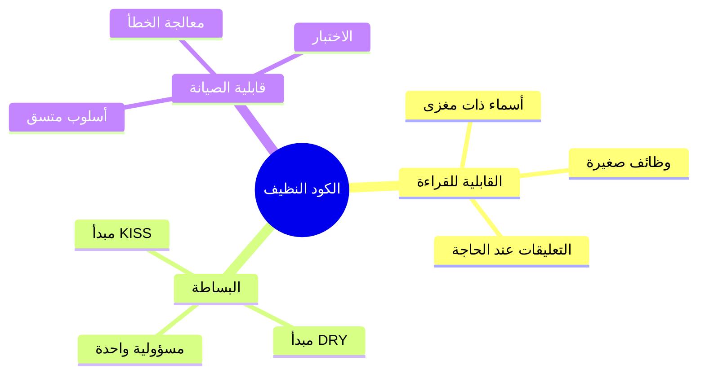

## نظرة عامة

الكود النظيف هو كود يسهل قراءته وفهمه وصيانته. يغطي هذا الدليل مبادئ الكود النظيف المطبقة بشكل خاص على تطوير وحدة XOOPS.

## المبادئ الأساسية



## أسماء ذات مغزى

### المتغيرات

```php
// سيء
$d = new DateTime();
$u = $memberHandler->getUser($id);
$arr = [];

// جيد
$createdDate = new DateTime();
$currentUser = $memberHandler->getUser($userId);
$publishedArticles = [];
```

### الدوال

```php
// سيء
function process($data) { ... }
function handle($item) { ... }
function doStuff($x, $y) { ... }

// جيد
function publishArticle(Article $article): void { ... }
function calculateTotalPrice(array $items): float { ... }
function sendNotificationEmail(User $user, string $subject): bool { ... }
```

### الفئات

```php
// سيء
class Manager { ... }
class Helper { ... }
class Utils { ... }

// جيد
class ArticleRepository { ... }
class NotificationService { ... }
class PermissionChecker { ... }
```

## وظائف صغيرة

### مسؤولية واحدة

```php
// سيء - يفعل أشياء كثيرة جداً
function processArticle($data) {
    // تحقق
    if (empty($data['title'])) {
        throw new Exception('العنوان مطلوب');
    }
    // احفظ
    $article = new Article();
    $article->setTitle($data['title']);
    $this->repository->save($article);
    // أخبر
    $this->mailer->send($article->getAuthor(), 'تم نشر المقال');
    // سجل
    $this->logger->info('تم إنشاء المقال');
    return $article;
}

// جيد - كل دالة تفعل شيء واحد
function validateArticleData(array $data): void
{
    if (empty($data['title'])) {
        throw new ValidationException('العنوان مطلوب');
    }
}

function createArticle(array $data): Article
{
    $this->validateArticleData($data);
    return Article::create($data['title'], $data['content']);
}

function publishArticle(Article $article): void
{
    $this->repository->save($article);
    $this->notifyAuthor($article);
    $this->logArticleCreation($article);
}
```

### طول الدالة

اجعل الدوال قصيرة - من الناحية المثالية أقل من 20 سطراً:

```php
// جيد - دالة مركزة
public function getPublishedArticles(int $limit = 10): array
{
    $criteria = new CriteriaCompo();
    $criteria->add(new Criteria('status', 'published'));
    $criteria->setSort('published_at');
    $criteria->setOrder('DESC');
    $criteria->setLimit($limit);

    return $this->repository->getObjects($criteria);
}
```

## مبدأ DRY (لا تكرر نفسك)

### استخرج الكود المشترك

```php
// سيء - كود مكرر
function getActiveUsers() {
    $criteria = new CriteriaCompo();
    $criteria->add(new Criteria('level', 0, '>'));
    $criteria->setSort('uname');
    return $this->userHandler->getObjects($criteria);
}

function getActiveAdmins() {
    $criteria = new CriteriaCompo();
    $criteria->add(new Criteria('level', 0, '>'));
    $criteria->add(new Criteria('is_admin', 1));
    $criteria->setSort('uname');
    return $this->userHandler->getObjects($criteria);
}

// جيد - منطق مشترك مستخرج
function getUsers(CriteriaCompo $criteria): array
{
    $criteria->add(new Criteria('level', 0, '>'));
    $criteria->setSort('uname');
    return $this->userHandler->getObjects($criteria);
}

function getActiveUsers(): array
{
    return $this->getUsers(new CriteriaCompo());
}

function getActiveAdmins(): array
{
    $criteria = new CriteriaCompo();
    $criteria->add(new Criteria('is_admin', 1));
    return $this->getUsers($criteria);
}
```

## معالجة الخطأ

### استخدم الاستثناءات بشكل صحيح

```php
// سيء - استثناءات عامة
throw new Exception('خطأ');

// جيد - استثناءات محددة
throw new ArticleNotFoundException($articleId);
throw new PermissionDeniedException('لا يمكنك تعديل المقال');
throw new ValidationException(['title' => 'العنوان مطلوب']);
```

### معالجة الأخطاء بأناقة

```php
public function findArticle(string $id): ?Article
{
    try {
        return $this->repository->findById($id);
    } catch (DatabaseException $e) {
        $this->logger->error('خطأ قاعدة بيانات البحث عن المقال', [
            'id' => $id,
            'error' => $e->getMessage()
        ]);
        throw new ServiceException('لا يمكن استرجاع المقال', 0, $e);
    }
}
```

## التعليقات

### متى تعلق

```php
// سيء - تعليق واضح
// زيادة العداد
$counter++;

// جيد - يشرح السبب وليس ماذا
// الذاكرة المؤقتة لمدة ساعة واحدة لتقليل حمل قاعدة البيانات أثناء ذروة الحركة
$cache->set($key, $data, 3600);

// جيد - يوثق الخوارزمية المعقدة
/**
 * حساب درجة صلة المقال باستخدام خوارزمية TF-IDF.
 * الدرجات الأعلى تشير إلى تطابق أفضل مع شروط البحث.
 */
function calculateRelevanceScore(Article $article, array $terms): float
{
    // ...
}
```

## تنظيم الكود

### هيكل الفئة

```php
class ArticleService
{
    // 1. الثوابت
    private const MAX_TITLE_LENGTH = 255;

    // 2. الخصائص
    private ArticleRepository $repository;
    private EventDispatcher $events;

    // 3. المنشئ
    public function __construct(
        ArticleRepository $repository,
        EventDispatcher $events
    ) {
        $this->repository = $repository;
        $this->events = $events;
    }

    // 4. الطرق العامة
    public function publish(Article $article): void { ... }
    public function archive(Article $article): void { ... }

    // 5. الطرق الخاصة
    private function validateForPublication(Article $article): void { ... }
}
```

## قائمة التحقق من الكود النظيف

- [ ] الأسماء ذات معنى وقابلة للنطق
- [ ] الدوال تفعل شيء واحد فقط
- [ ] الدوال صغيرة (< 20 سطراً)
- [ ] لا يوجد كود مكرر
- [ ] معالجة خطأ صحيحة مع استثناءات محددة
- [ ] التعليقات تشرح "لماذا" وليس "ماذا"
- [ ] التنسيق والأسلوب متسق
- [ ] لا توجد أرقام أو سلاسل نص سحرية
- [ ] الاعتماديات مُحقونة وليست مُنشأة

## الوثائق ذات الصلة

- Code Organization
- Error Handling
- Testing Best Practices
- PHP Standards
