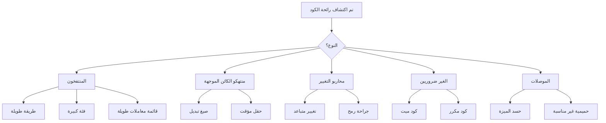

## نظرة عامة

روائح الكود هي مؤشرات على المشاكل المحتملة في الكود. فهي لا تعني بالضرورة أن الكود معطل، لكنها تشير إلى مناطق يمكن أن تستفيد من إعادة الهيكلة.

## روائح الكود الشائعة



## المنتفخون

### طريقة طويلة

```php
// رائحة: الطريقة تفعل الكثير
function processArticleSubmission($data) {
    // أكثر من 100 سطر من التحقق والحفظ والإخطار إلخ
}

// الحل: استخرج إلى طرق مركزة
function processArticleSubmission(array $data): Article
{
    $this->validateInput($data);
    $article = $this->createArticle($data);
    $this->saveArticle($article);
    $this->notifySubscribers($article);
    return $article;
}
```

### فئة كبيرة (كائن الإله)

```php
// رائحة: الفئة تفعل كل شيء
class ArticleManager {
    public function create() { ... }
    public function delete() { ... }
    public function sendEmail() { ... }
    public function generatePDF() { ... }
    public function exportToExcel() { ... }
    public function validateUser() { ... }
    public function checkPermissions() { ... }
    // ... 50 طريقة إضافية
}

// الحل: انقسم إلى فئات مركزة
class ArticleService { ... }
class ArticleExporter { ... }
class ArticleNotifier { ... }
class PermissionChecker { ... }
```

### قائمة معاملات طويلة

```php
// رائحة: معاملات كثيرة جداً
function createArticle($title, $content, $author, $category, $tags, $status, $publishDate, $featured, $image) { ... }

// الحل: استخدم كائن معامل
class CreateArticleCommand {
    public string $title;
    public string $content;
    public int $authorId;
    public int $categoryId;
    public array $tags;
    public string $status;
    public ?DateTime $publishDate;
    public bool $featured;
    public ?string $image;
}

function createArticle(CreateArticleCommand $command): Article { ... }
```

## منتهكو الكائن الموجهة

### صيغ التبديل

```php
// رائحة: التحقق من النوع مع التبديل
function getDiscount($userType) {
    switch ($userType) {
        case 'regular':
            return 0;
        case 'premium':
            return 10;
        case 'vip':
            return 20;
        default:
            return 0;
    }
}

// الحل: استخدم تعدد الأشكال
interface UserType {
    public function getDiscount(): int;
}

class RegularUser implements UserType {
    public function getDiscount(): int { return 0; }
}

class PremiumUser implements UserType {
    public function getDiscount(): int { return 10; }
}

class VipUser implements UserType {
    public function getDiscount(): int { return 20; }
}
```

### حقل مؤقت

```php
// رائحة: الحقول تُستخدم فقط في حالات معينة
class Article {
    private $tempCalculatedScore;

    public function search($terms) {
        $this->tempCalculatedScore = $this->calculateScore($terms);
        // ... استخدم الدرجة
    }
}

// الحل: مرر كمعامل أو قيمة إرجاع
class Article {
    public function getSearchScore(array $terms): float {
        return $this->calculateScore($terms);
    }
}
```

## محاربو التغيير

### تغيير متباعد

```php
// رائحة: فئة واحدة تتغير لأسباب عديدة مختلفة
class Article {
    public function save() { ... } // تغيير قاعدة البيانات
    public function toJson() { ... } // تغيير صيغة API
    public function validate() { ... } // تغيير قواعد الأعمال
    public function render() { ... } // تغيير الواجهة
}

// الحل: افصل المسؤوليات
class Article { ... } // كائن المجال فقط
class ArticleRepository { public function save() { ... } }
class ArticleSerializer { public function toJson() { ... } }
class ArticleValidator { public function validate() { ... } }
```

### جراحة رمح

```php
// رائحة: التغيير الواحد يتطلب عمليات تحرير ملف عديدة
// تغيير صيغة التاريخ يتطلب تحرير:
// - ArticleController.php
// - ArticleView.php
// - ArticleAPI.php
// - ArticleExport.php

// الحل: مركزيّة
class DateFormatter {
    public function format(DateTime $date): string {
        return $date->format($this->config->get('date_format'));
    }
}
```

## الغير ضروريين

### كود ميت

```php
// رائحة: كود غير قابل للوصول أو غير مستخدم
function processData($data) {
    if (true) {
        return $this->handleData($data);
    }
    // لا يتنفذ أبداً
    return $this->legacyHandler($data);
}

// الطريقة القديمة غير المستخدمة لا تزال في قاعدة الكود
function oldMethod() {
    // لم تُستدعَ في أي مكان
}

// الحل: احذف الكود الميت
function processData($data) {
    return $this->handleData($data);
}
```

### كود مكرر

```php
// رائحة: نفس المنطق في أماكن متعددة
class ArticleHandler {
    public function getActive() {
        $criteria = new CriteriaCompo();
        $criteria->add(new Criteria('status', 'active'));
        return $this->getObjects($criteria);
    }
}

class NewsHandler {
    public function getActive() {
        $criteria = new CriteriaCompo();
        $criteria->add(new Criteria('status', 'active'));
        return $this->getObjects($criteria);
    }
}

// الحل: استخرج السلوك المشترك
trait ActiveRecordsTrait {
    public function getActive(): array {
        $criteria = new CriteriaCompo();
        $criteria->add(new Criteria('status', 'active'));
        return $this->getObjects($criteria);
    }
}
```

## الموصلات

### حسد الميزة

```php
// رائحة: الطريقة تستخدم بيانات الكائن الآخر أكثر من بيانات الكائن الخاص بها
class Invoice {
    public function calculateTotal(Customer $customer) {
        $total = 0;
        foreach ($this->items as $item) {
            $total += $item->price;
        }
        // استخدم بيانات العميل بشكل مكثيف
        if ($customer->isPremium()) {
            $total *= (1 - $customer->getDiscountRate());
        }
        if ($customer->getCountry() === 'US') {
            $total *= 1.08; // الضريبة
        }
        return $total;
    }
}

// الحل: انقل السلوك إلى الكائن الذي يحتوي على البيانات
class Customer {
    public function applyDiscount(float $amount): float {
        return $this->isPremium()
            ? $amount * (1 - $this->discountRate)
            : $amount;
    }

    public function applyTax(float $amount): float {
        return $this->country === 'US'
            ? $amount * 1.08
            : $amount;
    }
}
```

## قائمة التحقق من إعادة الهيكلة

عند اكتشاف رائحة الكود:

1. **تحديد** - ما نوع رائحة الكود؟
2. **تقييم** - ما مدى تأثير الأثر؟
3. **خطة** - ما تقنية إعادة الهيكلة المطبقة؟
4. **اختبر** - تأكد من وجود الاختبارات قبل إعادة الهيكلة
5. **أعد الهيكلة** - اجعل تغييرات صغيرة وتدريجية
6. **تحقق** - قم بتشغيل الاختبارات بعد كل تغيير

## الوثائق ذات الصلة

- Clean Code Principles
- Code Organization
- Testing Best Practices
