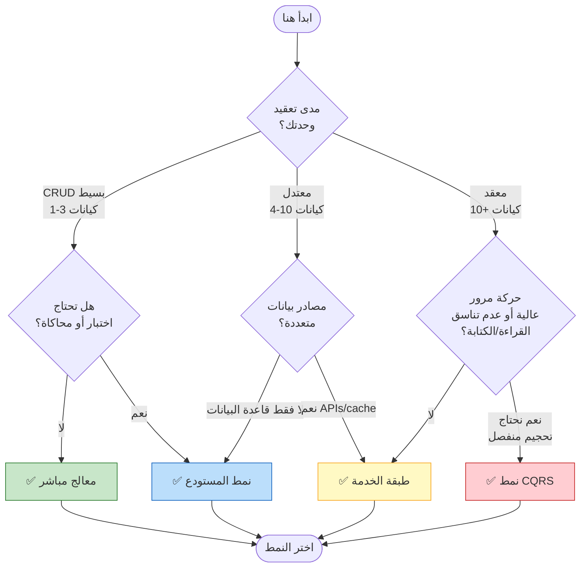

<span class="version-badge version-25x">2.5.x ✅</span> <span class="version-badge version-40x">4.0.x ✅</span>

> **أي نمط يجب أن أستخدم؟** تساعدك شجرة القرار هذه في الاختيار بين معالجات مباشرة وPattern Repository وService Layer و CQRS.

---

## شجرة القرار السريعة



---

## مقارنة النمط

| المعايير | معالج مباشر | المستودع | طبقة الخدمة | CQRS |
|----------|---------------|------------|---------------|------|
| **التعقيد** | ⭐ | ⭐⭐ | ⭐⭐⭐ | ⭐⭐⭐⭐⭐ |
| **قابلية الاختبار** | ❌ صعب | ✅ جيد | ✅ كبير | ✅ كبير |
| **المرونة** | ❌ منخفض | ✅ متوسط | ✅ عالي | ✅ عالي جداً |
| **XOOPS 2.5.x** | ✅ أصلي | ✅ يعمل | ✅ يعمل | ⚠️ معقد |
| **XOOPS 4.0** | ⚠️ مستهلك | ✅ مستحسن | ✅ مستحسن | ✅ للتوسع |
| **حجم الفريق** | 1 مطور | 1-3 مطورين | 2-5 مطورين | 5+ مطورين |
| **الصيانة** | ❌ أعلى | ✅ معتدل | ✅ أقل | ⚠️ يتطلب خبرة |

---

## متى تستخدم كل نمط

### ✅ معالج مباشر (`XoopsPersistableObjectHandler`)

**الأفضل للـ:** وحدات بسيطة وأنماط سريعة وتعلم XOOPS

```php
// بسيط وكل شيء - جيد للوحدات الصغيرة
$handler = xoops_getModuleHandler('article', 'news');
$articles = $handler->getObjects(new Criteria('status', 1));
```

**اختر هذا عندما:**
- بناء وحدة بسيطة مع 1-3 جداول قاعدة بيانات
- إنشاء نموذج أولي سريع
- أنت المطور الوحيد ولا تحتاج اختبارات
- الوحدة لن تنمو بشكل كبير

**القيود:**
- من الصعب اختبار الوحدة (الاعتماد العام)
- الاقتران الوثيق بطبقة قاعدة بيانات XOOPS
- منطق الأعمال يميل إلى التسرب إلى المتحكمات

---

### ✅ نمط المستودع

**الأفضل للـ:** معظم الوحدات والفرق التي تريد قابلية الاختبار

```php
// التجريد يسمح بالمحاكاة للاختبارات
interface ArticleRepositoryInterface {
    public function findPublished(): array;
    public function save(Article $article): void;
}

class XoopsArticleRepository implements ArticleRepositoryInterface {
    private $handler;

    public function __construct() {
        $this->handler = xoops_getModuleHandler('article', 'news');
    }

    public function findPublished(): array {
        return $this->handler->getObjects(new Criteria('status', 1));
    }
}
```

**اختر هذا عندما:**
- تريد كتابة اختبارات الوحدة
- قد تتغير مصادر البيانات لاحقاً (قاعدة البيانات → API)
- العمل مع 2+ مطورين
- بناء وحدات للتوزيع

**مسار الترقية:** هذا هو النمط الموصى به لتحضير XOOPS 4.0.

---

### ✅ طبقة الخدمة

**الأفضل للـ:** وحدات بمنطق أعمال معقد

```php
// خدمة تنسق مستودعات متعددة وتحتوي على قواعد عمل
class ArticlePublicationService {
    public function __construct(
        private ArticleRepositoryInterface $articles,
        private NotificationServiceInterface $notifications,
        private CacheInterface $cache
    ) {}

    public function publish(int $articleId): void {
        $article = $this->articles->find($articleId);
        $article->setStatus('published');
        $article->setPublishedAt(new DateTime());

        $this->articles->save($article);
        $this->notifications->notifySubscribers($article);
        $this->cache->invalidate("article:{$articleId}");
    }
}
```

**اختر هذا عندما:**
- العمليات تمتد عبر مصادر بيانات متعددة
- قواعد الأعمال معقدة
- تحتاج إدارة المعاملات
- أجزاء متعددة من التطبيق تفعل نفس الشيء

**مسار الترقية:** اجمع مع المستودع لعمارة قوية.

---

### ⚠️ CQRS (فصل مسؤولية الأمر والاستعلام)

**الأفضل للـ:** وحدات عالية الحجم مع عدم توازن القراءة/الكتابة

```php
// الأوامر تعديل الحالة
class PublishArticleCommand {
    public function __construct(
        public readonly int $articleId,
        public readonly int $publisherId
    ) {}
}

// الاستعلامات تقرأ الحالة (يمكن استخدام نماذج قراءة غير معايرة)
class GetPublishedArticlesQuery {
    public function __construct(
        public readonly int $limit = 10
    ) {}
}
```

**اختر هذا عندما:**
- القراءات تفوق الكتابات بكثير (100:1 أو أكثر)
- تحتاج تحجيم مختلف للقراءات مقابل الكتابات
- متطلبات التقارير/التحليلات المعقدة
- سوف يستفيد sourcing الأحداث من مجالك

**تحذير:** يضيف CQRS تعقيداً كبيراً. معظم وحدات XOOPS لا تحتاجه.

---

## مسار الترقية الموصى به


### الخطوة 1: لف المعالجات في المستودعات (2-4 ساعات)

1. أنشئ واجهة لاحتياجات وصول البيانات
2. طبقها باستخدام المعالج الموجود
3. اضخ المستودع بدلاً من استدعاء `xoops_getModuleHandler()` مباشرة

### الخطوة 2: أضف طبقة الخدمة عند الحاجة (1-2 يوم)

1. عندما يظهر منطق العمل في المتحكمات، استخرج إلى خدمة
2. الخدمة تستخدم المستودعات وليس المعالجات مباشرة
3. المتحكمات تصبح رقيقة (المسار → الخدمة → الاستجابة)

### الخطوة 3: فكر في CQRS فقط إذا (نادر)

1. لديك ملايين القراءات يومياً
2. نماذج القراءة والكتابة مختلفة بشكل كبير
3. تحتاج sourcing الأحداث للمسارات التدقيق
4. لديك فريق ذو خبرة في CQRS

---

## بطاقة مرجعية سريعة

| السؤال | الإجابة |
|----------|--------|
| **"أنا فقط بحاجة للحفظ/التحميل"** | معالج مباشر |
| **"أريد كتابة الاختبارات"** | نمط المستودع |
| **"لدي قواعد أعمال معقدة"** | طبقة الخدمة |
| **"أحتاج للتحجيم قراءات بشكل منفصل"** | CQRS |
| **"أستعد لـ XOOPS 4.0"** | نمط المستودع + طبقة الخدمة |

---

## الوثائق ذات الصلة

- [دليل نمط المستودع](Patterns/Repository-Pattern.md)
- [دليل نمط طبقة الخدمة](Patterns/Service-Layer-Pattern.md)
- [دليل نمط CQRS](../07-XOOPS-4.0/Implementation-Guides/CQRS-Pattern-Guide.md) *(متقدم)*
- [عقد الوضع الهجين](../07-XOOPS-4.0/Specifications/Hybrid-Mode-Contract.md)

---

#patterns #data-access #decision-tree #best-practices #xoops
