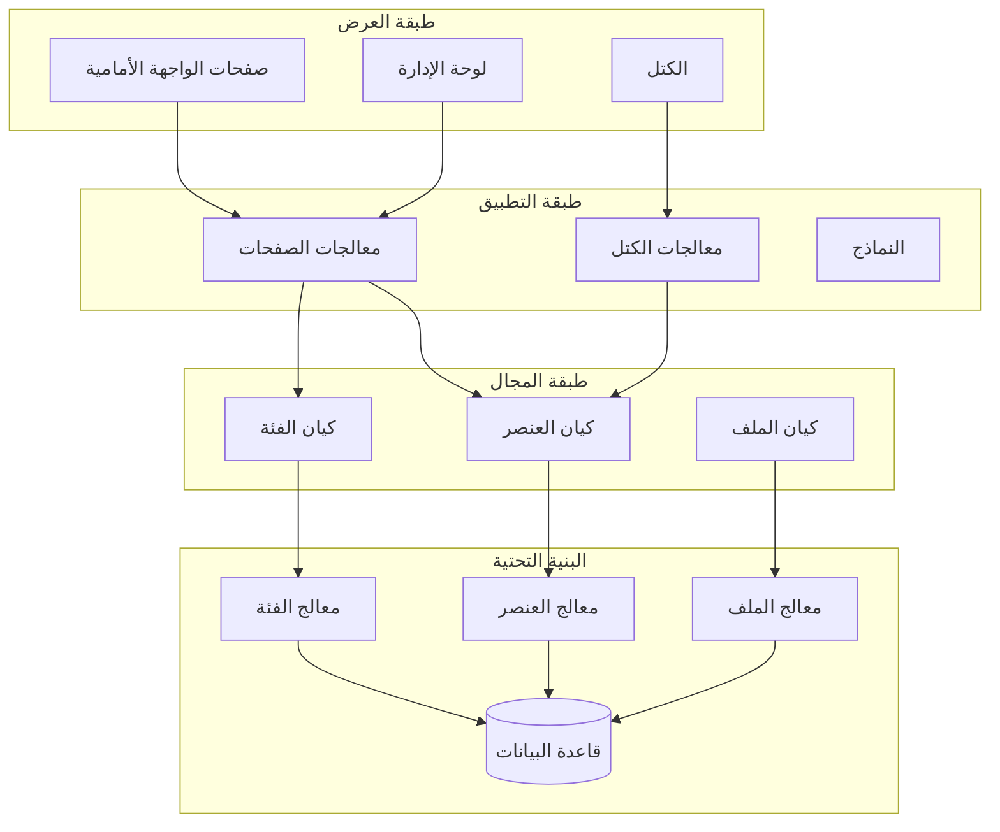
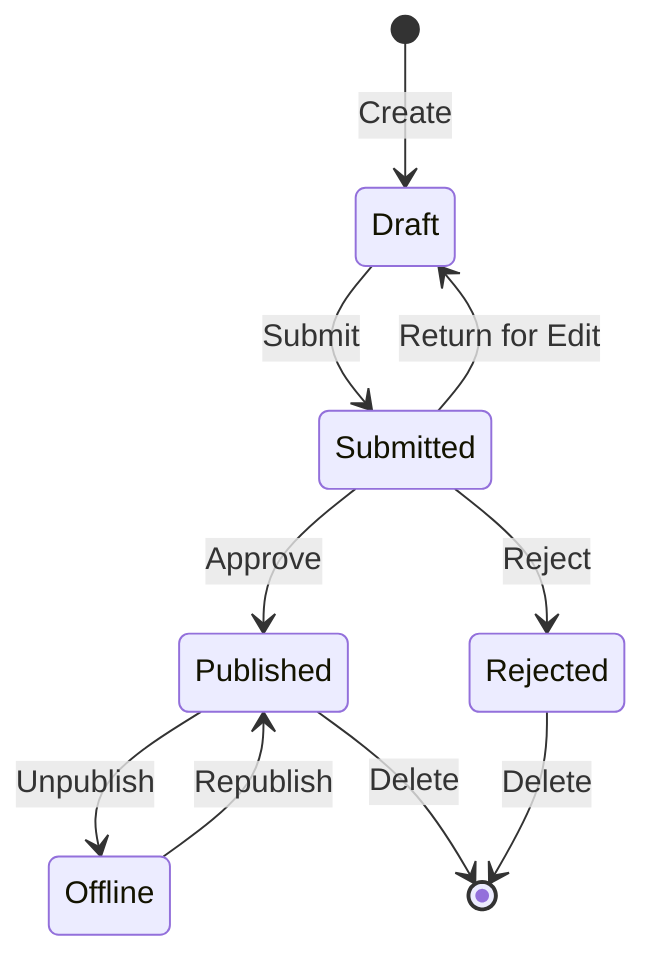

## نظرة عامة

توفر هذه الوثيقة تحليلاً تقنياً لمعمارية وحدة Publisher والأنماط وتفاصيل التنفيذ. استخدم هذا كمرجع لفهم كيفية بناء وحدة XOOPS بجودة الإنتاج.

## نظرة عامة على المعمارية



## هيكل الدليل

```
publisher/
├── admin/
│   ├── index.php           # لوحة معلومات الإدارة
│   ├── item.php            # إدارة المقالات
│   ├── category.php        # إدارة الفئات
│   ├── permission.php      # الأذونات
│   ├── file.php            # مدير الملفات
│   └── menu.php            # قائمة الإدارة
├── assets/
│   ├── css/
│   ├── js/
│   └── images/
├── class/
│   ├── Category.php        # كيان الفئة
│   ├── CategoryHandler.php # الوصول إلى بيانات الفئة
│   ├── Item.php            # كيان المقالة
│   ├── ItemHandler.php     # الوصول إلى بيانات المقالة
│   ├── File.php            # مرفق الملف
│   ├── FileHandler.php     # الوصول إلى بيانات الملف
│   ├── Form/               # فئات النموذج
│   ├── Common/             # الأدوات المساعدة
│   └── Helper.php          # مساعد الوحدة
├── include/
│   ├── common.php          # التهيئة
│   ├── functions.php       # وظائف الأداة
│   ├── oninstall.php       # خطاطيف التثبيت
│   ├── onupdate.php        # خطاطيف التحديث
│   └── search.php          # تكامل البحث
├── language/
├── templates/
├── sql/
└── xoops_version.php
```

## تحليل الكيانات

### كيان العنصر (المقالة)

```php
class Item extends \XoopsObject
{
    // الحقول
    public function initVar(): void
    {
        $this->initVar('itemid', XOBJ_DTYPE_INT, null, false);
        $this->initVar('categoryid', XOBJ_DTYPE_INT, 0, false);
        $this->initVar('title', XOBJ_DTYPE_TXTBOX, '', true);
        $this->initVar('subtitle', XOBJ_DTYPE_TXTBOX, '');
        $this->initVar('summary', XOBJ_DTYPE_TXTAREA, '');
        $this->initVar('body', XOBJ_DTYPE_TXTAREA, '', true);
        $this->initVar('uid', XOBJ_DTYPE_INT, 0);
        $this->initVar('status', XOBJ_DTYPE_INT, 0);
        $this->initVar('datesub', XOBJ_DTYPE_INT, time());
        // ... المزيد من الحقول
    }

    // طرق الأعمال
    public function isPublished(): bool
    {
        return $this->getVar('status') == _PUBLISHER_STATUS_PUBLISHED;
    }

    public function canEdit(int $userId): bool
    {
        return $this->getVar('uid') == $userId
            || $this->isAdmin($userId);
    }
}
```

### نمط المعالج

```php
class ItemHandler extends \XoopsPersistableObjectHandler
{
    public function __construct(\XoopsDatabase $db)
    {
        parent::__construct(
            $db,
            'publisher_items',
            Item::class,
            'itemid',
            'title'
        );
    }

    public function getPublishedItems(int $limit = 10): array
    {
        $criteria = new \CriteriaCompo();
        $criteria->add(new \Criteria('status', _PUBLISHER_STATUS_PUBLISHED));
        $criteria->setSort('datesub');
        $criteria->setOrder('DESC');
        $criteria->setLimit($limit);

        return $this->getObjects($criteria);
    }
}
```

## نظام الأذونات

### أنواع الأذونات

| الإذن | الوصف |
|------------|-------------|
| `publisher_view` | عرض الفئة/المقالات |
| `publisher_submit` | تقديم مقالات جديدة |
| `publisher_approve` | موافقة تلقائية على التقديمات |
| `publisher_moderate` | مراجعة المقالات المعلقة |
| `publisher_global` | أذونات الوحدة العالمية |

### فحص الأذونات

```php
class PermissionHandler
{
    public function isGranted(string $permission, int $categoryId): bool
    {
        $userId = $GLOBALS['xoopsUser']?->uid() ?? 0;
        $groups = $this->getUserGroups($userId);

        return $this->grouppermHandler->checkRight(
            $permission,
            $categoryId,
            $groups,
            $this->helper->getModule()->mid()
        );
    }
}
```

## حالات سير العمل



## هيكل القالب

### قوالب الواجهة الأمامية

| القالب | الغرض |
|----------|---------|
| `publisher_index.tpl` | الصفحة الرئيسية للوحدة |
| `publisher_item.tpl` | مقالة واحدة |
| `publisher_category.tpl` | قائمة الفئات |
| `publisher_submit.tpl` | نموذج التقديم |
| `publisher_search.tpl` | نتائج البحث |

### قوالب الكتل

| القالب | الغرض |
|----------|---------|
| `publisher_block_latest.tpl` | مقالات حديثة |
| `publisher_block_spotlight.tpl` | مقالة مميزة |
| `publisher_block_category.tpl` | قائمة الفئات |

## الأنماط الرئيسية المستخدمة

1. **نمط المعالج** - تغليف الوصول إلى البيانات
2. **كائن القيمة** - ثوابت الحالة
3. **طريقة النموذج** - إنشاء النموذج
4. **الإستراتيجية** - أوضاع العرض المختلفة
5. **المراقب** - الإخطارات عند الأحداث

## الدروس لتطوير الوحدات

1. استخدم XoopsPersistableObjectHandler للعمليات CRUD
2. تنفيذ أذونات حبيبية
3. فصل العرض عن المنطق
4. استخدم Criteria للاستعلامات
5. دعم حالات محتوى متعددة
6. التكامل مع نظام الإخطارات XOOPS

## الوثائق ذات الصلة

- Creating-Articles - إدارة المقالات
- Managing-Categories - نظام الفئات
- Permissions-Setup - إعداد الأذونات
- Developer-Guide/Hooks-and-Events - نقاط الامتداد
