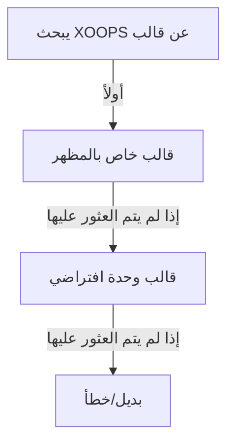

# القوالب المخصصة في Publisher

> دليل إنشاء وتخصيص قوالب Publisher باستخدام Smarty و CSS و HTML override.

---

## نظرة عامة نظام القوالب

### ما هي القوالب؟

تتحكم القوالب في كيفية عرض Publisher للمحتوى:

```
عرض القوالب:
  ├── عرض المقالة
  ├── قوائم الفئات
  ├── صفحات الأرشيف
  ├── قوائم المقالات
  ├── أقسام التعليقات
  ├── نتائج البحث
  ├── الكتل
  └── صفحات المسؤول
```

### أنواع القوالس

```
القوالس الأساسية:
  ├── publisher_index.tpl (الصفحة الرئيسية للوحدة)
  ├── publisher_item.tpl (مقالة واحدة)
  ├── publisher_category.tpl (صفحة الفئة)
  └── publisher_archive.tpl (عرض الأرشيف)

قوالس الكتل:
  ├── publisher_block_latest.tpl
  ├── publisher_block_categories.tpl
  ├── publisher_block_archives.tpl
  └── publisher_block_top.tpl

قوالس المسؤول:
  ├── admin_articles.tpl
  ├── admin_categories.tpl
  └── admin_*
```

---

## أدلة قوالس

### هيكل ملفات القوالس

```
تثبيت XOOPS:
├── modules/publisher/
│   └── templates/
│       ├── Publisher/ (القوالب الأساسية)
│       │   ├── publisher_index.tpl
│       │   ├── publisher_item.tpl
│       │   ├── publisher_category.tpl
│       │   ├── blocks/
│       │   │   ├── publisher_block_latest.tpl
│       │   │   └── publisher_block_categories.tpl
│       │   └── css/
│       │       └── publisher.css
│       └── Themes/ (خاصة بالمظهر)
│           ├── Classic/
│           ├── Modern/
│           └── Dark/

themes/yourtheme/
└── modules/
    └── publisher/
        ├── templates/
        │   └── publisher_custom.tpl
        ├── css/
        │   └── custom.css
        └── images/
            └── icons/
```

### التسلسل الهرمي للقالب



---

## إنشاء قوالس مخصصة

### نسخ القالب إلى المظهر

**الطريقة 1: عبر مدير الملفات**

```
1. انتقل إلى /themes/yourtheme/modules/publisher/
2. إنشاء الدليل إذا لم يكن موجوداً:
   - templates/
   - css/
   - js/ (اختياري)
3. نسخ ملف قالب الوحدة:
   modules/publisher/templates/Publisher/publisher_item.tpl
   → themes/yourtheme/modules/publisher/templates/publisher_item.tpl
4. تحرير نسخة المظهر (ليس نسخة الوحدة!)
```

**الطريقة 2: عبر FTP/SSH**

```bash
# إنشاء دليل تجاوز المظهر
mkdir -p /path/to/xoops/themes/yourtheme/modules/publisher/templates

# نسخ ملفات القالب
cp /path/to/xoops/modules/publisher/templates/Publisher/*.tpl \
   /path/to/xoops/themes/yourtheme/modules/publisher/templates/

# التحقق من نسخ الملفات
ls /path/to/xoops/themes/yourtheme/modules/publisher/templates/
```

### تحرير القالب المخصص

افتح نسخة المظهر في محرر نصوص:

```
الملف: /themes/yourtheme/modules/publisher/templates/publisher_item.tpl

تحرير:
  1. حافظ على متغيرات Smarty
  2. عدّل هيكل HTML
  3. أضف فئات CSS مخصصة
  4. اضبط منطق العرض
```

---

## أساسيات قالب Smarty

### متغيرات Smarty

توفر Publisher متغيرات للقوالس:

#### متغيرات المقالة

```smarty
{* متغيرات المقالة الواحدة *}
<h1>{$item->title()}</h1>
<p>{$item->description()}</p>
<p>{$item->body()}</p>
<p>بقلم {$item->uname()} في {$item->date('l, F j, Y')}</p>
<p>الفئة: {$item->category}</p>
<p>المشاهدات: {$item->views()}</p>
```

#### متغيرات الفئة

```smarty
{* متغيرات الفئة *}
<h2>{$category->name()}</h2>
<p>{$category->description()}</p>
image()}" alt="{$category->name()}">
<p>المقالات: {$category->itemCount()}</p>
```

#### متغيرات الكتلة

```smarty
{* كتلة أحدث المقالات *}
{foreach from=$items item=item}
  <div class="article">
    <h3>{$item->title()}</h3>
    <p>{$item->summary()}</p>
  </div>
{/foreach}
```

### بناء جملة Smarty الشائع

```smarty
{* متغير *}
{$variable}
{$array.key}
{$object->method()}

{* شرط *}
{if $condition}
  <p>محتوى يظهر إذا كان صحيحاً</p>
{else}
  <p>محتوى يظهر إذا كان خاطئاً</p>
{/if}

{* حلقة *}
{foreach from=$array item=item}
  <li>{$item}</li>
{/foreach}

{* دوال *}
{$variable|truncate:100:"..."}
{$date|date_format:"%Y-%m-%d"}
{$text|htmlspecialchars}

{* تعليقات *}
{* هذا تعليق Smarty، غير مُعروض *}
```

---

## أمثلة القوالس

### قالب مقالة واحدة

**الملف: publisher_item.tpl**

```smarty
<!-- عرض تفاصيل المقالة -->
<div class="publisher-item">

  <!-- قسم الرأس -->
  <div class="article-header">
    <h1>{$item->title()}</h1>

    {if $item->subtitle()}
      <h2 class="article-subtitle">{$item->subtitle()}</h2>
    {/if}

    <div class="article-meta">
      <span class="author">
        بقلم <a href="{$item->authorUrl()}">{$item->uname()}</a>
      </span>
      <span class="date">
        {$item->date('l, F j, Y')}
      </span>
      <span class="category">
        <a href="{$item->categoryUrl()}">
          {$item->category}
        </a>
      </span>
      <span class="views">
        {$item->views()} مشاهدة
      </span>
    </div>
  </div>

  <!-- صورة مميزة -->
  {if $item->image()}
    <div class="article-featured-image">
      image()}"
           alt="{$item->title()}"
           class="img-fluid">
    </div>
  {/if}

  <!-- محتوى المقالة -->
  <div class="article-content">
    {$item->body()}
  </div>

  <!-- الوسوم -->
  {if $item->tags()}
    <div class="article-tags">
      <strong>الوسوم:</strong>
      {foreach from=$item->tags() item=tag}
        <span class="tag">
          <a href="{$tag->url()}">{$tag->name()}</a>
        </span>
      {/foreach}
    </div>
  {/if}

  <!-- قسم الذيل -->
  <div class="article-footer">
    <div class="article-actions">
      {if $canEdit}
        <a href="{$editUrl}" class="btn btn-primary">تحرير</a>
      {/if}
      {if $canDelete}
        <a href="{$deleteUrl}" class="btn btn-danger">حذف</a>
      {/if}
    </div>

    {if $allowRatings}
      <div class="article-rating">
        <!-- مكون التقييم -->
      </div>
    {/if}
  </div>

</div>

<!-- قسم التعليقات -->
{if $allowComments}
  <div class="article-comments">
    <h3>التعليقات</h3>
    {include file="publisher_comments.tpl"}
  </div>
{/if}
```

### قالب قائمة الفئات

**الملف: publisher_category.tpl**

```smarty
<!-- صفحة الفئة -->
<div class="publisher-category">

  <!-- رأس الفئة -->
  <div class="category-header">
    <h1>{$category->name()}</h1>

    {if $category->image()}
      image()}"
           alt="{$category->name()}"
           class="category-image">
    {/if}

    {if $category->description()}
      <p class="category-description">
        {$category->description()}
      </p>
    {/if}
  </div>

  <!-- الفئات الفرعية -->
  {if $subcategories}
    <div class="subcategories">
      <h3>الفئات الفرعية</h3>
      <ul>
        {foreach from=$subcategories item=sub}
          <li>
            <a href="{$sub->url()}">{$sub->name()}</a>
            ({$sub->itemCount()} مقالة)
          </li>
        {/foreach}
      </ul>
    </div>
  {/if}

  <!-- قائمة المقالات -->
  <div class="articles-list">
    <h2>المقالات</h2>

    {if count($items) > 0}
      {foreach from=$items item=item}
        <article class="article-preview">
          {if $item->image()}
            <div class="article-image">
              <a href="{$item->url()}">
                image()}" alt="{$item->title()}">
              </a>
            </div>
          {/if}

          <div class="article-content">
            <h3>
              <a href="{$item->url()}">{$item->title()}</a>
            </h3>

            <div class="article-meta">
              <span class="date">{$item->date('M d, Y')}</span>
              <span class="author">بقلم {$item->uname()}</span>
            </div>

            <p class="article-excerpt">
              {$item->description()|truncate:200:"..."}
            </p>

            <a href="{$item->url()}" class="read-more">
              اقرأ المزيد →
            </a>
          </div>
        </article>
      {/foreach}

      <!-- الترقيم -->
      {if $pagination}
        <nav class="pagination">
          {$pagination}
        </nav>
      {/if}
    {else}
      <p class="no-articles">
        لا توجد مقالات في هذه الفئة بعد.
      </p>
    {/if}
  </div>

</div>
```

### قالب كتلة أحدث المقالات

**الملف: publisher_block_latest.tpl**

```smarty
<!-- كتلة أحدث المقالات -->
<div class="publisher-block-latest">
  <h3>{$block_title|default:"أحدث المقالات"}</h3>

  {if count($items) > 0}
    <ul class="article-list">
      {foreach from=$items item=item name=articles}
        <li class="article-item">
          <a href="{$item->url()}" title="{$item->title()}">
            {$item->title()}
          </a>
          <span class="date">
            {$item->date('M d, Y')}
          </span>

          {if $show_summary && $item->description()}
            <p class="summary">
              {$item->description()|truncate:80:"..."}
            </p>
          {/if}
        </li>
      {/foreach}
    </ul>
  {else}
    <p>لا توجد مقالات متاحة.</p>
  {/if}
</div>
```

---

## التنسيق باستخدام CSS

### ملفات CSS مخصصة

إنشاء CSS مخصص في المظهر:

```
/themes/yourtheme/modules/publisher/css/custom.css
```

### هيكل القالب الأساسي

فهم بنية HTML:

```html
<!-- وحدة Publisher -->
<div class="publisher-module">

  <!-- عرض العنصر -->
  <div class="publisher-item">
    <div class="article-header">...</div>
    <div class="article-featured-image">...</div>
    <div class="article-content">...</div>
    <div class="article-footer">...</div>
  </div>

  <!-- عرض الفئة -->
  <div class="publisher-category">
    <div class="category-header">...</div>
    <div class="articles-list">...</div>
  </div>

  <!-- كتلة -->
  <div class="publisher-block-latest">
    <ul class="article-list">...</ul>
  </div>

</div>
```

### أمثلة CSS

```css
/* حاوية المقالة */
.publisher-item {
  background: #fff;
  border: 1px solid #ddd;
  border-radius: 4px;
  padding: 20px;
  margin-bottom: 20px;
}

/* رأس المقالة */
.article-header {
  border-bottom: 2px solid #f0f0f0;
  padding-bottom: 15px;
  margin-bottom: 20px;
}

.article-header h1 {
  font-size: 2.5em;
  margin: 0 0 10px 0;
  color: #333;
}

.article-subtitle {
  font-size: 1.3em;
  color: #666;
  font-style: italic;
  margin: 0;
}

/* معلومات المقالة الفوقية -->
.article-meta {
  font-size: 0.9em;
  color: #999;
}

.article-meta span {
  margin-right: 20px;
}

.article-meta a {
  color: #0066cc;
  text-decoration: none;
}

.article-meta a:hover {
  text-decoration: underline;
}

/* صورة مميزة للمقالة -->
.article-featured-image {
  margin: 20px 0;
  text-align: center;
}

.article-featured-image img {
  max-width: 100%;
  height: auto;
  border-radius: 4px;
}

/* محتوى المقالة -->
.article-content {
  font-size: 1.1em;
  line-height: 1.8;
  color: #333;
}

.article-content h2 {
  font-size: 1.8em;
  margin: 30px 0 15px 0;
  color: #222;
}

.article-content h3 {
  font-size: 1.4em;
  margin: 20px 0 10px 0;
  color: #444;
}

.article-content p {
  margin-bottom: 15px;
}

.article-content ul,
.article-content ol {
  margin: 15px 0 15px 30px;
}

.article-content li {
  margin-bottom: 8px;
}

/* وسوم المقالة -->
.article-tags {
  margin-top: 20px;
  padding-top: 20px;
  border-top: 1px solid #f0f0f0;
}

.tag {
  display: inline-block;
  background: #f0f0f0;
  padding: 5px 10px;
  margin: 5px 5px 5px 0;
  border-radius: 3px;
  font-size: 0.9em;
}

.tag a {
  color: #0066cc;
  text-decoration: none;
}

.tag a:hover {
  text-decoration: underline;
}

/* قائمة مقالات الفئة -->
.publisher-category .articles-list {
  margin-top: 30px;
}

.article-preview {
  display: flex;
  margin-bottom: 30px;
  padding-bottom: 30px;
  border-bottom: 1px solid #f0f0f0;
}

.article-preview:last-child {
  border-bottom: none;
}

.article-image {
  flex: 0 0 200px;
  margin-right: 20px;
}

.article-image img {
  width: 100%;
  height: 150px;
  object-fit: cover;
  border-radius: 4px;
}

.article-content {
  flex: 1;
}

/* متجاوب -->
@media (max-width: 768px) {
  .article-preview {
    flex-direction: column;
  }

  .article-image {
    flex: 1;
    margin: 0 0 15px 0;
  }

  .article-header h1 {
    font-size: 1.8em;
  }
}
```

---

## مرجع متغيرات القالب

### كائن العنصر (المقالة)

```smarty
{* خصائص المقالة *}
{$item->id()}              {* معرف المقالة *}
{$item->title()}           {* عنوان المقالة *}
{$item->description()}     {* الوصف القصير *}
{$item->body()}            {* المحتوى الكامل *}
{$item->subtitle()}        {* العنوان الفرعي *}
{$item->uname()}           {* اسم المؤلف *}
{$item->authorId()}        {* معرف مستخدم المؤلف *}
{$item->date()}            {* تاريخ النشر *}
{$item->modified()}        {* آخر تعديل *}
{$item->image()}           {* صورة مميزة *}
{$item->views()}           {* عدد المشاهدات *}
{$item->categoryId()}      {* معرف الفئة *}
{$item->category()}        {* اسم الفئة *}
{$item->categoryUrl()}     {* رابط الفئة *}
{$item->url()}             {* رابط المقالة *}
{$item->status()}          {* حالة المقالة *}
{$item->rating()}          {* متوسط التقييم *}
{$item->comments()}        {* عدد التعليقات *}
{$item->tags()}            {* صفيف وسوم المقالة *}

{* طرق منسقة *}
{$item->date('Y-m-d')}               {* تاريخ منسق *}
{$item->description()|truncate:100}  {* مختصر *}
```

### كائن الفئة

```smarty
{* خصائص الفئة *}
{$category->id()}          {* معرف الفئة *}
{$category->name()}        {* اسم الفئة *}
{$category->description()} {* الوصف *}
{$category->image()}       {* رابط الصورة *}
{$category->parentId()}    {* معرف الفئة الأب *}
{$category->itemCount()}   {* عدد المقالات *}
{$category->url()}         {* رابط الفئة *}
{$category->status()}      {* الحالة *}
```

### متغيرات الكتلة

```smarty
{$items}           {* صفيف العناصر *}
{$categories}      {* صفيف الفئات *}
{$pagination}      {* HTML الترقيم *}
{$total}           {* العدد الإجمالي *}
{$limit}           {* عناصر في الصفحة *}
{$page}            {* الصفحة الحالية *}
```

---

## شروط القالب

### فحوصات شرطية شائعة

```smarty
{* التحقق من وجود المتغير وعدم كونه فارغاً *}
{if $variable}
  <p>{$variable}</p>
{/if}

{* التحقق من أن الصفيف يحتوي على عناصر *}
{if count($items) > 0}
  {foreach from=$items item=item}
    <li>{$item->title()}</li>
  {/foreach}
{else}
  <p>لا توجد عناصر متاحة.</p>
{/if}

{* التحقق من صلاحيات المستخدم *}
{if $canEdit}
  <a href="edit.php?id={$item->id()}">تحرير</a>
{/if}

{if $isAdmin}
  <a href="delete.php?id={$item->id()}">حذف</a>
{/if}

{* التحقق من إعدادات الوحدة *}
{if $allowComments}
  {include file="publisher_comments.tpl"}
{/if}

{* التحقق من الحالة *}
{if $item->status() == 1}
  <span class="published">منشور</span>
{elseif $item->status() == 0}
  <span class="draft">مسودة</span>
{/if}
```

---

## تقنيات قالب متقدمة

### تضمين قوالس أخرى

```smarty
{* تضمين قالب آخر *}
{include file="publisher_comments.tpl"}

{* تضمين بمتغيرات *}
{include file="publisher_article_preview.tpl" item=$item}

{* تضمين إذا كان موجوداً *}
{include file="custom_header.tpl"|default:"header.tpl"}
```

### تعيين متغيرات في القالب

```smarty
{* تعيين متغير للاستخدام لاحقاً *}
{assign var="articleTitle" value=$item->title()}

{* استخدام المتغير المعين *}
<h1>{$articleTitle}</h1>

{* تعيين قيم معقدة *}
{assign var="count" value=$items|count}
{if $count > 0}
  <p>تم العثور على {$count} مقالة</p>
{/if}
```

### مرشحات القالب

```smarty
{* مرشحات النص *}
{$text|htmlspecialchars}        {* هروب HTML *}
{$text|strip_tags}              {* إزالة وسوم HTML *}
{$text|truncate:100:"..."}     {* اختصار النص *}
{$text|upper}                   {* UPPERCASE *}
{$text|lower}                   {* lowercase *}

{* مرشحات التاريخ *}
{$date|date_format:"%Y-%m-%d"}  {* تنسيق التاريخ *}
{$date|date_format:"%l, %F %j, %Y"} {* تنسيق كامل *}

{* مرشحات الأرقام *}
{$number|string_format:"%.2f"}  {* تنسيق الرقم *}
{$number|number_format}         {* إضافة الفاصلات *}

{* مرشحات الصفيف *}
{$array|implode:", "}           {* دمج الصفيف *}
{$array|count}                  {* عد العناصر *}
```

---

## تصحيح القوالس

### عرض متغيرات Smarty

للتصحيح (أزل في الإنتاج):

```smarty
{* إظهار قيمة المتغير *}
<pre>{$variable|print_r}</pre>

{* إظهار جميع المتغيرات المتاحة *}
<pre>{$smarty.all|print_r}</pre>

{* التحقق من وجود المتغير *}
{if isset($variable)}
  المتغير موجود
{/if}

{* عرض معلومات التصحيح *}
{if $debug}
  العنصر: {$item->id()}<br>
  العنوان: {$item->title()}<br>
  الفئة: {$item->categoryId()}<br>
{/if}
```

### تفعيل وضع التصحيح

في `/modules/publisher/xoops_version.php` أو إعدادات المسؤول:

```php
// تفعيل التصحيح
define('PUBLISHER_DEBUG', true);
```

---

## ترحيل القالب

### من إصدار Publisher القديم

عند الترقية من إصدار أقدم:

1. قارن ملفات القالب القديمة والجديدة
2. دمج التغييرات المخصصة
3. استخدام أسماء المتغيرات الجديدة
4. اختبر بشكل كامل
5. احتفظ بنسخة احتياطية من القوالس القديمة

### مسار الترقية

```
القالب القديم          القالب الجديد          الإجراء
publisher_item.tpl → publisher_item.tpl   دمج التخصيصات
publisher_cat.tpl  → publisher_category.tpl إعادة تسمية، دمج
block_latest.tpl   → publisher_block_latest.tpl إعادة تسمية، فحص
```

---

## أفضل الممارسات

### إرشادات القالب

```
✓ احتفظ بمنطق العمل في PHP، منطق العرض في القوالس
✓ استخدم أسماء فئات CSS ذات معنى
✓ علّق الأقسام المعقدة
✓ اختبر التصميم المستجيب
✓ تحقق من صحة مخرجات HTML
✓ اهروب بيانات المستخدم
✓ استخدم HTML دلالي
✓ احتفظ بالقوالس جافة (لا تكرر نفسك)
```

### نصائح الأداء

```
✓ قلل استعلامات قاعدة البيانات في القوالس
✓ خزن مؤقتاً للقوالس المترجمة
✓ تحميل الصور بطريقة كسول
✓ صغر حجم CSS/JavaScript
✓ استخدم CDN للأصول
✓ حسّن الصور
✗ تجنب منطق Smarty المعقد
```

---

## الوثائق ذات الصلة

- مرجع API
- الخطافات والأحداث
- التكوين
- إنشاء المقالات

---

## الموارد

- [وثائق Smarty](https://www.smarty.net/documentation)
- [مستودع Publisher على GitHub](https://github.com/XoopsModules25x/publisher)
- [دليل قوالب XOOPS](../../02-Core-Concepts/Templates/Smarty-Basics.md)

---

#publisher #templates #smarty #customization #themeing #xoops
