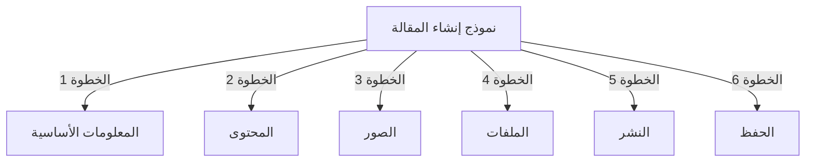
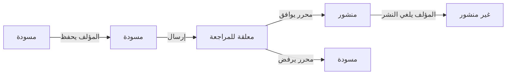
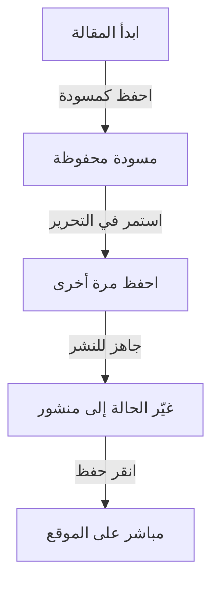

# إنشاء المقالات في Publisher

> دليل خطوة بخطوة لإنشاء وتحرير وتنسيق ونشر المقالات في وحدة Publisher.

---

## الوصول إلى إدارة المقالات

### التنقل في لوحة المسؤول

```
لوحة المسؤول
└── الوحدات
    └── Publisher
        └── المقالات
            ├── إنشاء جديد
            ├── تحرير
            ├── حذف
            └── نشر
```

### أسرع طريق

1. سجّل الدخول كـ **مسؤول**
2. انقر على **الوحدات** في شريط المسؤول
3. ابحث عن **Publisher**
4. انقر على رابط **المسؤول**
5. انقر على **المقالات** في القائمة اليسرى
6. انقر على زر **أضف مقالة**

---

## نموذج إنشاء المقالة

### المعلومات الأساسية

عند إنشاء مقالة جديدة، ملأ الأقسام التالية:



---

## الخطوة 1: المعلومات الأساسية

### حقول مطلوبة

#### عنوان المقالة

```
الحقل: العنوان
النوع: إدخال نصي (مطلوب)
الحد الأقصى: 255 حرفاً
مثال: "أفضل 5 نصائح للتصوير الفوتوغرافي الأفضل"
```

**الإرشادات:**
- واصفة وشاملة
- شمّل الكلمات الرئيسية لمحركات البحث
- تجنب كل الأحرف الكبيرة
- حافظ على أقل من 60 حرفاً للعرض الأفضل

#### اختر الفئة

```
الحقل: الفئة
النوع: القائمة المنسدلة (مطلوب)
الخيارات: قائمة الفئات المنشأة
مثال: التصوير الفوتوغرافي > البرامج التعليمية
```

**نصائح:**
- الفئات الأب والفئات الفرعية متاحة
- اختر الفئة الأكثر صلة
- فئة واحدة فقط لكل مقالة
- يمكن تغييرها لاحقاً

#### العنوان الفرعي للمقالة (اختياري)

```
الحقل: العنوان الفرعي
النوع: إدخال نصي (اختياري)
الحد الأقصى: 255 حرفاً
مثال: "تعلّم أساسيات التصوير الفوتوغرافي في 5 خطوات سهلة"
```

**الاستخدام:**
- نص تلخيصي
- نص المغري
- عنوان موسع

### وصف المقالة

#### الوصف القصير

```
الحقل: الوصف القصير
النوع: منطقة نصية (اختياري)
الحد الأقصى: 500 حرفاً
```

**الغرض:**
- نص معاينة المقالة
- يعرض في قوائم الفئات
- يستخدم في نتائج البحث
- وصف فوقي لـ SEO

**مثال:**
```
"اكتشف تقنيات التصوير الفوتوغرافي الأساسية التي ستحول صورك من عادية إلى غير عادية. يغطي هذا الدليل الشامل التركيب والإضاءة وإعدادات التعريض."
```

#### المحتوى الكامل

```
الحقل: جسم المقالة
النوع: محرر WYSIWYG (مطلوب)
الحد الأقصى: غير محدود
التنسيق: HTML
```

منطقة محتوى المقالة الرئيسية مع تحرير نص غني.

---

## الخطوة 2: تنسيق المحتوى

### استخدام محرر WYSIWYG

#### تنسيق النص

```
غامق:           Ctrl+B أو انقر على زر [B]
مائل:         Ctrl+I أو انقر على زر [I]
تسطير:      Ctrl+U أو انقر على زر [U]
يتوسطه خط:  Alt+Shift+D أو انقر على زر [S]
منخفض:        Ctrl+, (فاصلة)
مرتفع:    Ctrl+. (نقطة)
```

#### هيكل الرؤوس

إنشاء هرمية مستند مناسبة:

```html
<h1>عنوان المقالة</h1>      <!-- استخدم مرة واحدة في الأعلى -->
<h2>القسم الرئيسي</h2>        <!-- للأقسام الكبرى -->
<h3>القسم الفرعي</h3>          <!-- للمواضيع الفرعية -->
<h4>القسم الفرعي الفرعي</h4>  <!-- للتفاصيل -->
```

**في المحرر:**
- انقر على زر **التنسيق**
- اختر مستوى العنوان (H1-H6)
- اكتب العنوان الخاص بك

#### القوائم

**قائمة غير مرتبة (نقاط):**

```markdown
• النقطة الأولى
• النقطة الثانية
• النقطة الثالثة
```

خطوات في المحرر:
1. انقر على زر [≡] قائمة النقاط
2. اكتب كل نقطة
3. اضغط Enter لعنصر التالي
4. اضغط Backspace مرتين للإنهاء

**قائمة مرتبة (مرقمة):**

```markdown
1. الخطوة الأولى
2. الخطوة الثانية
3. الخطوة الثالثة
```

خطوات في المحرر:
1. انقر على زر [1.] قائمة مرقمة
2. اكتب كل عنصر
3. اضغط Enter للتالي
4. اضغط Backspace مرتين للإنهاء

**قوائم متداخلة:**

```markdown
1. النقطة الرئيسية
   a. نقطة فرعية
   b. نقطة فرعية
2. النقطة التالية
```

خطوات:
1. إنشاء قائمة أولى
2. اضغط Tab للمحاذاة إلى اليمين
3. إنشاء عناصر متداخلة
4. اضغط Shift+Tab للعودة إلى اليسار

#### الروابط

**إضافة رابط تشعبي:**

1. حدد النص للارتباط
2. انقر على زر **[🔗] الرابط**
3. أدخل الرابط: `https://example.com`
4. اختياري: أضف العنوان/الهدف
5. انقر على **إدراج الرابط**

**إزالة الرابط:**

1. انقر ضمن النص المرتبط
2. انقر على زر **[🔗] إزالة الرابط**

#### الأكواد والاقتباسات

**اقتباس:**

```
"هذا اقتباس مهم من خبير"
- الإسناد
```

خطوات:
1. اكتب نص الاقتباس
2. انقر على زر **[❝] اقتباس**
3. يتم محاذاة النص وتنسيقه

**كتلة الأكواد:**

```python
def hello_world():
    print("مرحبا بالعالم!")
```

خطوات:
1. انقر على **التنسيق → الأكواد**
2. الصق الأكواد
3. اختر اللغة (اختياري)
4. يعرض الأكواس مع تمييز بناء الجملة

---

## الخطوة 3: إضافة الصور

### صورة مميزة (صورة البطل)

```
الحقل: صورة مميزة / صورة رئيسية
النوع: تحميل صورة
التنسيق: JPG, PNG, GIF, WebP
الحد الأقصى: 5 MB
الموصى به: 600x400 px
```

**للتحميل:**

1. انقر على زر **تحميل صورة**
2. حدد صورة من الكمبيوتر
3. قص/أعد حجم إذا لزم الأمر
4. انقر على **استخدم هذه الصورة**

**موضع الصورة:**
- يعرض في أعلى المقالة
- يستخدم في قوائم الفئات
- يظهر في الأرشيف
- يستخدم للمشاركة الاجتماعية

### صور مضمنة

أدرج صوراً ضمن نص المقالة:

1. ضع المؤشر في المحرر حيث يجب أن تكون الصورة
2. انقر على زر **[🖼️] صورة** في شريط الأدوات
3. اختر خيار التحميل:
   - تحميل صورة جديدة
   - اختر من المعرض
   - أدخل رابط صورة
4. اضبط:
   ```
   حجم الصورة:
   - العرض: 300-600 px
   - الارتفاع: تلقائي (يحافظ على النسبة)
   - المحاذاة: يسار/وسط/يمين
   ```
5. انقر على **إدراج صورة**

**لف النص حول الصورة:**

في المحرر بعد الإدراج:

```html
<!-- الصورة تطفو لليسار، النص يلتف حولها -->

```

### معرض الصور

إنشاء معرض متعدد الصور:

1. انقر على زر **المعرض** (إذا كان متاحاً)
2. تحميل صور متعددة:
   - نقرة واحدة: إضافة واحدة
   - السحب والإفلات: إضافة متعددة
3. رتب الترتيب بالسحب
4. اضبط التسميات التوضيحية لكل صورة
5. انقر على **إنشاء المعرض**

---

## الخطوة 4: إرفاق الملفات

### إضافة مرفقات الملفات

```
الحقل: مرفقات الملفات
النوع: تحميل ملف (متعدد مسموح)
المدعوم: PDF, DOC, XLS, ZIP, إلخ.
الحد الأقصى لكل ملف: 10 MB
الحد الأقصى لكل مقالة: 5 ملفات
```

**للإرفاق:**

1. انقر على زر **إضافة ملف**
2. حدد ملف من الكمبيوتر
3. اختياري: أضف وصف الملف
4. انقر على **إرفاق ملف**
5. كرر للملفات المتعددة

**أمثلة على الملفات:**
- أدلة PDF
- جداول إكسل
- مستندات وورد
- أرشيفات ZIP
- أكواد المصدر

### إدارة الملفات المرفقة

**تحرير الملف:**

1. انقر على اسم الملف
2. حرّر الوصف
3. انقر على **حفظ**

**حذف الملف:**

1. ابحث عن الملف في القائمة
2. انقر على أيقونة **[×] حذف**
3. أكّد الحذف

---

## الخطوة 5: النشر والحالة

### حالة المقالة

```
الحقل: الحالة
النوع: قائمة منسدلة
الخيارات:
  - مسودة: لم ينشر، المؤلف يرى فقط
  - معلقة: انتظار الموافقة
  - منشور: مباشر على الموقع
  - أرشيفي: محتوى قديم
  - غير منشور: كان منشوراً، مخفي الآن
```

**سير العمل للحالة:**



### خيارات النشر

#### النشر الفوري

```
الحالة: منشور
تاريخ البدء: اليوم (ملء تلقائي)
تاريخ الانتهاء: (اترك فارغاً بدون انتهاء صلاحية)
```

#### جدول المستقبل

```
الحالة: مجدول
تاريخ البدء: تاريخ مستقبلي/وقت
مثال: 15 فبراير 2024 في الساعة 9:00 صباحاً
```

ستنشر المقالة تلقائياً في الوقت المحدد.

#### تعيين انتهاء الصلاحية

```
تفعيل انتهاء الصلاحية: نعم
تاريخ انتهاء الصلاحية: تاريخ مستقبلي
الإجراء: أرشيف/إخفاء/حذف
مثال: 1 أبريل 2024 (أرشيف تلقائي للمقالة)
```

### خيارات الرؤية

```yaml
عرض المقالة:
  - عرض على الصفحة الرئيسية: نعم/لا
  - إظهار في الفئة: نعم/لا
  - تضمين في البحث: نعم/لا
  - تضمين في المقالات الحديثة: نعم/لا

مقالة مميزة:
  - وضع علامة مميزة: نعم/لا
  - موضع قسم مميز: (رقم)
```

---

## الخطوة 6: محركات البحث والبيانات الوصفية

### إعدادات محركات البحث

```
الحقل: إعدادات محركات البحث (قسم توسيع)
```

#### وصف فوقي

```
الحقل: وصف فوقي
النوع: نصي (160 حرفاً موصى به)
يستخدم من قبل: محركات البحث، وسائل اجتماعية

مثال:
"تعلّم أساسيات التصوير الفوتوغرافي في 5 خطوات سهلة.
اكتشف تقنيات التركيب والإضاءة والتعريض."
```

#### الكلمات الرئيسية الفوقية

```
الحقل: الكلمات الرئيسية الفوقية
النوع: قائمة مفصولة بفواصل
الحد الأقصى: 5-10 كلمات رئيسية

مثال: التصوير الفوتوغرافي, برنامج تعليمي, التركيب, الإضاءة, التعريض
```

#### عنوان رابط الويب

```
الحقل: عنوان رابط الويب (إنشاء تلقائي من العنوان)
النوع: نصي
التنسيق: أحرف صغيرة، شرطات، بدون مسافات

تلقائي: "أفضل-5-نصائح-للتصوير-الفوتوغرافي-الأفضل"
تحرير: غيّر قبل النشر
```

#### وسوم Open Graph

إنشاء تلقائي من معلومات المقالة:
- العنوان
- الوصف
- الصورة المميزة
- رابط المقالة
- تاريخ النشر

يستخدم من قبل Facebook, LinkedIn, WhatsApp, إلخ.

---

## الخطوة 7: التعليقات والتفاعل

### إعدادات التعليقات

```yaml
السماح بالتعليقات:
  - تفعيل: نعم/لا
  - افتراضي: وراث من التفضيلات
  - تجاوز: خاص بهذه المقالة

الإشراف على التعليقات:
  - يتطلب موافقة: نعم/لا
  - افتراضي: وراث من التفضيلات
```

### إعدادات التقييم

```yaml
السماح بالتقييمات:
  - تفعيل: نعم/لا
  - مقياس: 5 نجوم (افتراضي)
  - إظهار المتوسط: نعم/لا
  - إظهار العدد: نعم/لا
```

---

## الخطوة 8: خيارات متقدمة

### المؤلف والتوقيع

```
الحقل: المؤلف
النوع: قائمة منسدلة
افتراضي: المستخدم الحالي
الخيارات: جميع المستخدمين ذوي صلاحية المؤلف

عرض:
  - إظهار اسم المؤلف: نعم/لا
  - إظهار السيرة الذاتية للمؤلف: نعم/لا
  - إظهار صورة المؤلف: نعم/لا
```

### قفل التحرير

```
الحقل: قفل التحرير
الغرض: منع التغييرات العرضية

قفل المقالة:
  - مقفولة: نعم/لا
  - سبب القفل: "النسخة النهائية"
  - تاريخ فتح القفل: (اختياري)
```

### سجل المراجعات

نسخ محفوظة تلقائياً من المقالة:

```
عرض المراجعات:
  - انقر على "سجل المراجعات"
  - يعرض جميع النسخ المحفوظة
  - قارن النسخ
  - استعيد نسخة سابقة
```

---

## حفظ ونشر

### سير عمل الحفظ



### احفظ المقالة

**حفظ تلقائي:**
- يتم كل 60 ثانية
- يحفظ كمسودة تلقائياً
- يعرض "آخر حفظ: قبل دقيقتين"

**حفظ يدوي:**
- انقر **حفظ واستمر** للبقاء في التحرير
- انقر **حفظ وعرض** لرؤية النسخة المنشورة
- انقر **حفظ** للحفظ والإغلاق

### نشر المقالة

1. اضبط **الحالة**: منشور
2. اضبط **تاريخ البدء**: الآن (أو تاريخ مستقبلي)
3. انقر **حفظ** أو **نشر**
4. تظهر رسالة تأكيد
5. المقالة مباشرة (أو مجدولة)

---

## تحرير المقالات الموجودة

### الوصول إلى محرر المقالة

1. انتقل إلى **Admin → Publisher → Articles**
2. ابحث عن المقالة في القائمة
3. انقر على أيقونة **تحرير**
4. أجر التغييرات
5. انقر **حفظ**

### تحرير جماعي

تحرير مقالات متعددة في نفس الوقت:

```
1. انتقل إلى قائمة المقالات
2. حدد المقالات (صناديق اختيار)
3. اختر "تحرير جماعي" من القائمة المنسدلة
4. غيّر الحقل المحدد
5. انقر "تحديث الكل"

متاح للـ:
  - الحالة
  - الفئة
  - مميزة (نعم/لا)
  - المؤلف
```

### معاينة المقالة

قبل النشر:

1. انقر على زر **معاينة**
2. عرض كما سيراها القراء
3. فحص التنسيق
4. اختبر الروابط
5. العودة إلى المحرر للتعديل

---

## إدارة المقالات

### عرض جميع المقالات

**عرض قائمة المقالات:**

```
Admin → Publisher → Articles

الأعمدة:
  - العنوان
  - الفئة
  - المؤلف
  - الحالة
  - تاريخ الإنشاء
  - تاريخ التعديل
  - إجراءات (تحرير، حذف، معاينة)

الترتيب:
  - حسب العنوان (A-Z)
  - حسب التاريخ (أحدث/أقدم)
  - حسب الحالة (منشور/مسودة)
  - حسب الفئة
```

### تصفية المقالات

```
خيارات التصفية:
  - حسب الفئة
  - حسب الحالة
  - حسب المؤلف
  - حسب نطاق التاريخ
  - البحث حسب العنوان

مثال: إظهار جميع مقالات "مسودة" بواسطة "John" في فئة "أخبار"
```

### حذف المقالة

**حذف ناعم (موصى به):**

1. غيّر **الحالة**: غير منشور
2. انقر **حفظ**
3. المقالة مخفية ولكن لم تُحذف
4. يمكن استعادتها لاحقاً

**حذف قوي:**

1. حدد المقالة في القائمة
2. انقر على زر **حذف**
3. أكّد الحذف
4. المقالة مزالة بشكل دائم

---

## أفضل الممارسات للمحتوى

### كتابة مقالات ذات جودة

```
البنية:
  ✓ عنوان جذاب
  ✓ وصف واضح/عنوان فرعي
  ✓ فقرة افتتاحية جذابة
  ✓ أقسام منطقية مع عناوين
  ✓ صور داعمة
  ✓ خلاصة/ملخص
  ✓ دعوة لاتخاذ إجراء

الطول:
  - مدونات: 500-2000 كلمة
  - أخبار: 300-800 كلمة
  - أدلة: 2000-5000 كلمة
  - الحد الأدنى: 300 كلمة
```

### تحسين محركات البحث

```
تحسين العنوان:
  ✓ تضمين الكلمة الرئيسية الأساسية
  ✓ أقل من 60 حرفاً
  ✓ ضع الكلمة الرئيسية بالقرب من البداية
  ✓ واصفة وشاملة

تحسين المحتوى:
  ✓ استخدم عناوين (H1, H2, H3)
  ✓ تضمين الكلمة الرئيسية في العنوان
  ✓ استخدم غامق للمصطلحات المهمة
  ✓ أضف روابط واصفة
  ✓ تضمين صور مع نص بديل

وصف فوقي:
  ✓ تضمين الكلمة الرئيسية الأساسية
  ✓ 155-160 حرفاً
  ✓ موجهة نحو الإجراء
  ✓ فريدة لكل مقالة
```

### نصائح التنسيق

```
القراءة:
  ✓ فقرات قصيرة (2-4 جمل)
  ✓ نقاط للقوائم
  ✓ عناوين فرعية كل 300 كلمة
  ✓ مسافة بيضاء سخية
  ✓ فواصل سطر بين الأقسام

الجاذبية البصرية:
  ✓ صورة مميزة في الأعلى
  ✓ صور مضمنة في المحتوى
  ✓ نص بديل على جميع الصور
  ✓ كتل أكواد تقنية
  ✓ اقتباسات للتأكيد
```

---

## اختصارات لوحة المفاتيح

### اختصارات المحرر

```
غامق:               Ctrl+B
مائل:             Ctrl+I
تسطير:          Ctrl+U
رابط:               Ctrl+K
حفظ مسودة:         Ctrl+S
```

### اختصارات النص

```
-- →  (شرطة إلى em dash)
... → … (ثلاث نقاط إلى علامة حذف)
(c) → © (حقوق الطبع)
(r) → ® (تسجيل)
(tm) → ™ (علامة تجارية)
```

---

## المهام الشائعة

### نسخ المقالة

1. افتح المقالة
2. انقر على زر **نسخ مكرر** أو **استنساخ**
3. تم نسخ المقالة كمسودة
4. حرّر العنوان والمحتوى
5. نشر

### جدول المقالة

1. إنشاء المقالة
2. اضبط **تاريخ البدء**: تاريخ مستقبلي/وقت
3. اضبط **الحالة**: منشور
4. انقر **حفظ**
5. تنشر المقالة تلقائياً

### نشر جماعي

1. إنشاء المقالات كمسودات
2. اضبط تواريخ النشر
3. تنشر المقالات تلقائياً في الأوقات المجدولة
4. راقب من عرض "مجدول"

### نقل بين الفئات

1. حرّر المقالة
2. غيّر قائمة منسدلة **الفئة**
3. انقر **حفظ**
4. تظهر المقالة في الفئة الجديدة

---

## استكشاف الأخطاء

### المشكلة: لا يمكن حفظ المقالة

**الحل:**
```
1. تحقق من ملء جميع الحقول المطلوبة
2. تحقق من اختيار الفئة
3. تحقق من حد الذاكرة لـ PHP
4. حاول الحفظ كمسودة أولاً
5. امسح ذاكرة الكمبيوتر
```

### المشكلة: الصور لا تعرض

**الحل:**
```
1. تحقق من نجاح التحميل
2. تحقق من تنسيق الصورة (JPG, PNG)
3. تحقق من مسار الصورة في قاعدة البيانات
4. تحقق من صلاحيات دليل الرفع
5. حاول إعادة تحميل الصورة
```

### المشكلة: شريط أدوات المحرر لا يعرض

**الحل:**
```
1. امسح ذاكرة الكمبيوتر
2. جرب متصفح مختلف
3. عطّل ملحقات المتصفح
4. تحقق من وحدة المحرر مثبتة
5. تحقق من خطأ وحدة تحكم JavaScript
```

### المشكلة: المقالة لا تنشر

**الحل:**
```
1. تحقق من الحالة = "منشور"
2. تحقق من تاريخ البدء اليوم أو أقدم
3. تحقق من الصلاحيات تسمح بالنشر
4. تحقق من نشر الفئة
5. امسح ذاكرة تخزين الوحدة
```

---

## الأدلة ذات الصلة

- دليل التكوين
- إدارة الفئات
- إعداد الصلاحيات
- تخصيص القالب

---

## الخطوات التالية

- إنشاء أول مقالة لك
- إعداد الفئات
- تكوين الصلاحيات
- مراجعة تخصيص القالب

---

#publisher #articles #content #creation #formatting #editing #xoops
