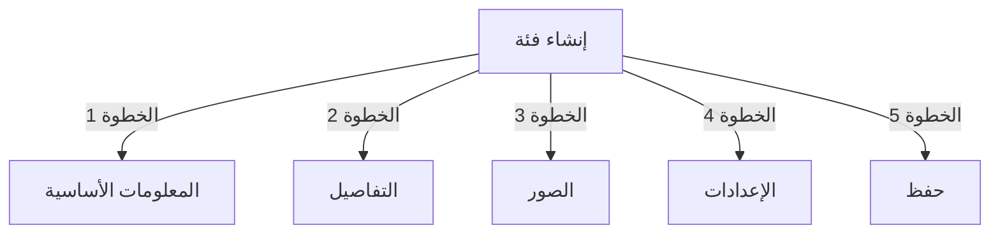

# إدارة الفئات في Publisher

> دليل شامل لإنشاء وتنظيم الهرميات وإدارة الفئات في وحدة Publisher.

---

## أساسيات الفئات

### ما هي الفئات؟

تنظم الفئات المقالات إلى مجموعات منطقية:

```
مثال على الهيكل:

  الأخبار (الفئة الرئيسية)
    ├── التكنولوجيا
    ├── الرياضة
    └── الترفيه

  البرامج التعليمية (الفئة الرئيسية)
    ├── التصوير الفوتوغرافي
    │   ├── الأساسيات
    │   └── المتقدم
    └── الكتابة
        └── التدوين
```

### فوائد هيكل الفئات الجيد

```
✓ تنقل أفضل للمستخدمين
✓ محتوى منظم
✓ تحسين تحسين محركات البحث
✓ إدارة محتوى أسهل
✓ سير عمل تحريري أفضل
```

---

## الوصول إلى إدارة الفئات

### ملاحة لوحة التحكم

```
لوحة التحكم
└── الوحدات
    └── Publisher
        └── الفئات
            ├── إنشاء جديد
            ├── تحرير
            ├── حذف
            ├── الصلاحيات
            └── تنظيم
```

### الوصول السريع

1. تسجيل الدخول كـ **المسؤول**
2. اذهب إلى **التحكم → الوحدات**
3. انقر على **Publisher → المسؤول**
4. انقر على **الفئات** في القائمة اليسرى

---

## إنشاء الفئات

### نموذج إنشاء الفئة



### الخطوة 1: المعلومات الأساسية

#### اسم الفئة

```
الحقل: اسم الفئة
النوع: إدخال نص (مطلوب)
الحد الأقصى: 100 حرف
الفريدة: يجب أن تكون فريدة
مثال: "التصوير الفوتوغرافي"
```

**الإرشادات:**
- وصفي ومفرد أو جمع بشكل متسق
- رأس مال صحيح
- تجنب الأحرف الخاصة
- اجعله قصيرا معقولا

#### وصف الفئة

```
الحقل: الوصف
النوع: منطقة نصية (اختياري)
الحد الأقصى: 500 حرف
المستخدم في: صفحات قائمة الفئات، كتل الفئات
```

**الغرض:**
- يشرح محتوى الفئة
- يظهر فوق مقالات الفئة
- يساعد المستخدمين على فهم النطاق
- مستخدم لوصف ميتا تحسين محركات البحث

**مثال:**
```
"نصائح التصوير الفوتوغرافي والبرامج التعليمية
والإلهام لجميع مستويات المهارة. من أساسيات
التركيب إلى تقنيات الإضاءة المتقدمة، أتقن حرفتك."
```

### الخطوة 2: الفئة الأب

#### إنشاء هيكل هرمي

```
الحقل: الفئة الأب
النوع: القائمة المنسدلة
الخيارات: بلا (جذر)، أو فئات موجودة
```

**أمثلة الهرمية:**

```
هيكل مسطح:
  الأخبار
  البرامج التعليمية
  الآراء

هيكل متداخل:
  الأخبار
    التكنولوجيا
    الأعمال
    الرياضة
  البرامج التعليمية
    التصوير الفوتوغرافي
      الأساسيات
      المتقدم
    الكتابة
```

**إنشاء فئة فرعية:**

1. انقر على قائمة **الفئة الأب** المنسدلة
2. حدد الأب (مثل "الأخبار")
3. املأ اسم الفئة
4. احفظ
5. تظهر الفئة الجديدة كطفل

### الخطوة 3: صورة الفئة

#### تحميل صورة الفئة

```
الحقل: صورة الفئة
النوع: تحميل الصورة (اختياري)
التنسيق: JPG, PNG, GIF, WebP
الحد الأقصى: 5 MB
الموصى به: 300x200 بكسل (أو حجم موضوعك)
```

**للتحميل:**

1. انقر على زر **تحميل صورة**
2. حدد صورة من الكمبيوتر
3. اقص / غير الحجم إذا لزم الأمر
4. انقر على **استخدم هذه الصورة**

**أين يتم استخدامه:**
- صفحة قائمة الفئات
- رأس كتلة الفئة
- فتات الخبز (بعض المواضيع)
- مشاركة وسائل التواصل الاجتماعي

### الخطوة 4: إعدادات الفئة

#### إعدادات العرض

```yaml
الحالة:
  - مفعل: نعم / لا
  - مختفي: نعم / لا (مختفي من القوائم، لا يزال يمكن الوصول إليه)

خيارات العرض:
  - عرض الوصف: نعم / لا
  - عرض الصورة: نعم / لا
  - عرض عدد المقالات: نعم / لا
  - عرض الفئات الفرعية: نعم / لا

التخطيط:
  - المقالات في الصفحة: 10-50
  - ترتيب العرض: التاريخ / العنوان / المؤلف
  - اتجاه العرض: تصاعد / تنازلي
```

#### صلاحيات الفئة

```yaml
من يمكنه العرض:
  - مجهول: نعم / لا
  - مسجل: نعم / لا
  - مجموعات محددة: تكوين لكل مجموعة

من يمكنه الإرسال:
  - مسجل: نعم / لا
  - مجموعات محددة: تكوين لكل مجموعة
  - يجب أن يكون المؤلف لديه: إذن "إرسال المقالات"
```

### الخطوة 5: إعدادات تحسين محركات البحث

#### العلامات الوصفية

```
الحقل: الوصف الوصفي
النوع: نص (160 حرف)
الغرض: وصف محرك البحث

الحقل: كلمات رئيسية وصفية
النوع: قائمة مفصولة بفواصل
مثال: التصوير الفوتوغرافي، البرامج التعليمية، نصائح، تقنيات
```

#### تكوين URL

```
الحقل: عنوان URL
النوع: نص
إنشاء تلقائي من اسم الفئة
مثال: "photography" من "التصوير الفوتوغرافي"
يمكن تخصيصه قبل الحفظ
```

### حفظ الفئة

1. املأ جميع الحقول المطلوبة:
   - اسم الفئة ✓
   - الوصف (موصى به)
2. اختياري: حمل صورة، عيّن تحسين محركات البحث
3. انقر على **حفظ الفئة**
4. تظهر رسالة تأكيد
5. الفئة متاحة الآن

---

## الهيكل الهرمي للفئة

### إنشاء هيكل متداخل

```
مثال خطوة بخطوة: إنشاء فئة فرعية أخبار → تكنولوجيا

1. اذهب إلى إدارة الفئات
2. انقر على "إضافة فئة"
3. الاسم: "الأخبار"
4. الأب: (اترك فارغا - هذا هو الجذر)
5. احفظ
6. انقر على "إضافة فئة" مرة أخرى
7. الاسم: "التكنولوجيا"
8. الأب: "الأخبار" (حدد من القائمة المنسدلة)
9. احفظ
```

### عرض شجرة الهيكل

```
تظهر طريقة عرض الفئات هيكل الشجرة:

📁 الأخبار
  📄 التكنولوجيا
  📄 الرياضة
  📄 الترفيه
📁 البرامج التعليمية
  📄 التصوير الفوتوغرافي
    📄 الأساسيات
    📄 المتقدم
  📄 الكتابة
```

انقر على أسهم التوسيع لإظهار / إخفاء الفئات الفرعية.

### إعادة تنظيم الفئات

#### نقل الفئة

1. اذهب إلى قائمة الفئات
2. انقر على **تحرير** في الفئة
3. غيّر **الفئة الأب**
4. انقر على **حفظ**
5. تم نقل الفئة إلى موضع جديد

#### إعادة ترتيب الفئات

إذا كانت متاحة، استخدم السحب والإفلات:

1. اذهب إلى قائمة الفئات
2. انقر واسحب الفئة
3. أسقط في موضع جديد
4. يتم حفظ الترتيب تلقائياً

#### حذف الفئة

**الخيار 1: الحذف الناعم (إخفاء)**

1. تحرير الفئة
2. تعيين **الحالة**: معطل
3. انقر على **حفظ**
4. الفئة مخفية لكن لم تحذف

**الخيار 2: الحذف الثابت**

1. اذهب إلى قائمة الفئات
2. انقر على **حذف** في الفئة
3. اختر إجراء للمقالات:
   ```
   ☐ نقل المقالات إلى الفئة الأب
   ☐ نقل المقالات إلى الجذر (الأخبار)
   ☐ حذف جميع المقالات في الفئة
   ```
4. تأكيد الحذف

---

## عمليات الفئة

### تحرير الفئة

1. اذهب إلى **التحكم → Publisher → الفئات**
2. انقر على **تحرير** في الفئة
3. عدّل الحقول:
   - الاسم
   - الوصف
   - الفئة الأب
   - الصورة
   - الإعدادات
4. انقر على **حفظ**

### تحرير صلاحيات الفئة

1. اذهب إلى الفئات
2. انقر على **الصلاحيات** في الفئة (أو انقر على الفئة ثم انقر على الصلاحيات)
3. فئات التكوين:

```
لكل مجموعة:
  ☐ عرض المقالات في هذه الفئة
  ☐ إرسال المقالات إلى هذه الفئة
  ☐ تحرير المقالات الخاصة
  ☐ تحرير جميع المقالات
  ☐ الموافقة / الاعتدال على المقالات
  ☐ إدارة الفئة
```

4. انقر على **حفظ الصلاحيات**

### تعيين صورة الفئة

**تحميل صورة جديدة:**

1. تحرير الفئة
2. انقر على **تغيير الصورة**
3. تحميل أو حدد صورة
4. قص / غير الحجم
5. انقر على **استخدم صورة**
6. انقر على **حفظ الفئة**

**إزالة الصورة:**

1. تحرير الفئة
2. انقر على **إزالة الصورة** (إن كانت متاحة)
3. انقر على **حفظ الفئة**

---

## صلاحيات الفئة

### مصفوفة الصلاحيات

```
                 مجهول  مسجل  محرر  مسؤول
عرض الفئة          ✓      ✓      ✓      ✓
إرسال مقالة       ✗      ✓      ✓      ✓
تحرير مقالتك      ✗      ✓      ✓      ✓
تحرير جميع       ✗      ✗      ✓      ✓
تعديل المقالات    ✗      ✗      ✓      ✓
إدارة الفئة       ✗      ✗      ✗      ✓
```

### تعيين صلاحيات مستوى الفئة

#### التحكم في الوصول لكل فئة

1. اذهب إلى قائمة **الفئات**
2. حدد فئة
3. انقر على **الصلاحيات**
4. لكل مجموعة، حدد الصلاحيات:

```
مثال: فئة الأخبار
  مجهول: عرض فقط
  مسجل: إرسال المقالات
  المحررون: الموافقة على المقالات
  المسؤولون: التحكم الكامل
```

5. انقر على **حفظ**

#### صلاحيات مستوى الحقل

التحكم في حقول النموذج التي يمكن للمستخدمين رؤيتها / تحريرها:

```
مثال: تقييد رؤية الحقول للمستخدمين المسجلين

المستخدمون المسجلون يمكنهم رؤية / تحرير:
  ✓ العنوان
  ✓ الوصف
  ✓ المحتوى
  ✗ المؤلف (تعيين تلقائي للمستخدم الحالي)
  ✗ تاريخ مجدول (محررون فقط)
  ✗ مميز (مسؤولون فقط)
```

**تكوين في:**
- صلاحيات الفئة
- ابحث عن قسم "رؤية الحقول"

---

## أفضل الممارسات للفئات

### هيكل الفئة

```
✓ احتفظ بالهرمية بعمق 2-3 مستويات
✗ لا تنشئ عدد كبير جداً من الفئات على المستوى الأعلى
✗ لا تنشئ فئات بمقالة واحدة

✓ استخدم تسمية متسقة (جمع أو مفرد)
✗ لا تستخدم أسماء غامضة ("أشياء"، "أخرى")

✓ أنشئ فئات للمقالات الموجودة
✗ لا تنشئ فئات فارغة مقدماً
```

### إرشادات التسمية

```
أسماء جيدة:
  "التصوير الفوتوغرافي"
  "تطوير الويب"
  "نصائح السفر"
  "أخبار الأعمال"

تجنب:
  "المقالات" (غامضة جداً)
  "المحتوى" (زائدة)
  "الأخبار والتحديثات" (غير متسقة)
  "أشياء التصوير الفوتوغرافي" (تنسيق)
```

### نصائح التنظيم

```
حسب الموضوع:
  الأخبار
    التكنولوجيا
    الرياضة
    الترفيه

حسب النوع:
  البرامج التعليمية
    فيديو
    نص
    تفاعلي

حسب الجمهور:
  للمبتدئين
  للخبراء
  دراسات الحالة

جغرافي:
  أمريكا الشمالية
    الولايات المتحدة
    كندا
  أوروبا
```

---

## كتل الفئة

### كتلة فئة Publisher

عرض قوائم الفئات على موقعك:

1. اذهب إلى **التحكم → الكتل**
2. ابحث عن **Publisher - الفئات**
3. انقر على **تحرير**
4. قم بالتكوين:

```
عنوان الكتلة: "فئات الأخبار"
عرض الفئات الفرعية: نعم / لا
عرض عدد المقالات: نعم / لا
الارتفاع: (بكسل أو تلقائي)
```

5. انقر على **حفظ**

### كتلة مقالات الفئة

عرض أحدث المقالات من فئة معينة:

1. اذهب إلى **التحكم → الكتل**
2. ابحث عن **Publisher - مقالات الفئة**
3. انقر على **تحرير**
4. حدد:

```
الفئة: الأخبار (أو فئة محددة)
عدد المقالات: 5
عرض الصور: نعم / لا
عرض الوصف: نعم / لا
```

5. انقر على **حفظ**

---

## تحليلات الفئة

### عرض إحصائيات الفئة

من إدارة الفئات:

```
تعرض كل فئة:
  - إجمالي المقالات: 45
  - منشور: 42
  - مسودة: 2
  - قيد الانتظار: 1
  - إجمالي المشاهدات: 5,234
  - أحدث مقالة: قبل ساعتين
```

### عرض حركة مرور الفئة

إذا كان التحليل مفعل:

1. انقر على اسم الفئة
2. انقر على علامة التبويب **الإحصائيات**
3. عرض:
   - مشاهدات الصفحات
   - المقالات الشهيرة
   - اتجاهات حركة المرور
   - المصطلحات المستخدمة في البحث

---

## قوالس الفئة

### تخصيص عرض الفئة

إذا كنت تستخدم قوالس مخصصة، يمكن لكل فئة تجاوز:

```
publisher_category.tpl
  ├── رأس الفئة
  ├── وصف الفئة
  ├── صورة الفئة
  ├── قائمة المقالات
  └── الترقيم
```

**للتخصيص:**

1. انسخ ملف القالب
2. عدّل HTML / CSS
3. عين إلى الفئة في المسؤول
4. تستخدم الفئة القالب المخصص

---

## المهام الشائعة

### إنشاء هيكل أخبار

```
التحكم → Publisher → الفئات
1. إنشاء "الأخبار" (الأب)
2. إنشاء "التكنولوجيا" (الأب: الأخبار)
3. إنشاء "الرياضة" (الأب: الأخبار)
4. إنشاء "الترفيه" (الأب: الأخبار)
```

### نقل المقالات بين الفئات

1. اذهب إلى إدارة **المقالات**
2. حدد المقالات (خانات اختيار)
3. اختر **"تغيير الفئة"** من قائمة الإجراءات المجمعة
4. اختر فئة جديدة
5. انقر على **تحديث الكل**

### إخفاء الفئة دون حذفها

1. تحرير الفئة
2. تعيين **الحالة**: معطل / مختفي
3. احفظ
4. الفئة غير مظهرة في القوائم (لا تزال يمكن الوصول إليها عبر URL)

### إنشاء فئة للمسودات

```
أفضل ممارسة:

إنشاء فئة "قيد المراجعة"
  ├── الغرض: المقالات في انتظار الموافقة
  ├── الصلاحيات: مخفية من الجمهور
  ├── يمكن للمسؤولين / المحررين فقط الرؤية
  ├── نقل المقالات هنا حتى الموافقة
  └── نقل إلى "الأخبار" عند نشره
```

---

## استيراد / تصدير الفئات

### تصدير الفئات

إذا كانت متاحة:

1. اذهب إلى إدارة **الفئات**
2. انقر على **تصدير**
3. حدد التنسيق: CSV / JSON / XML
4. نزل الملف
5. تم حفظ النسخة الاحتياطية

### استيراد الفئات

إذا كانت متاحة:

1. حضّر ملف بالفئات
2. اذهب إلى إدارة **الفئات**
3. انقر على **استيراد**
4. حمّل الملف
5. اختر استراتيجية التحديث:
   - إنشاء جديد فقط
   - تحديث الموجود
   - استبدال الكل
6. انقر على **استيراد**

---

## استكشاف أخطاء الفئات

### المشكلة: الفئات الفرعية لا تظهر

**الحل:**
```
1. تحقق من أن حالة الفئة الأب "مفعل"
2. تحقق من الصلاحيات تسمح بالعرض
3. تحقق من الفئات الفرعية لديها حالة "مفعل"
4. امسح الذاكرة: التحكم → الأدوات → مسح الذاكرة
5. تحقق من أن المظهر يعرض الفئات الفرعية
```

### المشكلة: لا يمكن حذف الفئة

**الحل:**
```
1. يجب أن تكون الفئة بدون مقالات
2. نقل أو حذف المقالات أولاً:
   التحكم → المقالات
   حدد المقالات في الفئة
   غيّر الفئة إلى أخرى
3. ثم احذف الفئة الفارغة
4. أو اختر خيار "نقل المقالات" عند الحذف
```

### المشكلة: صورة الفئة لا تظهر

**الحل:**
```
1. تحقق من تحميل الصورة بنجاح
2. تحقق من تنسيق الصورة (JPG, PNG)
3. تحقق من أذونات دليل التحميل
4. تحقق من أن المظهر يعرض صور الفئة
5. حاول إعادة تحميل الصورة
6. امسح ذاكرة التخزين المؤقت للمتصفح
```

### المشكلة: الصلاحيات لا تسري

**الحل:**
```
1. تحقق من صلاحيات المجموعة في الفئة
2. تحقق من صلاحيات Publisher العامة
3. تحقق من أن المستخدم ينتمي إلى مجموعة مكونة
4. امسح ذاكرة جلسة العمل
5. تسجيل الخروج والدخول مجدداً
6. تحقق من تثبيت وحدات الصلاحيات
```

---

## قائمة التحقق من أفضل الممارسات للفئة

قبل نشر الفئات:

- [ ] الهرمية بعمق 2-3 مستويات
- [ ] كل فئة بها 5+ مقالات
- [ ] أسماء الفئات متسقة
- [ ] الصلاحيات مناسبة
- [ ] صور الفئة محسّنة
- [ ] الأوصاف كاملة
- [ ] البيانات الوصفية لتحسين محركات البحث معبأة
- [ ] عناوين URL صديقة
- [ ] الفئات تم اختبارها على الواجهة الأمامية
- [ ] تم تحديث التوثيق

---

## الأدلة ذات الصلة

- إنشاء المقالات
- إدارة الصلاحيات
- تكوين الوحدة
- دليل التثبيت

---

## الخطوات التالية

- إنشاء مقالات في الفئات
- تكوين الصلاحيات
- التخصيص بقوالس مخصصة

---

#publisher #categories #organization #hierarchy #management #xoops
