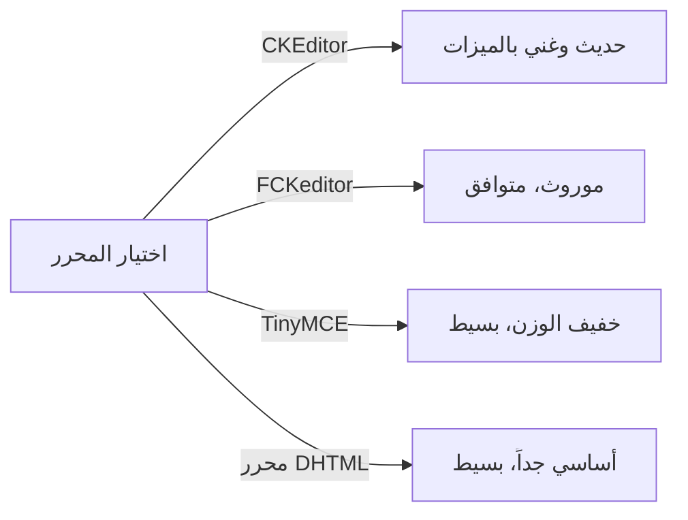
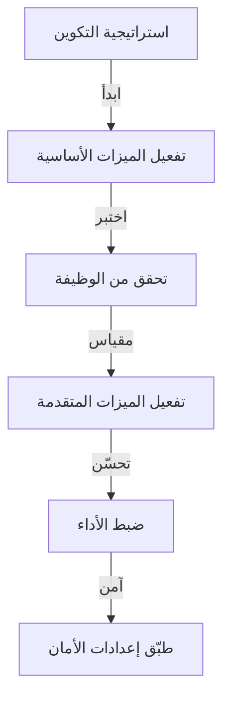

# تكوين Publisher الأساسي

> قم بتكوين إعدادات وحدة Publisher والتفضيلات والخيارات العامة لتثبيت XOOPS الخاص بك.

---

## الوصول إلى التكوين

### ملاحة لوحة التحكم

```
لوحة التحكم XOOPS
└── الوحدات
    └── Publisher
        ├── التفضيلات
        ├── الإعدادات
        └── التكوين
```

1. تسجيل الدخول كـ **المسؤول**
2. اذهب إلى **لوحة التحكم → الوحدات**
3. ابحث عن وحدة **Publisher**
4. انقر على **التفضيلات** أو **رابط المسؤول**

---

## الإعدادات العامة

### الوصول إلى التكوين

```
لوحة التحكم → الوحدات → Publisher
```

انقر على **رمز الترس** أو **الإعدادات** لهذه الخيارات:

#### خيارات العرض

| الإعداد | الخيارات | الافتراضي | الوصف |
|---------|---------|---------|-------------|
| **المقالات في الصفحة** | 5-50 | 10 | المقالات المعروضة في القوائم |
| **عرض فتات الخبز** | نعم / لا | نعم | عرض مسار التنقل |
| **استخدم الترقيم** | نعم / لا | نعم | ترقيم القوائم الطويلة |
| **عرض التاريخ** | نعم / لا | نعم | عرض تاريخ المقالة |
| **عرض الفئة** | نعم / لا | نعم | عرض فئة المقالة |
| **عرض المؤلف** | نعم / لا | نعم | عرض مؤلف المقالة |
| **عرض المشاهدات** | نعم / لا | نعم | عرض عدد مشاهدات المقالة |

**مثال التكوين:**

```yaml
المقالات في الصفحة: 15
عرض فتات الخبز: نعم
استخدم الترقيم: نعم
عرض التاريخ: نعم
عرض الفئة: نعم
عرض المؤلف: نعم
عرض المشاهدات: نعم
```

#### خيارات المؤلف

| الإعداد | الافتراضي | الوصف |
|---------|---------|-------------|
| **عرض اسم المؤلف** | نعم | عرض الاسم الحقيقي أو اسم المستخدم |
| **استخدم اسم المستخدم** | لا | عرض اسم المستخدم بدلاً من الاسم |
| **عرض بريد المؤلف** | لا | عرض بريد المؤلف الإلكتروني |
| **عرض صورة المؤلف** | نعم | عرض صورة المستخدم |

---

## تكوين المحرر

### حدد محرر WYSIWYG

يدعم Publisher عدة محررات:

#### المحررات المتاحة



### CKEditor (الموصى به)

**الأفضل لـ:** معظم المستخدمين، المتصفحات الحديثة، الميزات الكاملة

1. اذهب إلى **التفضيلات**
2. عيّن **المحرر**: CKEditor
3. قم بتكوين الخيارات:

```
المحرر: CKEditor 4.x
شريط الأدوات: ممتلئ
الارتفاع: 400 بكسل
العرض: 100%
أزل الملحقات: []
أضف ملحقات: [mathjax, codesnippet]
```

### FCKeditor

**الأفضل لـ:** التوافق، الأنظمة القديمة

```
المحرر: FCKeditor
شريط الأدوات: افتراضي
التكوين المخصص: (اختياري)
```

### TinyMCE

**الأفضل لـ:** حد أدنى من البصمة، تحرير أساسي

```
المحرر: TinyMCE
الملحقات: [paste, table, link, image]
شريط الأدوات: بسيط
```

---

## ملفات وإعدادات التحميل

### قم بتكوين أدلة التحميل

```
التحكم → Publisher → التفضيلات → إعدادات التحميل
```

#### إعدادات نوع الملف

```yaml
أنواع الملفات المسموحة:
  الصور:
    - jpg
    - jpeg
    - gif
    - png
    - webp
  المستندات:
    - pdf
    - doc
    - docx
    - xls
    - xlsx
    - ppt
    - pptx
  الأرشيفات:
    - zip
    - rar
    - 7z
  الوسائط:
    - mp3
    - mp4
    - webm
    - mov
```

#### حدود حجم الملف

| نوع الملف | الحد الأقصى | ملاحظات |
|-----------|----------|-------|
| **الصور** | 5 MB | لكل ملف صورة |
| **المستندات** | 10 MB | ملفات PDF والمكتب |
| **الوسائط** | 50 MB | ملفات الفيديو / الصوت |
| **جميع الملفات** | 100 MB | إجمالي لكل تحميل |

**التكوين:**

```
الحد الأقصى لحجم تحميل الصورة: 5 MB
الحد الأقصى لحجم تحميل المستند: 10 MB
الحد الأقصى لحجم تحميل الوسائط: 50 MB
إجمالي حجم التحميل: 100 MB
أقصى ملفات لكل مقالة: 5
```

### تغيير حجم الصورة

تقوم Publisher بتغيير حجم الصور تلقائياً للتسق:

```yaml
حجم الصورة المصغرة:
  العرض: 150
  الارتفاع: 150
  الوضع: قص / تغيير الحجم

حجم صورة الفئة:
  العرض: 300
  الارتفاع: 200
  الوضع: تغيير الحجم

صورة المقالة المميزة:
  العرض: 600
  الارتفاع: 400
  الوضع: تغيير الحجم
```

---

## تعليقات وإعدادات التفاعل

### تكوين التعليقات

```
التفضيلات → قسم التعليقات
```

#### خيارات التعليقات

```yaml
السماح بالتعليقات:
  - مفعل: نعم / لا
  - افتراضي: نعم
  - تجاوز لكل مقالة: نعم

اعتدال التعليقات:
  - اعتدال التعليقات: نعم / لا
  - اعتدال تعليقات الضيف فقط: نعم / لا
  - مرشح البريد العشوائي: مفعل
  - الحد الأقصى من التعليقات في اليوم: (غير محدود)

عرض التعليق:
  - تنسيق العرض: محذوف / مسطح
  - التعليقات في الصفحة: 10
  - تنسيق التاريخ: التاريخ الكامل / منذ وقت
  - عرض عدد التعليقات: نعم / لا
```

### تكوين التقييمات

```yaml
السماح بالتقييمات:
  - مفعل: نعم / لا
  - افتراضي: نعم
  - تجاوز لكل مقالة: نعم

خيارات التقييمات:
  - مقياس التقييم: 5 نجوم (افتراضي)
  - السماح للمستخدم بتقييم الخاص: لا
  - عرض متوسط التقييم: نعم
  - عرض عدد التقييمات: نعم
```

---

## محرك البحث والإعدادات

### تحسين محرك البحث

```
التفضيلات → إعدادات تحسين محركات البحث
```

#### تكوين URL

```yaml
عناوين URL لتحسين محركات البحث:
  - مفعل: لا (عيّن على نعم لعناوين URL لتحسين محركات البحث)
  - إعادة كتابة URL: بلا / Apache mod_rewrite / IIS rewrite

تنسيق URL:
  - الفئة: / فئة / أخبار
  - المقالة: / مقالة / مرحبا بالموقع
  - الأرشيف: / أرشيف / 2024/01

الوصف الوصفي:
  - إنشاء تلقائي: نعم
  - الحد الأقصى للطول: 160 حرف

الكلمات الرئيسية الوصفية:
  - إنشاء تلقائي: نعم
  - من: علامات المقالة، العنوان
```

### تفعيل عناوين URL لتحسين محركات البحث (متقدم)

**المتطلبات الأساسية:**
- Apache مع `mod_rewrite` مفعل
- دعم `.htaccess` مفعل

**خطوات التكوين:**

1. اذهب إلى **التفضيلات → إعدادات تحسين محركات البحث**
2. عيّن **عناوين URL لتحسين محركات البحث**: نعم
3. عيّن **إعادة كتابة URL**: Apache mod_rewrite
4. تحقق من وجود ملف `.htaccess` في مجلد Publisher

**تكوين `.htaccess`:**

```apache
<IfModule mod_rewrite.c>
    RewriteEngine On
    RewriteBase /modules/publisher/

    # إعادة كتابة الفئات
    RewriteRule ^category/([0-9]+)-(.*)\.html$ index.php?op=showcategory&categoryid=$1 [L,QSA]

    # إعادة كتابة المقالات
    RewriteRule ^article/([0-9]+)-(.*)\.html$ index.php?op=showitem&itemid=$1 [L,QSA]

    # إعادة كتابة الأرشيفات
    RewriteRule ^archive/([0-9]+)/([0-9]+)/$ index.php?op=archive&year=$1&month=$2 [L,QSA]
</IfModule>
```

---

## الذاكرة والأداء

### تكوين الذاكرة

```
التفضيلات → إعدادات الذاكرة
```

```yaml
تفعيل الذاكرة:
  - مفعل: نعم
  - نوع الذاكرة: ملف (أو Memcache)

مدة حياة الذاكرة:
  - قوائم الفئات: 3600 ثانية (ساعة واحدة)
  - قوائم المقالات: 1800 ثانية (30 دقيقة)
  - مقالة واحدة: 7200 ثانية (ساعتان)
  - كتلة المقالات الحديثة: 900 ثانية (15 دقيقة)

مسح الذاكرة:
  - مسح يدوي: متاح في المسؤول
  - مسح تلقائي عند حفظ المقالة: نعم
  - مسح عند تغيير الفئة: نعم
```

### مسح الذاكرة اليدوي

**مسح الذاكرة اليدوي:**

1. اذهب إلى **التحكم → Publisher → الأدوات**
2. انقر على **مسح الذاكرة**
3. حدد أنواع الذاكرة للمسح:
   - [ ] ذاكرة الفئة
   - [ ] ذاكرة المقالة
   - [ ] ذاكرة الكتلة
   - [ ] كل الذاكرة
4. انقر على **مسح المحدد**

**سطر الأوامر:**

```bash
# امسح كل ذاكرة Publisher
php /path/to/xoops/admin/cache_manage.php publisher

# أو احذف ملفات الذاكرة مباشرة
rm -rf /path/to/xoops/var/cache/publisher/*
```

---

## الإخطار وسير العمل

### إخطارات البريد الإلكتروني

```
التفضيلات → الإخطارات
```

```yaml
إخطار المسؤول بمقالة جديدة:
  - مفعل: نعم
  - المستلم: بريد المسؤول الإلكتروني
  - شمول الملخص: نعم

إخطار المحررين:
  - مفعل: نعم
  - عند الإرسال الجديد: نعم
  - عند المقالات المعلقة: نعم

إخطار المؤلف:
  - عند الموافقة: نعم
  - عند الرفض: نعم
  - عند التعليق: لا (اختياري)
```

### سير العمل

```yaml
طلب الموافقة:
  - مفعل: نعم
  - موافقة المحرر: نعم
  - موافقة المسؤول: لا

حفظ المسودة:
  - فترة الحفظ التلقائي: 60 ثانية
  - حفظ النسخ المحلية: نعم
  - سجل المراجعة: آخر 5 نسخ
```

---

## إعدادات المحتوى

### نشر الافتراضيات

```
التفضيلات → إعدادات المحتوى
```

```yaml
حالة المقالة الافتراضية:
  - المسودة / النشر: مسودة
  - مميزة افتراضياً: لا
  - وقت النشر التلقائي: بلا

الرؤية الافتراضية:
  - عام / خاص: عام
  - عرض على الصفحة الأمامية: نعم
  - عرض في الفئات: نعم

النشر المجدول:
  - مفعل: نعم
  - السماح لكل مقالة: نعم

انتهاء صلاحية المحتوى:
  - مفعل: لا
  - أرشيف تلقائي قديم: لا
  - أرشيف بعد الأيام: (غير محدود)
```

### خيارات محتوى WYSIWYG

```yaml
السماح بـ HTML:
  - في المقالات: نعم
  - في التعليقات: لا

السماح بالوسائط المدمجة:
  - مقاطع فيديو (iframe): نعم
  - الصور: نعم
  - الملحقات: لا

تصفية المحتوى:
  - إزالة العلامات: لا
  - مرشح XSS: نعم (موصى به)
```

---

## إعدادات محرك البحث

### قم بتكوين تكامل البحث

```
التفضيلات → إعدادات البحث
```

```yaml
تفعيل فهرسة المقالات:
  - شمول البحث في الموقع: نعم
  - نوع الفهرس: نص كامل / العنوان فقط

خيارات البحث:
  - البحث في العناوين: نعم
  - البحث في المحتوى: نعم
  - البحث في التعليقات: نعم

الوسوم الوصفية:
  - إنشاء تلقائي: نعم
  - وسوم OG (وسائط اجتماعية): نعم
  - بطاقات تويتر: نعم
```

---

## الإعدادات المتقدمة

### وضع التصحيح (التطوير فقط)

```
التفضيلات → متقدم
```

```yaml
وضع التصحيح:
  - مفعل: لا (للتطوير فقط!)

ميزات التطوير:
  - عرض استعلامات SQL: لا
  - تسجيل الأخطاء: نعم
  - بريد خطأ: admin@example.com
```

### تحسين قاعدة البيانات

```
التحكم → الأدوات → تحسين قاعدة البيانات
```

```bash
# تحسين يدوي
mysql> OPTIMIZE TABLE publisher_items;
mysql> OPTIMIZE TABLE publisher_categories;
mysql> OPTIMIZE TABLE publisher_comments;
```

---

## تخصيص الوحدة

### قوالس المظهر

```
التفضيلات → العرض → القوالس
```

حدد مجموعة القالب:
- افتراضي
- كلاسيكي
- حديث
- مظلم
- مخصص

يتحكم كل قالب في:
- تخطيط المقالة
- قائمة الفئة
- عرض الأرشيف
- عرض التعليق

---

## نصائح التكوين

### أفضل الممارسات



1. **ابدأ بسيط** - فعّل الميزات الأساسية أولاً
2. **اختبر كل تغيير** - تحقق قبل المتابعة
3. **فعّل الذاكرة** - يحسّن الأداء
4. **احفظ نسخة احتياطية أولاً** - صدّر الإعدادات قبل التغييرات الرئيسية
5. **راقب السجلات** - افحص سجلات الأخطاء بانتظام

### تحسين الأداء

```yaml
لأداء أفضل:
  - تفعيل الذاكرة: نعم
  - مدة حياة الذاكرة: 3600 ثانية
  - حد المقالات في الصفحة: 10-15
  - ضغط الصور: نعم
  - تصغير CSS / JS: نعم (إن كان متاحاً)
```

### تقوية الأمان

```yaml
لأمان أفضل:
  - اعتدال التعليقات: نعم
  - تعطيل HTML في التعليقات: نعم
  - تصفية XSS: نعم
  - قائمة بيضاء نوع الملف: صارم
  - الحد الأقصى لحجم التحميل: حد معقول
```

---

## تصدير / استيراد الإعدادات

### إعدادات النسخة الاحتياطية

```
التحكم → الأدوات → تصدير الإعدادات
```

**للعمل نسخة احتياطية من التكوين الحالي:**

1. انقر على **تصدير التكوين**
2. احفظ ملف `.cfg` الذي تم تنزيله
3. احفظه في مكان آمن

**للاستعادة:**

1. انقر على **استيراد التكوين**
2. حدد ملف `.cfg`
3. انقر على **استعادة**

---

## أدلة التكوين ذات الصلة

- إدارة الفئات
- إنشاء المقالات
- تكوين الصلاحيات
- دليل التثبيت

---

## استكشاف أخطاء التكوين

### الإعدادات لن تحفظ

**الحل:**
1. تحقق من أذونات دليل `/var/config/`
2. تحقق من وصول PHP للكتابة
3. افحص سجل أخطاء PHP
4. امسح ذاكرة المتصفح وحاول مجدداً

### المحرر لا يظهر

**الحل:**
1. تحقق من تثبيت ملحق المحرر
2. تحقق من تكوين محرر XOOPS
3. جرّب خيار محرر مختلف
4. افحص وحدة تحكم المتصفح لأخطاء JavaScript

### مشاكل الأداء

**الحل:**
1. فعّل الذاكرة
2. قلل المقالات في الصفحة
3. ضغط الصور
4. تحقق من تحسين قاعدة البيانات
5. استعرض سجل الاستعلام البطيء

---

## الخطوات التالية

- قم بتكوين صلاحيات المجموعة
- أنشئ مقالتك الأولى
- قم بإعداد الفئات
- استعرض قوالس مخصصة

---

#publisher #configuration #preferences #settings #xoops
