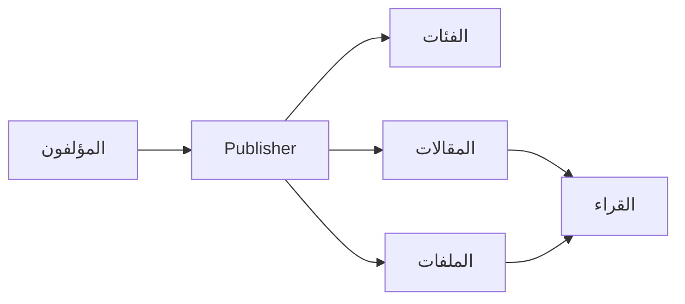
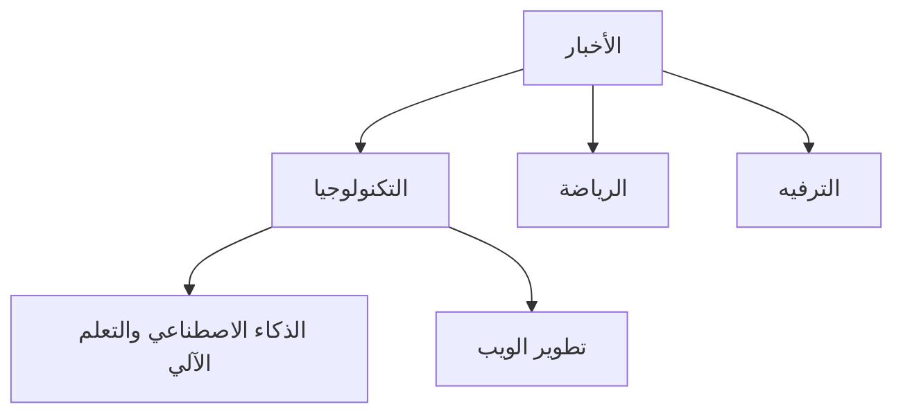
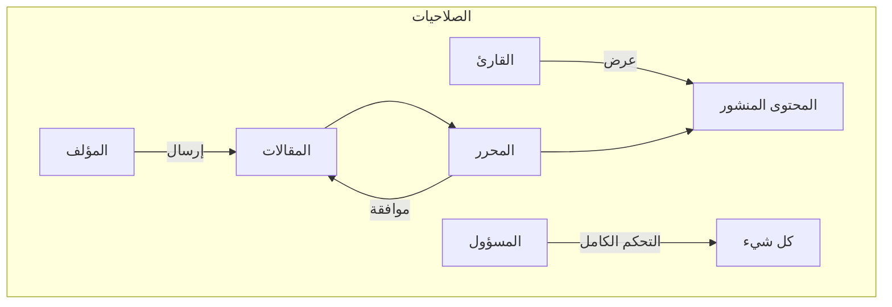
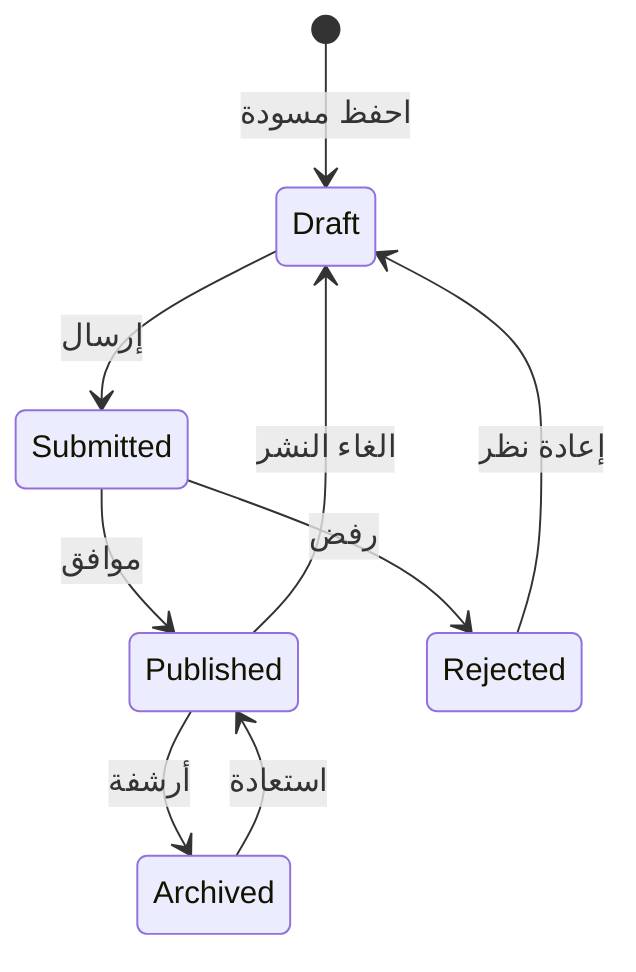

# البدء مع Publisher

> دليل خطوة بخطوة لإعداد واستخدام وحدة الأخبار والمدونات Publisher.

---

## ما هو Publisher؟

Publisher هي وحدة إدارة محتوى رئيسية لـ XOOPS، مصممة لـ:

- **مواقع الأخبار** - نشر المقالات مع الفئات
- **المدونات** - تدوين شخصي أو متعدد المؤلفين
- **التوثيق** - قواعد معارف منظمة
- **بوابات المحتوى** - محتوى وسائط مختلط



---

## الإعداد السريع

### الخطوة 1: تثبيت Publisher

1. نزل من [GitHub](https://github.com/XoopsModules25x/publisher)
2. أرسل إلى `modules/publisher/`
3. اذهب إلى التحكم → الوحدات → تثبيت

### الخطوة 2: إنشاء الفئات



1. التحكم → Publisher → الفئات
2. انقر على "إضافة فئة"
3. املأ:
   - **الاسم**: اسم الفئة
   - **الوصف**: محتوى هذه الفئة
   - **الصورة**: صورة الفئة الاختيارية
4. عيّن الصلاحيات (من يمكنه الإرسال / الرؤية)
5. احفظ

### الخطوة 3: تكوين الإعدادات

1. التحكم → Publisher → التفضيلات
2. إعدادات مهمة للتكوين:

| الإعداد | الموصى به | الوصف |
|---------|-------------|-------------|
| المقالات في الصفحة | 10-20 | المقالات في الفهرس |
| المحرر | TinyMCE / CKEditor | محرر نصي غني |
| السماح بالتقييمات | نعم | ملاحظات القارئ |
| السماح بالتعليقات | نعم | مناقشات |
| الموافقة التلقائية | لا | تحكم تحريري |

### الخطوة 4: إنشاء مقالتك الأولى

1. القائمة الرئيسية → Publisher → إرسال مقالة
2. املأ النموذج:
   - **العنوان**: عنوان المقالة
   - **الفئة**: أين تنتمي
   - **الملخص**: وصف قصير
   - **المحتوى**: محتوى المقالة الكامل
3. أضف عناصر اختيارية:
   - صورة مميزة
   - ملفات مرفقة
   - إعدادات تحسين محركات البحث
4. ارسل للمراجعة أو انشر

---

## أدوار المستخدمين



### القارئ
- عرض المقالات المنشورة
- تقييم وتعليق
- البحث عن المحتوى

### المؤلف
- إرسال مقالات جديدة
- تحرير مقالاتهم الخاصة
- إرفاق ملفات

### المحرر
- الموافقة على / رفض الإرسال
- تحرير أي مقالة
- إدارة الفئات

### المسؤول
- التحكم الكامل بالوحدة
- تكوين الإعدادات
- إدارة الصلاحيات

---

## كتابة المقالات

### محرر المقالة

```
┌─────────────────────────────────────────────────────┐
│ العنوان: [عنوان مقالتك                        ] │
├─────────────────────────────────────────────────────┤
│ الفئة: [حدد الفئة          ▼]              │
├─────────────────────────────────────────────────────┤
│ الملخص:                                            │
│ ┌─────────────────────────────────────────────────┐ │
│ │ وصف موجز يعرض في القوائم...          │ │
│ └─────────────────────────────────────────────────┘ │
├─────────────────────────────────────────────────────┤
│ المحتوى:                                               │
│ ┌─────────────────────────────────────────────────┐ │
│ │ [B] [I] [U] [الرابط] [صورة] [كود]               │ │
│ ├─────────────────────────────────────────────────┤ │
│ │                                                  │ │
│ │ يذهب محتوى المقالة الكاملة هنا...               │ │
│ │                                                  │ │
│ └─────────────────────────────────────────────────┘ │
├─────────────────────────────────────────────────────┤
│ [إرسال] [معاينة] [حفظ مسودة]                     │
└─────────────────────────────────────────────────────┘
```

### أفضل الممارسات

1. **عناوين جذابة** - عناوين واضحة وجذابة
2. **ملخصات جيدة** - أغري القراء للنقر
3. **محتوى منظم** - استخدم الرؤوس والقوائم والصور
4. **تصنيف صحيح** - ساعد القراء على إيجاد المحتوى
5. **تحسين تحسين محركات البحث** - كلمات رئيسية في العنوان والمحتوى

---

## إدارة المحتوى

### سير حالة المقالة



### وصف الحالات

| الحالة | الوصف |
|--------|-------------|
| مسودة | العمل قيد الإنجاز |
| مرسل | في انتظار المراجعة |
| منشور | مباشر على الموقع |
| منتهي الصلاحية | بعد تاريخ انتهاء الصلاحية |
| مرفوض | يحتاج إلى مراجعة |
| مؤرشف | مزال من القوائم |

---

## التنقل

### الوصول إلى Publisher

- **القائمة الرئيسية** → Publisher
- **عنوان مباشر**: `yoursite.com/modules/publisher/`

### صفحات رئيسية

| الصفحة | عنوان URL | الغرض |
|------|-----|---------|
| الفهرس | `/modules/publisher/` | قوائم المقالات |
| الفئة | `/modules/publisher/category.php?id=X` | مقالات الفئة |
| المقالة | `/modules/publisher/item.php?itemid=X` | مقالة واحدة |
| الإرسال | `/modules/publisher/submit.php` | مقالة جديدة |
| البحث | `/modules/publisher/search.php` | ابحث عن المقالات |

---

## الكتل

توفر Publisher عدة كتل لموقعك:

### مقالات حديثة
عرض أحدث المقالات المنشورة

### قائمة الفئات
التنقل حسب الفئة

### مقالات شهيرة
المحتوى الأكثر مشاهدة

### مقالة عشوائية
اعرض محتوى عشوائي

### الضوء
مقالات مميزة

---

## الوثائق ذات الصلة

- إنشاء وتحرير المقالات
- إدارة الفئات
- توسيع Publisher

---

#xoops #publisher #user-guide #getting-started #cms
