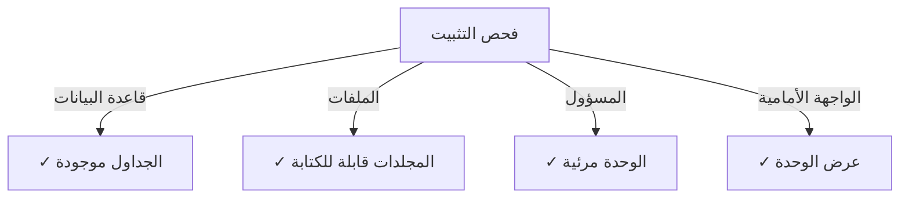

# دليل تثبيت Publisher

> تعليمات شاملة لتثبيت وتكوين وحدة Publisher لـ XOOPS CMS.

---

## متطلبات النظام

### الحد الأدنى من المتطلبات

| المتطلب | الإصدار | ملاحظات |
|-------------|---------|-------|
| XOOPS | 2.5.10+ | منصة CMS الأساسية |
| PHP | 7.1+ | PHP 8.x موصى به |
| MySQL | 5.7+ | خادم قاعدة البيانات |
| خادم الويب | Apache / Nginx | مع دعم إعادة الكتابة |

### ملحقات PHP

```
- PDO (كائنات بيانات PHP)
- pdo_mysql أو mysqli
- mb_string (سلاسل متعددة البايتات)
- curl (للمحتوى الخارجي)
- json
- gd (معالجة الصور)
```

### مساحة القرص

- **ملفات الوحدة**: ~5 MB
- **دليل الذاكرة**: 50+ MB موصى به
- **دليل التحميل**: حسب الحاجة للمحتوى

---

## قائمة التحقق قبل التثبيت

قبل تثبيت Publisher، تحقق من:

- [ ] تثبيت وتشغيل النواة XOOPS
- [ ] حساب المسؤول لديه صلاحيات إدارة الوحدات
- [ ] تم إنشاء نسخة احتياطية من قاعدة البيانات
- [ ] أذونات الملف تسمح بالوصول للكتابة لدليل `/modules/`
- [ ] حد ذاكرة PHP هو 128 MB على الأقل
- [ ] حدود حجم التحميل مناسبة (10 MB على الأقل)

---

## خطوات التثبيت

### الخطوة 1: نزل Publisher

#### الخيار أ: من GitHub (موصى به)

```bash
# انتقل إلى دليل الوحدات
cd /path/to/xoops/htdocs/modules/

# استنساخ المستودع
git clone https://github.com/XoopsModules25x/publisher.git

# تحقق من التنزيل
ls -la publisher/
```

#### الخيار ب: تنزيل يدوي

1. زيارة [إصدارات Publisher على GitHub](https://github.com/XoopsModules25x/publisher/releases)
2. نزل أحدث ملف `.zip`
3. استخرج إلى `modules/publisher/`

### الخطوة 2: عيّن أذونات الملف

```bash
# عيّن الملكية الصحيحة
chown -R www-data:www-data /path/to/xoops/htdocs/modules/publisher

# عيّن أذونات الدليل (755)
find publisher -type d -exec chmod 755 {} \;

# عيّن أذونات الملف (644)
find publisher -type f -exec chmod 644 {} \;

# اجعل السكريبتات قابلة للتنفيذ
chmod 755 publisher/admin/index.php
chmod 755 publisher/index.php
```

### الخطوة 3: تثبيت عبر لوحة التحكم XOOPS

1. تسجيل الدخول إلى **لوحة التحكم XOOPS** كمسؤول
2. انتقل إلى **النظام → الوحدات**
3. انقر على **تثبيت الوحدة**
4. ابحث عن **Publisher** في القائمة
5. انقر على زر **تثبيت**
6. انتظر اكتمال التثبيت (عرض جداول قاعدة البيانات المنشأة)

```
تقدم التثبيت:
✓ تم إنشاء الجداول
✓ تم تهيئة التكوين
✓ تم تعيين الصلاحيات
✓ تم مسح الذاكرة
اكتمل التثبيت!
```

---

## الإعداد الأولي

### الخطوة 1: الوصول إلى لوحة تحكم Publisher

1. اذهب إلى **لوحة التحكم → الوحدات**
2. ابحث عن وحدة **Publisher**
3. انقر على رابط **المسؤول**
4. أنت الآن في إدارة Publisher

### الخطوة 2: قم بتكوين تفضيلات الوحدة

1. انقر على **التفضيلات** في القائمة اليسرى
2. قم بتكوين الإعدادات الأساسية:

```
إعدادات عامة:
- المحرر: حدد محرر WYSIWYG
- المقالات في الصفحة: 10
- عرض فتات الخبز: نعم
- السماح بالتعليقات: نعم
- السماح بالتقييمات: نعم

إعدادات تحسين محركات البحث:
- عناوين URL لتحسين محركات البحث: لا (فعّل لاحقاً إذا لزم الأمر)
- إعادة كتابة URL: بلا

إعدادات التحميل:
- الحد الأقصى لحجم التحميل: 5 MB
- أنواع الملفات المسموحة: jpg, png, gif, pdf, doc, docx
```

3. انقر على **حفظ الإعدادات**

### الخطوة 3: أنشئ فئتك الأولى

1. انقر على **الفئات** في القائمة اليسرى
2. انقر على **إضافة فئة**
3. املأ النموذج:

```
اسم الفئة: الأخبار
الوصف: أحدث الأخبار والتحديثات
الصورة: (اختياري) حمّل صورة الفئة
الفئة الأب: (اترك فارغاً للفئة الرئيسية)
الحالة: مفعل
```

4. انقر على **حفظ الفئة**

### الخطوة 4: تحقق من التثبيت

تحقق من هذه المؤشرات:



#### فحص قاعدة البيانات

```bash
mysql -u xoops_user -p xoops_database
mysql> SHOW TABLES LIKE 'publisher%';

# يجب أن يعرض جداول:
# - publisher_categories
# - publisher_items
# - publisher_comments
# - publisher_files
```

#### فحص الواجهة الأمامية

1. زيارة الصفحة الأمامية لـ XOOPS
2. ابحث عن كتلة **Publisher** أو **الأخبار**
3. يجب أن تعرض المقالات الحديثة

---

## التكوين بعد التثبيت

### اختيار المحرر

يدعم Publisher عدة محررات WYSIWYG:

| المحرر | الإيجابيات | السلبيات |
|--------|------|------|
| FCKeditor | غني بالميزات | أقدم، أكبر |
| CKEditor | معيار حديث | تعقيد التكوين |
| TinyMCE | خفيف الوزن | ميزات محدودة |
| محرر DHTML | أساسي | أساسي جداً |

**لتغيير المحرر:**

1. اذهب إلى **التفضيلات**
2. مرر إلى إعداد **المحرر**
3. حدد من المنسدلة
4. احفظ واختبر

### إعداد دليل التحميل

```bash
# أنشئ أدلة التحميل
mkdir -p /path/to/xoops/uploads/publisher/
mkdir -p /path/to/xoops/uploads/publisher/categories/
mkdir -p /path/to/xoops/uploads/publisher/images/
mkdir -p /path/to/xoops/uploads/publisher/files/

# عيّن الأذونات
chmod 755 /path/to/xoops/uploads/publisher/
chmod 755 /path/to/xoops/uploads/publisher/*
```

### قم بتكوين أحجام الصور

في التفضيلات، عيّن أحجام الصور المصغرة:

```
حجم صورة الفئة: 300 × 200 بكسل
حجم صورة المقالة: 600 × 400 بكسل
حجم الصورة المصغرة: 150 × 100 بكسل
```

---

## خطوات ما بعد التثبيت

### 1. عيّن صلاحيات المجموعة

1. اذهب إلى **الصلاحيات** في قائمة المسؤول
2. قم بتكوين الوصول للمجموعات:
   - مجهول: عرض فقط
   - مستخدمون مسجلون: إرسال المقالات
   - المحررون: الموافقة / تحرير المقالات
   - المسؤولون: الوصول الكامل

### 2. قم بتكوين رؤية الوحدة

1. اذهب إلى **الكتل** في لوحة التحكم XOOPS
2. ابحث عن كتل Publisher:
   - Publisher - أحدث المقالات
   - Publisher - الفئات
   - Publisher - الأرشيفات
3. قم بتكوين رؤية الكتلة لكل صفحة

### 3. استيراد محتوى اختباري (اختياري)

لأغراض الاختبار، استيراد مقالات عينة:

1. اذهب إلى **Publisher Admin → استيراد**
2. حدد **محتوى عينة**
3. انقر على **استيراد**

### 4. فعّل عناوين URL لتحسين محركات البحث (اختياري)

لعناوين URL الصديقة لـ SEO:

1. اذهب إلى **التفضيلات**
2. عيّن **عناوين URL لتحسين محركات البحث**: نعم
3. فعّل إعادة كتابة **.htaccess**
4. تحقق من وجود ملف `.htaccess` في مجلد Publisher

```apache
# مثال .htaccess
<IfModule mod_rewrite.c>
    RewriteEngine On
    RewriteBase /modules/publisher/
    RewriteRule ^category/([0-9]+)-(.*)\.html$ index.php?op=showcategory&categoryid=$1 [L]
    RewriteRule ^article/([0-9]+)-(.*)\.html$ index.php?op=showitem&itemid=$1 [L]
</IfModule>
```

---

## استكشاف أخطاء التثبيت

### المشكلة: الوحدة لا تظهر في المسؤول

**الحل:**
```bash
# تحقق من أذونات الملف
ls -la /path/to/xoops/modules/publisher/

# تحقق من وجود xoops_version.php
ls /path/to/xoops/modules/publisher/xoops_version.php

# تحقق من بناء جملة PHP
php -l /path/to/xoops/modules/publisher/xoops_version.php
```

### المشكلة: لم يتم إنشاء جداول قاعدة البيانات

**الحل:**
1. تحقق من أن مستخدم MySQL لديه امتياز CREATE TABLE
2. افحص سجل خطأ MySQL:
   ```bash
   mysql> SHOW WARNINGS;
   ```
3. استيراد SQL يدوي:
   ```bash
   mysql -u user -p database < modules/publisher/sql/mysql.sql
   ```

### المشكلة: فشل تحميل الملف

**الحل:**
```bash
# تحقق من وجود الدليل وأنه قابل للكتابة
stat /path/to/xoops/uploads/publisher/

# إصلاح الأذونات
chmod 777 /path/to/xoops/uploads/publisher/

# تحقق من إعدادات PHP
php -i | grep upload_max_filesize
```

### المشكلة: أخطاء "لم يتم العثور على الصفحة"

**الحل:**
1. تحقق من وجود ملف `.htaccess`
2. تحقق من تفعيل Apache `mod_rewrite`:
   ```bash
   a2enmod rewrite
   systemctl restart apache2
   ```
3. تحقق من `AllowOverride All` في تكوين Apache

---

## الترقية من الإصدارات السابقة

### من Publisher 1.x إلى 2.x

1. **انسخ التثبيت الحالي:**
   ```bash
   cp -r modules/publisher/ modules/publisher-backup/
   mysqldump -u user -p database > publisher-backup.sql
   ```

2. **نزل Publisher 2.x**

3. **استبدل الملفات:**
   ```bash
   rm -rf modules/publisher/
   unzip publisher-2.0.zip -d modules/
   ```

4. **شغّل التحديث:**
   - اذهب إلى **التحكم → Publisher → تحديث**
   - انقر على **تحديث قاعدة البيانات**
   - انتظر الاكتمال

5. **تحقق:**
   - تحقق من عرض جميع المقالات بشكل صحيح
   - تحقق من سلامة الصلاحيات
   - اختبر تحميل الملفات

---

## اعتبارات الأمان

### أذونات الملف

```
- ملفات أساسية: 644 (قابلة للقراءة من قبل خادم الويب)
- الأدلة: 755 (قابلة للالتصفح من قبل خادم الويب)
- أدلة التحميل: 755 أو 777
- ملفات التكوين: 600 (غير قابلة للقراءة من الويب)
```

### معطّل الوصول المباشر إلى الملفات الحساسة

أنشئ `.htaccess` في أدلة التحميل:

```apache
<FilesMatch "\.(php|phtml|php3|php4|php5|phtml)$">
    Deny from all
</FilesMatch>
```

### أمان قاعدة البيانات

```bash
# استخدم كلمة مرور قوية
ALTER USER 'publisher_user'@'localhost' IDENTIFIED BY 'strong_password_here';

# امنح أدنى صلاحيات
GRANT SELECT, INSERT, UPDATE, DELETE ON publisher_db.* TO 'publisher_user'@'localhost';
FLUSH PRIVILEGES;
```

---

## قائمة التحقق من التحقق

بعد التثبيت، تحقق من:

- [ ] الوحدة تظهر في قائمة وحدات المسؤول
- [ ] يمكن الوصول إلى قسم لوحة تحكم Publisher
- [ ] يمكن إنشاء الفئات
- [ ] يمكن إنشاء المقالات
- [ ] تعرض المقالات على الواجهة الأمامية
- [ ] تحميل الملفات يعمل
- [ ] عرض الصور بشكل صحيح
- [ ] يتم تطبيق الصلاحيات بشكل صحيح
- [ ] تم إنشاء جداول قاعدة البيانات
- [ ] دليل الذاكرة قابل للكتابة

---

## الخطوات التالية

بعد التثبيت الناجح:

1. اقرأ دليل التكوين الأساسي
2. أنشئ مقالتك الأولى
3. قم بإعداد صلاحيات المجموعة
4. استعرض إدارة الفئات

---

## الدعم والموارد

- **مشاكل GitHub**: [مشاكل Publisher](https://github.com/XoopsModules25x/publisher/issues)
- **منتدى XOOPS**: [دعم المجتمع](https://www.xoops.org/modules/newbb/)
- **GitHub Wiki**: [مساعدة التثبيت](https://github.com/XoopsModules25x/publisher/wiki)

---

#publisher #installation #setup #xoops #module #configuration
