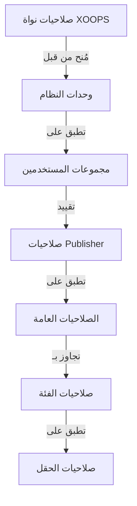

# إعداد صلاحيات Publisher

> دليل شامل لتكوين صلاحيات المجموعة والتحكم في الوصول وإدارة الوصول إلى المستخدمين في Publisher.

---

## أساسيات الصلاحيات

### ما هي الصلاحيات؟

تتحكم الصلاحيات في ما يمكن لمجموعات المستخدمين المختلفة القيام به في Publisher:

```
من يمكنه:
  - عرض المقالات
  - إرسال المقالات
  - تحرير المقالات
  - الموافقة على المقالات
  - إدارة الفئات
  - تكوين الإعدادات
```

### مستويات الصلاحيات

```
مجهول
  └── عرض المقالات المنشورة فقط

مستخدمون مسجلون
  ├── عرض المقالات
  ├── إرسال المقالات (في انتظار الموافقة)
  └── تحرير المقالات الخاصة

محررون / معتدلون
  ├── جميع صلاحيات المستخدمين المسجلين
  ├── الموافقة على المقالات
  ├── تحرير جميع المقالات
  └── إدارة بعض الفئات

مسؤولون
  └── الوصول الكامل إلى كل شيء
```

---

## إدارة صلاحيات الوصول

### انتقل إلى الصلاحيات

```
لوحة التحكم
└── الوحدات
    └── Publisher
        ├── الصلاحيات
        ├── صلاحيات الفئة
        └── إدارة المجموعات
```

### الوصول السريع

1. تسجيل الدخول كـ **المسؤول**
2. اذهب إلى **التحكم → الوحدات**
3. انقر على **Publisher → المسؤول**
4. انقر على **الصلاحيات** في القائمة اليسرى

---

## الصلاحيات العامة

### صلاحيات مستوى الوحدة

التحكم في الوصول إلى وحدة Publisher والميزات:

```
عرض مصفوفة الصلاحيات:
┌─────────────────────────────────────┐
│ الصلاحية             │ مج │ مس │ م │ ا │
├────────────────────────┼──┼────┼────┼───┤
│ عرض المقالات          │  ✓   │  ✓  │   ✓    │  ✓   │
│ إرسال المقالات        │  ✗   │  ✓  │   ✓    │  ✓   │
│ تحرير المقالات        │  ✗   │  ✓  │   ✓    │  ✓   │
│ تحرير جميع           │  ✗   │  ✗  │   ✓    │  ✓   │
│ الموافقة على المقالات │  ✗   │  ✗  │   ✓    │  ✓   │
│ إدارة الفئات          │  ✗   │  ✗  │   ✗    │  ✓   │
│ الوصول لـ المسؤول     │  ✗   │  ✗  │   ✓    │  ✓   │
└─────────────────────────────────────┘
```

### وصفات الصلاحيات

| الصلاحية | المستخدمون | التأثير |
|------------|-------|--------|
| **عرض المقالات** | جميع المجموعات | يمكن رؤية المقالات المنشورة على الواجهة الأمامية |
| **إرسال المقالات** | مسجلون + | يمكن إنشاء مقالات جديدة (في انتظار الموافقة) |
| **تحرير المقالات الخاصة** | مسجلون + | يمكن تحرير / حذف المقالات الخاصة بهم |
| **تحرير جميع** | محررون + | يمكن تحرير أي مقالة للمستخدم |
| **حذف المقالات الخاصة** | مسجلون + | يمكن حذف المقالات غير المنشورة الخاصة |
| **حذف جميع** | محررون + | يمكن حذف أي مقالة |
| **الموافقة على المقالات** | محررون + | يمكن نشر المقالات المعلقة |
| **إدارة الفئات** | مسؤولون | إنشاء وتحرير وحذف الفئات |
| **الوصول لـ المسؤول** | محررون + | الوصول إلى واجهة المسؤول |

---

## تكوين الصلاحيات العامة

### الخطوة 1: الوصول إلى إعدادات الصلاحيات

1. اذهب إلى **التحكم → الوحدات**
2. ابحث عن **Publisher**
3. انقر على **الصلاحيات** (أو رابط المسؤول ثم الصلاحيات)
4. أنت ترى مصفوفة الصلاحيات

### الخطوة 2: عيّن صلاحيات المجموعة

لكل مجموعة، قم بتكوين ما يمكنهم القيام به:

#### مستخدمون مجهولون

```yaml
صلاحيات مجموعة مجهولة:
  عرض المقالات: ✓ نعم
  إرسال المقالات: ✗ لا
  تحرير المقالات: ✗ لا
  حذف المقالات: ✗ لا
  الموافقة على المقالات: ✗ لا
  إدارة الفئات: ✗ لا
  الوصول لـ المسؤول: ✗ لا

النتيجة: المستخدمون المجهولون يمكنهم فقط عرض المحتوى المنشور
```

#### مستخدمون مسجلون

```yaml
صلاحيات مجموعة مسجلة:
  عرض المقالات: ✓ نعم
  إرسال المقالات: ✓ نعم (مع طلب موافقة)
  تحرير المقالات الخاصة: ✓ نعم
  تحرير جميع المقالات: ✗ لا
  حذف المقالات الخاصة: ✓ نعم (مسودات فقط)
  حذف جميع المقالات: ✗ لا
  الموافقة على المقالات: ✗ لا
  إدارة الفئات: ✗ لا
  الوصول لـ المسؤول: ✗ لا

النتيجة: يمكن للمستخدمين المسجلين المساهمة بالمحتوى بعد الموافقة
```

#### مجموعة المحررين

```yaml
صلاحيات مجموعة محرر:
  عرض المقالات: ✓ نعم
  إرسال المقالات: ✓ نعم
  تحرير المقالات الخاصة: ✓ نعم
  تحرير جميع المقالات: ✓ نعم
  حذف المقالات الخاصة: ✓ نعم
  حذف جميع المقالات: ✓ نعم
  الموافقة على المقالات: ✓ نعم
  إدارة الفئات: ✓ محدود
  الوصول لـ المسؤول: ✓ نعم
  تكوين الإعدادات: ✗ لا

النتيجة: المحررون يدير المحتوى لكن ليس الإعدادات
```

#### مسؤولون

```yaml
صلاحيات مجموعة مسؤول:
  ✓ الوصول الكامل لجميع الميزات

  - جميع صلاحيات المحرر
  - إدارة جميع الفئات
  - تكوين جميع الإعدادات
  - إدارة الصلاحيات
  - التثبيت / الإلغاء
```

### الخطوة 3: احفظ الصلاحيات

1. قم بتكوين صلاحيات كل مجموعة
2. انقر على صناديق للإجراءات المسموحة
3. أزل علامات الصناديق للإجراءات المرفوضة
4. انقر على **حفظ الصلاحيات**
5. تظهر رسالة تأكيد

---

## صلاحيات مستوى الفئة

### عيّن الوصول إلى الفئة

التحكم في من يمكنه رؤية / الإرسال إلى فئات محددة:

```
التحكم → Publisher → الفئات
→ حدد فئة → الصلاحيات
```

### مصفوفة صلاحيات الفئة

```
                 مجهول  مسجل  محرر  مسؤول
عرض الفئة          ✓      ✓      ✓      ✓
الإرسال للفئة      ✗      ✓      ✓      ✓
تحرير الخاص        ✗      ✓      ✓      ✓
تحرير الكل         ✗      ✗      ✓      ✓
الموافقة            ✗      ✗      ✓      ✓
إدارة الفئة         ✗      ✗      ✗      ✓
```

### قم بتكوين صلاحيات الفئة

1. اذهب إلى إدارة **الفئات**
2. ابحث عن الفئة
3. انقر على زر **الصلاحيات**
4. لكل مجموعة، حدد:
   - [ ] عرض هذه الفئة
   - [ ] إرسال مقالات
   - [ ] تحرير المقالات الخاصة
   - [ ] تحرير جميع المقالات
   - [ ] الموافقة على المقالات
   - [ ] إدارة الفئة
5. انقر على **حفظ**

### أمثلة صلاحيات الفئة

#### فئة أخبار عامة

```
مجهول: عرض فقط
مسجل: عرض + إرسال (في انتظار الموافقة)
محرر: موافقة + تحرير
مسؤول: التحكم الكامل
```

#### فئة تحديثات داخلية

```
مجهول: بلا وصول
مسجل: عرض فقط
محرر: إرسال + موافقة
مسؤول: التحكم الكامل
```

#### فئة مدونة ضيف

```
مجهول: عرض فقط
مسجل: إرسال (في انتظار الموافقة)
محرر: موافقة
مسؤول: التحكم الكامل
```

---

## صلاحيات مستوى الحقل

### التحكم في رؤية حقول النموذج

قيّد حقول النموذج التي يمكن للمستخدمين رؤيتها / تحريرها:

```
التحكم → Publisher → الصلاحيات → الحقول
```

### خيارات الحقل

```yaml
الحقول المرئية للمستخدمين المسجلين:
  ✓ العنوان
  ✓ الوصف
  ✓ المحتوى (الجسم)
  ✓ صورة مميزة
  ✓ الفئة
  ✓ العلامات
  ✗ المؤلف (تعيين تلقائي)
  ✗ تاريخ النشر (محررون فقط)
  ✗ تاريخ مجدول (محررون فقط)
  ✗ مميز (محررون فقط)
  ✗ الصلاحيات (مسؤولون فقط)
```

### أمثلة

#### إرسال محدود للمستخدمين المسجلين

يرى المستخدمون المسجلون خيارات أقل:

```
الحقول المتاحة:
  - العنوان ✓
  - الوصف ✓
  - المحتوى ✓
  - صورة مميزة ✓
  - الفئة ✓

الحقول المخفية:
  - المؤلف (تعيين تلقائي للمستخدم الحالي)
  - تاريخ النشر (يقررها المحررون)
  - تاريخ مجدول (مسؤولون فقط)
  - حالة مميزة (يختار المحررون)
```

#### نموذج كامل للمحررين

يرى المحررون جميع الخيارات:

```
الحقول المتاحة:
  - جميع الحقول الأساسية
  - جميع البيانات الوصفية
  - اختيار المؤلف ✓
  - تاريخ النشر / الوقت ✓
  - تاريخ مجدول ✓
  - حالة مميزة ✓
  - تاريخ انتهاء الصلاحية ✓
  - الصلاحيات ✓
```

---

## تكوين مجموعات المستخدمين

### أنشئ مجموعة مخصصة

1. اذهب إلى **التحكم → المستخدمون → المجموعات**
2. انقر على **إنشاء مجموعة**
3. أدخل تفاصيل المجموعة:

```
اسم المجموعة: "مساهمو المجتمع"
وصف المجموعة: "المستخدمون الذين يساهمون بمحتوى المدونة"
النوع: مجموعة عادية
```

4. انقر على **حفظ مجموعة**
5. ارجع إلى صلاحيات Publisher
6. عيّن الصلاحيات للمجموعة الجديدة

### أمثلة المجموعات

```
المجموعة المقترحة لـ Publisher:

المجموعة: المساهمون
  - أعضاء عاديون يرسلون مقالات
  - يمكنهم تحرير المقالات الخاصة
  - لا يمكنهم الموافقة على المقالات

المجموعة: المراجعون
  - يمكنهم رؤية المقالات المرسلة
  - يمكنهم الموافقة / رفض المقالات
  - لا يمكنهم حذف مقالات الآخرين

المجموعة: المحررون
  - يمكنهم تحرير أي مقالة
  - يمكنهم الموافقة على المقالات
  - يمكنهم تعديل التعليقات
  - يمكنهم إدارة بعض الفئات

المجموعة: الناشرون
  - يمكنهم تحرير أي مقالة
  - يمكنهم النشر مباشرة (بدون موافقة)
  - يمكنهم إدارة جميع الفئات
  - يمكنهم تكوين الإعدادات
```

---

## تسلسل هرمي الصلاحيات

### تدفق الصلاحيات



### وراثة الصلاحيات

```
الأساس: صلاحيات وحدة عامة
  ↓
الفئة: تجاوزات لفئات محددة
  ↓
الحقل: تقييدات إضافية متاحة للحقول
  ↓
المستخدم: له صلاحية إذا سمحت جميع المستويات

إذا أي مستوى رفض → الصلاحية مرفوضة
```

**مثال:**

```
يريد المستخدم تحرير مقالة:
1. مجموعة المستخدم يجب أن تحتوي على صلاحية "تحرير مقالات" (عامة)
2. الفئة يجب أن تسمح بالتحرير (مستوى الفئة)
3. الحقول يجب أن تسمح (إن كانت قابلة للتطبيق)
4. المستخدم يجب أن يكون المؤلف أو محرر (لمحررين)

إذا أي مستوى رفض → الصلاحية مرفوضة
```

---

## صلاحيات سير العمل الموافقة

### قم بتكوين الموافقة على الإرسال

التحكم في ما إذا كانت المقالات تحتاج إلى موافقة:

```
التحكم → Publisher → التفضيلات → سير العمل
```

#### خيارات الموافقة

```yaml
سير العمل للإرسال:
  طلب الموافقة: نعم

  للمستخدمين المسجلين:
    - المقالات الجديدة: مسودة (في انتظار الموافقة)
    - يجب على المحررين الموافقة
    - يمكن للمستخدم التحرير أثناء الانتظار
    - بعد الموافقة: يمكن للمستخدم التحرير

  للمحررين:
    - المقالات الجديدة: نشر مباشر (اختياري)
    - تخطي قائمة الانتظار
    - أو اطلب دائماً الموافقة
```

#### تكوين لكل مجموعة

1. اذهب إلى التفضيلات
2. ابحث عن "سير العمل"
3. لكل مجموعة، عيّن:

```
مجموعة: مستخدمون مسجلون
  طلب موافقة: ✓ نعم
  الحالة الافتراضية: مسودة
  يمكن التعديل أثناء الانتظار: ✓ نعم

مجموعة: محررون
  طلب موافقة: ✗ لا
  الحالة الافتراضية: منشور
  يمكن التعديل على المنشور: ✓ نعم
```

4. انقر على **حفظ**

---

## اعتدال المقالات

### الموافقة على المقالات المعلقة

للمستخدمين الذين لديهم صلاحية "الموافقة على المقالات":

1. اذهب إلى **التحكم → Publisher → المقالات**
2. قيّد حسب **الحالة**: المعلق
3. انقر على المقالة لمراجعة
4. تحقق من جودة المحتوى
5. عيّن **الحالة**: منشور
6. اختياري: أضف ملاحظات تحريرية
7. انقر على **حفظ**

### رفض المقالات

إذا لم تستوفِ المقالة المعايير:

1. افتح المقالة
2. عيّن **الحالة**: مسودة
3. أضف سبب الرفض (في التعليق أو البريد الإلكتروني)
4. انقر على **حفظ**
5. أرسل رسالة للمؤلف تشرح الرفض

### اعتدال التعليقات

إذا كنت تعتدل التعليقات:

1. اذهب إلى **التحكم → Publisher → التعليقات**
2. قيّد حسب **الحالة**: المعلق
3. استعرض التعليق
4. الخيارات:
   - الموافقة: انقر على **موافقة**
   - الرفض: انقر على **حذف**
   - تحرير: انقر على **تحرير**، أصلح، احفظ
5. انقر على **حفظ**

---

## إدارة وصول المستخدم

### عرض مجموعات المستخدمين

رؤية المستخدمين الذين ينتمون إلى مجموعات:

```
التحكم → المستخدمون → مجموعات المستخدمين

لكل مستخدم:
  - المجموعة الأساسية (واحدة)
  - المجموعات الثانوية (متعددة)

تطبيق الصلاحيات من جميع المجموعات (اتحاد)
```

### أضف المستخدم إلى المجموعة

1. اذهب إلى **التحكم → المستخدمون**
2. ابحث عن المستخدم
3. انقر على **تحرير**
4. تحت **المجموعات**، تحقق من المجموعات المراد إضافتها
5. انقر على **حفظ**

### غيّر صلاحيات المستخدم

لمستخدمين فرديين (إن كانت مدعومة):

1. اذهب إلى إدارة المستخدم
2. ابحث عن المستخدم
3. انقر على **تحرير**
4. ابحث عن تجاوز صلاحيات فردية
5. قم بالتكوين حسب الحاجة
6. انقر على **حفظ**

---

## سيناريوهات الصلاحيات الشائعة

### السيناريو 1: مدونة مفتوحة

السماح لأي شخص بالإرسال:

```
مجهول: عرض
مسجل: إرسال، تحرير الخاص، حذف الخاص
محرر: موافقة، تحرير الكل، حذف الكل
مسؤول: التحكم الكامل

النتيجة: مدونة مجتمع مفتوحة
```

### السيناريو 2: موقع أخبار معتدل

عملية موافقة صارمة:

```
مجهول: عرض فقط
مسجل: لا يمكن الإرسال
محرر: إرسال، موافقة الآخرين
مسؤول: التحكم الكامل

النتيجة: محترفون معتمدون فقط ينشرون
```

### السيناريو 3: مدونة الموظفين

يمكن للموظفين المساهمة:

```
أنشئ مجموعة: "الموظفون"
مجهول: عرض
مسجل: عرض فقط (غير الموظفين)
موظفون: إرسال، تحرير الخاص، نشر مباشر
مسؤول: التحكم الكامل

النتيجة: مدونة مؤلفة من الموظفين
```

### السيناريو 4: فئات متعددة مع محررين مختلفين

محررون مختلفون لفئات مختلفة:

```
فئة الأخبار:
  مجموعة المحررين أ: التحكم الكامل

فئة المراجعات:
  مجموعة المحررين ب: التحكم الكامل

فئة البرامج التعليمية:
  مجموعة المحررين ج: التحكم الكامل

النتيجة: تحكم تحريري لامركزي
```

---

## اختبار الصلاحيات

### تحقق من عمل الصلاحيات

1. أنشئ مستخدم اختبار في كل مجموعة
2. تسجيل الدخول كل مستخدم اختبار
3. حاول:
   - عرض المقالات
   - إرسال مقالة (يجب إنشاء مسودة إذا كانت مسموحة)
   - تحرير المقالة (الخاصة والآخرين)
   - حذف المقالة
   - الوصول إلى لوحة التحكم
   - الوصول إلى الفئات

4. تحقق من أن النتائج تطابق الصلاحيات المتوقعة

### حالات الاختبار الشائعة

```
حالة الاختبار 1: مستخدم مجهول
  [ ] يمكن عرض المقالات المنشورة: ✓
  [ ] لا يمكن إرسال المقالات: ✓
  [ ] لا يمكن الوصول إلى المسؤول: ✓

حالة الاختبار 2: مستخدم مسجل
  [ ] يمكن إرسال المقالات: ✓
  [ ] المقالات تذهب إلى مسودة: ✓
  [ ] يمكن تحرير مقالتك الخاصة: ✓
  [ ] لا يمكن تحرير آخرين: ✓
  [ ] لا يمكن الوصول إلى المسؤول: ✓

حالة الاختبار 3: محرر
  [ ] يمكن الموافقة على المقالات: ✓
  [ ] يمكن تحرير أي مقالة: ✓
  [ ] يمكن الوصول إلى المسؤول: ✓
  [ ] لا يمكن حذف الكل: ✓ (أو ✓ إذا سُمح)

حالة الاختبار 4: مسؤول
  [ ] يمكن فعل كل شيء: ✓
```

---

## استكشاف أخطاء الصلاحيات

### المشكلة: المستخدم لا يمكنه إرسال المقالات

**تحقق:**
```
1. مجموعة المستخدم لديها صلاحية "إرسال مقالات"
   التحكم → Publisher → الصلاحيات

2. المستخدم ينتمي إلى مجموعة مسموحة
   التحكم → المستخدمون → تحرير المستخدم → المجموعات

3. الفئة تسمح بالإرسال من مجموعة المستخدم
   التحكم → Publisher → الفئات → الصلاحيات

4. المستخدم مسجل (ليس مجهول)
```

**الحل:**
```bash
1. تحقق من أن مجموعة المستخدم لديها صلاحية الإرسال
2. أضف المستخدم إلى مجموعة مناسبة
3. تحقق من صلاحيات الفئة
4. امسح ذاكرة جلسة العمل
```

### المشكلة: المحرر لا يمكنه الموافقة على المقالات

**تحقق:**
```
1. مجموعة المحرر لديها صلاحية "الموافقة على المقالات"
2. توجد مقالات بحالة "المعلق"
3. المحرر في المجموعة الصحيحة
4. الفئة تسمح بالموافقة من مجموعة المحرر
```

**الحل:**
```bash
1. اذهب إلى الصلاحيات، تحقق من "الموافقة على المقالات" مفحوصة للمجموعة
2. أنشئ مقالة اختبار، اضبط على مسودة
3. حاول الموافقة كمحرر
4. افحص سجل الأخطاء للرسائل
```

### المشكلة: يمكن عرض المقالات لكن لا يمكن الوصول إلى الفئة

**تحقق:**
```
1. الفئة ليست معطلة / مخفية
2. صلاحيات الفئة تسمح بالعرض
3. مجموعة المستخدم مسموحة برؤية الفئة
4. الفئة منشورة
```

**الحل:**
```bash
1. اذهب إلى الفئات، تحقق من أن حالة الفئة "مفعلة"
2. تحقق من صلاحيات الفئة معينة
3. أضف مجموعة المستخدم إلى صلاحية عرض الفئة
```

### المشكلة: الصلاحيات تغيرت لكن لا تسري

**الحل:**
```bash
1. امسح الذاكرة: التحكم → الأدوات → مسح الذاكرة
2. امسح الجلسة: تسجيل خروج وتسجيل دخول
3. تحقق من سجل النظام للأخطاء
4. تحقق من أن الصلاحيات احفوظة بالفعل
5. جرّب متصفح / نافذة حاضنة مختلفة
```

---

## اختبار واستعادة الصلاحيات

### تصدير الصلاحيات

بعض الأنظمة تسمح بالتصدير:

1. اذهب إلى **التحكم → Publisher → الأدوات**
2. انقر على **تصدير الصلاحيات**
3. احفظ ملف `.xml` أو `.json`
4. احتفظ كنسخة احتياطية

### استيراد الصلاحيات

استعادة من نسخة احتياطية:

1. اذهب إلى **التحكم → Publisher → الأدوات**
2. انقر على **استيراد الصلاحيات**
3. حدد ملف النسخة الاحتياطية
4. استعرض التغييرات
5. انقر على **استيراد**

---

## أفضل الممارسات

### قائمة تحقق من تكوين الصلاحيات

- [ ] قرّر مجموعات المستخدمين
- [ ] عيّن أسماء واضحة للمجموعات
- [ ] عيّن صلاحيات أساسية لكل مجموعة
- [ ] اختبر كل مستوى صلاحيات
- [ ] وثّق هيكل الصلاحيات
- [ ] أنشئ سير عمل موافقة
- [ ] اشرح الاعتدال للمحررين
- [ ] راقب استخدام الصلاحيات
- [ ] استعرض الصلاحيات ربع سنوياً
- [ ] احفظ إعدادات الصلاحيات

### أفضل ممارسات الأمان

```
✓ مبدأ أقل الامتيازات
  - امنح الحد الأدنى من الصلاحيات الضرورية

✓ وصول قائم على الأدوار
  - استخدم المجموعات للأدوار (محرر، معتدل، إلخ)

✓ صلاحيات الفحص الدوري
  - استعرض من لديه وصول إلى ماذا

✓ فصل الواجبات
  - المُرسل، والموافق، والناشر مختلفون

✓ مراجعة منتظمة
  - تحقق من الصلاحيات كل ربع سنة
  - أزل الوصول عند المغادرة
  - حدّث للمتطلبات الجديدة
```

---

## الأدلة ذات الصلة

- إنشاء المقالات
- إدارة الفئات
- التكوين الأساسي
- التثبيت

---

## الخطوات التالية

- عيّن الصلاحيات لسير العمل الخاص بك
- أنشئ مقالات بصلاحيات صحيحة
- قم بتكوين الفئات بصلاحيات
- اشرح للمستخدمين كيفية إنشاء المقالات

---

#publisher #permissions #groups #access-control #security #moderation #xoops
