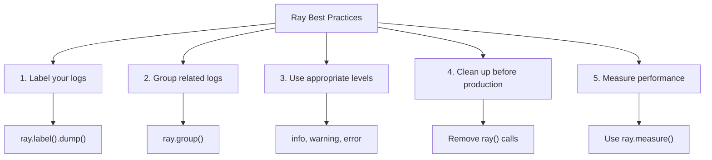

# استخدام Ray Debugger لـ XOOPS

> تصحيح حديث مع Ray: تفتيش المتغيرات وتسجيل الرسائل وتتبع استعلامات SQL والقياس الدقيق لأداء التطبيقات XOOPS.

---

## ما هو Ray؟

Ray هي أداة تصحيح خفيفة الوزن تساعدك على فحص حالة التطبيق دون إيقاف التنفيذ أو استخدام نقاط التوقف. إنها مثالية لتطوير XOOPS.

**الميزات:**
- تسجيل الرسائل والمتغيرات
- فحص استعلامات SQL
- تتبع الأداء
- قياس الأداء
- تجميع السجلات ذات الصلة
- جدول زمني مرئي

**المتطلبات:**
- PHP 7.4+
- تطبيق Ray (نسخة مجانية متاحة)
- Composer

---

## التثبيت

### الخطوة 1: تثبيت حزمة Ray

```bash
cd /path/to/xoops

# Install Ray via Composer
composer require spatie/ray

# Or install globally
composer global require spatie/ray
```

### الخطوة 2: تحميل تطبيق Ray

قم بالتحميل من [ray.so](https://ray.so):
- Mac: Ray.app
- Windows: Ray.exe
- Linux: ray (AppImage)

### الخطوة 3: تكوين جدار الحماية (إذا لزم الأمر)

يستخدم Ray المنفذ 23517 بشكل افتراضي:

```bash
# UFW
sudo ufw allow 23517/udp

# iptables
sudo iptables -A INPUT -p udp --dport 23517 -j ACCEPT
```

---

## الاستخدام الأساسي

### التسجيل البسيط

```php
<?php
require_once 'mainfile.php';
require 'vendor/autoload.php';

// Initialize Ray
$ray = ray();

// Log a simple message
$ray->info('Page loaded');

// Log a variable
$user = ['name' => 'John', 'email' => 'john@example.com'];
$ray->dump($user);

// Log with label
$ray->label('User Data')->dump($user);
?>
```

**الإخراج في تطبيق Ray:**
```
ℹ Page loaded
👁 User Data: ['name' => 'John', 'email' => 'john@example.com']
```

---

### مستويات السجل المختلفة

```php
<?php
$ray = ray();

// Info
$ray->info('Informational message');

// Success
$ray->success('Operation completed');

// Warning
$ray->warning('Potential issue');

// Error
$ray->error('An error occurred');

// Debug
$ray->debug('Debug information');

// Notice
$ray->notice('Notice message');
?>
```

---

### تفريغ المتغيرات

```php
<?php
$ray = ray();

// Simple dump
$ray->dump($variable);

// Multiple dumps
$ray->dump($var1, $var2, $var3);

// With labels
$ray->label('User')->dump($user);
$ray->label('Post')->dump($post);

// Dump array with formatting
$config = [
    'debug' => true,
    'cache' => 'redis',
    'db_host' => 'localhost'
];
$ray->label('Configuration')->dump($config);
?>
```

---

## الميزات المتقدمة

### 1. تتبع استعلام SQL

```php
<?php
$ray = ray();

// Log database query
$ray->notice('Running query');
$result = $GLOBALS['xoopsDB']->query("SELECT * FROM xoops_users LIMIT 10");

// Log result
while ($row = $result->fetch_assoc()) {
    $ray->dump($row);
}

// Or log with label
$query = "SELECT COUNT(*) as total FROM xoops_articles";
$ray->label('Article Count Query')->info($query);
$result = $GLOBALS['xoopsDB']->query($query);
?>
```

### 2. قياس الأداء

```php
<?php
$ray = ray();

// Start a profile
$ray->showQueries();  // Show all queries

// Your code
$start = microtime(true);
expensive_operation();
$end = microtime(true);

$ray->label('Execution Time')->info(($end - $start) . ' seconds');

// Or measure directly
$ray->measure(function() {
    expensive_operation();
});
?>
```

### 3. التصحيح المشروط

```php
<?php
$ray = ray();

// Only in development
if (defined('XOOPS_DEBUG_LEVEL') && XOOPS_DEBUG_LEVEL > 0) {
    $ray->debug('Debug mode enabled');
}

// Only for specific user
if ($xoopsUser && $xoopsUser->getVar('uid') == 1) {
    $ray->dump($sensitive_data);
}

// Only in specific section
if ($_GET['debug'] == 'module') {
    $ray->label('Module Debug')->dump($_GET);
}
?>
```

### 4. تجميع السجلات ذات الصلة

```php
<?php
$ray = ray();

// Start a group
$ray->group('User Authentication');
    $ray->info('Checking credentials');
    $ray->info('Password verified');
    $ray->success('User authenticated');
$ray->groupEnd();

// Or use closure
$ray->group('Database Operations', function($ray) {
    $ray->info('Connecting to database');
    $ray->info('Running queries');
    $ray->success('Operations complete');
});
?>
```

---

## تصحيح خاص بـ XOOPS

### تصحيح الوحدة

```php
<?php
// modules/mymodule/index.php
require_once '../../mainfile.php';
require_once XOOPS_ROOT_PATH . '/vendor/autoload.php';

$ray = ray();

// Log module initialization
$ray->group('Module Initialization');
    $ray->info('Module: ' . XOOPS_MODULE_NAME);

    // Check module is active
    if (is_object($xoopsModule)) {
        $ray->success('Module loaded');
        $ray->dump($xoopsModule->getValues());
    }

    // Check user permissions
    if (xoops_isUser()) {
        $ray->info('User: ' . $xoopsUser->getVar('uname'));
    } else {
        $ray->warning('Anonymous user');
    }
$ray->groupEnd();

// Get module config
$config_handler = xoops_getHandler('config');
$module = xoops_getHandler('module')->getByDirname(XOOPS_MODULE_NAME);
$settings = $config_handler->getConfigsByCat(0, $module->mid());

$ray->label('Module Settings')->dump($settings);
?>
```

### تصحيح النموذج

```php
<?php
// In template or PHP code
$ray = ray();

// Log assigned variables
$tpl = new XoopsTpl();
$ray->label('Template Variables')->dump($tpl->get_template_vars());

// Log specific variables
$ray->label('User Variable')->dump($tpl->get_template_vars('user'));

// Log Smarty engine state
$ray->label('Smarty Config')->dump([
    'compile_dir' => $tpl->getCompileDir(),
    'cache_dir' => $tpl->getCacheDir(),
    'debugging' => $tpl->debugging
]);
?>
```

### تصحيح قاعدة البيانات

```php
<?php
$ray = ray();

// Log database operations
$ray->group('Database Operations');

// Count queries
$ray->info('Database Prefix: ' . XOOPS_DB_PREFIX);

// List tables
$result = $GLOBALS['xoopsDB']->query("SHOW TABLES");
$tables = [];
while ($row = $result->fetch_row()) {
    $tables[] = $row[0];
}
$ray->label('Tables')->dump($tables);

// Check connection
if ($GLOBALS['xoopsDB']) {
    $ray->success('Database connected');
} else {
    $ray->error('Database connection failed');
}

$ray->groupEnd();
?>
```

---

## أفضل الممارسات



---

## الوثائق ذات الصلة

- Enable Debug Mode
- Database Debugging
- Performance FAQ
- Troubleshooting Guide

---

#xoops #debugging #ray #profiling #monitoring
