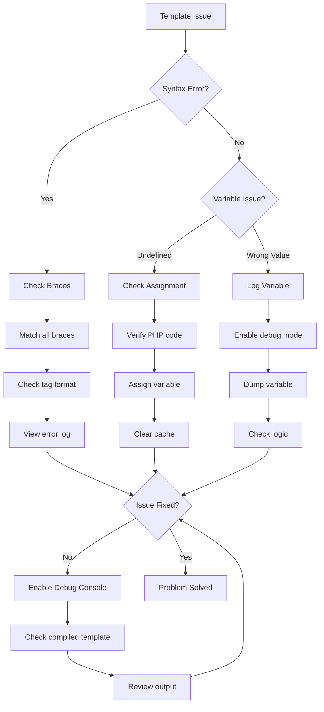

> تقنيات متقدمة لتصحيح قوالب Smarty في مواضيع ووحدات XOOPS.

---

## مخطط التشخيص



---

## تفعيل وضع تصحيح Smarty

### الطريقة 1: لوحة التحكم الإدارية

XOOPS Admin > Settings > Performance:
- تفعيل "Debug Output"
- تعيين "Debug Level" إلى 2

---

### الطريقة 2: تكوين الكود

```php
<?php
// In mainfile.php or module code
require_once XOOPS_ROOT_PATH . '/class/smarty/Smarty.class.php';

$tpl = new XoopsTpl();

// Enable debug mode
$tpl->debugging = true;

// Optional: Set custom debug template
$tpl->debug_tpl = XOOPS_ROOT_PATH . '/class/smarty/debug.tpl';

// Render template
$tpl->display('file:template.html');
?>
```

---

### الطريقة 3: Debug Popup في المتصفح

```smarty
{* Add to template to enable debug in footer *}
{debug}
```

يعرض نافذة منفثقة بجميع المتغيرات المعينة.

---

## تقنيات تصحيح Smarty الشائعة

### تفريغ جميع المتغيرات

```php
<?php
// In PHP code
$tpl = new XoopsTpl();

// Get all assigned variables
$variables = $tpl->get_template_vars();

echo "<pre>";
print_r($variables);
echo "</pre>";
?>
```

في النموذج:
```smarty
{* Display debug info *}
<div style="border: 1px red solid; background: #ffffcc; padding: 10px;">
    <h3>Debug Info</h3>
    {debug}
</div>
```

---

### تسجيل متغير محدد

```php
<?php
$tpl = new XoopsTpl();

// Check if variable exists
$user = $tpl->get_template_var('user');

if ($user === null) {
    error_log("Variable 'user' not assigned to template");
} else {
    error_log("User data: " . json_encode($user));
}
?>
```

---

### التحقق من المتغير في النموذج

```smarty
{* Dump variable for debugging *}
<pre>
{$variable|print_r}
</pre>

{* Or with label *}
<pre>
User Data:
{$user|print_r}
</pre>

{* Check if variable exists *}
{if isset($user)}
    <p>User: {$user.name}</p>
{else}
    <p style="color: red;">ERROR: user variable not set</p>
{/if}
```

---

## عرض القوالب المترجمة

تقوم Smarty بترجمة القوالب إلى PHP للأداء. قم بالتصحيح بعرض الكود المترجم:

```bash
# Find compiled templates
ls -la xoops_data/caches/smarty_compile/

# View compiled template
cat xoops_data/caches/smarty_compile/filename.php
```

```php
<?php
// Create debug script to view latest compiled template
$compile_dir = XOOPS_CACHE_PATH . '/smarty_compile';

// Get latest compiled file
$files = glob($compile_dir . '/*.php');
usort($files, function($a, $b) {
    return filemtime($b) - filemtime($a);
});

if ($files) {
    echo "<h1>Latest Compiled Template</h1>";
    echo "<pre>";
    echo htmlspecialchars(file_get_contents($files[0]));
    echo "</pre>";
}
?>
```

---

## تحليل ترجمة النموذج

```php
<?php
// Create modules/yourmodule/debug_smarty.php

require_once '../../mainfile.php';
require_once XOOPS_ROOT_PATH . '/vendor/autoload.php';

$tpl = new XoopsTpl();
$ray = ray();  // If using Ray debugger

$ray->group('Smarty Configuration');

// Get Smarty paths
$ray->label('Compile Dir')->info($tpl->getCompileDir());
$ray->label('Cache Dir')->info($tpl->getCacheDir());
$ray->label('Template Dirs')->dump($tpl->getTemplateDir());

// Check compiled templates
$compile_dir = $tpl->getCompileDir();
$compiled_files = glob($compile_dir . '*.php');
$ray->label('Compiled Templates')->info(count($compiled_files) . " files");

// Show compilation stats
$total_size = 0;
foreach ($compiled_files as $file) {
    $total_size += filesize($file);
}
$ray->label('Compiled Cache Size')->info(round($total_size / 1024 / 1024, 2) . " MB");

// Check cache directory
$cache_dir = $tpl->getCacheDir();
$cache_files = glob($cache_dir . '*.php');
$ray->label('Cached Templates')->info(count($cache_files) . " files");

$ray->groupEnd();
?>
```

---

## تصحيح مشاكل محددة

### المشكلة 1: المتغير يظهر فارغاً

```php
<?php
$tpl = new XoopsTpl();

// Check what's assigned
$user = $tpl->get_template_var('user');

if ($user === null) {
    error_log("ERROR: 'user' not assigned");
} elseif (empty($user)) {
    error_log("WARNING: 'user' is empty");
} else {
    error_log("user data: " . json_encode($user));
}

// Also check in template
?>
```

تصحيح النموذج:
```smarty
{if !isset($user)}
    <span style="color: red;">ERROR: user variable not set</span>
{elseif empty($user)}
    <span style="color: orange;">WARNING: user is empty</span>
{else}
    <p>User: {$user.name}</p>
{/if}
```

---

### المشكلة 2: مفتاح المصفوفة غير موجود

```smarty
{* Use safe array access *}

{* WRONG - causes undefined index notice *}
{$array.key}

{* CORRECT - check first *}
{if isset($array.key)}
    {$array.key}
{else}
    <span style="color: red;">Key 'key' not found in array</span>
{/if}

{* Or use default *}
{$array.key|default:'key not found'}
```

التصحيح في PHP:
```php
<?php
$array = $tpl->get_template_var('array');

if (!isset($array['key'])) {
    error_log("Missing key in array: " . json_encode(array_keys($array)));
}
?>
```

---

## قائمة التحقق من صحة النموذج

```mermaid
graph TD
    A[Template Validation] --> B["1. Syntax Check"]
    A --> C["2. Variable Verification"]
    A --> D["3. Plugin Check"]
    A --> E["4. File Paths"]
    A --> F["5. Encoding"]
    A --> G["6. Cache"]

    B --> B1["✓ All braces matched"]
    B --> B2["✓ All tags closed"]
    B --> B3["✓ Proper syntax"]

    C --> C1["✓ Variables assigned"]
    C --> C2["✓ Correct property access"]
    C --> C3["✓ Default values set"]

    D --> D1["✓ Modifiers available"]
    D --> D2["✓ Plugins registered"]
    D --> D3["✓ Custom functions work"]

    E --> E1["✓ Relative paths correct"]
    E --> E2["✓ Files exist"]
    E --> E3["✓ Permissions correct"]

    F --> F1["✓ UTF-8 declared"]
    F --> F2["✓ HTML charset set"]
    F --> F3["✓ Database UTF-8"]

    G --> G1["✓ Cache cleared"]
    G --> G2["✓ Compiled fresh"]
```



---

## الوثائق ذات الصلة

- Enable Debug Mode
- Template Errors
- Using Ray Debugger
- Smarty Templating

---

#xoops #templates #smarty #debugging #troubleshooting
