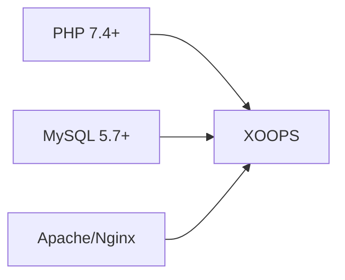
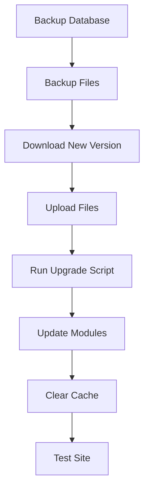

> أسئلة وإجابات شائعة حول تثبيت XOOPS.

---

## ما قبل التثبيت

### س: ما هي متطلبات الخادم الأساسية؟

**ج:** يتطلب XOOPS 2.5.x:
- PHP 7.4 أو أعلى (يُنصح بـ PHP 8.x)
- MySQL 5.7+ أو MariaDB 10.3+
- Apache مع mod_rewrite أو Nginx
- ما لا يقل عن 64MB حد أقصى لذاكرة PHP (يُنصح بـ 128MB+)



### س: هل يمكن تثبيت XOOPS على استضافة مشتركة؟

**ج:** نعم، يعمل XOOPS بشكل جيد على معظم الاستضافة المشتركة التي تلبي المتطلبات. تحقق من أن المضيف يوفر:
- PHP مع الامتدادات المطلوبة (mysqli, gd, curl, json, mbstring)
- الوصول إلى قاعدة بيانات MySQL
- إمكانية تحميل الملفات
- دعم .htaccess (لـ Apache)

### س: ما الامتدادات المطلوبة؟

**ج:** امتدادات مطلوبة:
- `mysqli` - الاتصال بقاعدة البيانات
- `gd` - معالجة الصور
- `json` - معالجة JSON
- `mbstring` - دعم النصوص متعددة البايتات

موصى بها:
- `curl` - استدعاءات API الخارجية
- `zip` - تثبيت الوحدة
- `intl` - التدويل

---

## عملية التثبيت

### س: معالج التثبيت يعرض صفحة فارغة

**ج:** هذا عادة خطأ PHP. حاول:

1. فعّل عرض الخطأ مؤقتاً:
```php
// Add to htdocs/install/index.php at the top
error_reporting(E_ALL);
ini_set('display_errors', 1);
```

2. تحقق من سجل أخطاء PHP
3. تحقق من توافق إصدار PHP
4. تأكد من تحميل جميع الامتدادات المطلوبة

### س: الحصول على "لا يمكن الكتابة إلى mainfile.php"

**ج:** عيّن أذونات الكتابة قبل التثبيت:

```bash
chmod 666 mainfile.php
# After installation, secure it:
chmod 444 mainfile.php
```

### س: جداول قاعدة البيانات لا يتم إنشاؤها

**ج:** تحقق من:

1. مستخدم MySQL له امتيازات CREATE TABLE:
```sql
GRANT ALL PRIVILEGES ON xoopsdb.* TO 'xoopsuser'@'localhost';
FLUSH PRIVILEGES;
```

2. قاعدة البيانات موجودة:
```sql
CREATE DATABASE xoopsdb CHARACTER SET utf8mb4 COLLATE utf8mb4_unicode_ci;
```

3. بيانات الاعتماد في المعالج تطابق إعدادات قاعدة البيانات

### س: التثبيت يكتمل لكن الموقع يعرض أخطاء

**ج:** إصلاحات شائعة بعد التثبيت:

1. أزل أو أعد تسمية دليل التثبيت:
```bash
mv htdocs/install htdocs/install.bak
```

2. عيّن الأذونات الصحيحة:
```bash
chmod -R 755 htdocs/
chmod -R 777 xoops_data/
chmod 444 mainfile.php
```

3. امسح الكاش:
```bash
rm -rf xoops_data/caches/smarty_cache/*
rm -rf xoops_data/caches/smarty_compile/*
```

---

## الترقيات

### س: كيفية ترقية XOOPS؟

**ج:**



1. **انسخ احتياطياً كل شيء** (قاعدة البيانات والملفات)
2. حمّل إصدار XOOPS الجديد
3. حمّل الملفات (لا تستبدل `mainfile.php`)
4. قم بتشغيل `htdocs/upgrade/` إن وُجدت
5. حدّث الوحدات عبر لوحة التحكم
6. امسح جميع الكاش
7. اختبر الموقع بعناية

---

## الوثائق ذات الصلة

- Installation Guide
- Basic Configuration
- White Screen of Death

---

#xoops #faq #installation #troubleshooting
