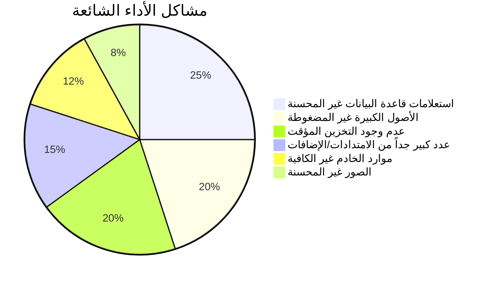
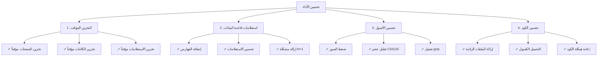
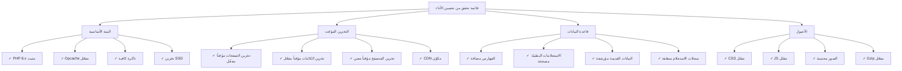

# الأسئلة الشائعة حول الأداء

> أسئلة وإجابات شائعة حول تحسين أداء XOOPS وتشخيص المواقع البطيئة.

---

## الأداء العام

### س: كيف أعرف إذا كان موقع XOOPS الخاص بي بطيئاً؟

**ج:** استخدم هذه الأدوات والمقاييس:

1. **وقت تحميل الصفحة**:
```bash
# استخدم curl لقياس وقت الاستجابة
curl -w "@curl-format.txt" -o /dev/null -s https://yoursite.com

# أو استخدم أدوات عبر الإنترنت
# - PageSpeed Insights (Google)
# - GTmetrix
# - WebPageTest
```

2. **المقاييس المستهدفة**:
- First Contentful Paint (FCP): < 1.8s
- Largest Contentful Paint (LCP): < 2.5s
- Time to First Byte (TTFB): < 0.6s
- حجم الصفحة الإجمالي: < 2-3 MB

3. **فحص سجلات الخادم**:
```bash
# Apache
tail -100 /var/log/apache2/access.log

# Nginx
tail -100 /var/log/nginx/access.log

# ابحث عن الطلبات البطيئة (> 1 ثانية)
```

---

### س: ما هي أكثر مشاكل الأداء شيوعاً؟

**ج:**


---

### س: أين يجب أن أركز جهود التحسين؟

**ج:** اتبع أولوية التحسين:



---

## التخزين المؤقت

### س: كيف أفعّل التخزين المؤقت في XOOPS؟

**ج:** XOOPS لديه تخزين مؤقت مدمج. تكوينه في Admin > Settings > Performance:

```php
<?php
// تحقق من إعدادات التخزين المؤقت في mainfile.php أو الإدارة
// أنواع التخزين المؤقت الشائعة:
// 1. file - تخزين مؤقت قائم على الملفات (افتراضي)
// 2. memcache - Memcached (إذا تم تثبيته)
// 3. redis - Redis (إذا تم تثبيته)

// في الكود، استخدم التخزين المؤقت:
$cache = xoops_cache_handler::getInstance();

// قراءة من التخزين المؤقت
$data = $cache->read('cache_key');

if ($data === false) {
    // غير موجود في التخزين المؤقت، احصل من المصدر
    $data = expensive_operation();

    // اكتب إلى التخزين المؤقت (3600 = ساعة واحدة)
    $cache->write('cache_key', $data, 3600);
}
?>
```

---

### س: نوع التخزين المؤقت الذي يجب أن أستخدمه؟

**ج:**
- **File Cache**: افتراضي، بسيط، لا يتطلب إعداداً إضافياً. جيد للمواقع الصغيرة.
- **Memcache**: أسرع، قائم على الذاكرة. أفضل للمواقع عالية الحركة.
- **Redis**: الأكثر قوة، يدعم أنواع بيانات أكثر. الأفضل للتوسع.

التثبيت والتفعيل:
```bash
# تثبيت Memcached
sudo apt-get install memcached php-memcached

# أو تثبيت Redis
sudo apt-get install redis-server php-redis

# أعد تشغيل PHP-FPM أو Apache
sudo systemctl restart php-fpm
sudo systemctl restart apache2
```

ثم فعّله من لوحة التحكم في XOOPS.

---

### س: كيف أمسح ذاكرة التخزين المؤقت في XOOPS؟

**ج:**
```bash
# امسح كل التخزين المؤقت
rm -rf xoops_data/caches/*

# امسح ذاكرة التخزين المؤقت لـ Smarty بشكل محدد
rm -rf xoops_data/caches/smarty_cache/*
rm -rf xoops_data/caches/smarty_compile/*

# أو في لوحة الإدارة
اذهب إلى Admin > System > Maintenance > Clear Cache
```

في الكود:
```php
<?php
$cache = xoops_cache_handler::getInstance();
$cache->deleteAll();

// أو امسح المفاتيح المحددة
$cache->delete('cache_key');
?>
```

---

### س: كم من الوقت يجب أن أخزن البيانات مؤقتاً؟

**ج:** يعتمد على متطلبات تحديث البيانات:

```php
<?php
// 5 دقائق - البيانات التي تتغير بكثرة
$cache->write('key', $data, 300);

// ساعة واحدة - البيانات شبه الثابتة
$cache->write('key', $data, 3600);

// 24 ساعة - البيانات الثابتة والصور وما إلى ذلك
$cache->write('key', $data, 86400);

// لا ينتهي الصلاحية (حتى المسح اليدوي)
$cache->write('key', $data, 0);

// التخزين المؤقت أثناء الطلب الحالي فقط
$cache->write('key', $data, 1);
?>
```

---

## تحسين قاعدة البيانات

### س: كيف أجد الاستعلامات البطيئة في قاعدة البيانات؟

**ج:** فعّل تسجيل الاستعلامات:

```php
<?php
// في mainfile.php
define('XOOPS_DB_DEBUGMODE', true);
define('XOOPS_SQL_DEBUG', true);

// ثم تحقق من جدول xoops_log
SELECT * FROM xoops_log WHERE logid > SOME_NUMBER
ORDER BY created DESC LIMIT 20;
?>
```

أو استخدم سجل الاستعلامات البطيئة في MySQL:
```bash
# فعّل في /etc/mysql/my.cnf
[mysqld]
slow_query_log = 1
slow_query_log_file = /var/log/mysql/slow.log
long_query_time = 1  # سجل الاستعلامات > 1 ثانية

# عرض الاستعلامات البطيئة
tail -100 /var/log/mysql/slow.log
```

---

### س: كيف أحسّن استعلامات قاعدة البيانات؟

**ج:** اتبع هذه الخطوات:

**1. إضافة فهارس قاعدة البيانات**
```sql
-- أضف فهرساً للأعمدة التي يتم البحث فيها بكثرة
ALTER TABLE `xoops_articles` ADD INDEX `author_id` (`author_id`);
ALTER TABLE `xoops_articles` ADD INDEX `created` (`created`);

-- تحقق مما إذا ساعد الفهرس
ANALYZE TABLE `xoops_articles`;
EXPLAIN SELECT * FROM xoops_articles WHERE author_id = 5;
```

**2. استخدم LIMIT والتقسيم إلى صفحات**
```php
<?php
// خطأ - يحصل على جميع السجلات
$result = $db->query("SELECT * FROM xoops_articles");

// صحيح - يحصل على 10 سجلات بدءاً من الإزاحة
$limit = 10;
$offset = 0;  // غيّر مع التقسيم إلى صفحات
$result = $db->query(
    "SELECT * FROM xoops_articles LIMIT $limit OFFSET $offset"
);
?>
```

**3. حدد الأعمدة المطلوبة فقط**
```php
<?php
// خطأ
$result = $db->query("SELECT * FROM xoops_articles");

// صحيح
$result = $db->query(
    "SELECT id, title, author_id, created FROM xoops_articles"
);
?>
```

**4. تجنب مشكلة N+1**
```php
<?php
// خطأ - مشكلة N+1
$articles = $db->query("SELECT * FROM xoops_articles");
while ($article = $articles->fetch_assoc()) {
    // هذا الاستعلام يعمل مرة واحدة لكل مقالة!
    $author = $db->query(
        "SELECT * FROM xoops_users WHERE uid = " . $article['author_id']
    );
}

// صحيح - استخدم JOIN
$result = $db->query("
    SELECT a.*, u.uname, u.email
    FROM xoops_articles a
    JOIN xoops_users u ON a.author_id = u.uid
");

while ($row = $result->fetch_assoc()) {
    echo $row['title'] . " by " . $row['uname'];
}
?>
```

**5. استخدم EXPLAIN لتحليل الاستعلامات**
```sql
EXPLAIN SELECT * FROM xoops_articles WHERE author_id = 5 AND status = 1;

-- ابحث عن:
-- - type: ALL (سيء)، INDEX (حسن)، const/ref (جيد)
-- - possible_keys: يجب أن يظهر الفهارس المتاحة
-- - key: يجب أن يستخدم الفهرس الأفضل
-- - rows: يجب أن يكون رقماً منخفضاً
```

---

### س: كيف أقلل حمل قاعدة البيانات؟

**ج:**
1. **خزّن نتائج الاستعلامات مؤقتاً**:
```php
<?php
$cache = xoops_cache_handler::getInstance();
$articles = $cache->read('all_articles');

if ($articles === false) {
    $result = $db->query("SELECT * FROM xoops_articles");
    $articles = $result->fetch_all();
    $cache->write('all_articles', $articles, 3600);
}
?>
```

2. **أرشّف البيانات القديمة** في جداول منفصلة
3. **نظّف السجلات** بانتظام:
```bash
# احذف إدخالات السجل القديمة (أقدم من 30 يوماً)
DELETE FROM xoops_log WHERE created < NOW() - INTERVAL 30 DAY;
```

4. **فعّل cache الاستعلام** (MySQL):
```sql
SET GLOBAL query_cache_type = 1;
SET GLOBAL query_cache_size = 268435456;  -- 256 MB
```

---

## تحسين الأصول

### س: كيف أحسّن CSS و JavaScript؟

**ج:**

**1. تقليل حجم الملفات**:
```bash
# استخدام أدوات عبر الإنترنت
# - cssminifier.com
# - javascript-minifier.com
# - minify.org

# أو مع أدوات سطر الأوامر
sudo apt-get install yui-compressor closure-compiler
yui-compressor file.css -o file.min.css
```

**2. دمج الملفات ذات الصلة**:
```html
{* بدلاً من ملفات عديدة *}
<link rel="stylesheet" href="{$xoops_url}/themes/{$xoops_theme}/style1.css">
<link rel="stylesheet" href="{$xoops_url}/themes/{$xoops_theme}/style2.css">
<link rel="stylesheet" href="{$xoops_url}/themes/{$xoops_theme}/style3.css">

{* دمج في واحد *}
<link rel="stylesheet" href="{$xoops_url}/themes/{$xoops_theme}/style.css">
```

**3. تأجيل JavaScript غير الحرج**:
```html
{* JS حرج - حمّل فوراً *}
<script src="critical.js"></script>

{* JS غير حرج - حمّل بعد الصفحة *}
<script src="analytics.js" defer></script>
<script src="ads.js" async></script>
```

**4. تفعيل ضغط Gzip** (.htaccess):
```apache
<IfModule mod_deflate.c>
    AddOutputFilterByType DEFLATE text/html
    AddOutputFilterByType DEFLATE text/plain
    AddOutputFilterByType DEFLATE text/xml
    AddOutputFilterByType DEFLATE text/css
    AddOutputFilterByType DEFLATE text/javascript
    AddOutputFilterByType DEFLATE application/javascript
    AddOutputFilterByType DEFLATE application/xml
</IfModule>
```

---

### س: كيف أحسّن الصور؟

**ج:**

**1. اختر الصيغة الصحيحة**:
- JPG: الصور الفوتوغرافية والصور المعقدة
- PNG: الرسومات والصور ذات الشفافية
- WebP: المتصفحات الحديثة، ضغط أفضل
- AVIF: الأحدث، أفضل ضغط

**2. اضغط الصور**:
```bash
# استخدام ImageMagick
convert image.jpg -quality 85 image-compressed.jpg

# استخدام ImageOptim
imageoptim image.jpg

# أدوات عبر الإنترنت
# - imagecompressor.com
# - tinypng.com
```

**3. قدّم صوراً متجاوبة**:
```html
{* قدّم أحجاماً مختلفة *}
<picture>
    <source srcset="image-large.webp" type="image/webp" media="(min-width: 1200px)">
    <source srcset="image-medium.webp" type="image/webp" media="(min-width: 768px)">
    <source srcset="image-small.webp" type="image/webp">
    
</picture>
```

**4. حمّل الصور بشكل كسول**:
```html
{* التحميل الكسول الأصلي *}


{* أو مع مكتبة JavaScript *}
<script src="https://cdn.jsdelivr.net/npm/lazysizes@5/lazysizes.min.js"></script>

```

---

## تكوين الخادم

### س: كيف أتحقق من أداء الخادم؟

**ج:**

```bash
# CPU والذاكرة
top -b -n 1 | head -20
free -h
df -h

# تحقق من عمليات PHP-FPM
ps aux | grep php-fpm

# تحقق من اتصالات Apache/Nginx
netstat -an | grep ESTABLISHED | wc -l

# راقب في الوقت الفعلي
watch 'free -h && echo "---" && df -h'
```

---

### س: كيف أحسّن PHP لـ XOOPS؟

**ج:** عدّل `/etc/php/8.x/fpm/php.ini`:

```ini
; زيادة الحدود لـ XOOPS
max_execution_time = 300         ; الافتراضي 30 ثانية
memory_limit = 512M              ; الافتراضي 128MB
upload_max_filesize = 100M       ; الافتراضي 2MB
post_max_size = 100M             ; الافتراضي 8MB

; فعّل opcache للأداء
opcache.enable = 1
opcache.memory_consumption = 256
opcache.max_accelerated_files = 20000
opcache.validate_timestamps = 0   ; الإنتاج: 0 (أعد الحمل عند الإعادة)
opcache.revalidate_freq = 0       ; الإنتاج: 0 أو رقم مرتفع

; قاعدة البيانات
default_socket_timeout = 60
mysqli.default_socket = /run/mysqld/mysqld.sock
```

ثم أعد تشغيل PHP:
```bash
sudo systemctl restart php8.2-fpm
# أو
sudo systemctl restart apache2
```

---

### س: كيف أفعّل HTTP/2 والضغط؟

**ج:** بالنسبة لـ Apache (.htaccess):
```apache
# فعّل HTTPS (مطلوب لـ HTTP/2)
<IfModule mod_ssl.c>
    Protocols h2 http/1.1
</IfModule>

# فعّل الضغط
<IfModule mod_deflate.c>
    AddOutputFilterByType DEFLATE text/html text/plain text/css text/javascript application/javascript
</IfModule>

# فعّل تخزين المتصفح مؤقتاً
<IfModule mod_expires.c>
    ExpiresActive On
    ExpiresByType image/jpeg "access plus 1 year"
    ExpiresByType image/png "access plus 1 year"
    ExpiresByType text/css "access plus 1 month"
    ExpiresByType text/javascript "access plus 1 month"
</IfModule>
```

بالنسبة لـ Nginx (nginx.conf):
```nginx
http {
    # فعّل gzip
    gzip on;
    gzip_types text/plain text/css text/javascript application/json;
    gzip_min_length 1000;

    # فعّل HTTP/2
    listen 443 ssl http2;

    # تخزين المتصفح مؤقتاً
    expires 1y;
    add_header Cache-Control "public, immutable";
}
```

---

## المراقبة والتشخيص

### س: كيف أراقب أداء XOOPS عبر الوقت؟

**ج:**

**1. استخدم Google Analytics**:
- Core Web Vitals
- أوقات تحميل الصفحة
- سلوك المستخدم

**2. استخدم أدوات مراقبة الخادم**:
```bash
# تثبيت Glances (مراقب النظام)
sudo apt-get install glances
glances

# أو استخدم New Relic و DataDog وما إلى ذلك
```

**3. سجّل وحلّل الطلبات**:
```bash
# احصل على متوسط وقت الاستجابة
grep "GET /index.php" /var/log/apache2/access.log | \
  awk '{print $NF}' | \
  sort -n | \
  awk '{sum+=$1; count++} END {print "Average: " sum/count " ms"}'
```

---

### س: كيف أحدّد تسرب الذاكرة؟

**ج:**

```php
<?php
// في الكود، تتبع استخدام الذاكرة
$start_memory = memory_get_usage();

// قم بالعمليات
for ($i = 0; $i < 1000; $i++) {
    $array[] = expensive_operation();
}

$end_memory = memory_get_usage();
$used = ($end_memory - $start_memory) / 1024 / 1024;

if ($used > 50) {  // تنبيه إذا > 50MB
    error_log("Memory leak detected: " . $used . " MB");
}

// تحقق من ذروة الذاكرة
$peak = memory_get_peak_usage();
echo "Peak memory: " . ($peak / 1024 / 1024) . " MB";
?>
```

---

## قائمة تحقق من الأداء



---

## الوثائق ذات الصلة

- Database Debugging
- Enable Debug Mode
- Module FAQ
- Performance Optimization

---

#xoops #performance #optimization #faq #troubleshooting #caching
