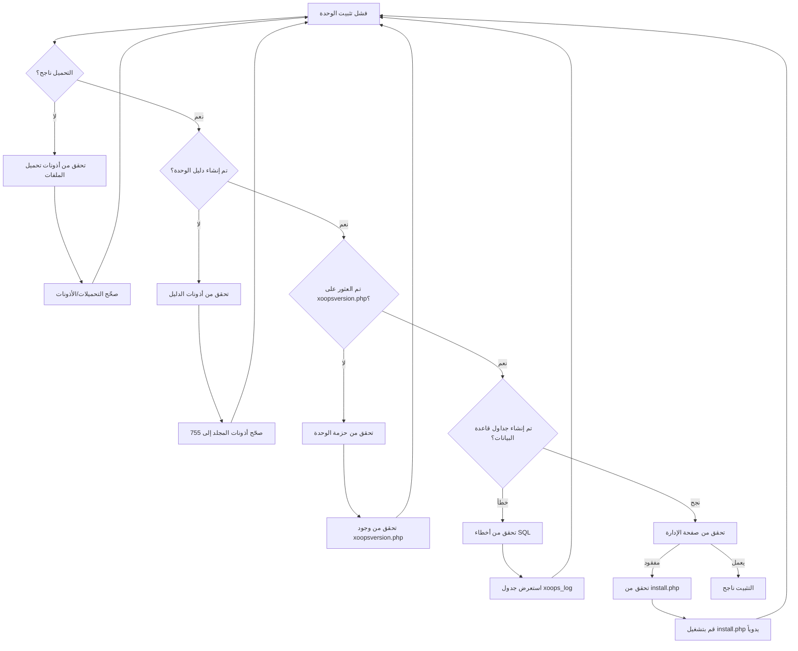
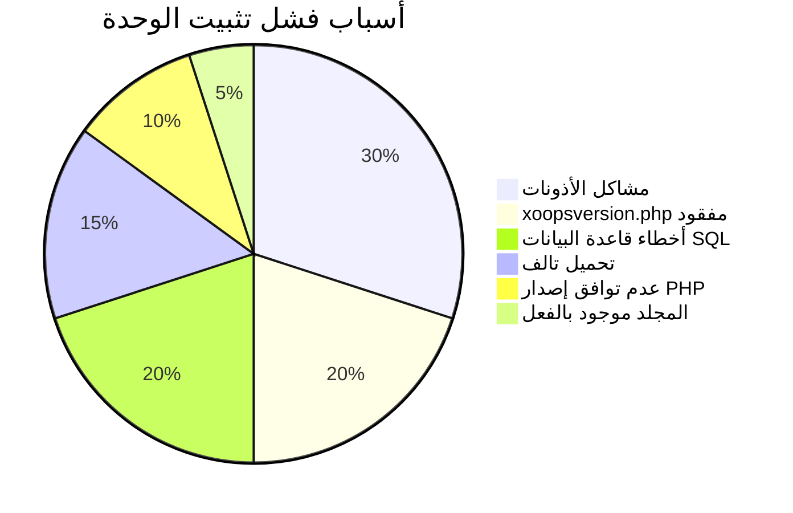

> مشاكل شائعة وحلول لحل مشاكل تثبيت الوحدة في XOOPS.

---

## مخطط التشخيص



---

## الأسباب الشائعة والحلول



---

## 1. رفض أذونات تحميل الملفات

**الأعراض:**
- فشل التحميل برسالة "Permission denied"
- لم يتم إنشاء مجلد الوحدة
- لا يمكن الكتابة إلى دليل الوحدات

**رسائل الخطأ:**
```
Warning: move_uploaded_file(): Unable to move file
Permission denied (13)
```

**الحلول:**

```bash
# فحص الأذونات الحالية
ls -ld /path/to/xoops/modules
ls -ld /path/to/xoops/uploads

# صحّح أذونات دليل الوحدات
chmod 755 /path/to/xoops/modules

# صحّح دليل التحميل المؤقت
chmod 777 /path/to/xoops/uploads
chmod 777 /tmp  # إذا لزم الأمر

# صحّح الملكية (إذا كان يعمل كمستخدم مختلف)
chown -R www-data:www-data /path/to/xoops/modules
chown -R www-data:www-data /path/to/xoops/uploads
```

---

## 2. xoopsversion.php مفقود

**الأعراض:**
- تظهر الوحدة في القائمة ولكن لن تفعّل
- يبدأ التثبيت ثم يتوقف
- لم يتم إنشاء صفحة إدارية

**خطأ في xoops_log:**
```
Module xoopsversion.php not found
```

**الحلول:**

تحقق من هيكل حزمة الوحدة:

```bash
# استخرج وتحقق من محتويات الوحدة
unzip module.zip
ls -la mymodule/

# يجب أن يحتوي على:
# - xoopsversion.php
# - language/
# - sql/
# - admin/ (اختياري لكن مُنصح به)
```

**هيكل xoopsversion.php صحيح:**

```php
<?php
$modversion['name'] = 'My Module';
$modversion['version'] = '1.0.0';
$modversion['description'] = 'Module description';
$modversion['author'] = 'Author Name';
$modversion['author_mail'] = 'author@example.com';
$modversion['author_website_url'] = 'https://example.com';
$modversion['credits'] = 'Credits';
$modversion['license'] = 'GPL 2.0 or later';
$modversion['official'] = 0;
$modversion['image'] = 'images/icon.png';
$modversion['dirname'] = basename(__DIR__);
$modversion['modpath'] = __DIR__;

// معلومات الوحدة الأساسية
$modversion['hasMain'] = 1;
$modversion['hasAdmin'] = 1;
$modversion['hasSearch'] = 0;
$modversion['hasNotification'] = 0;

// جداول قاعدة البيانات
$modversion['sqlfile']['mysql'] = 'sql/mysql.sql';
$modversion['tables'] = ['table_name'];
```

---

## 3. أخطاء تنفيذ SQL لقاعدة البيانات

**الأعراض:**
- التحميل ناجح لكن جداول قاعدة البيانات لم تُنشأ
- صفحة الإدارة لن تحمّل
- أخطاء "Table doesn't exist"

**رسائل الخطأ:**
```
SQL Error: Table 'xoops_module_table' already exists
Syntax error in SQL statement
```

**الحلول:**

### فحص بناء جملة ملف SQL

```bash
# عرض ملف SQL
cat modules/mymodule/sql/mysql.sql

# تحقق من مشاكل البناء
# تحقق من:
# - جميع بيانات CREATE TABLE تنتهي بـ ;
# - الفاصل العكسي الصحيح للمعرفات
# - أنواع الحقول الصحيحة (INT، VARCHAR، TEXT، إلخ)
```

**صيغة SQL الصحيحة:**

```sql
CREATE TABLE `xoops_module_table` (
  `id` INT(11) NOT NULL AUTO_INCREMENT,
  `name` VARCHAR(255) NOT NULL,
  `description` TEXT,
  `created` INT(11) NOT NULL,
  `updated` INT(11) NOT NULL,
  PRIMARY KEY (`id`)
) ENGINE=InnoDB DEFAULT CHARSET=utf8mb4;
```

### قم بتنفيذ SQL يدوياً

```php
<?php
// أنشئ الملف: modules/mymodule/test_sql.php
require_once '../../mainfile.php';

$sql_file = __DIR__ . '/sql/mysql.sql';
$sql_content = file_get_contents($sql_file);

// قسّم البيانات
$statements = array_filter(array_map('trim', explode(';', $sql_content)));

foreach ($statements as $statement) {
    if (empty($statement)) continue;

    try {
        $GLOBALS['xoopsDB']->query($statement);
        echo "✓ Executed: " . substr($statement, 0, 50) . "...<br>";
    } catch (Exception $e) {
        echo "✗ Error: " . $e->getMessage() . "<br>";
        echo "Statement: " . substr($statement, 0, 100) . "...<br>";
    }
}
?>
```

---

## 4. تحميل وحدة تالفة

**الأعراض:**
- تم تحميل الملفات جزئياً
- ملفات .php عشوائية مفقودة
- تصبح الوحدة غير مستقرة بعد التثبيت

**الحلول:**

```bash
# أعد تحميل نسخة طازجة
rm -rf /path/to/xoops/modules/mymodule

# تحقق من مجموع التحقق إذا كان مقدماً
md5sum -c mymodule.md5

# تحقق من سلامة الأرشيف قبل الاستخراج
unzip -t mymodule.zip

# استخرج إلى مؤقتة، تحقق، ثم انقل
unzip -d /tmp mymodule.zip
find /tmp/mymodule -name "*.php" | wc -l
# يجب أن يعرض العدد المتوقع من الملفات
```

---

## 5. عدم توافق إصدار PHP

**الأعراض:**
- فشل التثبيت فوراً
- أخطاء تحليل في xoopsversion.php
- أخطاء "Unexpected token"

**رسائل الخطأ:**
```
Parse error: syntax error, unexpected 'fn' (T_FN)
```

**الحلول:**

```bash
# فحص إصدار PHP المدعوم لـ XOOPS
grep -r "php_require" /path/to/xoops/

# فحص متطلبات الوحدة
grep -i "php\|version" modules/mymodule/xoopsversion.php

# فحص إصدار PHP على الخادم
php --version
```

**اختبر توافق الوحدة:**

```php
<?php
// أنشئ modules/mymodule/check_compat.php
$required_php = '7.4.0';
$current_php = PHP_VERSION;

echo "Required PHP: $required_php<br>";
echo "Current PHP: $current_php<br>";

if (version_compare(PHP_VERSION, $required_php, '<')) {
    echo "✗ PHP version too old<br>";
} else {
    echo "✓ PHP version compatible<br>";
}

// تحقق من الامتدادات المطلوبة
$required_ext = ['mysqli', 'json', 'mb_string'];
foreach ($required_ext as $ext) {
    echo extension_loaded($ext) ? "✓" : "✗";
    echo " $ext<br>";
}
?>
```

---

## 6. مجلد الوحدة موجود بالفعل

**الأعراض:**
- فشل التثبيت عند وجود دليل الوحدة
- لا يمكن إعادة تثبيت أو تحديث الوحدة
- خطأ "Directory exists"

**رسائل الخطأ:**
```
The specified directory already exists
```

**الحلول:**

```bash
# احسب نسخة احتياطية من الوحدة الموجودة
cp -r modules/mymodule modules/mymodule.backup

# احذف التثبيت القديم تماماً
rm -rf modules/mymodule

# امسح أي ذاكرة تخزين مؤقت تتعلق بالوحدة
rm -rf xoops_data/caches/*

# الآن أعد محاولة التثبيت عبر لوحة الإدارة
```

---

## 7. فشل توليد صفحة الإدارة

**الأعراض:**
- تثبّت الوحدة ولكن صفحة الإدارة مفقودة
- لا تعرض لوحة الإدارة الوحدة
- لا يمكن الوصول إلى إعدادات الوحدة

**الحلول:**

```php
<?php
// أنشئ modules/mymodule/admin/index.php
<?php
/**
 * فهرس إدارة الوحدة
 */

include_once XOOPS_ROOT_PATH . '/kernel/module.php';

if (!is_object($xoopsModule) || !is_object($xoopsUser) || !$xoopsUser->isAdmin($xoopsModule->mid())) {
    exit("Access Denied");
}

// أدرج رأس الإدارة
xoops_cp_header();

// أضف محتوى الإدارة
echo "<h1>Module Administration</h1>";
echo "<p>Welcome to module administration</p>";

// أدرج تذييل الإدارة
xoops_cp_footer();
?>
```

---

## 8. ملفات اللغة المفقودة

**الأعراض:**
- تعرض الوحدة أسماء متغيرات بدلاً من النص
- صفحات الإدارة تظهر نص بنمط "[LANG_CONSTANT]"
- اكتمل التثبيت لكن الواجهة مكسورة

**الحلول:**

```bash
# تحقق من هيكل ملف اللغة
ls -la modules/mymodule/language/

# يجب أن يحتوي على:
# english/ (على الأقل)
#   admin.php
#   index.php
#   modinfo.php
```

**أنشئ ملف اللغة:**

```php
<?php
// modules/mymodule/language/english/index.php
<?php
define('_AM_MYMODULE_INSTALLED', 'Module installed successfully');
define('_AM_MYMODULE_UPDATED', 'Module updated successfully');
define('_AM_MYMODULE_ERROR', 'An error occurred');
?>
```

---

## قائمة التحقق من التثبيت

```mermaid
graph TD
    A[قائمة تحقق من التثبيت] --> B["1. تحقق من هيكل الوحدة"]
    A --> C["2. فحص الأذونات"]
    A --> D["3. اختبر ملف SQL"]
    A --> E["4. تحقق من xoopsversion.php"]
    A --> F["5. تحقق من ملفات اللغة"]
    A --> G["6. اختبر التثبيت"]
    A --> H["7. تحقق من الإدارة"]

    B --> B1["✓ يحتوي على xoopsversion.php"]
    B --> B2["✓ ملفات SQL موجودة"]
    B --> B3["✓ ملفات اللغة موجودة"]

    C --> C1["✓ modules/ هو 755"]
    C --> C2["✓ uploads/ هو 777"]
    C --> C3["✓ خادم الويب يمكنه الكتابة"]

    D --> D1["✓ بناء جملة SQL صحيح"]
    D --> D2["✓ لا توجد جداول مكررة"]

    E --> E1["✓ بناء جملة PHP صحيح"]
    E --> E2["✓ الحقول المطلوبة موجودة"]

    F --> F1["✓ مجلد english/ موجود"]
    F --> F2["✓ ملفات .php موجودة"]

    G --> G1["✓ تحميل ناجح"]
    G --> G2["✓ إنشاء قاعدة البيانات"]

    H --> H1["✓ مرئي في قائمة الوحدات"]
    H --> H2["✓ صفحة الإدارة قابلة للوصول"]
```



---

## نص التصحيح

أنشئ `modules/mymodule/debug_install.php`:

```php
<?php
/**
 * مصحح تثبيت الوحدة
 * احذف بعد استكشاف الأخطاء!
 */

require_once '../../mainfile.php';

echo "<h1>Module Installation Debug</h1>";

// 1. تحقق من هيكل الملف
echo "<h2>1. File Structure</h2>";
$required_files = [
    'xoopsversion.php',
    'language/english/modinfo.php',
    'language/english/index.php',
    'language/english/admin.php'
];

foreach ($required_files as $file) {
    $path = __DIR__ . '/' . $file;
    echo file_exists($path) ? "✓" : "✗";
    echo " $file<br>";
}

// 2. تحقق من xoopsversion.php
echo "<h2>2. xoopsversion.php Content</h2>";
$version_file = __DIR__ . '/xoopsversion.php';
if (file_exists($version_file)) {
    $modversion = [];
    include $version_file;
    echo "<pre>";
    echo "Name: " . ($modversion['name'] ?? 'NOT SET') . "\n";
    echo "Version: " . ($modversion['version'] ?? 'NOT SET') . "\n";
    echo "Dirname: " . ($modversion['dirname'] ?? 'NOT SET') . "\n";
    echo "Has SQL: " . (isset($modversion['sqlfile']) ? "YES" : "NO") . "\n";
    echo "Has Tables: " . (isset($modversion['tables']) ? count($modversion['tables']) : 0) . "\n";
    echo "</pre>";
}

// 3. تحقق من ملف SQL
echo "<h2>3. SQL File</h2>";
$sql_file = __DIR__ . '/sql/mysql.sql';
if (file_exists($sql_file)) {
    $content = file_get_contents($sql_file);
    $tables = substr_count($content, 'CREATE TABLE');
    echo "✓ SQL file exists<br>";
    echo "✓ Contains $tables CREATE TABLE statements<br>";
    echo "<pre>" . htmlspecialchars(substr($content, 0, 300)) . "...</pre>";
} else {
    echo "✗ SQL file not found<br>";
}

// 4. تحقق من ملفات اللغة
echo "<h2>4. Language Files</h2>";
$lang_files = [
    'language/english/modinfo.php',
    'language/english/index.php',
    'language/english/admin.php'
];

foreach ($lang_files as $file) {
    $path = __DIR__ . '/' . $file;
    if (file_exists($path)) {
        $size = filesize($path);
        echo "✓ $file ($size bytes)<br>";
    } else {
        echo "✗ $file MISSING<br>";
    }
}

// 5. تحقق من الأذونات
echo "<h2>5. Directory Permissions</h2>";
echo "Module dir: " . substr(sprintf('%o', fileperms(__DIR__)), -4) . "<br>";

// 6. اختبر اتصال قاعدة البيانات
echo "<h2>6. Database Connection</h2>";
if (is_object($GLOBALS['xoopsDB'])) {
    echo "✓ Database connected<br>";

    // حاول إنشاء جدول اختبار
    $test_sql = "CREATE TEMPORARY TABLE test_install (id INT PRIMARY KEY)";
    if ($GLOBALS['xoopsDB']->query($test_sql)) {
        echo "✓ Can create tables<br>";
    } else {
        echo "✗ Cannot create tables: " . $GLOBALS['xoopsDB']->error . "<br>";
    }
} else {
    echo "✗ Database not connected<br>";
}

echo "<p><strong>Delete this file after testing!</strong></p>";
?>
```

---

## الوقاية والممارسات الأفضل

1. **احسب نسخة احتياطية دائماً** قبل تثبيت وحدات جديدة
2. **اختبر محلياً** قبل النشر على الإنتاج
3. **تحقق من هيكل الوحدة** قبل التحميل
4. **فحص الأذونات** فوراً بعد التحميل
5. **استعرض جدول xoops_log** لأخطاء التثبيت
6. **احفظ النسخ الاحتياطية** من إصدارات الوحدة التي تعمل

---

## الوثائق ذات الصلة

- Enable Debug Mode
- Module FAQ
- Module Structure
- Database Connection Errors

---

#xoops #troubleshooting #modules #installation #debugging
