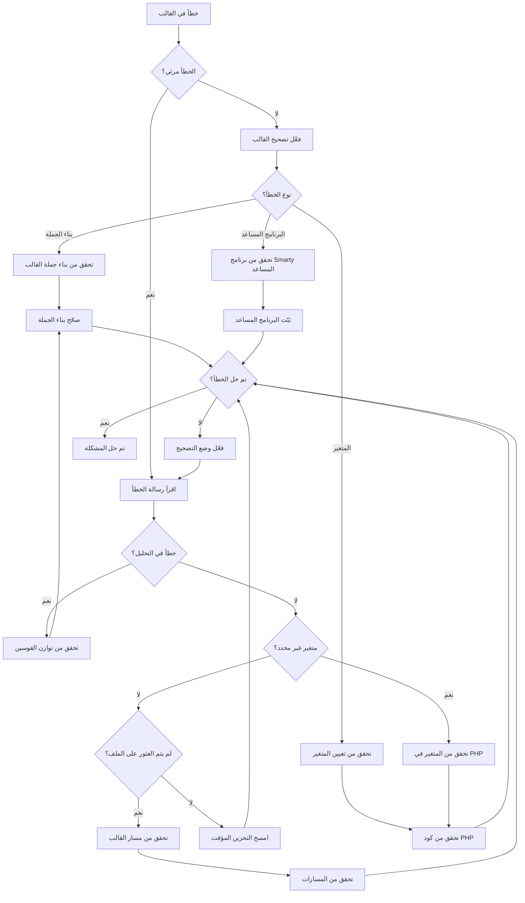
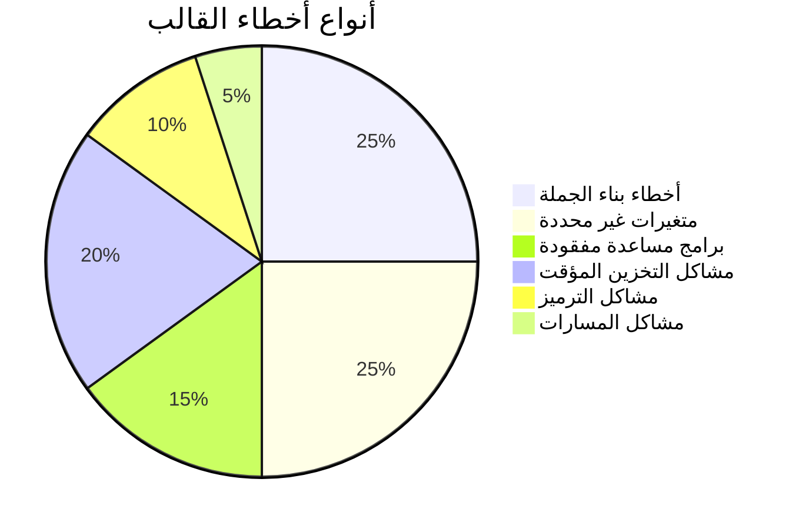

# أخطاء القوالس (تصحيح Smarty)

> مشاكل قوالس Smarty الشائعة وتقنيات التصحيح لقوالس ووحدات XOOPS.

---

## مخطط التشخيص



---

## أنواع أخطاء قوالس Smarty الشائعة



---

## 1. أخطاء بناء الجملة

**الأعراض:**
- رسائل "Smarty syntax error"
- لن تُترجم القوالس
- صفحة فارغة بدون مخرجات

**رسائل الخطأ:**
```
Syntax error: unrecognized tag 'myfunction'
Unexpected "}" near end of template
```

### مشاكل بناء الجملة الشائعة

**وسم إغلاق مفقود:**
```smarty
{* خطأ *}
{if $user}
User: {$user.name}
{* {/if} مفقود *}

{* صحيح *}
{if $user}
User: {$user.name}
{/if}
```

**بناء جملة متغير غير صحيح:**
```smarty
{* خطأ *}
{$user->name}          {* استخدم . وليس -> *}
{$array[key]}          {* استخدم مفاتيح مقتبسة *}
{$func()}              {* لا يمكن استدعاء الدوال مباشرة *}

{* صحيح *}
{$user.name}
{$array.key}
{$array['key']}
{$user|@function}      {* استخدم المعدلات بدلاً من ذلك *}
```

**علامات استشهام غير متطابقة:**
```smarty
{* خطأ *}
{if $name == 'John}     {* علامات استشهام غير متطابقة *}
{assign var="user' value="John"}

{* صحيح *}
{if $name == 'John'}
{assign var="user" value="John"}
```

**الحلول:**

```smarty
{* وازن القوسين دائماً *}
{if condition}
  ...
{elseif condition}
  ...
{else}
  ...
{/if}

{* تحقق من تنسيق الوسم *}
{foreach $items as $item}
  ...
{/foreach}

{* تحقق من أن جميع المتغيرات محددة *}
{if isset($variable)}
  {$variable}
{/if}
```

---

## 2. أخطاء المتغيرات غير المحددة

**الأعراض:**
- تحذيرات "Undefined variable"
- المتغير يعرض فارغاً
- إشعار PHP في سجل الأخطاء

**رسائل الخطأ:**
```
Notice: Undefined variable: myvar
Smarty notice: variable "$user" not available
```

**نص التصحيح:**

```php
<?php
// في ملف القالب أو كود PHP
// أنشئ modules/yourmodule/debug_template.php

require_once '../../mainfile.php';

// احصل على محرك النموذج
$tpl = new XoopsTpl();

// تحقق من المتغيرات المعينة
echo "<h1>Template Variables</h1>";
echo "<pre>";
print_r($tpl->get_template_vars());
echo "</pre>";

// أو اطبع كائن Smarty
echo "<h1>Smarty Debug</h1>";
echo "<pre>";
$tpl->debug_vars();
echo "</pre>";
?>
```

**إصلاح في PHP:**

```php
<?php
// تأكد من تعيين المتغيرات قبل العرض
$xoopsTpl = new XoopsTpl();

// خطأ - لم يتم تعيين المتغير
$xoopsTpl->display('file:templates/page.html');

// صحيح - عيّن المتغيرات أولاً
$user = [
    'name' => 'John',
    'email' => 'john@example.com'
];
$xoopsTpl->assign('user', $user);
$xoopsTpl->display('file:templates/page.html');
?>
```

**إصلاح في القالب:**

```smarty
{* تحقق مما إذا كان المتغير موجوداً قبل استخدامه *}
{if isset($user)}
    <p>User: {$user.name}</p>
{else}
    <p>No user data</p>
{/if}

{* استخدم القيم الافتراضية *}
<p>Name: {$user.name|default:"No name"}</p>

{* تحقق مما إذا كان مفتاح الصفيف موجوداً *}
{if isset($array.key)}
    {$array.key}
{/if}
```

---

## 3. المعدلات المفقودة أو غير الصحيحة

**الأعراض:**
- البيانات لا تُنسق بشكل صحيح
- النص يعرض كـ HTML
- حالة/ترميز غير صحيح

**رسائل الخطأ:**
```
Warning: undefined modifier 'stripslashes'
```

**المعدلات الشائعة:**

```smarty
{* عمليات السلسلة *}
{$text|upper}                    {* أحرف كبيرة *}
{$text|lower}                    {* أحرف صغيرة *}
{$text|capitalize}               {* الحرف الأول كبير *}
{$text|truncate:20:"..."}        {* قطع إلى 20 حرف *}
{$text|strip_tags}               {* إزالة وسوم HTML *}

{* HTML/التنسيق *}
{$html|escape}                   {* فرار HTML *}
{$html|escape:'html'}
{$url|escape:'url'}              {* فرار URL *}
{$text|nl2br}                    {* أسطر جديدة إلى <br> *}

{* الصفائف *}
{$array|@count}                  {* عدد الصفيف *}
{$array|@implode:', '}           {* دمج الصفيف *}

{* القيم الافتراضية *}
{$var|default:"No value"}

{* تنسيق التاريخ *}
{$date|date_format:"%Y-%m-%d"}   {* تنسيق التاريخ *}

{* عمليات الرياضيات *}
{$number|math:'+':10}            {* عمليات الرياضيات *}
```

**تسجيل معدل مخصص:**

```php
<?php
// سجّل في الوحدة الخاصة بك
$xoopsTpl = new XoopsTpl();
$xoopsTpl->register_modifier('mymodifier', 'my_modifier_function');

function my_modifier_function($string) {
    return strtoupper($string);
}
?>
```

---

## 4. مشاكل التخزين المؤقت

**الأعراض:**
- تغييرات القالب لا تظهر
- المحتوى القديم لا يزال يظهر
- ملفات مضمنة أو موارد قديمة

**الحلول:**

```bash
# امسح أدلة ذاكرة التخزين المؤقت لـ Smarty
rm -rf /path/to/xoops/xoops_data/caches/smarty_cache/*
rm -rf /path/to/xoops/xoops_data/caches/smarty_compile/*

# امسح ذاكرة التخزين المؤقت لوحدة محددة
rm -rf /path/to/xoops/xoops_data/caches/smarty_cache/modules/*
```

**امسح التخزين المؤقت في الكود:**

```php
<?php
// امسح جميع ذاكرات Smarty
$xoopsTpl = new XoopsTpl();
$xoopsTpl->clear_cache();
$xoopsTpl->clear_compiled_tpl();

// امسح ذاكرة تخزين قالب محددة
$xoopsTpl->clear_cache('file:templates/page.html');

// امسح جميع الملفات المخزنة
require_once XOOPS_ROOT_PATH . '/class/xoopsfile.php';
$dh = opendir(XOOPS_CACHE_PATH . '/smarty_cache');
while (($file = readdir($dh)) !== false) {
    if (is_file(XOOPS_CACHE_PATH . '/smarty_cache/' . $file)) {
        unlink(XOOPS_CACHE_PATH . '/smarty_cache/' . $file);
    }
}
closedir($dh);
?>
```

---

## 5. أخطاء البرنامج المساعد غير الموجود

**الأعراض:**
- "Unknown modifier" أو "Unknown plugin"
- الدوال المخصصة لا تعمل
- أخطاء في التجميع مع البرامج المساعدة

**رسائل الخطأ:**
```
Fatal error: Call to undefined function smarty_modifier_custom
Unknown modifier 'myfunction'
```

**أنشئ برنامج مساعد مخصص:**

```php
<?php
// أنشئ: modules/yourmodule/plugins/modifier.custom.php

/**
 * برنامج معدل Smarty {$var|custom}
 */
function smarty_modifier_custom($string, $param = '') {
    // الكود المخصص الخاص بك
    return strtoupper($string) . $param;
}
?>
```

**سجّل البرنامج المساعد:**

```php
<?php
// في كود تهيئة الوحدة الخاصة بك
$xoopsTpl = new XoopsTpl();

// أضف دليل البرنامج المساعد إلى Smarty
$xoopsTpl->addPluginDir(
    XOOPS_ROOT_PATH . '/modules/yourmodule/plugins'
);

// أو سجّل يدوياً
$xoopsTpl->register_modifier(
    'custom',
    'smarty_modifier_custom'
);
?>
```

**أنواع البرامج المساعدة:**

```php
<?php
// برنامج معدل: modifier.name.php
function smarty_modifier_name($string) {
    return $string;
}

// برنامج كتلة: block.name.php
function smarty_block_name($params, $content, &$smarty, &$repeat) {
    if (!isset($smarty->security_settings['IF_FUNCS'])) {
        $smarty->security_settings['IF_FUNCS'] = [];
    }
    return $content;
}

// برنامج دالة: function.name.php
function smarty_function_name($params, &$smarty) {
    return 'output';
}

// برنامج فلتر: filter.name.php
function smarty_filter_name($code, &$smarty) {
    return $code;
}
?>
```

---

## 6. مشاكل الإدراج/الامتداد للقالب

**الأعراض:**
- القوالس المدرجة لا تُحمّل
- لم يتم العثور على قالب الوالد
- CSS/JS لا يُحمّل

**رسائل الخطأ:**
```
Template file 'file:path/to/template.html' not found
Can't find template file 'header.html'
```

**بناء جملة الإدراج الصحيح:**

```smarty
{* إدرج قالباً *}
{include file="file:templates/header.html"}

{* إدرج مع متغيرات *}
{include file="file:templates/header.html" title="My Page"}

{* وراثة القالب *}
{extends file="file:templates/base.html"}

{* كتل مسماة *}
{block name="content"}
    محتوى الصفحة هنا
{/block}

{* موارد ثابتة *}
<link rel="stylesheet" href="{$xoops_url}/themes/{$xoops_theme}/style.css">
<script src="{$xoops_url}/modules/{$xoops_module_dir}/js/script.js"></script>
```

**تحقق من مسار القالب:**

```bash
# تحقق من وجود ملف القالب
ls -la /path/to/xoops/themes/mytheme/templates/
ls -la /path/to/xoops/modules/mymodule/templates/

# فحص الأذونات
stat /path/to/xoops/themes/mytheme/templates/header.html
```

---

## 7. وصول متغير الصفيف/الكائن

**الأعراض:**
- لا يمكن الوصول إلى قيم الصفيف
- خصائص الكائن لا تُعرض
- فشل المتغيرات المعقدة

**رسائل الخطأ:**
```
Undefined variable: user.profile.name
```

**بناء الجملة الصحيح:**

```smarty
{* وصول الصفيف *}
{$array.key}                     {* استخدم . للمفاتيح *}
{$array['key']}
{$array.0}                       {* الفهارس الرقمية *}
{$array.$variable_key}           {* المفاتيح الديناميكية *}

{* الصفائف المتداخلة *}
{$user.profile.name}
{$data.items.0.title}

{* خصائص الكائن *}
{$object.property}
{$object.method|escape}          {* استدعاءات الدوال *}

{* الوصول الآمن مع isset *}
{if isset($array.key)}
    {$array.key}
{/if}

{* فحص الطول *}
{if count($array) > 0}
    Items found
{/if}
```

---

## 8. مشاكل ترميز الأحرف

**الأعراض:**
- نص مشوه في القوالس
- الأحرف الخاصة تعرض بشكل غير صحيح
- أحرف UTF-8 مكسورة

**الحلول:**

**ترميز ملف القالب:**

```smarty
{* عيّن charset في وسم meta *}
<meta charset="UTF-8">

{* أو في رأس HTML *}
<meta http-equiv="Content-Type" content="text/html; charset=utf-8">

{* إعلان PHP الصحيح *}
header('Content-Type: text/html; charset=utf-8');
```

**كود PHP:**

```php
<?php
// عيّن ترميز الإخراج
header('Content-Type: text/html; charset=utf-8');

// تأكد من أن قاعدة البيانات تستخدم UTF-8
$conn = new mysqli('localhost', 'user', 'pass', 'db');
$conn->set_charset('utf8mb4');

// أو في SQL
SET NAMES utf8mb4;
SET CHARACTER SET utf8mb4;

// عيّن البيانات بشكل صحيح
$text = mb_convert_encoding($text, 'UTF-8', 'UTF-8');
$xoopsTpl->assign('text', $text);
?>
```

---

## تكوين وضع التصحيح

**فعّل تصحيح القالب:**

```php
<?php
// في mainfile.php
define('XOOPS_DEBUG_LEVEL', 2);

// في تكوين Smarty
$xoopsTpl->debugging = true;
$xoopsTpl->debug_tpl = SMARTY_DIR . 'debug.tpl';

// أو في الوحدة
$tpl = new XoopsTpl();
$tpl->debugging = true;
?>
```

**مخرجات وحدة التصحيح:**

```php
<?php
// أنشئ modules/yourmodule/debug_smarty.php

require_once '../../mainfile.php';
require_once XOOPS_ROOT_PATH . '/class/smarty/Smarty.class.php';

$smarty = new Smarty();
$smarty->debugging = true;

// تحقق من القالب المترجم
$compiled_dir = $smarty->getCompileDir();
echo "<h1>Compiled Templates</h1>";
$files = glob($compiled_dir . '/*.php');
foreach ($files as $file) {
    echo "<p>" . basename($file) . "</p>";
}

// عرض الكود المترجم
echo "<h1>Compiled Code</h1>";
echo "<pre>";
$latest = max(array_map('filemtime', $files));
foreach ($files as $file) {
    if (filemtime($file) == $latest) {
        echo htmlspecialchars(file_get_contents($file));
        break;
    }
}
echo "</pre>";
?>
```

---

## قائمة التحقق من صحة القالب

```mermaid
graph TD
    A[التحقق من القالب] --> B["1. فحص بناء الجملة"]
    A --> C["2. التحقق من المتغير"]
    A --> D["3. فحص البرنامج المساعد"]
    A --> E["4. مسارات الملفات"]
    A --> F["5. الترميز"]
    A --> G["6. التخزين المؤقت"]

    B --> B1["✓ جميع القوسين متطابقة"]
    B --> B2["✓ جميع الوسوم مغلقة"]
    B --> B3["✓ بناء الجملة صحيح"]

    C --> C1["✓ المتغيرات معينة"]
    C --> C2["✓ وصول الخصائص صحيح"]
    C --> C3["✓ القيم الافتراضية معينة"]

    D --> D1["✓ المعدلات متاحة"]
    D --> D2["✓ البرامج المساعدة مسجلة"]
    D --> D3["✓ الدوال المخصصة تعمل"]

    E --> E1["✓ المسارات النسبية صحيحة"]
    E --> E2["✓ الملفات موجودة"]
    E --> E3["✓ الأذونات صحيحة"]

    F --> F1["✓ UTF-8 معلن"]
    F --> F2["✓ charset HTML معين"]
    F --> F3["✓ قاعدة البيانات UTF-8"]

    G --> G1["✓ التخزين المؤقت ممسوح"]
    G --> G2["✓ مترجم جديد"]
```



---

## الوقاية والممارسات الأفضل

1. **فعّل التصحيح** أثناء التطوير
2. **تحقق من القوالس** قبل النشر
3. **امسح التخزين المؤقت** بعد التغييرات
4. **استخدم git** لتتبع تغييرات القالب
5. **اختبر في متصفحات متعددة** من أجل مشاكل الترميز
6. **وثّق البرامج المساعدة المخصصة** والمعدلات
7. **استخدم وراثة القوالس** للاتساق

---

## الوثائق ذات الصلة

- Smarty Debugging Guide
- Smarty Templating
- Enable Debug Mode
- Theme FAQ

---

#xoops #troubleshooting #templates #smarty #debugging
