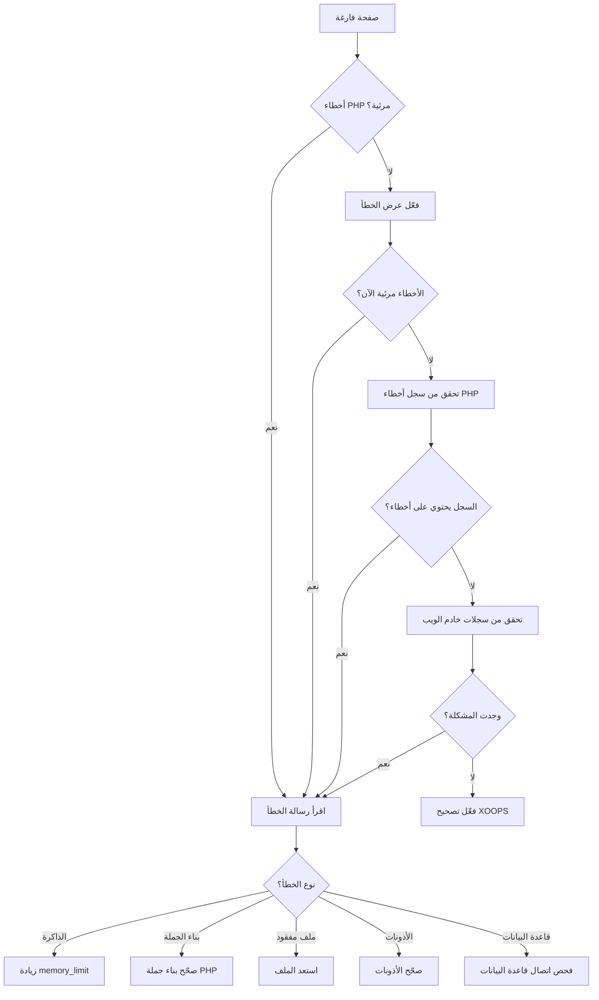
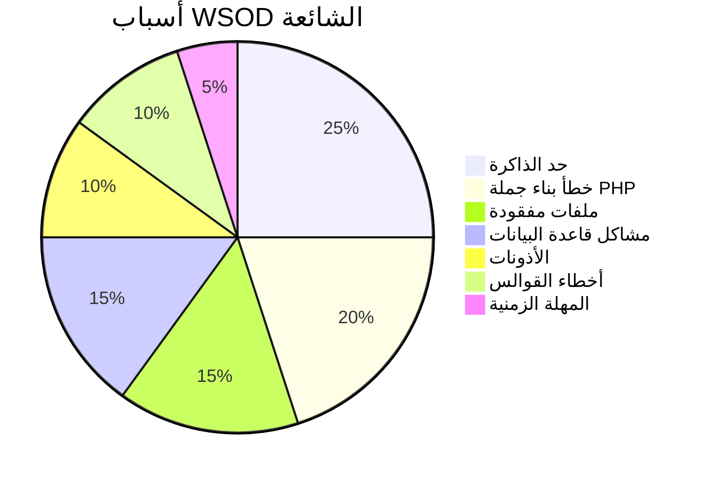
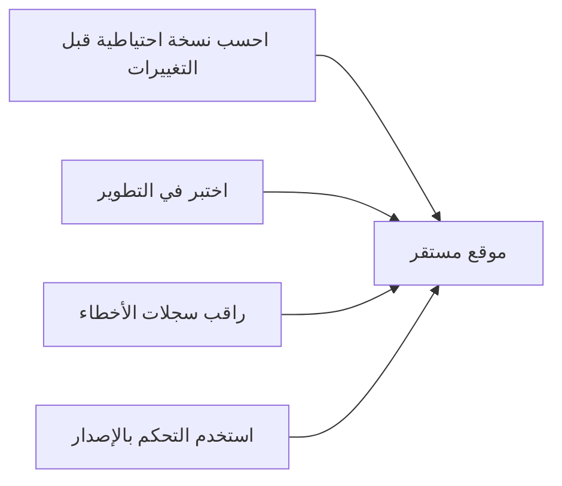

> كيفية تشخيص وإصلاح الصفحات البيضاء الفارغة في XOOPS.

---

## مخطط التشخيص



---

## التشخيص السريع

### الخطوة 1: فعّل عرض أخطاء PHP

أضف إلى `mainfile.php` مؤقتاً:

```php
<?php
// أضف في الأعلى جداً، بعد <?php
error_reporting(E_ALL);
ini_set('display_errors', '1');
ini_set('display_startup_errors', '1');
```

### الخطوة 2: فحص سجل أخطاء PHP

```bash
# مواقع السجل الشائعة
tail -100 /var/log/php/error.log
tail -100 /var/log/apache2/error.log
tail -100 /var/log/nginx/error.log

# أو تحقق من معلومات PHP لموقع السجل
php -i | grep error_log
```

### الخطوة 3: فعّل تصحيح XOOPS

```php
// في mainfile.php
define('XOOPS_DEBUG_LEVEL', 2);
```

---

## الأسباب الشائعة والحلول



### 1. تم تجاوز حد الذاكرة

**الأعراض:**
- صفحة فارغة في العمليات الكبيرة
- تعمل للبيانات الصغيرة، فشل للبيانات الكبيرة

**خطأ:**
```
Fatal error: Allowed memory size of 134217728 bytes exhausted
```

**الحلول:**

```php
// في mainfile.php
ini_set('memory_limit', '256M');

// أو في .htaccess
php_value memory_limit 256M

// أو في php.ini
memory_limit = 256M
```

### 2. خطأ بناء جملة PHP

**الأعراض:**
- WSOD بعد تحرير ملف PHP
- فشل صفحة محددة، صفحات أخرى تعمل

**خطأ:**
```
Parse error: syntax error, unexpected '}' in /path/file.php on line 123
```

**الحلول:**

```bash
# فحص الملف من أجل أخطاء بناء الجملة
php -l /path/to/file.php

# فحص جميع ملفات PHP في الوحدة
find modules/mymodule -name "*.php" -exec php -l {} \;
```

### 3. ملف مطلوب مفقود

**الأعراض:**
- WSOD بعد التحميل/الهجرة
- فشل صفحات عشوائية

**خطأ:**
```
Fatal error: require_once(): Failed opening required 'class/Helper.php'
```

**الحلول:**

```bash
# أعد تحميل الملفات المفقودة
# قارن مع التثبيت الطازج
diff -r /path/to/xoops /path/to/fresh-xoops

# فحص أذونات الملفات
ls -la class/
```

### 4. فشل اتصال قاعدة البيانات

**الأعراض:**
- جميع الصفحات تعرض WSOD
- الملفات الثابتة (الصور، CSS) تعمل

**خطأ:**
```
Warning: mysqli_connect(): Access denied for user
```

**الحلول:**

```php
// تحقق من بيانات الاعتماد في mainfile.php
define('XOOPS_DB_HOST', 'localhost');
define('XOOPS_DB_USER', 'your_user');
define('XOOPS_DB_PASS', 'your_password');
define('XOOPS_DB_NAME', 'your_database');

// اختبر الاتصال يدوياً
<?php
$conn = new mysqli('localhost', 'user', 'pass', 'database');
if ($conn->connect_error) {
    die("Connection failed: " . $conn->connect_error);
}
echo "Connected successfully";
```

### 5. مشاكل الأذونات

**الأعراض:**
- WSOD عند كتابة الملفات
- أخطاء التخزين المؤقت/الترجمة

**الحلول:**

```bash
# صحّح أذونات المجلد
chmod -R 755 htdocs/
chmod -R 777 xoops_data/
chmod -R 777 uploads/

# صحّح الملكية
chown -R www-data:www-data /path/to/xoops
```

### 6. خطأ قالب Smarty

**الأعراض:**
- WSOD على صفحات محددة
- تعمل بعد مسح التخزين المؤقت

**الحلول:**

```bash
# امسح ذاكرة تخزين Smarty
rm -rf xoops_data/caches/smarty_cache/*
rm -rf xoops_data/caches/smarty_compile/*

# فحص بناء جملة القالب
```

### 7. الوقت الأقصى للتنفيذ

**الأعراض:**
- WSOD بعد ~30 ثانية
- فشل العمليات الطويلة

**خطأ:**
```
Fatal error: Maximum execution time of 30 seconds exceeded
```

**الحلول:**

```php
// في mainfile.php
set_time_limit(300);

// أو في .htaccess
php_value max_execution_time 300
```

---

## نص التصحيح

أنشئ `debug.php` في جذر XOOPS:

```php
<?php
/**
 * نص تصحيح XOOPS
 * احذف بعد استكشاف الأخطاء!
 */

error_reporting(E_ALL);
ini_set('display_errors', '1');

echo "<h1>XOOPS Debug</h1>";

// فحص إصدار PHP
echo "<h2>PHP Version</h2>";
echo "PHP " . PHP_VERSION . "<br>";

// فحص الامتدادات المطلوبة
echo "<h2>Required Extensions</h2>";
$required = ['mysqli', 'gd', 'curl', 'json', 'mbstring'];
foreach ($required as $ext) {
    $status = extension_loaded($ext) ? '✓' : '✗';
    echo "$status $ext<br>";
}

// فحص أذونات الملفات
echo "<h2>Directory Permissions</h2>";
$dirs = [
    'xoops_data' => 'xoops_data',
    'uploads' => 'uploads',
    'cache' => 'xoops_data/caches'
];
foreach ($dirs as $name => $path) {
    $writable = is_writable($path) ? '✓ Writable' : '✗ Not writable';
    echo "$name: $writable<br>";
}

// اختبر اتصال قاعدة البيانات
echo "<h2>Database Connection</h2>";
if (file_exists('mainfile.php')) {
    // استخرج بيانات الاعتماد (regex بسيط، غير آمن للإنتاج)
    $mainfile = file_get_contents('mainfile.php');
    preg_match("/XOOPS_DB_HOST.*'(.+?)'/", $mainfile, $host);
    preg_match("/XOOPS_DB_USER.*'(.+?)'/", $mainfile, $user);
    preg_match("/XOOPS_DB_PASS.*'(.+?)'/", $mainfile, $pass);
    preg_match("/XOOPS_DB_NAME.*'(.+?)'/", $mainfile, $name);

    if (!empty($host[1])) {
        $conn = @new mysqli($host[1], $user[1], $pass[1], $name[1]);
        if ($conn->connect_error) {
            echo "✗ Connection failed: " . $conn->connect_error;
        } else {
            echo "✓ Connected to database";
            $conn->close();
        }
    }
} else {
    echo "mainfile.php not found";
}

// معلومات الذاكرة
echo "<h2>Memory</h2>";
echo "Memory Limit: " . ini_get('memory_limit') . "<br>";
echo "Current Usage: " . round(memory_get_usage() / 1024 / 1024, 2) . " MB<br>";

// فحص موقع سجل الأخطاء
echo "<h2>Error Log</h2>";
echo "Location: " . ini_get('error_log');
```

---

## الوقاية



1. **احسب نسخة احتياطية دائماً** قبل إجراء التغييرات
2. **اختبر محلياً** قبل النشر
3. **راقب سجلات الأخطاء** بانتظام
4. **استخدم git** لتتبع التغييرات
5. **حافظ على PHP محدثاً** ضمن الإصدارات المدعومة

---

## الوثائق ذات الصلة

- Database Connection Errors
- Permission Denied Errors
- Enable Debug Mode

---

#xoops #troubleshooting #wsod #debugging #errors
