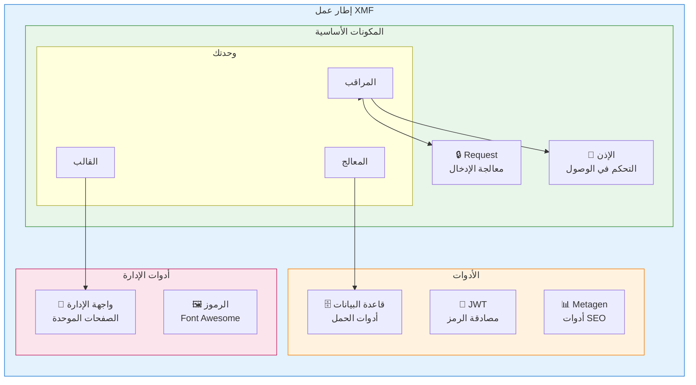
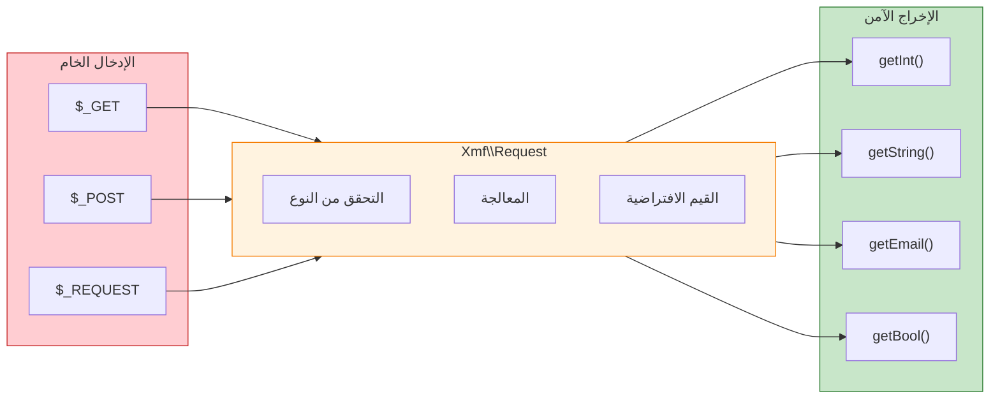

<span class="version-badge version-25x">2.5.x ✅</span> <span class="version-badge version-40x">4.0.x ✅</span>

:::tip[الجسر إلى XOOPS الحديث]
يعمل XMF في **كل من XOOPS 2.5.x و XOOPS 4.0.x**. إنها الطريقة الموصى بها لتحديث وحداتك اليوم أثناء التحضير لـ XOOPS 4.0. يوفر XMF تحميل PSR-4 التلقائي والمساحات والمساعدات التي تسلس الانتقال.
:::

**إطار عمل وحدات XOOPS (XMF)** هو مكتبة قوية مصممة لتبسيط وتوحيد تطوير وحدات XOOPS. يوفر XMF ممارسات PHP الحديثة بما في ذلك المساحات والتحميل التلقائي ومجموعة شاملة من فئات المساعد التي تقلل من الأنماط الحالية وتحسن الصيانة.

## ما هو XMF؟

XMF هي مجموعة من الفئات والأدوات التي توفر:

- **دعم PHP الحديث** - دعم مساحة أسماء كامل مع تحميل PSR-4 التلقائي
- **معالجة الطلب** - التحقق من صحة المدخلات الآمنة والمعالجة
- **مساعدات الوحدة** - وصول مبسط إلى تكوينات وكائنات الوحدة
- **نظام الإذن** - إدارة الأذونات سهلة الاستخدام
- **أدوات قاعدة البيانات** - أدوات هجرة الحمل وإدارة الجداول
- **دعم JWT** - تنفيذ رمز الويب JSON للمصادقة الآمنة
- **توليد البيانات الوصفية** - أدوات المحتوى المستخرجة من SEO
- **واجهة الإدارة** - صفحات إدارة الوحدة الموحدة

### نظرة عامة على مكونات XMF



## الميزات الرئيسية

### مساحات الأسماء والتحميل التلقائي

تقيم جميع فئات XMF في مساحة اسم `Xmf`. يتم تحميل الفئات تلقائيا عند الإشارة إليها - لا توجد ملفات include يدوية مطلوبة.

```php
use Xmf\Request;
use Xmf\Module\Helper;

// تحميل الفئات تلقائيا عند الاستخدام
$input = Request::getString('input', '');
$helper = Helper::getHelper('mymodule');
```

### معالجة طلب آمنة

توفر [فئة Request](../05-XMF-Framework/Basics/XMF-Request.md) وصول آمن من حيث النوع لبيانات طلب HTTP مع المعالجة المدمجة:



```php
use Xmf\Request;

$id = Request::getInt('id', 0);
$name = Request::getString('name', '');
$email = Request::getEmail('email', '');
```

### نظام مساعد الوحدة

يوفر [مساعد الوحدة](../05-XMF-Framework/Basics/XMF-Module-Helper.md) وصول مناسب إلى الوظائف المتعلقة بالوحدة:

```php
$helper = \Xmf\Module\Helper::getHelper('mymodule');

// وصول تكوين الوحدة
$configValue = $helper->getConfig('setting_name', 'default');

// الحصول على كائن الوحدة
$module = $helper->getModule();

// وصول المعالجات
$handler = $helper->getHandler('items');
```

### إدارة الأذونات

يبسط [Permission-Helper](../05-XMF-Framework/Recipes/Permission-Helper.md) معالجة الأذونات في XOOPS:

```php
$permHelper = new \Xmf\Module\Helper\Permission();

// التحقق من أذن المستخدم
if ($permHelper->checkPermission('view', $itemId)) {
    // المستخدم لديه إذن
}
```

## هيكل التوثيق

### أساسيات

- [Getting-Started-with-XMF](../05-XMF-Framework/Basics/Getting-Started-with-XMF.md) - التثبيت والاستخدام الأساسي
- [XMF-Request](../05-XMF-Framework/Basics/XMF-Request.md) - معالجة الطلب والتحقق من صحة المدخلات
- [XMF-Module-Helper](../05-XMF-Framework/Basics/XMF-Module-Helper.md) - استخدام فئة مساعد الوحدة

### الوصفات

- [Permission-Helper](../05-XMF-Framework/Recipes/Permission-Helper.md) - العمل مع الأذونات
- [Module-Admin-Pages](../05-XMF-Framework/Recipes/Module-Admin-Pages.md) - إنشاء واجهات إدارة موحدة

### مرجع

- [JWT](../05-XMF-Framework/Reference/JWT.md) - تنفيذ رمز الويب JSON
- [Database](../05-XMF-Framework/Reference/Database.md) - أدوات قاعدة البيانات وإدارة الحمل
- [Metagen](Reference/Metagen.md) - أدوات البيانات الوصفية و SEO

## المتطلبات

- XOOPS 2.5.8 أو إصدار أحدث
- PHP 7.2 أو إصدار أحدث (يُنصح PHP 8.x)

## التثبيت

يتم تضمين XMF مع XOOPS 2.5.8 والإصدارات الأحدث. للإصدارات السابقة أو التثبيت اليدوي:

1. قم بتنزيل حزمة XMF من مستودع XOOPS
2. قم بالاستخراج إلى مجلد `/class/xmf/` في XOOPS الخاص بك
3. سيتولى المحمل التلقائي معالجة تحميل الفئة تلقائيا

## مثال البدء السريع

إليك مثال كامل يوضح أنماط استخدام XMF الشائعة:

```php
<?php
use Xmf\Request;
use Xmf\Module\Helper;
use Xmf\Module\Helper\Permission;

// احصل على مساعد الوحدة
$helper = Helper::getHelper('mymodule');

// احصل على قيم التكوين
$itemsPerPage = $helper->getConfig('items_per_page', 10);

// معالجة إدخال الطلب
$op = Request::getCmd('op', 'list');
$id = Request::getInt('id', 0);

// تحقق من الأذونات
$permHelper = new Permission();
if (!$permHelper->checkPermission('view', $id)) {
    redirect_header('index.php', 3, 'Access denied');
}

// معالجة على أساس العملية
switch ($op) {
    case 'view':
        $handler = $helper->getHandler('items');
        $item = $handler->get($id);
        // ... عرض العنصر
        break;
    case 'list':
    default:
        // ... قائمة العناصر
        break;
}
```

## الموارد

- [مستودع XMF على GitHub](https://github.com/XOOPS/XMF)
- [موقع مشروع XOOPS](https://xoops.org)

---

#xmf #xoops #framework #php #module-development
