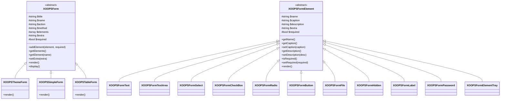
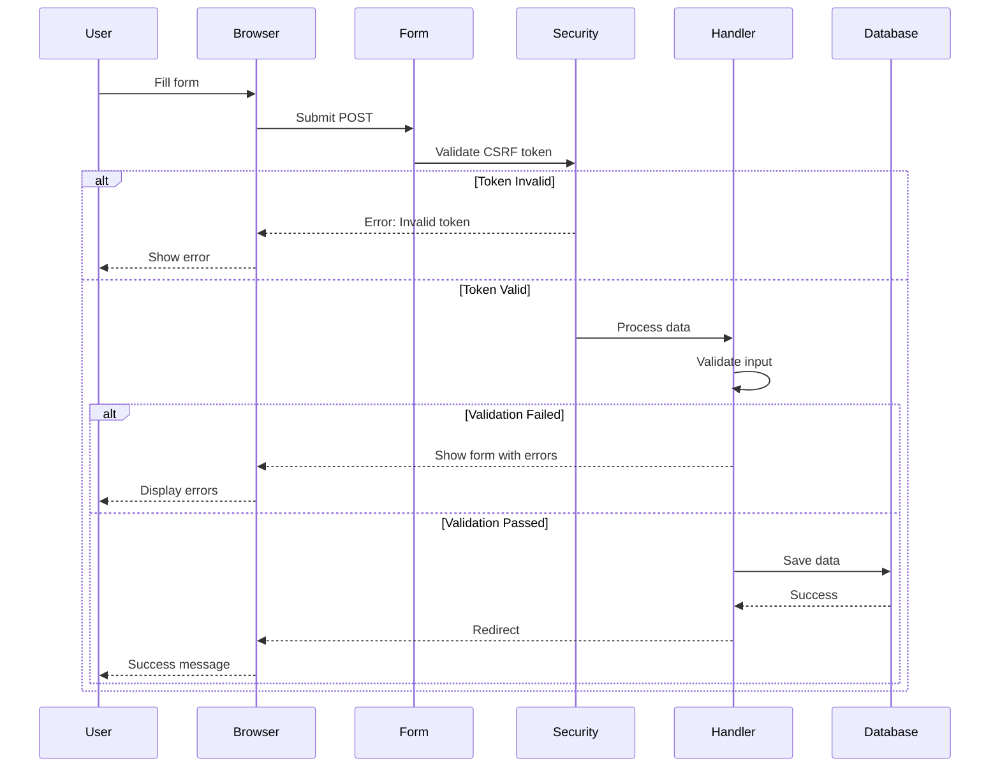

> Kompletní dokumentace API pro systém generování formulářů XOOPS.

---

## Hierarchie tříd



---

## XOOPSForm (abstraktní základna)

### Konstruktér

```php
public function __construct(
    string $title,      // Form title
    string $name,       // Form name attribute
    string $action,     // Form action URL
    string $method = 'post',  // HTTP method
    bool $addToken = false    // Add CSRF token
)
```

### Metody

| Metoda | Parametry | Návraty | Popis |
|--------|------------|---------|-------------|
| `addElement` | `XOOPSFormElement $element, bool $required = false` | `void` | Přidat prvek do formuláře |
| `getElements` | - | `array` | Získejte všechny prvky |
| `getElement` | `string $name` | `XOOPSFormElement|null` | Získat prvek podle názvu |
| `setExtra` | `string $extra` | `void` | Nastavit další atributy HTML |
| `getExtra` | - | `string` | Získat další atributy |
| `getTitle` | - | `string` | Získat název formuláře |
| `setTitle` | `string $title` | `void` | Nastavit název formuláře |
| `getName` | - | `string` | Získat název formuláře |
| `getAction` | - | `string` | Získejte akci URL |
| `render` | - | `string` | Formulář vykreslení HTML |
| `display` | - | `void` | Echo vykreslená forma |
| `insertBreak` | `string $extra = ''` | `void` | Vložit vizuální přerušení |
| `setRequired` | `XOOPSFormElement $element` | `void` | Označit požadovaný prvek |

---

## XOOPSThemeForm

Nejčastěji používaná třída formulářů, vykresluje se styly s ohledem na motiv.

### Použití

```php
<?php
$form = new XOOPSThemeForm(
    'User Registration',
    'registration_form',
    'register.php',
    'post',
    true  // Include CSRF token
);

$form->addElement(new XOOPSFormText('Username', 'uname', 25, 255, ''), true);
$form->addElement(new XOOPSFormPassword('Password', 'pass', 25, 255), true);
$form->addElement(new XOOPSFormButton('', 'submit', _SUBMIT, 'submit'));

echo $form->render();
```

### Renderovaný výstup

```html
<form name="registration_form" action="register.php" method="post"
      enctype="application/x-www-form-urlencoded">
  <table class="outer" cellspacing="1">
    <tr><th colspan="2">User Registration</th></tr>
    <tr class="odd">
      <td class="head">Username <span class="required">*</span></td>
      <td class="even">
        <input type="text" name="uname" size="25" maxlength="255" value="">
      </td>
    </tr>
    <!-- ... more fields ... -->
  </table>
  <input type="hidden" name="XOOPS_TOKEN_REQUEST" value="...">
</form>
```

---

## Prvky formuláře

### XOOPSFormText

Jednořádkové zadávání textu.

```php
$text = new XOOPSFormText(
    string $caption,    // Label text
    string $name,       // Input name
    int $size,          // Display width
    int $maxlength,     // Max characters
    mixed $value = ''   // Default value
);

// Methods
$text->getValue();
$text->setValue($value);
$text->getSize();
$text->getMaxlength();
```

### XOOPSFormTextArea

Víceřádkové zadávání textu.

```php
$textarea = new XOOPSFormTextArea(
    string $caption,
    string $name,
    mixed $value = '',
    int $rows = 5,
    int $cols = 50
);

// Methods
$textarea->getRows();
$textarea->getCols();
```

### XOOPSFormSelect

Rozbalovací nebo vícenásobný výběr.

```php
$select = new XOOPSFormSelect(
    string $caption,
    string $name,
    mixed $value = null,
    int $size = 1,        // 1 = dropdown, >1 = listbox
    bool $multiple = false
);

// Methods
$select->addOption(mixed $value, string $name = '');
$select->addOptionArray(array $options);
$select->getOptions();
$select->getValue();
$select->isMultiple();
```

### XOOPSFormCheckBox

Zaškrtávací políčko nebo skupina zaškrtávacích políček.

```php
$checkbox = new XOOPSFormCheckBox(
    string $caption,
    string $name,
    mixed $value = null,
    string $delimeter = '&nbsp;'
);

// Methods
$checkbox->addOption(mixed $value, string $name = '');
$checkbox->addOptionArray(array $options);
$checkbox->getValue();
```

### XOOPSFormRadio

Skupina přepínacích tlačítek.

```php
$radio = new XOOPSFormRadio(
    string $caption,
    string $name,
    mixed $value = null,
    string $delimeter = '&nbsp;'
);

// Methods
$radio->addOption(mixed $value, string $name = '');
$radio->addOptionArray(array $options);
```

### XOOPSFormButton

Odeslat, resetovat nebo vlastní tlačítko.

```php
$button = new XOOPSFormButton(
    string $caption,
    string $name,
    string $value = '',
    string $type = 'button'  // 'submit', 'reset', 'button'
);
```

### XOOPSFormFile

Vstup pro nahrání souboru.

```php
$file = new XOOPSFormFile(
    string $caption,
    string $name,
    int $maxFileSize = 0
);

// Methods
$file->getMaxFileSize();
$file->setMaxFileSize(int $size);
```

### XOOPSFormHidden

Skryté vstupní pole.

```php
$hidden = new XOOPSFormHidden(
    string $name,
    mixed $value
);
```

### XOOPSFormHiddenToken

Ochranný token CSRF.

```php
$token = new XOOPSFormHiddenToken(
    string $name = 'XOOPS_TOKEN_REQUEST'
);
```

### XOOPSFormLabel

Štítek pouze pro zobrazení (ne vstup).

```php
$label = new XOOPSFormLabel(
    string $caption,
    string $value
);
```

### XOOPSFormPassword

Pole pro zadání hesla.

```php
$password = new XOOPSFormPassword(
    string $caption,
    string $name,
    int $size,
    int $maxlength,
    mixed $value = ''
);
```

### XOOPSFormElementTray

Seskupuje více prvků dohromady.

```php
$tray = new XOOPSFormElementTray(
    string $caption,
    string $delimeter = '&nbsp;'
);

// Methods
$tray->addElement(XOOPSFormElement $element, bool $required = false);
$tray->getElements();
```

---

## Diagram toku formuláře



---

## Úplný příklad

```php
<?php
require_once __DIR__ . '/mainfile.php';

use XMF\Request;

$helper = \XOOPSModules\MyModule\Helper::getInstance();
$itemHandler = $helper->getHandler('Item');

// Process form submission
if (Request::hasVar('submit', 'POST')) {
    // Verify CSRF token
    if (!$GLOBALS['xoopsSecurity']->check()) {
        redirect_header('form.php', 3, implode('<br>', $GLOBALS['xoopsSecurity']->getErrors()));
    }

    // Get validated input
    $title = Request::getString('title', '', 'POST');
    $content = Request::getText('content', '', 'POST');
    $categoryId = Request::getInt('category_id', 0, 'POST');
    $status = Request::getString('status', 'draft', 'POST');

    // Create and populate object
    $item = $itemHandler->create();
    $item->setVars([
        'title' => $title,
        'content' => $content,
        'category_id' => $categoryId,
        'status' => $status,
        'created' => time(),
        'uid' => $GLOBALS['xoopsUser']->getVar('uid')
    ]);

    // Save
    if ($itemHandler->insert($item)) {
        redirect_header('index.php', 2, _MD_MYMODULE_SAVED);
    } else {
        $error = _MD_MYMODULE_ERROR_SAVING;
    }
}

// Build form
$form = new XOOPSThemeForm(_MD_MYMODULE_ADD_ITEM, 'itemform', 'form.php', 'post', true);

// Title field
$titleElement = new XOOPSFormText(_MD_MYMODULE_TITLE, 'title', 50, 255, $title ?? '');
$titleElement->setDescription(_MD_MYMODULE_TITLE_DESC);
$form->addElement($titleElement, true);

// Category dropdown
$categoryHandler = $helper->getHandler('Category');
$categories = $categoryHandler->getList();
$categorySelect = new XOOPSFormSelect(_MD_MYMODULE_CATEGORY, 'category_id', $categoryId ?? 0);
$categorySelect->addOptionArray($categories);
$form->addElement($categorySelect, true);

// Content textarea with editor
$editorConfigs = [
    'name' => 'content',
    'value' => $content ?? '',
    'rows' => 15,
    'cols' => 60,
    'width' => '100%',
    'height' => '400px',
];
$form->addElement(new XOOPSFormEditor(_MD_MYMODULE_CONTENT, 'content', $editorConfigs));

// Status radio buttons
$statusRadio = new XOOPSFormRadio(_MD_MYMODULE_STATUS, 'status', $status ?? 'draft');
$statusRadio->addOptionArray([
    'draft' => _MD_MYMODULE_DRAFT,
    'published' => _MD_MYMODULE_PUBLISHED,
    'archived' => _MD_MYMODULE_ARCHIVED
]);
$form->addElement($statusRadio);

// Submit button
$buttonTray = new XOOPSFormElementTray('', '&nbsp;');
$buttonTray->addElement(new XOOPSFormButton('', 'submit', _SUBMIT, 'submit'));
$buttonTray->addElement(new XOOPSFormButton('', 'reset', _CANCEL, 'reset'));
$form->addElement($buttonTray);

// Display
require_once XOOPS_ROOT_PATH . '/header.php';

if (!empty($error)) {
    echo "<div class='errorMsg'>$error</div>";
}

$form->display();

require_once XOOPS_ROOT_PATH . '/footer.php';
```

---

## Související dokumentace

- XOOPSObject API
- Průvodce formuláři
- Ochrana CSRF

---

#xoops #api #formuláře #xoopsform #reference