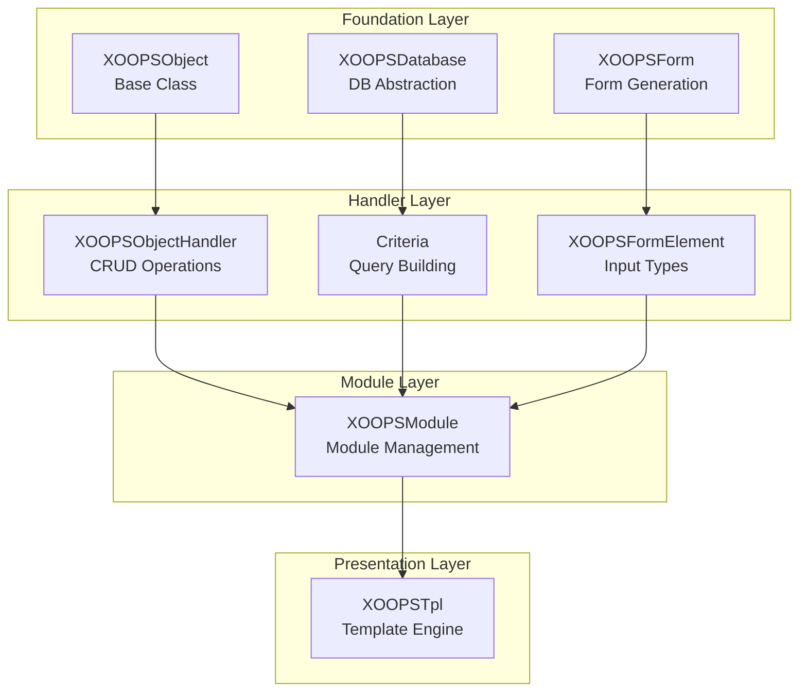
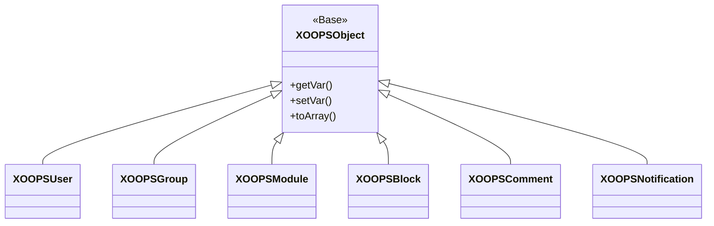
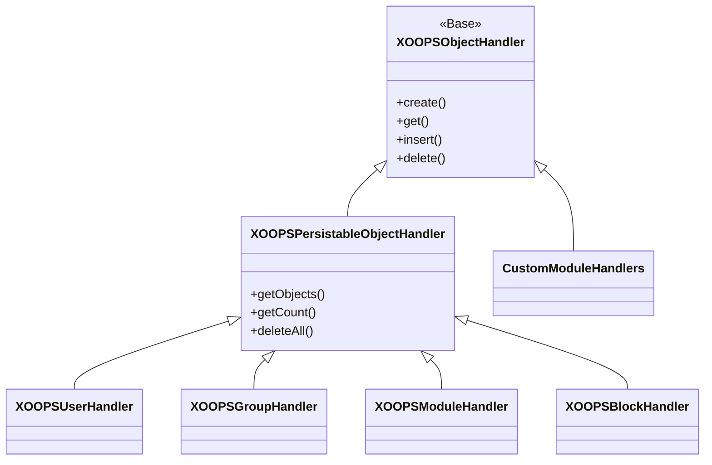
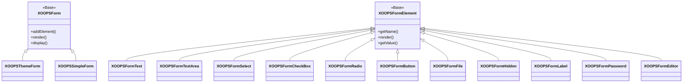

Vítejte v obsáhlé referenční dokumentaci XOOPS API. Tato část poskytuje podrobnou dokumentaci pro všechny základní třídy, metody a systémy, které tvoří systém správy obsahu XOOPS.

## Přehled

XOOPS API je organizován do několika hlavních subsystémů, z nichž každý je zodpovědný za specifický aspekt funkčnosti CMS. Pochopení těchto API je nezbytné pro vývoj modulů, motivů a rozšíření pro XOOPS.

## Sekce API

### Základní třídy

Třídy základů, na kterých staví všechny ostatní komponenty XOOPS.

| Dokumentace | Popis |
|--------------|-------------|
| XOOPSObject | Základní třída pro všechny datové objekty v XOOPS |
| XOOPSObjectHandler | Vzor manipulátoru pro operace CRUD |

### Databázová vrstva

Databázová abstrakce a dotazování stavebních utilit.

| Dokumentace | Popis |
|--------------|-------------|
| XOOPSDatabase | Vrstva abstrakce databáze |
| Systém kritérií | Kritéria a podmínky dotazu |
| QueryBuilder | Moderní plynulá budova dotazu |

### Systém formulářů

Generování a ověřování formuláře HTML.

| Dokumentace | Popis |
|--------------|-------------|
| XOOPSForm | Kontejner formuláře a vykreslování |
| Prvky formuláře | Všechny dostupné typy formulářových prvků |

### Třídy jádra

Základní systémové komponenty a služby.

| Dokumentace | Popis |
|--------------|-------------|
| Třídy jádra | Systémové jádro a základní komponenty |

### Modulový systém

Správa modulu a životní cyklus.

| Dokumentace | Popis |
|--------------|-------------|
| Modulový systém | Načítání, instalace a správa modulů |

### Systém šablon

Integrace šablony Smarty.

| Dokumentace | Popis |
|--------------|-------------|
| Systém šablon | Smarty integrace a správa šablon |

### Uživatelský systém

Správa a ověřování uživatelů.

| Dokumentace | Popis |
|--------------|-------------|
| Uživatelský systém | Uživatelské účty, skupiny a oprávnění |

## Přehled architektury



## Hierarchie tříd

### Objektový model



### Model manipulátoru



### Model formuláře



## Návrhové vzory

XOOPS API implementuje několik známých návrhových vzorů:

### Jednobarevný vzor
Používá se pro globální služby, jako jsou databázová připojení a instance kontejnerů.

```php
$db = XOOPSDatabase::getInstance();
$container = XOOPSContainer::getInstance();
```

### Tovární vzor
Obslužné rutiny objektů vytvářejí objekty domény konzistentně.

```php
$handler = xoops_getHandler('user');
$user = $handler->create();
```

### Složený vzor
Formuláře obsahují více formulářových prvků; kritéria mohou obsahovat vnořená kritéria.

```php
$criteria = new CriteriaCompo();
$criteria->add(new Criteria('status', 1));
$criteria->add(new CriteriaCompo(...)); // Nested
```

### Vzor pozorovatele
Systém událostí umožňuje volné spojení mezi moduly.

```php
$dispatcher->addListener('module.news.article_published', $callback);
```

## Příklady rychlého startu

### Vytvoření a uložení objektu

```php
// Get the handler
$handler = xoops_getHandler('user');

// Create a new object
$user = $handler->create();
$user->setVar('uname', 'newuser');
$user->setVar('email', 'user@example.com');

// Save to database
$handler->insert($user);
```

### Dotazování s kritérii

```php
// Build criteria
$criteria = new CriteriaCompo();
$criteria->add(new Criteria('level', 0, '>'));
$criteria->setSort('uname');
$criteria->setOrder('ASC');
$criteria->setLimit(10);

// Get objects
$handler = xoops_getHandler('user');
$users = $handler->getObjects($criteria);
```

### Vytvoření formuláře

```php
$form = new XOOPSThemeForm('User Profile', 'userform', 'save.php', 'post', true);
$form->addElement(new XOOPSFormText('Username', 'uname', 50, 255, $user->getVar('uname')));
$form->addElement(new XOOPSFormTextArea('Bio', 'bio', $user->getVar('bio')));
$form->addElement(new XOOPSFormButton('', 'submit', _SUBMIT, 'submit'));
echo $form->render();
```

## Konvence API

### Konvence pojmenování

| Typ | Úmluva | Příklad |
|------|-----------|---------|
| Třídy | PascalCase | `XOOPSUser`, `CriteriaCompo` |
| Metody | CamelCase | `getVar()`, `setVar()` |
| Vlastnosti | camelCase (chráněné) | `$_vars`, `$_handler` |
| Konstanty | UPPER_SNAKE_CASE | `XOBJ_DTYPE_INT` |
| Databázové tabulky | hadí_případ | `users`, `groups_users_link` |

### Typy dat

XOOPS definuje standardní datové typy pro objektové proměnné:

| Konstantní | Typ | Popis |
|----------|------|-------------|
| `XOBJ_DTYPE_TXTBOX` | Řetězec | Zadávání textu (vyčištěno) |
| `XOBJ_DTYPE_TXTAREA` | Řetězec | Obsah textové oblasti |
| `XOBJ_DTYPE_INT` | Celé číslo | Číselné hodnoty |
| `XOBJ_DTYPE_URL` | Řetězec | Ověření URL |
| `XOBJ_DTYPE_EMAIL` | Řetězec | Ověření e-mailu |
| `XOBJ_DTYPE_ARRAY` | Pole | Serializovaná pole |
| `XOBJ_DTYPE_OTHER` | Smíšené | Vlastní manipulace |
| `XOBJ_DTYPE_SOURCE` | Řetězec | Zdrojový kód (minimální sanitace) |
| `XOBJ_DTYPE_STIME` | Celé číslo | Krátké časové razítko |
| `XOBJ_DTYPE_MTIME` | Celé číslo | Střední časové razítko |
| `XOBJ_DTYPE_LTIME` | Celé číslo | Dlouhé časové razítko |

## Metody autentizace

API podporuje několik metod ověřování:

### Ověření klíče API
```
X-API-Key: your-api-key
```

### Token nositele OAuth
```
Authorization: Bearer your-oauth-token
```

### Autentizace na základě relace
Při přihlášení použije existující relaci XOOPS.## Koncové body REST API

Když je povoleno REST API:

| Koncový bod | Metoda | Popis |
|----------|--------|-------------|
| `/api.php/rest/users` | GET | Seznam uživatelů |
| `/api.php/rest/users/{id}` | GET | Získat uživatele podle ID |
| `/api.php/rest/users` | POST | Vytvořit uživatele |
| `/api.php/rest/users/{id}` | PUT | Aktualizovat uživatele |
| `/api.php/rest/users/{id}` | DELETE | Smazat uživatele |
| `/api.php/rest/modules` | GET | Seznam modulů |

## Související dokumentace

- Průvodce vývojem modulu
- Průvodce rozvojem tématu
- Konfigurace systému
- Nejlepší bezpečnostní postupy

## Historie verzí

| Verze | Změny |
|---------|---------|
| 2.5.11 | Aktuální stabilní verze |
| 2.5.10 | Přidána podpora GraphQL API |
| 2.5.9 | Rozšířený systém kritérií |
| 2.5.8 | Podpora automatického načítání PSR-4 |

---

*Tato dokumentace je součástí znalostní báze XOOPS. Nejnovější aktualizace naleznete v [úložišti XOOPS GitHub](https://github.com/XOOPS).*