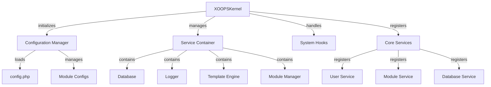

Kernel XOOPS poskytuje základní rámec pro bootstraping systému, správu konfigurací, zpracování systémových událostí a poskytování základních utilit. Tyto třídy tvoří páteř aplikace XOOPS.

## Architektura systému



## Třída XOOPSKernel

Hlavní třída jádra, která inicializuje a spravuje systém XOOPS.

### Přehled třídy

```php
namespace XOOPS;

class XOOPSKernel
{
    private static ?XOOPSKernel $instance = null;
    protected ServiceContainer $services;
    protected ConfigurationManager $config;
    protected array $modules = [];
    protected bool $isLoaded = false;
}
```

### Konstruktér

```php
private function __construct()
```

Soukromý konstruktor vynucuje singleton vzor.

### getInstance

Načte instanci jádra singleton.

```php
public static function getInstance(): XOOPSKernel
```

**Vrátí:** `XOOPSKernel` – Instance jádra typu singleton

**Příklad:**
```php
$kernel = XOOPSKernel::getInstance();
```

### Proces spouštění

Proces spouštění jádra probíhá takto:

1. **Inicializace** - Nastavte obslužné rutiny chyb, definujte konstanty
2. **Konfigurace** – Načtení konfiguračních souborů
3. **Registrace služby** – Zaregistrujte základní služby
4. **Detekce modulů** – Skenování a identifikace aktivních modulů
5. **Inicializace databáze** - Připojení k databázi
6. **Cleanup** – Připravte se na zpracování požadavku

```php
public function boot(): void
```

**Příklad:**
```php
$kernel = XOOPSKernel::getInstance();
$kernel->boot();
```

### Metody kontejneru služeb

#### registrační služba

Registruje službu v kontejneru služeb.

```php
public function registerService(
    string $name,
    callable|object $definition
): void
```

**Parametry:**

| Parametr | Typ | Popis |
|-----------|------|-------------|
| `$name` | řetězec | Identifikátor služby |
| `$definition` | volatelný\|objekt | Servisní továrna nebo instance |

**Příklad:**
```php
$kernel->registerService('custom.handler', function($c) {
    return new CustomHandler();
});
```

#### getService

Načte registrovanou službu.

```php
public function getService(string $name): mixed
```

**Parametry:**

| Parametr | Typ | Popis |
|-----------|------|-------------|
| `$name` | řetězec | Identifikátor služby |

**Vrátí:** `mixed` - Požadovaná služba

**Příklad:**
```php
$database = $kernel->getService('database');
$logger = $kernel->getService('logger');
```

#### hasService

Zkontroluje, zda je služba registrována.

```php
public function hasService(string $name): bool
```

**Příklad:**
```php
if ($kernel->hasService('cache')) {
    $cache = $kernel->getService('cache');
}
```

## Configuration Manager

Spravuje konfiguraci aplikace a nastavení modulu.

### Přehled třídy

```php
namespace XOOPS\Core;

class ConfigurationManager
{
    protected array $config = [];
    protected array $defaults = [];
    protected string $configPath;
}
```

### Metody

#### zatížení

Načte konfiguraci ze souboru nebo pole.

```php
public function load(string|array $source): void
```

**Parametry:**

| Parametr | Typ | Popis |
|-----------|------|-------------|
| `$source` | řetězec\|pole | Cesta k konfiguračnímu souboru nebo pole |

**Příklad:**
```php
$config = $kernel->getService('config');
$config->load(XOOPS_ROOT_PATH . '/include/config.php');
$config->load(['sitename' => 'My Site', 'admin_email' => 'admin@example.com']);
```

#### dostat

Načte konfigurační hodnotu.

```php
public function get(string $key, mixed $default = null): mixed
```

**Parametry:**

| Parametr | Typ | Popis |
|-----------|------|-------------|
| `$key` | řetězec | Konfigurační klíč (tečková notace) |
| `$default` | smíšené | Výchozí hodnota, pokud nebyla nalezena |

**Vrátí:** `mixed` - Hodnota konfigurace

**Příklad:**
```php
$siteName = $config->get('sitename');
$adminEmail = $config->get('admin.email', 'admin@example.com');
```

#### sada

Nastaví hodnotu konfigurace.

```php
public function set(string $key, mixed $value): void
```

**Parametry:**

| Parametr | Typ | Popis |
|-----------|------|-------------|
| `$key` | řetězec | Konfigurační klíč |
| `$value` | smíšené | Hodnota konfigurace |

**Příklad:**
```php
$config->set('sitename', 'New Site Name');
$config->set('features.cache_enabled', true);
```

#### getModuleConfig

Získá konfiguraci pro konkrétní modul.

```php
public function getModuleConfig(
    string $moduleName
): array
```

**Parametry:**

| Parametr | Typ | Popis |
|-----------|------|-------------|
| `$moduleName` | řetězec | Název adresáře modulu |

**Vrátí:** `array` - Pole konfigurace modulu

**Příklad:**
```php
$publisherConfig = $config->getModuleConfig('publisher');
```

## Systémové háky

Systémové háky umožňují modulům a zásuvným modulům spouštět kód v konkrétních bodech životního cyklu aplikace.

### Třída HookManager

```php
namespace XOOPS\Core;

class HookManager
{
    protected array $hooks = [];
    protected array $listeners = [];
}
```

### Metody

#### addHáček

Registruje bod háku.

```php
public function addHook(string $name): void
```

**Parametry:**

| Parametr | Typ | Popis |
|-----------|------|-------------|
| `$name` | řetězec | Identifikátor háčku |

**Příklad:**
```php
$hooks = $kernel->getService('hooks');
$hooks->addHook('system.startup');
$hooks->addHook('user.login');
$hooks->addHook('module.install');
```

#### poslouchejte

Připojuje posluchače k háčku.

```php
public function listen(
    string $hookName,
    callable $callback,
    int $priority = 10
): void
```

**Parametry:**

| Parametr | Typ | Popis |
|-----------|------|-------------|
| `$hookName` | řetězec | Identifikátor háčku |
| `$callback` | povolatelný | Funkce k provedení |
| `$priority` | int | Priorita provedení (vyšší běží jako první) |

**Příklad:**
```php
$hooks->listen('user.login', function($user) {
    error_log('User ' . $user->uname . ' logged in');
}, 10);

$hooks->listen('module.install', function($module) {
    // Custom module installation logic
    echo "Installing " . $module->getName();
}, 5);
```

#### spoušť

Provede všechny posluchače na háček.

```php
public function trigger(
    string $hookName,
    mixed $arguments = null
): array
```

**Parametry:**

| Parametr | Typ | Popis |
|-----------|------|-------------|
| `$hookName` | řetězec | Identifikátor háčku |
| `$arguments` | smíšené | Data k předání posluchačům |

**Návraty:** `array` – výsledky od všech posluchačů

**Příklad:**
```php
$results = $hooks->trigger('system.startup');
$results = $hooks->trigger('user.created', $newUser);
```

## Přehled základních služeb

Jádro během bootování registruje několik základních služeb:| Služba | třída | Účel |
|---------|-------|---------|
| `database` | XOOPSDatabase | Vrstva abstrakce databáze |
| `config` | ConfigurationManager | Správa konfigurace |
| `logger` | Logger | Protokolování aplikací |
| `template` | XOOPSTpl | Šablona motoru |
| `user` | UserManager | Služba správy uživatelů |
| `module` | ModuleManager | Správa modulů |
| `cache` | CacheManager | Vrstva mezipaměti |
| `hooks` | HookManager | Háčky systémových událostí |

## Kompletní příklad použití

```php
<?php
/**
 * Custom module boot process utilizing kernel
 */

// Get kernel instance
$kernel = XOOPSKernel::getInstance();

// Boot the system
$kernel->boot();

// Get services
$config = $kernel->getService('config');
$database = $kernel->getService('database');
$logger = $kernel->getService('logger');
$hooks = $kernel->getService('hooks');

// Access configuration
$siteName = $config->get('sitename');
$adminEmail = $config->get('admin.email');

// Register module-specific hooks
$hooks->listen('user.login', function($user) {
    // Log user login
    $logger->info('User login: ' . $user->uname);

    // Track in database
    $database->query(
        'INSERT INTO ' . $database->prefix('event_log') .
        ' (type, user_id, message, timestamp) VALUES (?, ?, ?, ?)',
        ['login', $user->uid(), 'User login', time()]
    );
});

$hooks->listen('module.install', function($module) {
    $logger->info('Module installed: ' . $module->getName());
});

// Trigger hooks
$hooks->trigger('system.startup');

// Use database service
$result = $database->query(
    'SELECT * FROM ' . $database->prefix('users') .
    ' LIMIT 10'
);

while ($row = $database->fetchArray($result)) {
    echo "User: " . htmlspecialchars($row['uname']) . "\n";
}

// Register custom service
$kernel->registerService('custom.repository', function($c) {
    return new CustomRepository($c->getService('database'));
});

// Later access custom service
$repo = $kernel->getService('custom.repository');
```

## Základní konstanty

Jádro během bootování definuje několik důležitých konstant:

```php
// System paths
define('XOOPS_ROOT_PATH', '/var/www/xoops');
define('XOOPS_HTDOCS_PATH', XOOPS_ROOT_PATH . '/htdocs');
define('XOOPS_MODULES_PATH', XOOPS_ROOT_PATH . '/htdocs/modules');
define('XOOPS_THEMES_PATH', XOOPS_ROOT_PATH . '/htdocs/themes');

// Web paths
define('XOOPS_URL', 'http://example.com');
define('XOOPS_HTDOCS_URL', XOOPS_URL . '/htdocs');

// Database
define('XOOPS_DB_PREFIX', 'xoops_');
```

## Zpracování chyb

Jádro během spouštění nastavuje obslužné rutiny chyb:

```php
// Set custom error handler
set_error_handler(function($errno, $errstr, $errfile, $errline) {
    $kernel->getService('logger')->error(
        "Error: $errstr in $errfile:$errline"
    );
});

// Set exception handler
set_exception_handler(function($exception) {
    $kernel->getService('logger')->critical(
        "Exception: " . $exception->getMessage()
    );
});
```

## Nejlepší postupy

1. **Single Boot** – Volejte `boot()` pouze jednou během spouštění aplikace
2. **Use Service Container** – Zaregistrujte a načtěte služby prostřednictvím jádra
3. **Zacházení s háky včas** – Zaregistrujte posluchače háčků před jejich spuštěním
4. **Protokolovat důležité události** – K ladění použijte službu protokolování
5. **Konfigurace mezipaměti** – Načtěte konfiguraci jednou a znovu ji použijte
6. **Ošetření chyb** – Před zpracováním požadavků vždy nastavte obslužné rutiny chyb

## Související dokumentace

- ../Module/Module-System - Modulový systém a životní cyklus
- ../Template/Template-System - Integrace šablony motoru
- ../User/User-System - Ověřování a správa uživatelů
- ../Database/XOOPSDatabase - Databázová vrstva

---

*Viz také: [XOOPS zdroj jádra](https://github.com/XOOPS/XOOPSCore27/tree/master/htdocs/class)*